# 语音答题系统集成设计

## 1. 需求概述

本设计旨在实现诗词飞花令游戏的智能语音答题功能，解决儿童语音识别准确率问题，提升用户答题体验。

### 1.1 核心需求

1. **前端语音识别**：前端直接调用腾讯云 ASR 一句话识别接口，后端提供签名生成服务以保护密钥安全
2. **智能答案判定**：后端集成 DeepSeek LLM 对 ASR 识别文本进行宽松判断，提高儿童语音答题的容错率
3. **计时器控制**：用户开始语音答题时暂停倒计时，识别与判断完成后恢复计时

### 1.2 架构约束

- **Vercel 海外部署限制**：后端部署在 Vercel 海外节点，无法直接访问腾讯云国内 ASR 接口
- **解决方案**：前端从后端获取签名后，直接调用腾讯云 ASR 接口完成识别，再将识别文本发送给后端进行 LLM 判断

### 1.3 设计目标

- 保障 API 密钥安全性（前端不直接持有腾讯云密钥）
- 提升儿童语音答题准确率（通过 LLM 宽松判断降低误判）
- 优化用户体验（语音识别期间暂停计时，避免超时）
- 保持系统架构清晰（前后端职责分离，可扩展性强）

## 2. 系统架构设计

### 2.1 整体流程

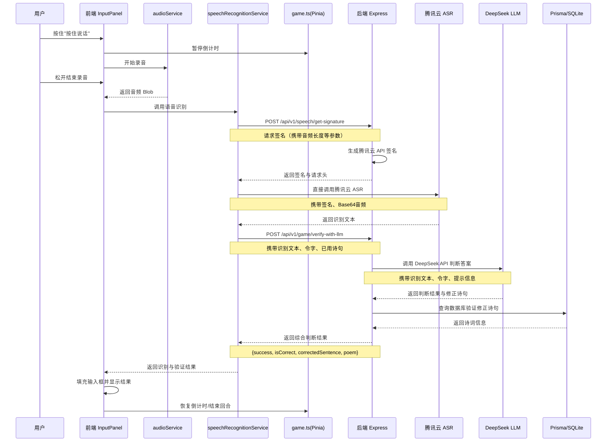

### 2.2 核心组件职责

| 组件 | 职责 | 输入 | 输出 |
|------|------|------|------|
| **前端 InputPanel** | 录音控制、计时器暂停/恢复、结果展示 | 用户按住/松开事件 | 音频 Blob、UI 状态更新 |
| **audioService** | 录音采集、权限管理 | 录音启动/停止指令 | 音频 Blob(WAV 格式) |
| **speechRecognitionService** | 协调签名获取与 ASR 调用 | 音频 Blob | 识别文本 |
| **后端签名服务** | 生成腾讯云 API 签名 | 音频元信息、时间戳 | TC3-HMAC-SHA256 签名与请求头 |
| **前端 ASR 调用** | 直接调用腾讯云 ASR 接口 | Base64 音频、签名、请求头 | 识别文本 |
| **后端 LLM 服务** | 调用 DeepSeek 判断答案 | 识别文本、令字、游戏上下文 | 判断结果、修正诗句 |
| **后端验证服务** | 数据库查询验证诗句 | 修正诗句、令字 | 诗词信息(标题、作者) |
| **game.ts(Pinia)** | 游戏状态、计时器管理 | 答题事件 | 倒计时状态、游戏进度 |

## 3. 详细设计

### 3.1 前端改造方案

#### 3.1.1 计时器暂停机制

**设计原则**：录音开始时暂停计时，识别完成后根据结果决定恢复或停止计时。

**涉及文件**：
- `frontend/src/components/InputPanel.vue`
- `frontend/src/stores/game.ts`

**状态管理**：

| 状态字段 | 类型 | 说明 |
|---------|------|------|
| `timerPausedByVoice` | boolean | 标记计时器是否因语音输入暂停 |
| `voiceInputInProgress` | boolean | 标记语音识别是否进行中 |

**流程控制**：

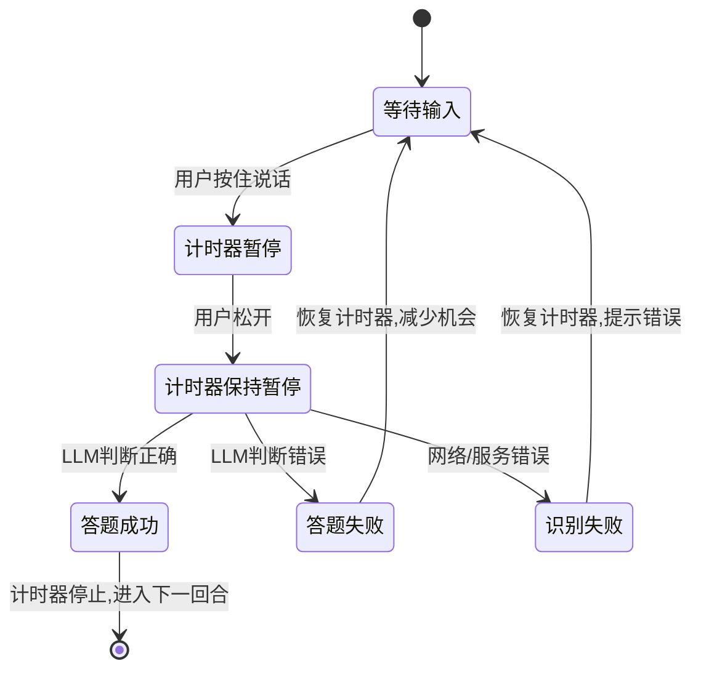

#### 3.1.2 InputPanel 改造要点

**新增行为**：
- 录音开始时调用 `gameStore.pauseTimerForVoice()`
- 识别成功后自动填充输入框并提交验证
- 验证完成后根据结果调用 `gameStore.resumeTimerAfterVoice()` 或结束回合

**错误处理**：
- ASR 识别失败：显示错误提示，恢复计时器
- LLM 服务异常：降级为原有验证逻辑，恢复计时器
- 网络超时：显示超时提示，恢复计时器

### 3.2 后端服务设计

#### 3.2.1 新增 API 接口

**接口 1：获取腾讯云 ASR 签名**

**接口名称**：`POST /api/v1/speech/get-signature`

**功能说明**：为前端生成腾讯云 ASR 请求所需的签名和请求头。

**请求参数**：

| 参数名 | 类型 | 必填 | 说明 |
|--------|------|------|------|
| audioLength | number | 是 | 音频数据长度(字节) |

**响应数据**：

| 字段名 | 类型 | 说明 |
|--------|------|------|
| success | boolean | 是否成功生成签名 |
| headers | object | 腾讯云 ASR 请求头 |
| payload | object | 请求体模板（不含 Data 字段） |
| endpoint | string | 腾讯云 ASR 接口地址 |
| error | string | 错误信息(失败时) |

**示例响应**：

```json
{
  "success": true,
  "headers": {
    "Content-Type": "application/json; charset=utf-8",
    "Authorization": "TC3-HMAC-SHA256 Credential=...",
    "X-TC-Action": "SentenceRecognition",
    "X-TC-Version": "2019-06-14",
    "X-TC-Timestamp": "1234567890",
    "X-TC-Region": "ap-beijing"
  },
  "payload": {
    "ProjectId": 0,
    "SubServiceType": 2,
    "EngSerViceType": "16k",
    "SourceType": 1,
    "VoiceFormat": 4,
    "UsrAudioKey": "session-1234567890"
  },
  "endpoint": "https://asr.tencentcloudapi.com"
}
```

**接口 2：LLM 验证识别文本**

**接口名称**：`POST /api/v1/game/verify-with-llm`

**功能说明**：使用 DeepSeek LLM 判断 ASR 识别文本是否为正确诗句，并进行数据库验证。

**请求参数**：

| 参数名 | 类型 | 必填 | 说明 |
|--------|------|------|------|
| recognizedText | string | 是 | ASR 识别的原始文本 |
| keyword | string | 是 | 当前回合令字 |
| usedPoems | string[] | 是 | 已使用的诗句列表 |

**响应数据**：

| 字段名 | 类型 | 说明 |
|--------|------|------|
| success | boolean | 整体请求是否成功 |
| valid | boolean | 是否答对（兼容原有验证接口） |
| isCorrect | boolean | LLM 判断是否答对 |
| correctedSentence | string | LLM 修正后的标准诗句 |
| matchType | string | 匹配类型：exact/llm_fuzzy/none |
| poem | object | 诗词信息(id, title, author) |
| message | string | 提示信息 |
| error | string | 错误信息(失败时) |

**示例响应**：

成功场景：
```json
{
  "success": true,
  "valid": true,
  "isCorrect": true,
  "correctedSentence": "春眠不觉晓",
  "matchType": "llm_fuzzy",
  "poem": {
    "id": 123,
    "title": "春晓",
    "author": "孟浩然"
  },
  "message": "识别结果与诗句基本一致，判定正确！"
}
```

失败场景：
```json
{
  "success": true,
  "valid": false,
  "isCorrect": false,
  "message": "这不是一句诗词，请再试一次"
}
```

#### 3.2.2 签名服务设计

**服务文件**：`backend/src/asrService.ts`（扩展现有服务）

**新增导出函数**：`generateAsrSignature(audioLength: number)`

**核心职责**：
- 为前端生成腾讯云 ASR 请求所需的完整签名
- 构造请求头（Authorization、X-TC-Action 等）
- 构造请求体模板（不包含音频数据）
- 返回签名信息供前端直接使用

**签名生成流程**：

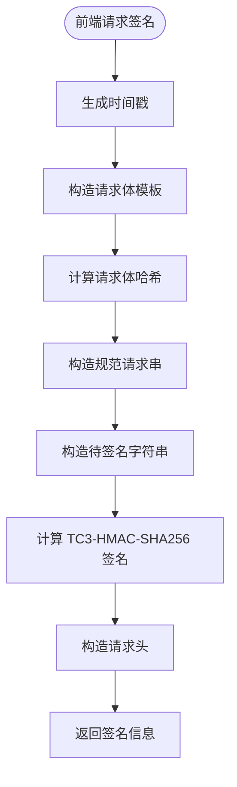

**返回数据结构**：

```typescript
{
  success: boolean;
  headers: {
    'Content-Type': string;
    'Authorization': string;
    'X-TC-Action': string;
    'X-TC-Version': string;
    'X-TC-Timestamp': string;
    'X-TC-Region': string;
  };
  payload: {
    ProjectId: number;
    SubServiceType: number;
    EngSerViceType: string;
    SourceType: number;
    VoiceFormat: number;
    UsrAudioKey: string;
    DataLen: number;
  };
  endpoint: string;
}
```

**安全措施**：
- 签名有效期：5 分钟（腾讯云默认）
- 每次请求生成独立时间戳和 UsrAudioKey
- SecretId/SecretKey 仅在后端使用，不返回给前端

##### 3.2.3.1 多轮对话上下文管理

**Pinia Store 新增字段**：

| 字段名 | 类型 | 说明 |
|--------|------|------|
| conversationContext | object | LLM 多轮对话上下文 |
| conversationContext.recentHistory | array | 最近 3 轮答题记录 |
| conversationContext.userStyle | object | 用户答题风格统计 |

**上下文更新逻辑**：

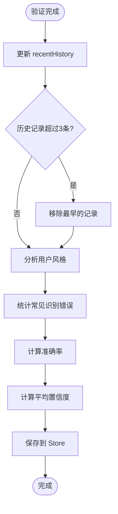

**Store 方法**：

| 方法名 | 功能 |
|--------|------|
| updateConversationContext | 更新会话上下文 |
| getConversationContext | 获取当前上下文供 LLM 调用 |
| resetConversationContext | 新游戏开始时重置上下文 |

### 3.2.4 前端 ASR 调用改造

**服务文件**：`frontend/src/services/speechRecognitionService.ts`（重构现有服务）

**调用流程**：

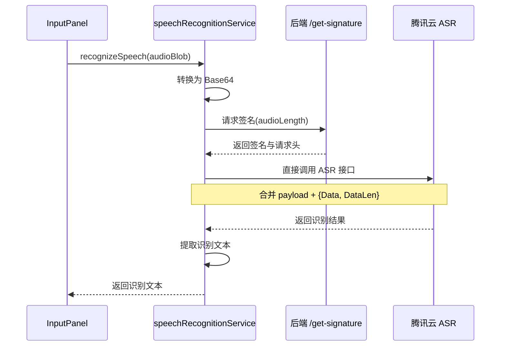

**核心改造点**：

1. **分步请求**：
   - 第一步：调用 `/api/v1/speech/get-signature` 获取签名
   - 第二步：使用签名直接调用腾讯云 ASR

2. **请求体构造**：
   - 合并后端返回的 `payload` 模板
   - 添加 `Data`（Base64 音频）和 `DataLen`（音频长度）字段

3. **跨域处理**：
   - 腾讯云 ASR 接口支持跨域请求
   - 使用标准 fetch API，携带自定义请求头

**错误处理**：
- 签名获取失败：提示网络错误，恢复计时器
- ASR 调用失败：解析错误信息，显示具体原因
- 超时处理：设置 10 秒超时限制

#### 3.2.4 DeepSeek LLM 集成服务

**服务文件**：`backend/src/llmService.ts`

**核心职责**：
- 构造 Prompt 引导 LLM 宽松判断
- 调用 DeepSeek API 获取判断结果
- 解析 LLM 返回的 JSON 结构化结果

**环境变量配置**：

| 变量名 | 说明 | 示例值 |
|--------|------|--------|
| DEEPSEEK_API_KEY | DeepSeek API 密钥 | sk-xxx |
| DEEPSEEK_API_BASE_URL | DeepSeek API 基础 URL | https://api.deepseek.com |
| DEEPSEEK_MODEL | 使用的模型名称 | deepseek-chat |

**Prompt 设计策略**：

````markdown
你是一个古诗词专家，负责判断儿童语音识别的答题内容是否正确。

**判断规则**：
1. 儿童说话可能存在口音、咬字不清等问题，识别结果可能有误
2. 如果识别文本与某句诗词的意思、韵律、字数基本一致，即可判定正确
3. 允许个别字词的谐音、同音字替换（如"晓"识别为"小"）
4. 允许1-2个字的识别错误，只要能推断出正确诗句
5. 必须包含指定的令字（关键字）
6. 不能与已使用的诗句重复

**当前游戏信息**：
- 令字：{keyword}
- 已使用诗句：{usedPoems}
- 识别文本：{recognizedText}

**历史上下文（多轮对话）**：
- 前几轮答题记录：{recentHistory}
- 用户答题风格：{userStyle}

**输出要求**：
请以 JSON 格式返回判断结果，格式如下：
```json
{
  "isCorrect": true/false,
  "correctedSentence": "修正后的标准诗句（如果正确的话）",
  "confidence": "high/medium/low",
  "reason": "判断理由"
}
```
````

**LLM 服务接口设计**：

函数签名：`verifyWithLLM(recognizedText, keyword, usedPoems, conversationContext?)`

输入：
- `recognizedText`：ASR 识别的原始文本
- `keyword`：当前回合令字
- `usedPoems`：已使用诗句数组
- `conversationContext`（可选）：会话上下文，包含最近 3 轮答题记录和用户答题风格

输出：
```typescript
{
  isCorrect: boolean;
  correctedSentence?: string;
  confidence: 'high' | 'medium' | 'low';
  reason: string;
}
```

**多轮对话上下文设计**：

会话上下文数据结构：
```typescript
{
  recentHistory: Array<{
    round: number;
    recognizedText: string;
    correctedSentence: string;
    isCorrect: boolean;
  }>; // 最近 3 轮答题记录
  userStyle: {
    commonErrors: string[]; // 常见识别错误（如"晓"识别为"小"）
    accuracyRate: number;   // 识别准确率
    averageConfidence: string; // 平均置信度
  };
}
```

**上下文管理策略**：
- 每次验证时传入最近 3 轮的答题记录
- 统计用户的常见识别错误模式，提高后续判断准确性
- 根据用户历史表现调整判断宽松度（准确率高则稍严格，准确率低则更宽松）
- 会话数据存储在 Pinia Store 中，仅在当前游戏会话有效

**异常处理**：
- API 调用失败：返回错误，前端降级为原有验证逻辑
- 响应超时(>5秒)：取消请求，返回超时错误
- JSON 解析失败：记录日志，返回解析错误

#### 3.2.3 数据库验证增强

**验证流程**：

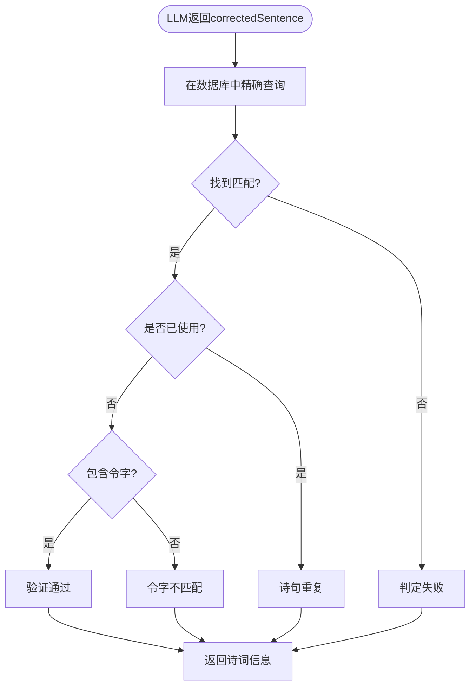

**查询策略**：
1. 使用 LLM 修正后的诗句在数据库中查询
2. 查询条件：`content LIKE '%{correctedSentence}%'`
3. 验证令字存在性、重复性
4. 返回诗词元数据（标题、作者、ID）

### 3.3 语音识别降级方案：浏览器 Web Speech API

#### 3.3.1 降级触发条件

当以下情况发生时，自动降级到浏览器 Web Speech API：

| 触发条件 | 说明 |
|---------|------|
| 腾讯云 ASR 签名获取失败 | 后端签名服务异常 |
| 腾讯云 ASR 调用失败超过 2 次 | 网络问题或 API 限流 |
| 用户手动切换 | 提供设置选项让用户选择识别方式 |
| 开发环境 | 本地开发时优先使用免费方案 |

#### 3.3.2 Web Speech API 集成设计

**服务文件**：`frontend/src/services/browserSpeechService.ts`

**能力检测**：
```typescript
function isBrowserSpeechSupported(): boolean {
  return 'webkitSpeechRecognition' in window || 'SpeechRecognition' in window;
}
```

**识别流程**：

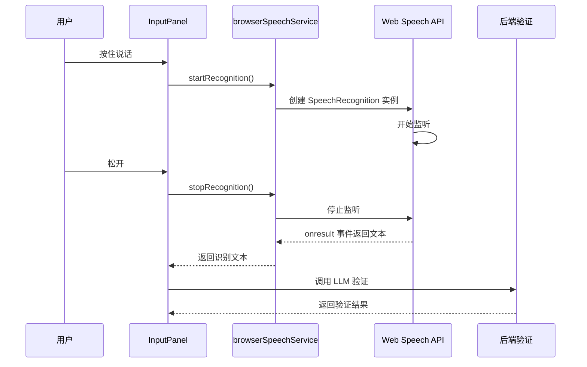

**配置参数**：

| 参数 | 值 | 说明 |
|------|---|------|
| lang | 'zh-CN' | 中文普通话 |
| continuous | false | 单次识别 |
| interimResults | false | 仅返回最终结果 |
| maxAlternatives | 1 | 仅返回最佳结果 |

**优劣对比**：

| 对比项 | 腾讯云 ASR | Web Speech API |
|--------|-----------|----------------|
| 成本 | 按调用量计费 | 完全免费 |
| 准确率 | 高（专业服务） | 中等（依赖浏览器） |
| 网络依赖 | 需要网络 | 部分浏览器支持离线 |
| 浏览器兼容性 | 全兼容（fetch 调用） | Chrome/Edge 较好，Safari/Firefox 有限 |
| 诗词专用优化 | 可自定义热词 | 无法自定义 |
| 隐私性 | 数据传输到云端 | 部分浏览器本地处理 |

#### 3.3.3 识别方式切换策略

**自动切换逻辑**：

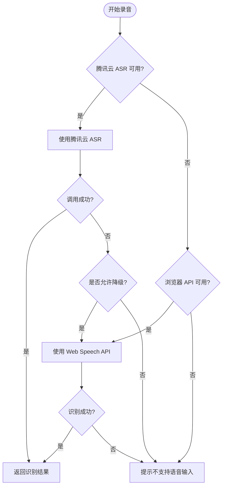

**用户设置选项**：

在游戏设置中新增"语音识别方式"选项：
- 自动选择（优先腾讯云，失败时降级）
- 仅腾讯云 ASR
- 仅浏览器识别

**降级提示**：
当降级到浏览器识别时，在 UI 上显示提示：
"当前使用浏览器内置识别，准确率可能较低，请清晰发音"

### 3.4 计时器状态管理

#### 3.4.1 Pinia Store 新增方法

**新增状态字段**：

| 字段名 | 类型 | 默认值 | 说明 |
|--------|------|--------|------|
| timerPausedByVoice | boolean | false | 是否因语音输入暂停 |
| pausedTimeRemaining | number | 0 | 暂停时的剩余时间 |

**新增方法**：

| 方法名 | 参数 | 返回值 | 说明 |
|--------|------|--------|------|
| pauseTimerForVoice | 无 | void | 暂停计时器并记录剩余时间 |
| resumeTimerAfterVoice | 无 | void | 恢复计时器到暂停前的时间 |
| cancelVoicePause | 无 | void | 取消语音暂停状态 |

**方法逻辑**：

pauseTimerForVoice：
- 如果计时器正在运行，则停止计时器
- 保存当前 `timeRemaining` 到 `pausedTimeRemaining`
- 设置 `timerPausedByVoice = true`

resumeTimerAfterVoice：
- 恢复 `timeRemaining` 为 `pausedTimeRemaining`
- 重新启动计时器
- 设置 `timerPausedByVoice = false`

cancelVoicePause：
- 重置 `timerPausedByVoice = false`
- 清空 `pausedTimeRemaining`

#### 3.4.2 TimerDisplay 组件适配

**显示逻辑**：
- 计时器暂停时显示"识别中..."状态提示
- 保持暂停时的时间显示不变
- 识别完成后恢复倒计时动画

**UI 状态**：

| 状态 | 显示文案 | 样式 |
|------|----------|------|
| 正常倒计时 | 剩余时间(秒) | 默认 |
| 语音暂停 | "语音识别中..." | 蓝色高亮 |
| 即将超时(<5秒) | 剩余时间(秒) | 红色闪烁 |

## 4. 数据流设计

### 4.1 语音答题完整数据流（腾讯云 ASR）

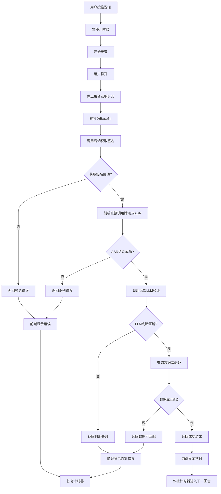

### 4.2 多轮对话数据流

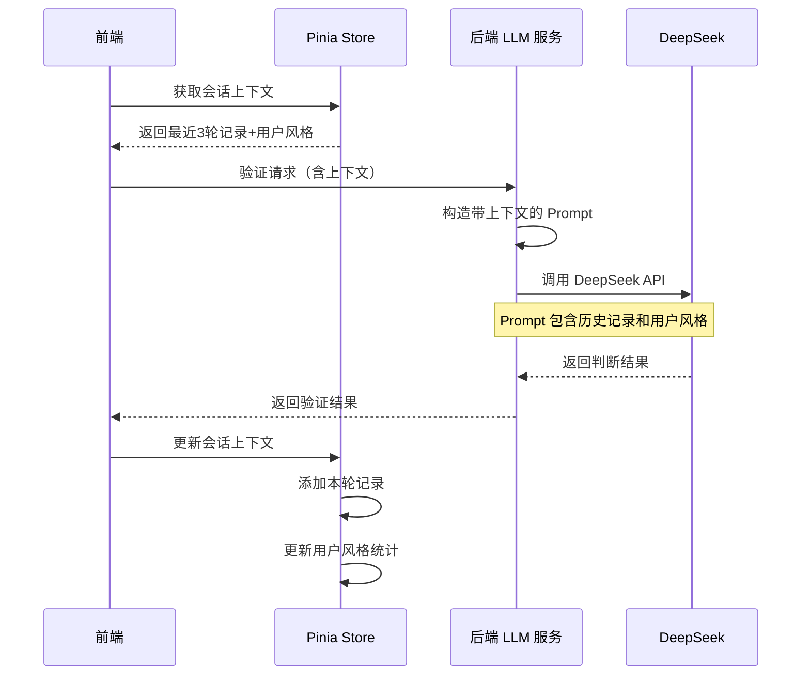

**上下文传递示例**：

```json
{
  "recognizedText": "春眠不觉小",
  "keyword": "春",
  "usedPoems": ["春江潮水连海平"],
  "conversationContext": {
    "recentHistory": [
      {
        "round": 1,
        "recognizedText": "春江潮水连海平",
        "correctedSentence": "春江潮水连海平",
        "isCorrect": true
      }
    ],
    "userStyle": {
      "commonErrors": ["晓->小", "明->名"],
      "accuracyRate": 0.85,
      "averageConfidence": "high"
    }
  }
}
```

**上下文对判断的影响**：

| 场景 | 无上下文判断 | 有上下文判断 |
|------|------------|-------------|
| 用户常识别错"晓"为"小" | 需要 LLM 推断 | 根据历史模式直接修正 |
| 用户准确率很高 | 默认宽松度 | 可稍微提高严格度 |
| 用户准确率很低 | 默认宽松度 | 进一步放宽判断标准 |
| 连续多轮相似错误 | 每次独立判断 | 识别出口音特点，智能修正 |

### 4.3 浏览器 Web Speech API 数据流

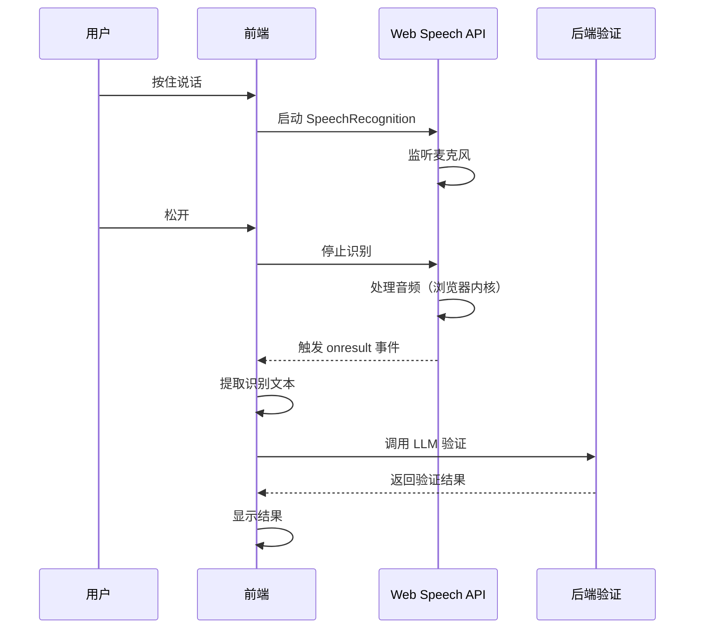

**与腾讯云 ASR 流程对比**：

| 环节 | 腾讯云 ASR | Web Speech API |
|------|-----------|----------------|
| 获取签名 | 需要 | 不需要 |
| 音频上传 | 需要转 Base64 上传 | 浏览器内部处理 |
| 识别过程 | 云端处理 | 浏览器内核处理 |
| 网络依赖 | 强依赖 | 部分浏览器可离线 |
| 后续验证 | 相同（调用 LLM） | 相同（调用 LLM） |

### 4.4 错误降级策略

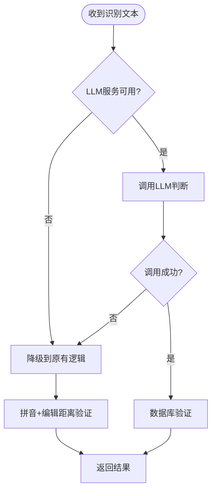

**降级规则**：
1. LLM API 不可用时，使用原有的拼音+编辑距离验证
2. LLM 响应超时(>5秒)时，降级到原有逻辑
3. LLM 返回格式错误时，降级到原有逻辑
4. 保留原有验证逻辑作为兜底方案

### 4.3 前端服务改造要点

#### 4.3.1 speechRecognitionService 重构

**原有实现问题**：
- 当前服务将音频发送到后端，由后端调用腾讯云 ASR
- Vercel 海外部署无法访问腾讯云国内接口

**新实现方案**：

函数签名：`recognizeSpeech(audioBlob: Blob): Promise<string>`

实现步骤：

1. **获取签名**：
```typescript
const signatureResponse = await fetch('/api/v1/speech/get-signature', {
  method: 'POST',
  headers: { 'Content-Type': 'application/json' },
  body: JSON.stringify({ audioLength: audioBlob.size })
});

const { headers, payload, endpoint } = await signatureResponse.json();
```

2. **转换音频**：
```typescript
const base64Audio = await convertBlobToBase64(audioBlob);
```

3. **调用腾讯云 ASR**：
```typescript
const asrPayload = {
  ...payload,
  Data: base64Audio,
  DataLen: audioBlob.size
};

const asrResponse = await fetch(endpoint, {
  method: 'POST',
  headers: headers,
  body: JSON.stringify(asrPayload)
});

const result = await asrResponse.json();
const recognizedText = result.Response.Result;
```

4. **调用后端验证**：
```typescript
const verifyResponse = await fetch('/api/v1/game/verify-with-llm', {
  method: 'POST',
  headers: { 'Content-Type': 'application/json' },
  body: JSON.stringify({
    recognizedText,
    keyword: currentKeyword,
    usedPoems: usedPoemsList
  })
});

const verifyResult = await verifyResponse.json();
return { recognizedText, ...verifyResult };
```

**异常处理**：
- 签名请求失败：抛出 "无法获取签名" 错误
- ASR 调用失败：解析腾讯云错误信息
- 验证请求失败：抛出 "验证服务异常" 错误

#### 4.3.2 InputPanel 组件改造

**新增状态**：
- `isRecognizing`：标记是否正在识别（ASR 阶段）
- `isVerifying`：标记是否正在验证（LLM 阶段）

**UI 状态提示**：

| 阶段 | 显示文案 | 样式 |
|------|----------|------|
| 录音中 | "录音中...请说话" | 蓝色背景 |
| 识别中 | "语音识别中..." | 黄色背景 |
| 验证中 | "智能判断中..." | 紫色背景 |
| 完成 | 显示结果 | 绿色/红色 |

**停止录音逻辑改造**：

```typescript
const stopRecording = async () => {
  if (!isRecording.value) return;
  
  try {
    isRecording.value = false;
    const audioBlob = await audioService.stopRecording();
    
    // 显示识别状态
    isRecognizing.value = true;
    
    // 调用语音识别服务（内部包含 ASR + 验证）
    const result = await recognizeSpeech(audioBlob, {
      keyword: props.keyword,
      usedPoems: props.usedPoems
    });
    
    isRecognizing.value = false;
    
    if (result.isCorrect) {
      // 答对了
      userInput.value = result.correctedSentence;
      emit('submit', result);
    } else {
      // 答错了
      errorMessage.value = result.message;
      // 恢复计时器由父组件处理
    }
  } catch (error) {
    isRecognizing.value = false;
    errorMessage.value = error instanceof Error ? error.message : '识别失败';
    // 通知父组件恢复计时器
    emit('recognitionFailed');
  }
};
```

**新增事件**：
- `recognitionFailed`：识别失败时触发，通知父组件恢复计时器

## 5. 安全性设计

### 5.1 API 密钥保护

| 密钥类型 | 存储位置 | 访问方式 | 安全措施 |
|---------|---------|---------|---------||
| 腾讯云 SecretId/Key | 后端环境变量 | 仅后端内部使用 | 不暴露给前端，签名有效期5分钟 |
| DeepSeek API Key | 后端环境变量 | 仅后端内部使用 | 不暴露给前端 |

### 5.2 请求签名机制

**腾讯云 ASR 签名**：
- 使用 TC3-HMAC-SHA256 算法
- 签名过程在后端完成
- 每次请求生成独立时间戳和签名
- 签名有效期：5分钟（腾讯云默认）

**防重放攻击**：
- 签名中包含时间戳
- 服务端验证时间戳有效性(±5分钟)
- 后端对签名生成接口进行限流（1次/秒/用户）

### 5.3 输入验证

**前端验证**：
- 音频大小限制：最大 5MB
- 录音时长限制：最长 30 秒
- 识别方式选择：自动降级或用户手动选择

**后端验证**：
- Base64 格式校验（仅腾讯云 ASR 需要）
- 音频长度校验
- 令字非空校验
- SQL 注入防护（Prisma ORM 自动防护）

### 5.4 Web Speech API 隐私保护

**浏览器权限管理**：
- 使用前需用户明确授权麦克风权限
- 在隐私政策中明确说明语音数据使用范围

**数据处理**：
- Chrome/Edge：部分数据可能发送到 Google 服务器
- Safari：Apple 服务器处理
- 提示用户了解不同浏览器的隐私政策
- 提供仅使用腾讯云 ASR 的选项（更可控）

## 6. 性能优化策略

### 6.1 响应时间优化

| 环节 | 目标时长 | 优化措施 |
|------|---------|---------|
| 音频采集 | <1秒 | 浏览器原生 MediaRecorder |
| Base64 转换 | <0.5秒 | FileReader 异步处理 |
| 签名获取 | <0.5秒 | 后端内存计算，无外部调用 |
| ASR 识别 | <2秒 | 前端直连腾讯云，避免 Vercel 转发 |
| LLM 判断 | <3秒 | DeepSeek API 调用 |
| 数据库查询 | <0.2秒 | 索引优化、查询缓存 |
| **总计** | **<7.2秒** | 用户可接受范围 |

### 6.2 并发控制

**限流策略**：
- 单个用户签名请求：最多 1 次/秒
- 单个用户 ASR 请求：最多 1 次/秒（前端调用，后端无法直接限流）
- 单个用户 LLM 请求：最多 1 次/2秒
- 全局 LLM 请求：根据 API 套餐限制配置

**实现方式**：
- 使用内存缓存记录用户请求时间戳
- 超出频率限制返回 429 错误
- 前端禁用连续点击（录音按钮防抖）
- Web Speech API 无需限流（浏览器本地处理）

### 6.3 缓存策略

**LLM 结果缓存**：
- 缓存键：`${recognizedText}_${keyword}_${conversationContextHash}`
- 缓存时长：1小时
- 存储方式：内存缓存（如 node-cache）
- 缓存命中率预期：20-30%（常见诗句）
- 注意：多轮对话场景下缓存命中率可能降低（上下文变化）

**数据库查询优化**：
- `content` 字段建立全文索引
- 热门诗句查询结果缓存
- 限制候选诗句查询数量（take: 1000）

**会话上下文缓存**：
- 存储在 Pinia Store 中，仅在当前游戏会话有效
- 游戏结束后清空，不持久化到 localStorage

## 7. 监控与日志

### 7.1 关键指标

| 指标名称 | 说明 | 监控阈值 |
|---------|------|---------||
| 签名生成成功率 | 签名接口调用成功比例 | >99% |
| ASR 成功率（腾讯云） | 腾讯云识别接口调用成功比例 | >95% |
| ASR 成功率（浏览器） | Web Speech API 识别成功比例 | >80% |
| 降级触发率 | 从腾讯云降级到浏览器的比例 | <10% |
| LLM 成功率 | LLM 接口调用成功比例 | >90% |
| 平均识别时长（腾讯云） | 签名+ASR+LLM+DB 总耗时 | <7.2秒 |
| 平均识别时长（浏览器） | 浏览器识别+LLM+DB 总耗时 | <4秒 |
| 判断准确率 | LLM 判断与人工审核一致性 | >85% |
| 多轮对话准确率提升 | 有上下文 vs 无上下文准确率 | >5% |
| 错误率 | 各类错误占比 | <5% |

### 7.2 日志记录

**记录内容**：

```typescript
{
  timestamp: Date,
  userId: string,
  action: 'voice_input',
  recognitionMethod: 'tencent_asr' | 'browser_speech',
  recognizedText: string,
  keyword: string,
  conversationContext: {
    roundNumber: number,
    recentHistoryCount: number,
    userAccuracyRate: number
  },
  llmResult: {
    isCorrect: boolean,
    correctedSentence: string,
    confidence: string,
    usedContext: boolean
  },
  dbVerified: boolean,
  finalResult: boolean,
  duration: {
    signature?: number,
    asr: number,
    llm: number,
    db: number,
    total: number
  },
  fallback?: {
    from: string,
    to: string,
    reason: string
  },
  error?: string
}
```

**日志级别**：
- INFO：正常识别与判断流程
- WARN：降级、超时、缓存未命中
- ERROR：API 调用失败、数据库错误

## 8. 测试策略

### 8.1 单元测试

**前端**：
- audioService 录音采集功能
- InputPanel 计时器暂停/恢复逻辑
- game.ts 状态管理方法

**后端**：
- ASR 签名生成正确性
- LLM Prompt 构造
- 数据库查询验证逻辑

### 8.2 集成测试

**测试场景**：

| 场景 | 输入 | 预期输出 |
|------|------|---------||
| 标准诗句 | "春眠不觉晓" | 识别正确，验证通过 |
| 谐音错误 | "春眠不觉小" | LLM 修正为"晓"，验证通过 |
| 口音识别 | "春mian不觉晓" | LLM 识别拼音混杂，修正后通过 |
| 错误诗句 | "春天真美丽" | LLM 判断非诗词，验证失败 |
| 重复诗句 | 已用过的诗句 | 数据库验证失败，提示重复 |
| 无令字 | 不含令字的诗句 | 验证失败，提示缺少令字 |
| 腾讯云 ASR 降级 | 签名获取失败 | 自动切换到浏览器识别 |
| 浏览器识别成功 | Chrome 浏览器语音输入 | 识别成功，正常验证 |
| 多轮对话优化 | 连续3次"晓"识别为"小" | LLM 识别用户口音特点，自动修正 |

### 8.3 性能测试

**测试目标**：
- 腾讯云 ASR 全流程 < 7.2秒
- 浏览器 Web Speech API 全流程 < 4秒
- 并发 10 用户同时识别不崩溃
- LLM 缓存命中率 > 20%
- 多轮对话上下文传递准确率 100%
- 降级切换成功率 > 95%

## 9. 部署配置

### 9.1 环境变量清单

**后端新增变量**：

```bash
# 腾讯云 ASR 配置
TENCENT_ASR_SECRET_ID=your-secret-id
TENCENT_ASR_SECRET_KEY=your-secret-key
TENCENT_ASR_APP_ID=your-app-id

# DeepSeek LLM 配置
DEEPSEEK_API_KEY=sk-xxxxx
DEEPSEEK_API_BASE_URL=https://api.deepseek.com
DEEPSEEK_MODEL=deepseek-chat
DEEPSEEK_TIMEOUT=5000

# 缓存配置
LLM_CACHE_TTL=3600
LLM_CACHE_MAX_SIZE=1000

# 多轮对话配置
CONVERSATION_HISTORY_LIMIT=3
ENABLE_CONVERSATION_CONTEXT=true
```

### 9.2 依赖安装

**后端新增依赖**：

```json
{
  "dependencies": {
    "axios": "^1.13.2",
    "node-cache": "^5.1.2"
  }
}
```

**前端无需新增依赖**（复用现有 audioService 和 fetch）。

## 10. 风险评估与应对

| 风险 | 影响 | 概率 | 应对措施 |
|------|------|------|---------|
| 前端跨域 ASR 调用失败 | 语音输入不可用 | 低 | 腾讯云 API 支持 CORS，测试验证 |
| LLM API 不稳定 | 识别失败率增加 | 中 | 降级到原有验证逻辑 |
| LLM 判断过于宽松 | 错误答案被误判正确 | 中 | 调整 Prompt 严格度，人工审核日志 |
| ASR 识别率低 | 用户体验差 | 低 | 优化录音参数，引导用户清晰发音 |
| 响应时间过长 | 用户等待时间长 | 中 | 增加缓存、优化 Prompt 长度、前端直连 ASR |
| 成本增加 | 运营成本上升 | 高 | 控制并发量、合理配置缓存 |
| 签名泄露风险 | 密钥被滥用 | 低 | 签名短期有效(5分钟)，后端限流 |

## 11. 后续优化方向

1. **自定义词库**：在腾讯云 ASR 请求中传入诗词专用热词，提升识别准确率
2. **用户反馈机制**：允许用户标记错误判断，收集数据优化 Prompt 和多轮对话策略
3. **性能监控面板**：实时展示 ASR/LLM 成功率、响应时间、降级触发率等指标
4. **多轮对话深度优化**：
   - 基于更长时间窗口（如整局游戏）分析用户语音特点
   - 构建用户语音特征画像，持久化到用户配置
   - 支持多用户识别，为不同用户建立独立的语音模型
5. **离线识别增强**：
   - 探索 WebAssembly 版本的离线语音识别引擎
   - 构建诗词专用的轻量级识别模型
6. **跨平台适配**：
   - 针对移动端浏览器优化识别体验
   - 支持微信小程序语音接口（如需扩展）
