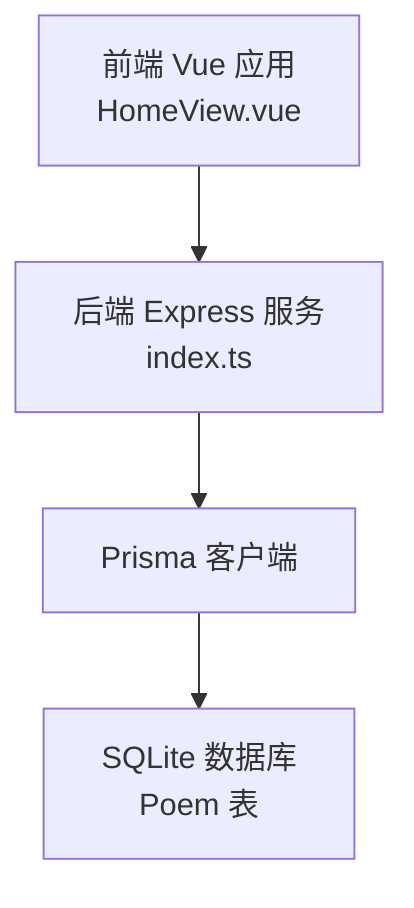
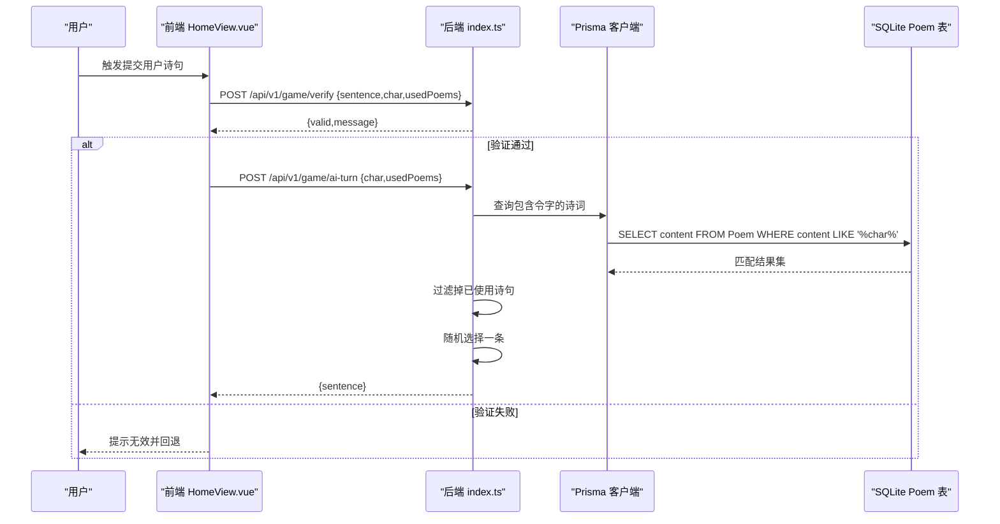
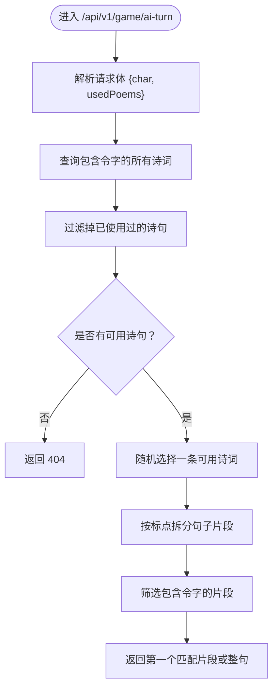
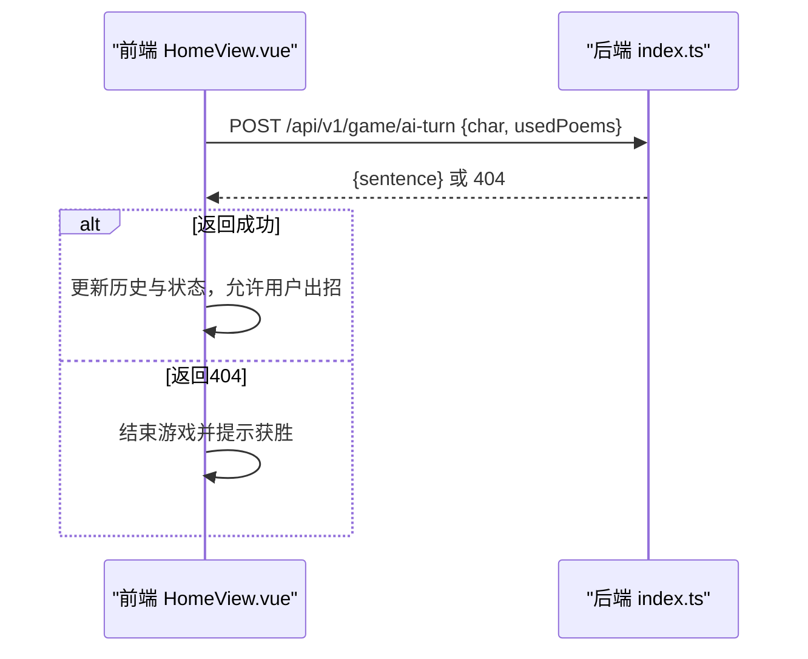
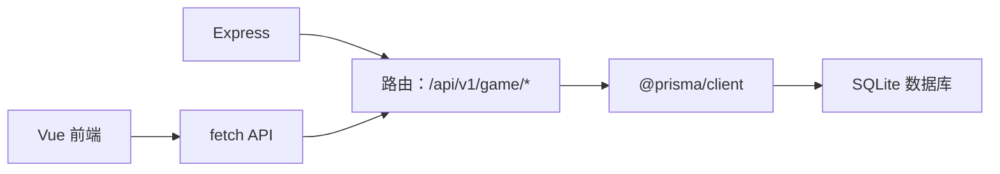

# AI出句接口

<cite>
**本文引用的文件**
- [backend/src/index.ts](file://backend/src/index.ts)
- [backend/prisma/migrations/20251104061144_init/migration.sql](file://backend/prisma/migrations/20251104061144_init/migration.sql)
- [backend/prisma/seed.ts](file://backend/prisma/seed.ts)
- [frontend/src/views/HomeView.vue](file://frontend/src/views/HomeView.vue)
- [GEMINI.md](file://GEMINI.md)
</cite>

## 目录
1. [简介](#简介)
2. [项目结构](#项目结构)
3. [核心组件](#核心组件)
4. [架构总览](#架构总览)
5. [详细组件分析](#详细组件分析)
6. [依赖关系分析](#依赖关系分析)
7. [性能考虑](#性能考虑)
8. [故障排查指南](#故障排查指南)
9. [结论](#结论)
10. [附录](#附录)

## 简介
本接口用于在用户诗句验证通过后，请求AI返回一句包含“令字”的合法诗句，作为人机对战的下一步动作。接口采用POST方法，请求体包含令字与已使用诗句列表；响应体包含一句AI选择的诗句；当无可选诗句时返回404。该接口是实现飞花令人机对战的核心交互之一，确保游戏流程的连续性。

## 项目结构
后端使用Express + Prisma，数据库为SQLite（开发环境）。前端为Vue3应用，通过fetch调用后端API完成游戏流程。

图表来源
- [backend/src/index.ts](file://backend/src/index.ts#L1-L78)
- [backend/prisma/migrations/20251104061144_init/migration.sql](file://backend/prisma/migrations/20251104061144_init/migration.sql#L1-L8)
- [frontend/src/views/HomeView.vue](file://frontend/src/views/HomeView.vue#L1-L118)

章节来源
- [GEMINI.md](file://GEMINI.md#L11-L21)

## 核心组件
- 接口路径与方法
  - 方法：POST
  - 路径：/api/v1/game/ai-turn
- 请求体字段
  - char: string —— 当前轮次的令字
  - usedPoems: string[] —— 已被使用过的诗句集合
- 响应体字段
  - sentence: string —— AI返回的一句包含令字的合法诗句
- 错误处理
  - 当无可选诗句时返回404，并携带错误信息

章节来源
- [backend/src/index.ts](file://backend/src/index.ts#L50-L72)

## 架构总览
该接口属于后端API层，依赖Prisma访问SQLite数据库中的Poem表。前端在用户验证通过后调用此接口，AI从可用诗句中随机选择一句返回给前端，前端更新历史记录并切换回合。

图表来源
- [backend/src/index.ts](file://backend/src/index.ts#L24-L72)
- [frontend/src/views/HomeView.vue](file://frontend/src/views/HomeView.vue#L32-L84)

## 详细组件分析

### 接口定义与行为
- 接口名称：POST /api/v1/game/ai-turn
- 功能：在用户诗句验证通过后，返回一句包含令字的合法诗句
- 请求体结构：
  - char: string —— 当前轮次的令字
  - usedPoems: string[] —— 已使用过的诗句集合
- 响应体结构：
  - sentence: string —— AI选择的诗句
- 错误响应：
  - 404：无可选诗句时返回

章节来源
- [backend/src/index.ts](file://backend/src/index.ts#L50-L72)

### AI选择逻辑
AI选择逻辑分为以下步骤：
1. 查询所有包含令字的诗词
2. 过滤掉已被使用的诗句（通过判断诗句是否出现在usedPoems中）
3. 若无可用诗句，返回404
4. 否则随机选择一条可用诗词
5. 将该诗词按标点拆分为句子片段，筛选包含令字的片段作为最终返回值；若无匹配片段，则返回整句

图表来源
- [backend/src/index.ts](file://backend/src/index.ts#L50-L72)

### 数据模型与存储
- 表结构：Poem（id、title、author、content）
- 数据来源：种子脚本将多首诗按段落拼接为content存入数据库
- 关键字段：
  - content：存储完整诗句串（包含逗号等标点）

章节来源
- [backend/prisma/migrations/20251104061144_init/migration.sql](file://backend/prisma/migrations/20251104061144_init/migration.sql#L1-L8)
- [backend/prisma/seed.ts](file://backend/prisma/seed.ts#L1-L53)

### 前端集成与调用方式
- 前端在用户验证通过后调用该接口，传入当前令字与已使用诗句列表
- 成功时将AI返回的诗句加入历史并切换回合；失败时提示并结束游戏

图表来源
- [frontend/src/views/HomeView.vue](file://frontend/src/views/HomeView.vue#L64-L84)
- [backend/src/index.ts](file://backend/src/index.ts#L50-L72)

章节来源
- [frontend/src/views/HomeView.vue](file://frontend/src/views/HomeView.vue#L32-L84)

### curl 调用示例
- 示例命令（请根据实际后端地址调整）：
  - curl -X POST http://localhost:3000/api/v1/game/ai-turn -H "Content-Type: application/json" -d '{"char":"月","usedPoems":["床前明月光，疑是地上霜。"]}'

章节来源
- [backend/src/index.ts](file://backend/src/index.ts#L50-L72)

### 前端 fetch 使用方式
- 在用户验证通过后，调用该接口：
  - fetch("http://localhost:3000/api/v1/game/ai-turn", {
      method: "POST",
      headers: { "Content-Type": "application/json" },
      body: JSON.stringify({ char, usedPoems })
    })

章节来源
- [frontend/src/views/HomeView.vue](file://frontend/src/views/HomeView.vue#L64-L84)

## 依赖关系分析
- 后端依赖
  - Express：提供HTTP服务与路由
  - Prisma：ORM访问SQLite数据库
  - CORS：跨域支持
- 数据库依赖
  - Poem表：存储诗词标题、作者与完整诗句串
- 前端依赖
  - Vue3 + Pinia：状态管理与UI渲染
  - fetch：调用后端API

图表来源
- [backend/src/index.ts](file://backend/src/index.ts#L1-L78)
- [backend/prisma/migrations/20251104061144_init/migration.sql](file://backend/prisma/migrations/20251104061144_init/migration.sql#L1-L8)
- [frontend/src/views/HomeView.vue](file://frontend/src/views/HomeView.vue#L1-L118)

## 性能考虑
- 查询效率
  - 当前实现对包含令字的诗词进行全量查询，未使用索引；在数据量较大时建议为content字段建立全文检索或模糊查询优化
- 过滤成本
  - 对每条诗词执行包含判断，复杂度与usedPoems长度线性相关；可考虑将usedPoems转换为Set以降低查找成本
- 随机选择
  - 数组随机选择为O(1)，整体受可用诗句数量影响

## 故障排查指南
- 404 无可选诗句
  - 可能原因：所有包含令字的诗句均已被使用
  - 处理建议：检查usedPoems是否过长或过于保守；适当放宽策略
- 网络或跨域问题
  - 检查CORS配置与后端端口
- 数据库为空
  - 确认种子脚本已执行并成功写入Poem表

章节来源
- [backend/src/index.ts](file://backend/src/index.ts#L50-L72)
- [backend/prisma/seed.ts](file://backend/prisma/seed.ts#L1-L53)

## 结论
POST /api/v1/game/ai-turn接口实现了人机对战中的AI出句能力。当前实现为简单随机选择，满足基本游戏连续性需求。未来可扩展为基于难度、作者偏好或上下文语义的智能选择策略，以提升游戏体验与挑战性。

## 附录
- 业务意义
  - 维持人机对战的回合制流程，确保每轮都有AI的合法响应
  - 与验证接口配合，形成完整的“出句-验证-回合计”闭环
- 未来扩展方向
  - 引入难度等级：低级仅随机，高级引入作者偏好或主题相关性
  - 引入语义相似度：优先选择与上一轮诗句风格相近的句子
  - 引入缓存与预筛选：减少重复查询与计算开销