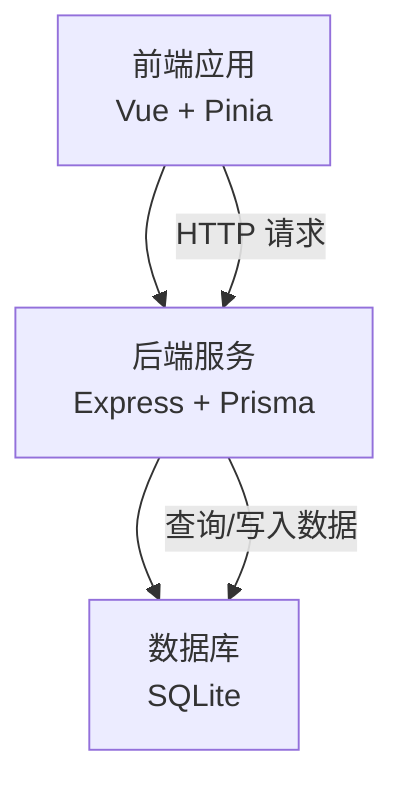
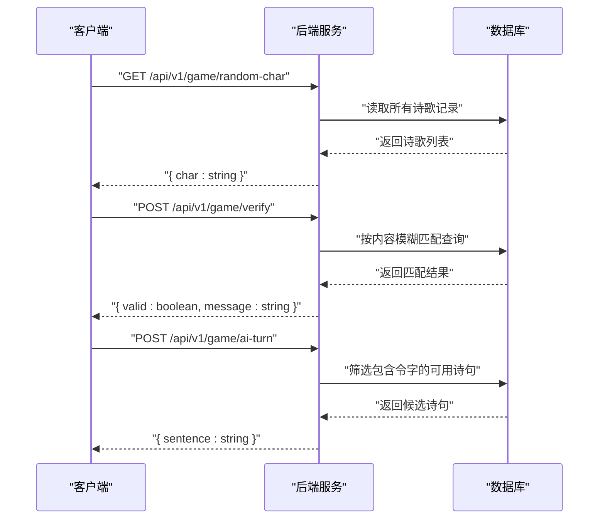
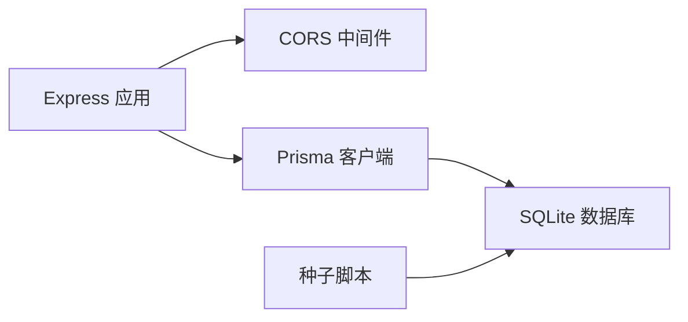
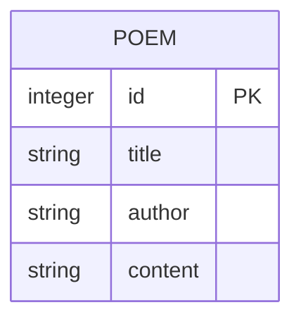

# API接口文档

<cite>
**本文引用的文件**
- [backend/src/index.ts](file://backend/src/index.ts)
- [backend/package.json](file://backend/package.json)
- [backend/prisma/seed.ts](file://backend/prisma/seed.ts)
- [backend/prisma/migrations/20251104061144_init/migration.sql](file://backend/prisma/migrations/20251104061144_init/migration.sql)
- [backend/.env](file://backend/.env)
- [frontend/src/views/HomeView.vue](file://frontend/src/views/HomeView.vue)
</cite>

## 目录
1. [简介](#简介)
2. [项目结构](#项目结构)
3. [核心组件](#核心组件)
4. [架构总览](#架构总览)
5. [详细组件分析](#详细组件分析)
6. [依赖关系分析](#依赖关系分析)
7. [性能考量](#性能考量)
8. [故障排查指南](#故障排查指南)
9. [结论](#结论)
10. [附录](#附录)

## 简介
本文件为飞花令游戏后端服务的公开API接口文档，覆盖以下三个端点：
- GET /api/v1/game/random-char：返回一个随机令字
- POST /api/v1/game/verify：校验用户输入的诗句是否有效
- POST /api/v1/game/ai-turn：由AI生成一句包含令字的诗句

文档提供每个接口的HTTP方法、URL路径、请求头要求（Content-Type: application/json）、请求体结构与响应体格式，并给出curl命令示例与JavaScript fetch调用示例。同时说明错误码设计（如400输入无效、404资源不存在、500服务器内部错误）及安全注意事项（无认证需求，适用于本地开发），并建议采用OpenAPI规范进行后续自动化文档生成。

## 项目结构
后端基于Express框架，使用Prisma访问SQLite数据库，提供上述三个REST接口；前端通过fetch调用后端接口实现交互逻辑。

图表来源
- [backend/src/index.ts](file://backend/src/index.ts#L1-L78)
- [backend/prisma/migrations/20251104061144_init/migration.sql](file://backend/prisma/migrations/20251104061144_init/migration.sql#L1-L8)
- [backend/.env](file://backend/.env#L1-L1)

章节来源
- [backend/src/index.ts](file://backend/src/index.ts#L1-L78)
- [backend/package.json](file://backend/package.json#L1-L30)

## 核心组件
- 后端服务：提供三个REST接口，均位于 /api/v1/game 路径下
- 数据层：使用Prisma访问SQLite数据库，表结构包含诗歌标题、作者与正文
- 前端集成：通过fetch调用后端接口，完成游戏流程控制

章节来源
- [backend/src/index.ts](file://backend/src/index.ts#L1-L78)
- [backend/prisma/migrations/20251104061144_init/migration.sql](file://backend/prisma/migrations/20251104061144_init/migration.sql#L1-L8)
- [frontend/src/views/HomeView.vue](file://frontend/src/views/HomeView.vue#L1-L118)

## 架构总览
后端服务启动后监听本地端口，接收来自前端的HTTP请求，查询或更新数据库中的诗歌记录，返回结构化JSON响应。

图表来源
- [backend/src/index.ts](file://backend/src/index.ts#L1-L78)

## 详细组件分析

### 接口一：获取随机令字
- 方法与路径
  - GET /api/v1/game/random-char
- 请求头
  - Content-Type: application/json（可选，后端未强制校验）
- 请求体
  - 无
- 成功响应
  - 结构：{ char: string }
  - 示例：{"char":"光"}
- 错误响应
  - 404：当数据库中无任何诗歌记录时，返回错误信息
- curl示例
  - curl -X GET http://localhost:3000/api/v1/game/random-char
- JavaScript fetch示例
  - fetch("http://localhost:3000/api/v1/game/random-char").then(r=>r.json()).then(d=>console.log(d.char))

章节来源
- [backend/src/index.ts](file://backend/src/index.ts#L12-L21)

### 接口二：校验用户诗句
- 方法与路径
  - POST /api/v1/game/verify
- 请求头
  - Content-Type: application/json
- 请求体
  - 字段
    - sentence: string（必填）
    - char: string（必填）
    - usedPoems: string[]（必填）
- 成功响应
  - 结构：{ valid: boolean, message: string }
  - 示例：{"valid":true,"message":"验证成功"}
- 错误响应
  - 400：缺少必要参数时返回错误
  - 其他：正常返回校验结果（valid与message）
- curl示例
  - curl -X POST http://localhost:3000/api/v1/game/verify -H "Content-Type: application/json" -d '{"sentence":"床前明月光","char":"光","usedPoems":[""]}'
- JavaScript fetch示例
  - fetch("http://localhost:3000/api/v1/game/verify",{method:"POST",headers:{"Content-Type":"application/json"},body:JSON.stringify({sentence,char,usedPoems})}).then(r=>r.json())

章节来源
- [backend/src/index.ts](file://backend/src/index.ts#L23-L48)
- [frontend/src/views/HomeView.vue](file://frontend/src/views/HomeView.vue#L32-L62)

### 接口三：AI回合生成诗句
- 方法与路径
  - POST /api/v1/game/ai-turn
- 请求头
  - Content-Type: application/json
- 请求体
  - 字段
    - char: string（必填）
    - usedPoems: string[]（必填）
- 成功响应
  - 结构：{ sentence: string }
  - 示例：{"sentence":"举头望明月"}
- 错误响应
  - 404：当无可选诗句时返回错误
- curl示例
  - curl -X POST http://localhost:3000/api/v1/game/ai-turn -H "Content-Type: application/json" -d '{"char":"月","usedPoems":["床前明月光"]}'
- JavaScript fetch示例
  - fetch("http://localhost:3000/api/v1/game/ai-turn",{method:"POST",headers:{"Content-Type":"application/json"},body:JSON.stringify({char,usedPoems})}).then(r=>r.json())

章节来源
- [backend/src/index.ts](file://backend/src/index.ts#L50-L72)
- [frontend/src/views/HomeView.vue](file://frontend/src/views/HomeView.vue#L64-L84)

## 依赖关系分析
- 后端依赖
  - Express：提供HTTP服务与路由
  - Prisma：ORM访问SQLite数据库
  - CORS：允许跨域请求（开发环境）
- 数据模型
  - 表：Poem（id, title, author, content）
  - 初始数据：通过种子脚本导入多首经典诗歌
- 运行与配置
  - 端口：默认3000
  - 数据库：SQLite文件路径由环境变量指定

图表来源
- [backend/src/index.ts](file://backend/src/index.ts#L1-L10)
- [backend/package.json](file://backend/package.json#L15-L28)
- [backend/prisma/migrations/20251104061144_init/migration.sql](file://backend/prisma/migrations/20251104061144_init/migration.sql#L1-L8)
- [backend/prisma/seed.ts](file://backend/prisma/seed.ts#L1-L53)
- [backend/.env](file://backend/.env#L1-L1)

章节来源
- [backend/package.json](file://backend/package.json#L1-L30)
- [backend/prisma/migrations/20251104061144_init/migration.sql](file://backend/prisma/migrations/20251104061144_init/migration.sql#L1-L8)
- [backend/prisma/seed.ts](file://backend/prisma/seed.ts#L1-L53)
- [backend/.env](file://backend/.env#L1-L1)

## 性能考量
- 查询策略
  - 随机令字：全量读取诗歌列表后随机选择，适合小规模数据
  - 校验诗句：按内容模糊匹配，建议在content字段建立索引以提升查询效率
  - AI回合：先按令字筛选，再排除已用诗句，最后随机选择，适合小规模数据
- 建议
  - 在生产环境启用数据库索引（如对content建立全文索引或等价索引）
  - 对高频接口增加缓存（如令字池缓存）
  - 控制请求体大小，避免超大数组导致内存压力

[本节为通用性能建议，不直接分析具体文件]

## 故障排查指南
- 400 错误（缺少参数）
  - 现象：POST /api/v1/game/verify 返回错误
  - 处理：确保请求体包含 sentence、char、usedPoems
- 404 错误（资源不存在）
  - 现象：GET /api/v1/game/random-char 或 POST /api/v1/game/ai-turn 返回错误
  - 处理：确认数据库中存在诗歌记录；如为空，先执行种子脚本导入数据
- 500 错误（服务器内部错误）
  - 现象：服务异常或数据库连接失败
  - 处理：检查服务日志、数据库连接字符串与权限
- 前端调用问题
  - 现象：fetch请求失败或跨域报错
  - 处理：确认后端已启用CORS，且端口与地址正确

章节来源
- [backend/src/index.ts](file://backend/src/index.ts#L12-L21)
- [backend/src/index.ts](file://backend/src/index.ts#L23-L48)
- [backend/src/index.ts](file://backend/src/index.ts#L50-L72)

## 结论
本API提供了飞花令游戏的核心能力：获取令字、校验诗句与AI回合生成。接口设计简洁，便于集成与扩展。建议在后续迭代中引入OpenAPI规范，自动生成接口文档与SDK，提升团队协作效率与一致性。

[本节为总结性内容，不直接分析具体文件]

## 附录

### OpenAPI 规范建议
- 使用OpenAPI 3.0定义上述三个端点，明确请求/响应结构、状态码与错误模式
- 自动生成TypeScript客户端SDK，统一前后端契约
- 集成到CI/CD流水线，保持文档与代码同步

[本节为概念性建议，不直接分析具体文件]

### 数据模型概览

图表来源
- [backend/prisma/migrations/20251104061144_init/migration.sql](file://backend/prisma/migrations/20251104061144_init/migration.sql#L1-L8)