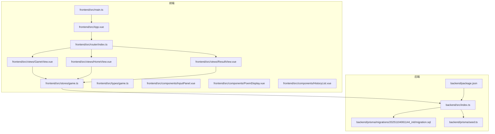
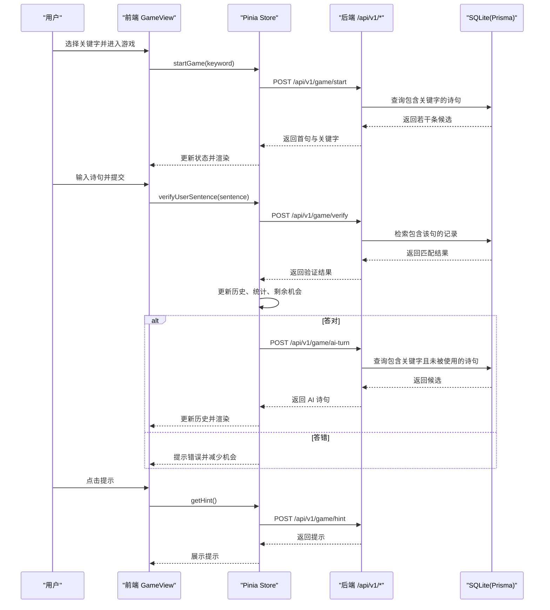
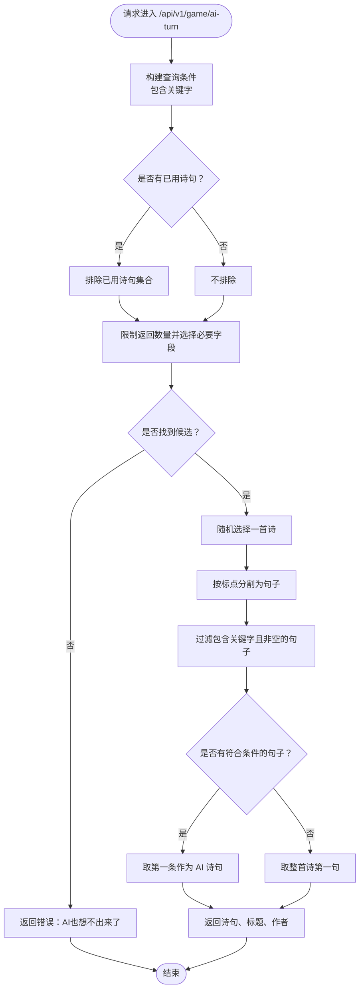
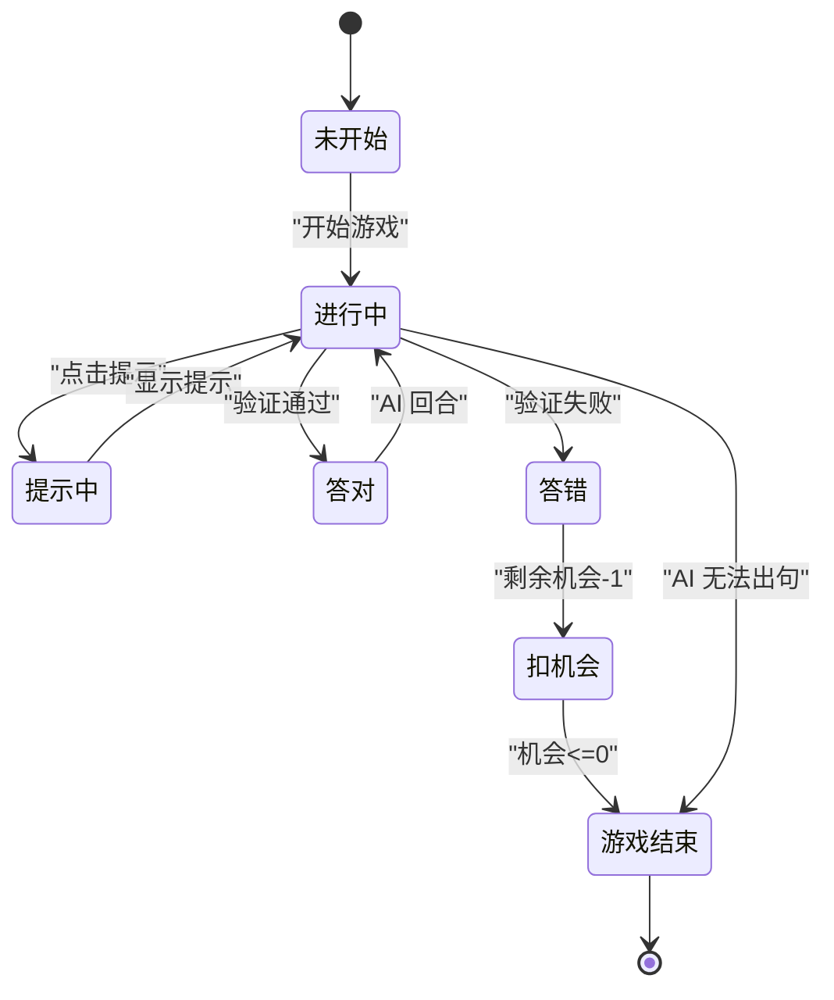
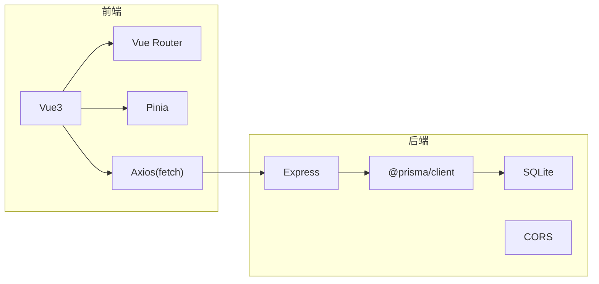

# Hint Api

<cite>
**本文引用的文件**
- [backend/src/index.ts](file://backend/src/index.ts)
- [backend/package.json](file://backend/package.json)
- [backend/prisma/seed.ts](file://backend/prisma/seed.ts)
- [backend/prisma/migrations/20251104061144_init/migration.sql](file://backend/prisma/migrations/20251104061144_init/migration.sql)
- [frontend/src/main.ts](file://frontend/src/main.ts)
- [frontend/src/App.vue](file://frontend/src/App.vue)
- [frontend/src/router/index.ts](file://frontend/src/router/index.ts)
- [frontend/src/views/HomeView.vue](file://frontend/src/views/HomeView.vue)
- [frontend/src/views/GameView.vue](file://frontend/src/views/GameView.vue)
- [frontend/src/views/ResultView.vue](file://frontend/src/views/ResultView.vue)
- [frontend/src/stores/game.ts](file://frontend/src/stores/game.ts)
- [frontend/src/types/game.ts](file://frontend/src/types/game.ts)
- [frontend/src/components/InputPanel.vue](file://frontend/src/components/InputPanel.vue)
- [frontend/src/components/PoemDisplay.vue](file://frontend/src/components/PoemDisplay.vue)
- [frontend/src/components/HistoryList.vue](file://frontend/src/components/HistoryList.vue)
- [GEMINI.md](file://GEMINI.md)
</cite>

## 目录
1. [简介](#简介)
2. [项目结构](#项目结构)
3. [核心组件](#核心组件)
4. [架构总览](#架构总览)
5. [详细组件分析](#详细组件分析)
6. [依赖关系分析](#依赖关系分析)
7. [性能考虑](#性能考虑)
8. [故障排查指南](#故障排查指南)
9. [结论](#结论)
10. [附录](#附录)

## 简介
本项目为“飞花令”H5小游戏，采用前后端分离架构：前端使用 Vue3 + TypeScript + Pinia + Vue Router，后端使用 Node.js + Express + Prisma + SQLite。后端提供一组与飞花令玩法相关的 API，包括随机令字、诗句验证、AI 出句、开始游戏以及提示系统；前端通过 Pinia Store 调用这些 API，完成游戏流程控制、状态管理与 UI 展示。

## 项目结构
- 后端
  - 服务入口与路由：backend/src/index.ts
  - 数据库与迁移：backend/prisma/seed.ts、backend/prisma/migrations/20251104061144_init/migration.sql
  - 包管理：backend/package.json
- 前端
  - 应用入口：frontend/src/main.ts
  - 根组件：frontend/src/App.vue
  - 路由：frontend/src/router/index.ts
  - 视图：HomeView、GameView、ResultView
  - 状态：Pinia Store（frontend/src/stores/game.ts）
  - 类型：frontend/src/types/game.ts
  - 组件：InputPanel、PoemDisplay、HistoryList
  - 文档：GEMINI.md

图表来源
- [frontend/src/main.ts](file://frontend/src/main.ts#L1-L15)
- [frontend/src/App.vue](file://frontend/src/App.vue#L1-L12)
- [frontend/src/router/index.ts](file://frontend/src/router/index.ts#L1-L26)
- [frontend/src/views/HomeView.vue](file://frontend/src/views/HomeView.vue#L1-L69)
- [frontend/src/views/GameView.vue](file://frontend/src/views/GameView.vue#L1-L156)
- [frontend/src/views/ResultView.vue](file://frontend/src/views/ResultView.vue#L1-L118)
- [frontend/src/stores/game.ts](file://frontend/src/stores/game.ts#L1-L220)
- [frontend/src/types/game.ts](file://frontend/src/types/game.ts#L1-L37)
- [frontend/src/components/InputPanel.vue](file://frontend/src/components/InputPanel.vue#L1-L106)
- [frontend/src/components/PoemDisplay.vue](file://frontend/src/components/PoemDisplay.vue#L1-L31)
- [frontend/src/components/HistoryList.vue](file://frontend/src/components/HistoryList.vue#L1-L41)
- [backend/src/index.ts](file://backend/src/index.ts#L1-L234)
- [backend/prisma/migrations/20251104061144_init/migration.sql](file://backend/prisma/migrations/20251104061144_init/migration.sql#L1-L8)
- [backend/prisma/seed.ts](file://backend/prisma/seed.ts#L1-L53)
- [backend/package.json](file://backend/package.json#L1-L32)

章节来源
- [GEMINI.md](file://GEMINI.md#L1-L21)

## 核心组件
- 后端 API 服务
  - 随机令字接口：随机从诗词库中抽取一个字符作为关键字
  - 诗句验证接口：校验用户输入是否包含关键字、是否重复使用、是否存在于数据库
  - AI 回合接口：基于关键字筛选可用诗句，排除已用过的诗句，返回一条包含关键字的句子
  - 开始游戏接口：根据关键字返回 AI 的首句，并初始化游戏状态
  - 提示接口：按提示等级返回不同层级的提示
- 前端状态与交互
  - Pinia Store：集中管理 keyword、isPlaying、currentRound、remainingChances、history、usedPoems、stats、currentHintLevel 等状态
  - 视图与组件：HomeView（关键字选择）、GameView（主游戏界面）、ResultView（结算页）、InputPanel（输入与按钮）、PoemDisplay（诗句展示）、HistoryList（历史记录）

章节来源
- [backend/src/index.ts](file://backend/src/index.ts#L12-L234)
- [frontend/src/stores/game.ts](file://frontend/src/stores/game.ts#L1-L220)
- [frontend/src/views/HomeView.vue](file://frontend/src/views/HomeView.vue#L1-L69)
- [frontend/src/views/GameView.vue](file://frontend/src/views/GameView.vue#L1-L156)
- [frontend/src/views/ResultView.vue](file://frontend/src/views/ResultView.vue#L1-L118)
- [frontend/src/components/InputPanel.vue](file://frontend/src/components/InputPanel.vue#L1-L106)
- [frontend/src/components/PoemDisplay.vue](file://frontend/src/components/PoemDisplay.vue#L1-L31)
- [frontend/src/components/HistoryList.vue](file://frontend/src/components/HistoryList.vue#L1-L41)

## 架构总览
后端以 Express 提供 REST API，Prisma 访问 SQLite 数据库存取诗词内容；前端通过 Pinia Store 发起 fetch 请求调用后端接口，完成游戏流程闭环。

图表来源
- [frontend/src/views/GameView.vue](file://frontend/src/views/GameView.vue#L1-L156)
- [frontend/src/stores/game.ts](file://frontend/src/stores/game.ts#L1-L220)
- [backend/src/index.ts](file://backend/src/index.ts#L12-L234)

## 详细组件分析

### 后端 API 设计与实现
- 接口概览
  - GET /api/v1/game/random-char：随机返回一个字符
  - POST /api/v1/game/verify：验证用户诗句是否包含关键字、是否重复使用、是否存在
  - POST /api/v1/game/ai-turn：AI 基于关键字与已用诗句集合返回一条候选句
  - POST /api/v1/game/start：开始游戏，返回 AI 首句
  - POST /api/v1/game/hint：按提示等级返回提示
- 数据模型
  - Poem 表：id、title、author、content
- 关键实现要点
  - 查询优化：限制查询数量、仅选择必要字段
  - 字符串处理：按多种标点分割句子，确保包含关键字的完整句
  - 错误处理：对空库、参数缺失、未找到等场景返回明确错误信息

图表来源
- [backend/src/index.ts](file://backend/src/index.ts#L78-L132)

章节来源
- [backend/src/index.ts](file://backend/src/index.ts#L12-L234)
- [backend/prisma/migrations/20251104061144_init/migration.sql](file://backend/prisma/migrations/20251104061144_init/migration.sql#L1-L8)

### 前端状态与流程
- 状态模型
  - 关键字、是否进行中、当前回合、剩余机会、历史记录、已用诗句、统计数据、当前提示等级
- 主要流程
  - 开始游戏：向后端发起开始请求，接收首句并写入历史
  - 用户提交：验证诗句，正确则推进到 AI 回合，错误则扣减机会
  - AI 回合：向后端请求 AI 诗句，写入历史并更新已用诗句
  - 提示：按等级递增，向后端请求提示
  - 结算：统计总回合、正确/错误次数、提示使用次数、游戏时长

图表来源
- [frontend/src/stores/game.ts](file://frontend/src/stores/game.ts#L1-L220)
- [frontend/src/views/GameView.vue](file://frontend/src/views/GameView.vue#L1-L156)
- [frontend/src/views/ResultView.vue](file://frontend/src/views/ResultView.vue#L1-L118)

章节来源
- [frontend/src/stores/game.ts](file://frontend/src/stores/game.ts#L1-L220)
- [frontend/src/types/game.ts](file://frontend/src/types/game.ts#L1-L37)

### 前端组件与视图
- HomeView：提供关键字选择器，触发开始游戏
- GameView：展示 AI 诗句、玩家输入面板、历史记录、统计信息；处理提交、提示、跳过、退出
- ResultView：展示评价、统计数据、历史记录，并支持再来一局或返回首页
- InputPanel：输入框、提交、提示、跳过按钮，支持提示与错误消息展示
- PoemDisplay：渲染诗句、标题、作者
- HistoryList：滚动展示历史记录

章节来源
- [frontend/src/views/HomeView.vue](file://frontend/src/views/HomeView.vue#L1-L69)
- [frontend/src/views/GameView.vue](file://frontend/src/views/GameView.vue#L1-L156)
- [frontend/src/views/ResultView.vue](file://frontend/src/views/ResultView.vue#L1-L118)
- [frontend/src/components/InputPanel.vue](file://frontend/src/components/InputPanel.vue#L1-L106)
- [frontend/src/components/PoemDisplay.vue](file://frontend/src/components/PoemDisplay.vue#L1-L31)
- [frontend/src/components/HistoryList.vue](file://frontend/src/components/HistoryList.vue#L1-L41)

## 依赖关系分析
- 后端依赖
  - Express：HTTP 服务器与路由
  - Prisma：ORM，SQLite：数据存储
  - CORS：跨域支持
- 前端依赖
  - Vue3 + Vue Router：页面与路由
  - Pinia：状态管理
  - Axios：HTTP 请求（在 Store 中使用原生 fetch）

图表来源
- [backend/package.json](file://backend/package.json#L1-L32)
- [frontend/src/stores/game.ts](file://frontend/src/stores/game.ts#L1-L220)

章节来源
- [backend/package.json](file://backend/package.json#L1-L32)

## 性能考虑
- 查询限制
  - 随机令字与 AI 回合均限制查询数量，避免全表扫描
  - 仅选择必要字段，减少网络传输与序列化开销
- 分词策略
  - 使用多种标点符号分割句子，提升命中率与准确性
- 状态管理
  - 将已用诗句缓存于前端，避免重复使用
- 数据库设计
  - 单表结构简单，适合小规模诗词库；如需扩展可考虑索引与分页

章节来源
- [backend/src/index.ts](file://backend/src/index.ts#L12-L234)
- [backend/prisma/migrations/20251104061144_init/migration.sql](file://backend/prisma/migrations/20251104061144_init/migration.sql#L1-L8)

## 故障排查指南
- 后端常见问题
  - 诗词库为空：随机令字与 AI 回合会返回相应错误，检查种子脚本是否执行
  - 参数缺失：验证接口对缺失参数返回错误，确认前端传参是否完整
  - 未找到诗句：验证与提示接口在未命中时返回相应提示，确认关键字与数据库内容
- 前端常见问题
  - 网络错误：Store 中对 fetch 异常进行捕获并抛出，检查后端服务是否启动
  - 状态异常：若出现“你赢了”提示，通常表示 AI 无法出句，前端逻辑会判定玩家胜利
  - 路由跳转：未开始游戏时 GameView 会自动跳转首页，确认 Pinia 状态是否正确初始化

章节来源
- [backend/src/index.ts](file://backend/src/index.ts#L12-L234)
- [frontend/src/stores/game.ts](file://frontend/src/stores/game.ts#L1-L220)
- [frontend/src/views/GameView.vue](file://frontend/src/views/GameView.vue#L1-L156)

## 结论
本项目以简洁清晰的前后端分工实现了飞花令游戏的核心玩法：关键字驱动、诗句验证、AI 回合与提示系统。后端通过 Prisma 与 SQLite 提供稳定的数据访问，前端通过 Pinia 实现状态管理与用户体验优化。整体架构易于扩展，后续可在提示系统、难度分级、排行榜等方面进一步增强。

## 附录
- 数据库初始化与种子
  - 迁移文件创建 Poem 表
  - 种子脚本插入多首经典诗词，形成初始数据集
- 项目约定
  - API 路由统一前缀 /api/v1/
  - 组件与工具函数按目录组织，便于维护与扩展

章节来源
- [backend/prisma/migrations/20251104061144_init/migration.sql](file://backend/prisma/migrations/20251104061144_init/migration.sql#L1-L8)
- [backend/prisma/seed.ts](file://backend/prisma/seed.ts#L1-L53)
- [GEMINI.md](file://GEMINI.md#L1-L21)