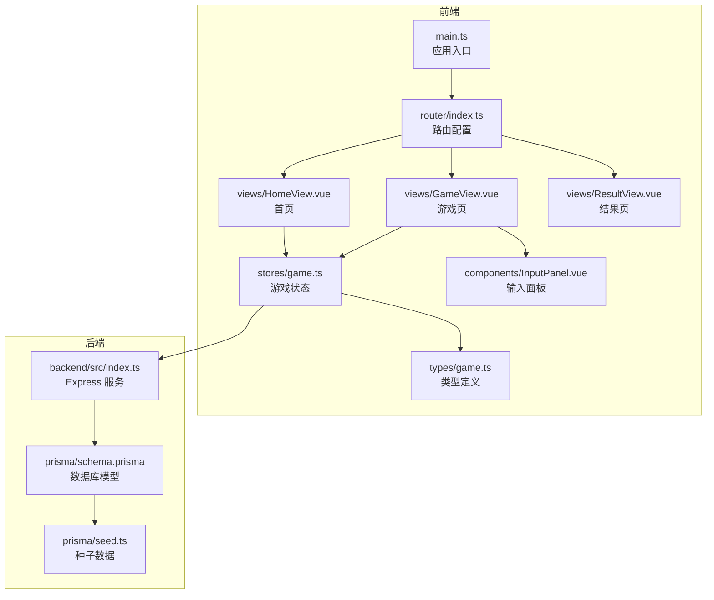
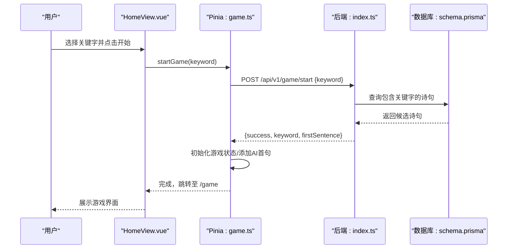
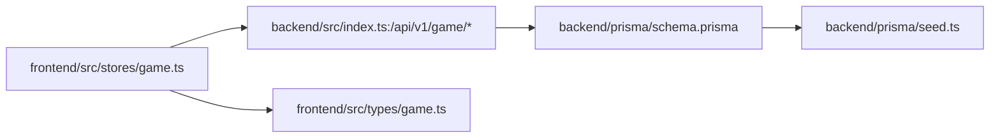
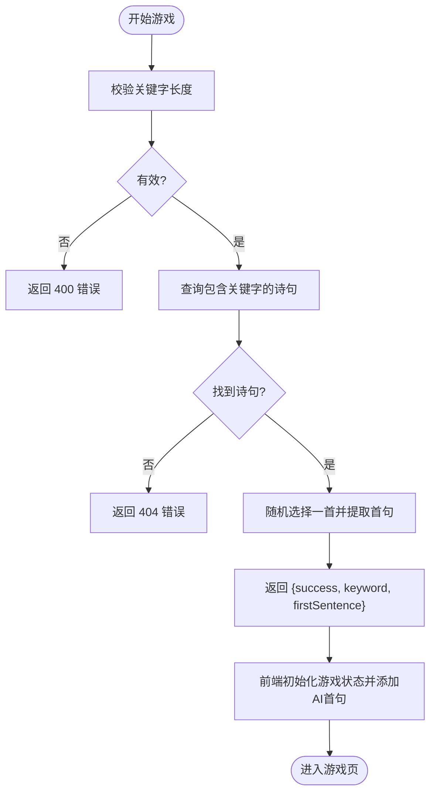

# 开始游戏 API 文档

<cite>
**本文引用的文件列表**
- [后端入口 index.ts](file://backend/src/index.ts)
- [前端游戏状态 stores/game.ts](file://frontend/src/stores/game.ts)
- [前端路由 router/index.ts](file://frontend/src/router/index.ts)
- [前端主应用 main.ts](file://frontend/src/main.ts)
- [前端游戏视图 GameView.vue](file://frontend/src/views/GameView.vue)
- [前端首页 HomeView.vue](file://frontend/src/views/HomeView.vue)
- [前端结果页 ResultView.vue](file://frontend/src/views/ResultView.vue)
- [前端输入面板 InputPanel.vue](file://frontend/src/components/InputPanel.vue)
- [前端游戏类型定义 types/game.ts](file://frontend/src/types/game.ts)
- [数据库模式 schema.prisma](file://backend/prisma/schema.prisma)
- [种子数据脚本 seed.ts](file://backend/prisma/seed.ts)
- [后端包配置 package.json](file://backend/package.json)
- [前端包配置 package.json](file://frontend/package.json)
</cite>

## 目录
1. [简介](#简介)
2. [项目结构](#项目结构)
3. [核心组件](#核心组件)
4. [架构总览](#架构总览)
5. [详细组件分析](#详细组件分析)
6. [依赖关系分析](#依赖关系分析)
7. [性能考量](#性能考量)
8. [故障排查指南](#故障排查指南)
9. [结论](#结论)
10. [附录](#附录)

## 简介
本文件聚焦“开始游戏”相关接口与前端调用流程，围绕后端提供的游戏 API 与前端 Pinia 状态管理之间的交互进行系统化说明。目标是帮助开发者快速理解如何通过“开始游戏”接口启动一轮飞花令对局，并掌握前后端协作的关键路径、数据流转与错误处理策略。

## 项目结构
该项目采用前后端分离架构：
- 后端基于 Express 提供 REST API，使用 Prisma 访问 SQLite 数据库。
- 前端基于 Vue 3 + Pinia，通过 fetch 与后端 API 通信，使用 Vue Router 进行页面导航。

图表来源
- [前端主应用 main.ts](file://frontend/src/main.ts#L1-L15)
- [前端路由 router/index.ts](file://frontend/src/router/index.ts#L1-L26)
- [前端首页 HomeView.vue](file://frontend/src/views/HomeView.vue#L1-L69)
- [前端游戏视图 GameView.vue](file://frontend/src/views/GameView.vue#L1-L156)
- [前端结果页 ResultView.vue](file://frontend/src/views/ResultView.vue#L1-L118)
- [前端输入面板 InputPanel.vue](file://frontend/src/components/InputPanel.vue#L1-L106)
- [前端游戏状态 stores/game.ts](file://frontend/src/stores/game.ts#L1-L220)
- [前端游戏类型定义 types/game.ts](file://frontend/src/types/game.ts#L1-L37)
- [后端入口 index.ts](file://backend/src/index.ts#L1-L234)
- [数据库模式 schema.prisma](file://backend/prisma/schema.prisma#L1-L19)
- [种子数据脚本 seed.ts](file://backend/prisma/seed.ts#L1-L53)

章节来源
- [前端主应用 main.ts](file://frontend/src/main.ts#L1-L15)
- [前端路由 router/index.ts](file://frontend/src/router/index.ts#L1-L26)
- [后端入口 index.ts](file://backend/src/index.ts#L1-L234)
- [数据库模式 schema.prisma](file://backend/prisma/schema.prisma#L1-L19)

## 核心组件
- 后端 API：提供“开始游戏”、“验证诗句”、“AI 回合”、“提示”等接口。
- 前端 Pinia Store：封装游戏状态、发起 API 请求、处理响应与错误。
- 视图组件：首页负责关键字选择并触发开始游戏；游戏页负责渲染当前回合、历史记录与统计；结果页展示最终统计与评价。
- 输入面板：收集用户输入、触发提交、提示与跳过事件。

章节来源
- [后端入口 index.ts](file://backend/src/index.ts#L1-L234)
- [前端游戏状态 stores/game.ts](file://frontend/src/stores/game.ts#L1-L220)
- [前端游戏视图 GameView.vue](file://frontend/src/views/GameView.vue#L1-L156)
- [前端首页 HomeView.vue](file://frontend/src/views/HomeView.vue#L1-L69)
- [前端结果页 ResultView.vue](file://frontend/src/views/ResultView.vue#L1-L118)
- [前端输入面板 InputPanel.vue](file://frontend/src/components/InputPanel.vue#L1-L106)

## 架构总览
“开始游戏”流程涉及从前端关键字选择到后端返回首句，再到前端渲染与后续回合推进的整体链路。

图表来源
- [前端首页 HomeView.vue](file://frontend/src/views/HomeView.vue#L1-L69)
- [前端游戏状态 stores/game.ts](file://frontend/src/stores/game.ts#L1-L220)
- [后端入口 index.ts](file://backend/src/index.ts#L134-L181)
- [数据库模式 schema.prisma](file://backend/prisma/schema.prisma#L1-L19)

## 详细组件分析

### 后端 API：开始游戏
- 接口路径：POST /api/v1/game/start
- 请求体字段：
  - keyword: 单个汉字关键字
- 成功响应字段：
  - success: 布尔值
  - keyword: 关键字
  - firstSentence: 包含内容、标题、作者的对象
- 失败场景：
  - 缺少或非法关键字：返回 400
  - 无匹配诗句：返回 404
- 实现要点：
  - 限制查询数量以提升性能
  - 从包含关键字的诗句中优先取首句，否则取首段
  - 返回结构化首句信息供前端直接使用

章节来源
- [后端入口 index.ts](file://backend/src/index.ts#L134-L181)

### 前端 Store：开始游戏
- 关键方法：startGame(keyword)
  - 发起 POST /api/v1/game/start
  - 校验响应状态，失败抛错
  - 初始化游戏状态：keyword、isPlaying、currentRound、remainingChances、history、usedPoems、stats、currentHintLevel
  - 将 AI 的首句加入历史并记录到 usedPoems
  - 返回数据给调用方
- 与路由配合：
  - 成功后由 HomeView 跳转到 /game

章节来源
- [前端游戏状态 stores/game.ts](file://frontend/src/stores/game.ts#L34-L81)
- [前端首页 HomeView.vue](file://frontend/src/views/HomeView.vue#L12-L24)

### 前端视图：游戏页与输入面板
- GameView.vue
  - 在未开始游戏时重定向首页
  - 渲染当前回合、关键字、剩余机会
  - 通过 InputPanel.vue 收集用户输入并调用 Store 的 verifyUserSentence
  - 错误时显示提示并根据 remainingChances 决定是否跳转结果页
- InputPanel.vue
  - 提交按钮与回车触发 submit 事件
  - 提示与跳过按钮分别触发 hint/skip 事件
  - 暴露 showHint/showError 方法用于外部提示展示

章节来源
- [前端游戏视图 GameView.vue](file://frontend/src/views/GameView.vue#L1-L156)
- [前端输入面板 InputPanel.vue](file://frontend/src/components/InputPanel.vue#L1-L106)

### 类型与状态
- 游戏状态与历史项类型定义
  - PoemSentence：包含 content/title/author
  - HistoryItem：包含 round/speaker/sentence/可选 title/author/isCorrect
  - GameStats：包含 totalRounds/correct/wrong/hintsUsed/startTime/endTime
  - GameState：包含 keyword/isPlaying/currentRound/remainingChances/history/usedPoems/stats/currentHintLevel

章节来源
- [前端游戏类型定义 types/game.ts](file://frontend/src/types/game.ts#L1-L37)

### 数据库与种子数据
- 数据模型：Poem(id, title, author, content)
- 种子数据：包含多首经典诗作，content 为拼接后的完整文本
- 作用：为“开始游戏”和“提示/验证”提供数据基础

章节来源
- [数据库模式 schema.prisma](file://backend/prisma/schema.prisma#L1-L19)
- [种子数据脚本 seed.ts](file://backend/prisma/seed.ts#L1-L53)

## 依赖关系分析
- 前端依赖
  - Vue 3 + Pinia：状态管理与组件化
  - vue-router：页面导航
  - fetch：HTTP 请求
- 后端依赖
  - Express：Web 服务器
  - Prisma：数据库 ORM
  - sqlite3：SQLite 驱动
- 前后端耦合点
  - API 基础 URL：http://localhost:3000/api/v1
  - 关键字校验：前端要求 keyword 为单个字符，后端同样校验长度
  - usedPoems：前后端共同维护，避免重复使用同一诗句

图表来源
- [前端游戏状态 stores/game.ts](file://frontend/src/stores/game.ts#L1-L220)
- [后端入口 index.ts](file://backend/src/index.ts#L1-L234)
- [数据库模式 schema.prisma](file://backend/prisma/schema.prisma#L1-L19)
- [种子数据脚本 seed.ts](file://backend/prisma/seed.ts#L1-L53)

章节来源
- [前端包配置 package.json](file://frontend/package.json#L1-L52)
- [后端包配置 package.json](file://backend/package.json#L1-L32)

## 性能考量
- 查询限制
  - “开始游戏”和“AI 回合”均限制查询数量，避免全表扫描导致延迟
- 字符串匹配
  - 使用 contains 进行模糊匹配，建议在 content 上建立索引以进一步优化
- 响应体积
  - 仅选择必要字段，减少网络传输与序列化开销
- 并发与重试
  - 前端未实现自动重试，建议在网络异常时增加简单重试逻辑

章节来源
- [后端入口 index.ts](file://backend/src/index.ts#L134-L181)
- [后端入口 index.ts](file://backend/src/index.ts#L78-L132)

## 故障排查指南
- 常见错误与定位
  - 关键字无效：前端校验 keyword 长度，后端同样校验；若报错，检查输入是否为单个汉字
  - 无匹配诗句：确认种子数据是否导入，或关键字是否过于生僻
  - 网络请求失败：检查后端服务是否启动、端口是否正确、CORS 是否允许
  - AI 无法出句：当 usedPoems 达到上限或无可用诗句时，后端会返回 404；前端应视为玩家获胜
- 日志与调试
  - 后端控制台输出服务启动信息
  - 前端 Store 中捕获异常并打印错误，便于定位问题

章节来源
- [后端入口 index.ts](file://backend/src/index.ts#L134-L181)
- [后端入口 index.ts](file://backend/src/index.ts#L78-L132)
- [前端游戏状态 stores/game.ts](file://frontend/src/stores/game.ts#L34-L81)
- [前端游戏状态 stores/game.ts](file://frontend/src/stores/game.ts#L136-L171)

## 结论
“开始游戏”接口是整个飞花令对局的核心入口。前端通过 Pinia Store 统一管理游戏状态，后端以 Prisma 提供稳定的数据访问。二者通过明确的 API 约定协同工作，实现了从关键字选择到首句呈现、再到后续回合推进的完整闭环。建议在生产环境中进一步完善数据库索引、错误重试与更细粒度的状态反馈。

## 附录

### API 定义概览
- 开始游戏
  - 方法：POST
  - 路径：/api/v1/game/start
  - 请求体：{ keyword }
  - 响应：{ success, keyword, firstSentence }
- 验证诗句
  - 方法：POST
  - 路径：/api/v1/game/verify
  - 请求体：{ sentence, char, usedPoems[] }
  - 响应：{ valid, message, poem? }
- AI 回合
  - 方法：POST
  - 路径：/api/v1/game/ai-turn
  - 请求体：{ char, usedPoems[] }
  - 响应：{ sentence, title, author }
- 提示
  - 方法：POST
  - 路径：/api/v1/game/hint
  - 请求体：{ keyword, hintLevel }
  - 响应：{ hint, sentence }

章节来源
- [后端入口 index.ts](file://backend/src/index.ts#L134-L230)

### 关键流程图：开始游戏

图表来源
- [后端入口 index.ts](file://backend/src/index.ts#L134-L181)
- [前端游戏状态 stores/game.ts](file://frontend/src/stores/game.ts#L34-L81)