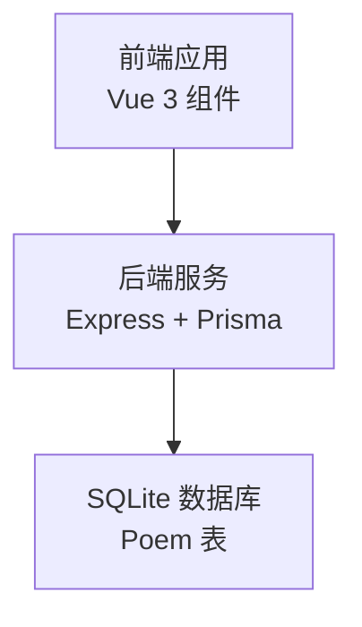
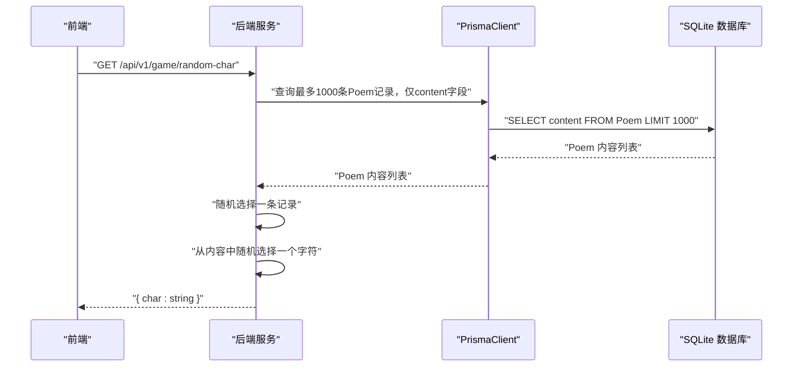
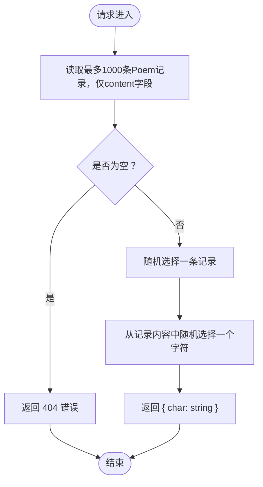
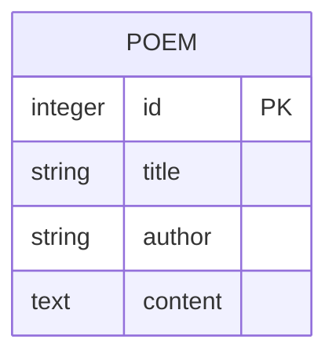
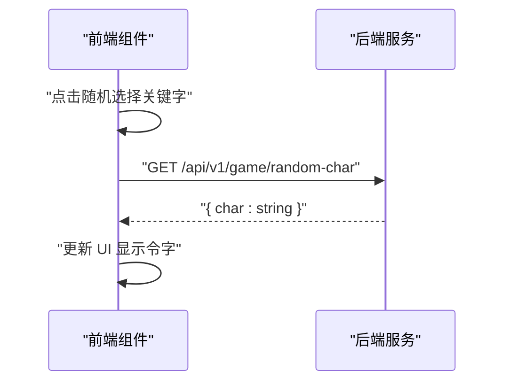
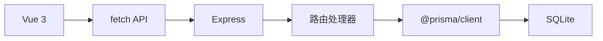

# 获取随机令字接口

<cite>
**本文引用的文件**
- [backend/src/index.ts](file://backend/src/index.ts)
- [backend/prisma/seed.ts](file://backend/prisma/seed.ts)
- [backend/prisma/migrations/20251104061144_init/migration.sql](file://backend/prisma/migrations/20251104061144_init/migration.sql)
- [backend/package.json](file://backend/package.json)
- [backend/.env](file://backend/.env)
- [frontend/src/views/HomeView.vue](file://frontend/src/views/HomeView.vue)
- [frontend/src/components/KeywordSelector.vue](file://frontend/src/components/KeywordSelector.vue)
</cite>

## 更新摘要
**变更内容**
- 更新了接口实现细节，反映查询优化变更
- 修正了性能考量部分，准确描述新的查询限制
- 更新了架构总览序列图，反映优化后的数据流
- 添加了前端调用组件的引用

## 目录
1. [简介](#简介)
2. [项目结构](#项目结构)
3. [核心组件](#核心组件)
4. [架构总览](#架构总览)
5. [详细组件分析](#详细组件分析)
6. [依赖关系分析](#依赖关系分析)
7. [性能考量](#性能考量)
8. [故障排查指南](#故障排查指南)
9. [结论](#结论)
10. [附录](#附录)

## 简介
本接口用于在游戏开始阶段获取一个随机的“令字”。前端通过发起一次 GET 请求至 /api/v1/game/random-char，后端将从 Poem 表中随机挑选一条记录，再从该条记录的内容中随机抽取一个字符作为本次对局的令字。接口无请求体，响应为 JSON 格式 { char: string }。若诗词库为空，则返回 404 错误。

该接口是游戏流程的触发点：前端调用后获得令字，随后进入对战状态，玩家与 AI 轮流出句，必须包含该令字。

**更新** 优化了数据库查询，限制返回诗歌数量为1000条，并仅查询 content 字段以提高性能。

**Section sources**
- [index.ts](file://backend/src/index.ts#L12-L31) - *更新了查询优化*

## 项目结构
后端采用 Express 框架，使用 Prisma 进行数据库访问；前端基于 Vue 3（Composition API）实现游戏界面。接口位于后端入口文件中，Poem 表结构由迁移脚本定义，初始数据通过种子脚本写入。

**图表来源**
- [backend/src/index.ts](file://backend/src/index.ts#L1-L78)
- [backend/prisma/migrations/20251104061144_init/migration.sql](file://backend/prisma/migrations/20251104061144_init/migration.sql#L1-L8)
- [backend/.env](file://backend/.env#L1-L1)

**章节来源**
- [backend/src/index.ts](file://backend/src/index.ts#L1-L78)
- [backend/package.json](file://backend/package.json#L1-L30)

## 核心组件
- 接口路径与方法：GET /api/v1/game/random-char
- 请求：无请求体
- 响应：
  - 成功：JSON 对象 { char: string }
  - 失败：当诗词库为空时返回 404，包含错误信息
- 业务逻辑：
  - 从 Poem 表读取最多1000条记录，仅包含 content 字段
  - 若为空则返回 404
  - 否则随机选择一条记录，再从该记录内容中随机选择一个字符
  - 返回该字符

**章节来源**
- [backend/src/index.ts](file://backend/src/index.ts#L12-L31)

## 架构总览
后端服务启动后，注册路由处理函数；数据库连接由 PrismaClient 管理。前端通过 fetch 发起请求，后端完成随机选择并返回结果。

**图表来源**
- [backend/src/index.ts](file://backend/src/index.ts#L12-L31)
- [backend/.env](file://backend/.env#L1-L1)

## 详细组件分析

### 接口实现与数据流
- 实现位置：后端入口文件中注册的 GET 路由处理器
- 关键步骤：
  - 读取最多1000条 Poem 记录，仅包含 content 字段
  - 判空：若为空返回 404
  - 随机选择一条记录
  - 随机选择该记录内容中的一个字符
  - 返回 { char: string }

**图表来源**
- [backend/src/index.ts](file://backend/src/index.ts#L12-L31)

**章节来源**
- [backend/src/index.ts](file://backend/src/index.ts#L12-L31)

### 数据模型与初始化
- 表结构：Poem 表包含 id、title、author、content 字段
- 初始化方式：通过种子脚本将多首诗的段落合并为 content 写入数据库
- 数据库文件：本地 SQLite 文件，路径由环境变量指定

**图表来源**
- [backend/prisma/migrations/20251104061144_init/migration.sql](file://backend/prisma/migrations/20251104061144_init/migration.sql#L1-L8)

**章节来源**
- [backend/prisma/migrations/20251104061144_init/migration.sql](file://backend/prisma/migrations/20251104061144_init/migration.sql#L1-L8)
- [backend/prisma/seed.ts](file://backend/prisma/seed.ts#L1-L53)
- [backend/.env](file://backend/.env#L1-L1)

### 前端集成与调用示例
- 前端在“开始游戏”按钮点击后，向后端发起 GET 请求获取令字
- 成功后更新 UI 状态，提示本轮令字
- 失败时显示错误消息
- 前端通过 KeywordSelector 组件调用此接口

**图表来源**
- [frontend/src/components/KeywordSelector.vue](file://frontend/src/components/KeywordSelector.vue#L72-L108)
- [backend/src/index.ts](file://backend/src/index.ts#L12-L31)

**章节来源**
- [frontend/src/components/KeywordSelector.vue](file://frontend/src/components/KeywordSelector.vue#L72-L108)
- [frontend/src/views/HomeView.vue](file://frontend/src/views/HomeView.vue#L14-L30)

## 依赖关系分析
- 后端依赖：
  - Express：提供 Web 服务与路由
  - Prisma Client：数据库访问抽象
  - CORS：跨域支持
- 数据库：
  - SQLite：本地文件型数据库
  - Poem 表：存储诗词内容
- 前端依赖：
  - Vue 3：组件化开发
  - Composition API：响应式状态管理

**图表来源**
- [backend/src/index.ts](file://backend/src/index.ts#L1-L11)
- [backend/package.json](file://backend/package.json#L1-L30)
- [frontend/src/views/HomeView.vue](file://frontend/src/views/HomeView.vue#L1-L12)

**章节来源**
- [backend/src/index.ts](file://backend/src/index.ts#L1-L11)
- [backend/package.json](file://backend/package.json#L1-L30)

## 性能考量
- 查询优化：限制返回诗歌数量为1000条，并仅查询 content 字段，减少数据传输量和内存占用
- 首次调用可能触发数据库加载与查询，建议在生产环境中：
  - 对 Poem 表建立合适的索引（如按作者或标题）
  - 在应用层引入缓存机制，缓存热门令字或近期使用的字符
  - 使用分页或游标查询减少一次性加载的数据量
  - 将常用字符预热到内存，降低随机选择成本
- 当前实现为限制数量读取，适合中等规模数据；若数据量增长，需进一步优化随机选择策略与缓存策略。

[本节为通用性能建议，不直接分析具体文件，故无“章节来源”]

## 故障排查指南
- 404 未找到：
  - 可能原因：Poem 表为空
  - 处理建议：执行种子脚本导入数据后再试
- 网络错误或跨域问题：
  - 可能原因：CORS 未正确配置或跨域被拦截
  - 处理建议：确认后端已启用 CORS 中间件
- 数据库连接异常：
  - 可能原因：数据库文件路径不正确或权限不足
  - 处理建议：检查环境变量与文件路径

**章节来源**
- [backend/src/index.ts](file://backend/src/index.ts#L12-L31)
- [backend/.env](file://backend/.env#L1-L1)

## 结论
GET /api/v1/game/random-char 是飞花令游戏的核心入口接口，负责在每轮对局开始时生成并返回一个随机令字。其实现简洁高效，依赖 Prisma 完成数据访问；前端通过一次请求即可完成游戏启动。通过优化查询，限制返回诗歌数量为1000条并仅查询 content 字段，提高了性能和效率。建议在生产环境中结合缓存与索引优化，提升首次调用性能与稳定性。

[本节为总结性内容，不直接分析具体文件，故无“章节来源”]

## 附录

### 接口规范
- 方法：GET
- 路径：/api/v1/game/random-char
- 请求体：无
- 成功响应：{ char: string }
- 失败响应：404，包含错误信息

**章节来源**
- [backend/src/index.ts](file://backend/src/index.ts#L12-L31)

### curl 示例
- 获取令字：
  - curl http://localhost:3000/api/v1/game/random-char

**章节来源**
- [backend/src/index.ts](file://backend/src/index.ts#L12-L31)

### JavaScript fetch 调用示例
- 前端调用示例可参考：
  - [frontend/src/components/KeywordSelector.vue](file://frontend/src/components/KeywordSelector.vue#L72-L108)

**章节来源**
- [frontend/src/components/KeywordSelector.vue](file://frontend/src/components/KeywordSelector.vue#L72-L108)

### 游戏流程说明
- 触发点：前端点击“随机选择关键字”
- 步骤：
  1) 调用 GET /api/v1/game/random-char 获取令字
  2) 进入对战状态，等待玩家输入包含令字的诗句
  3) 提交后端验证，成功则轮到 AI 回合，失败则提示并重试
- 依赖关系：
  - 令字来源于 Poem 表内容的随机字符
  - 验证与 AI 回合依赖于令字与已使用诗句集合

**章节来源**
- [frontend/src/components/KeywordSelector.vue](file://frontend/src/components/KeywordSelector.vue#L72-L108)
- [backend/src/index.ts](file://backend/src/index.ts#L12-L72)