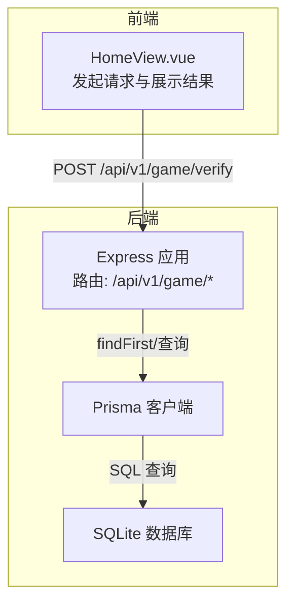
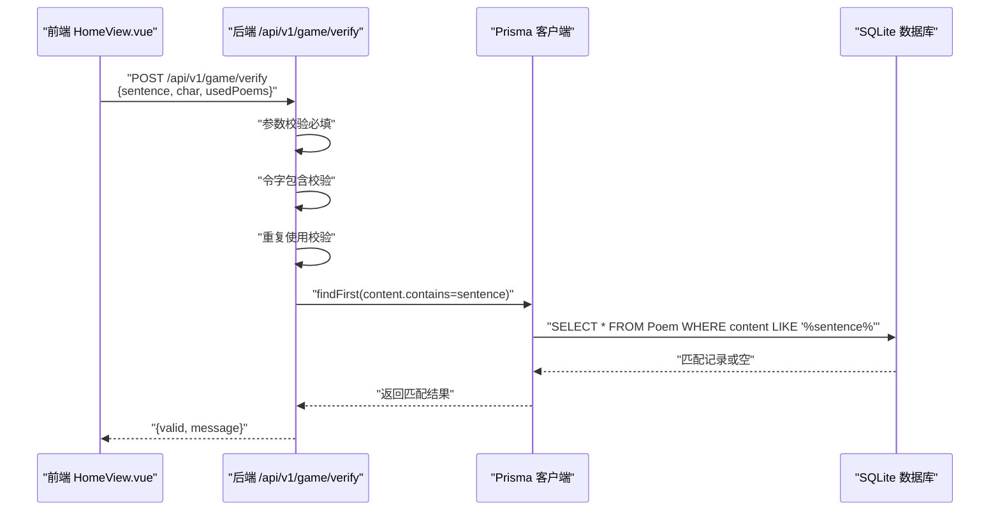
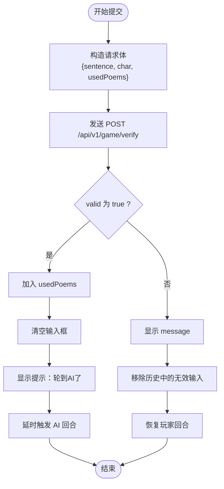
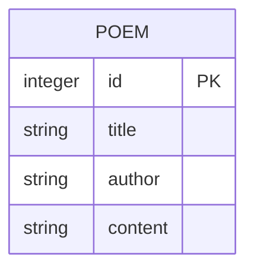
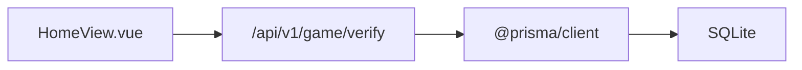
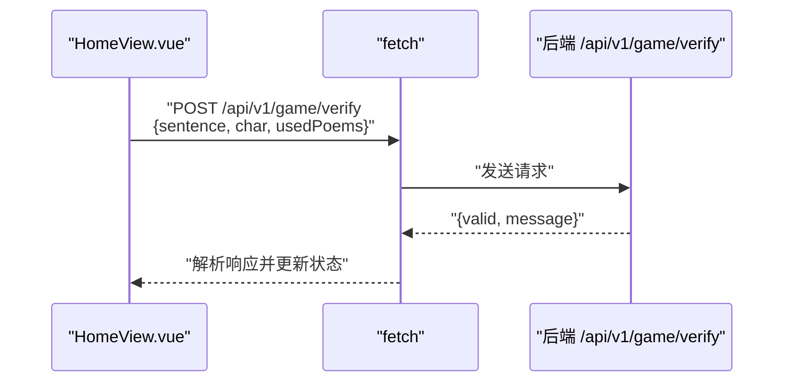

# 验证用户诗句接口

<cite>
**本文引用的文件**
- [backend/src/index.ts](file://backend/src/index.ts)
- [frontend/src/views/HomeView.vue](file://frontend/src/views/HomeView.vue)
- [backend/prisma/seed.ts](file://backend/prisma/seed.ts)
- [backend/prisma/migrations/20251104061144_init/migration.sql](file://backend/prisma/migrations/20251104061144_init/migration.sql)
- [backend/package.json](file://backend/package.json)
- [GEMINI.md](file://GEMINI.md)
</cite>

## 目录
1. [简介](#简介)
2. [项目结构](#项目结构)
3. [核心组件](#核心组件)
4. [架构总览](#架构总览)
5. [详细组件分析](#详细组件分析)
6. [依赖关系分析](#依赖关系分析)
7. [性能考虑](#性能考虑)
8. [故障排查指南](#故障排查指南)
9. [结论](#结论)
10. [附录](#附录)

## 简介
本文件面向“POST /api/v1/game/verify”接口，系统性说明其职责、请求/响应格式、验证规则、错误处理机制，以及与前端 HomeView.vue 的交互流程。同时解释后端如何通过 Prisma 的查询实现诗句匹配，并给出 curl 与 fetch 示例，帮助开发者快速集成与调试。

## 项目结构
- 后端采用 Node.js + Express + Prisma（SQLite），提供飞花令相关 API。
- 前端使用 Vue3 + TypeScript，负责游戏状态管理与用户交互。
- 数据模型为 Poem（标题、作者、内容），通过种子脚本初始化。



图表来源
- [backend/src/index.ts](file://backend/src/index.ts#L1-L78)
- [frontend/src/views/HomeView.vue](file://frontend/src/views/HomeView.vue#L1-L118)
- [backend/prisma/migrations/20251104061144_init/migration.sql](file://backend/prisma/migrations/20251104061144_init/migration.sql#L1-L8)

章节来源
- [GEMINI.md](file://GEMINI.md#L1-L21)
- [backend/package.json](file://backend/package.json#L1-L30)

## 核心组件
- 接口路径与方法：POST /api/v1/game/verify
- 请求头要求：Content-Type: application/json
- 请求体字段：
  - sentence: string — 用户输入的诗句
  - char: string — 当前令字
  - usedPoems: string[] — 已使用过的诗句列表
- 响应体字段：
  - valid: boolean — 是否通过验证
  - message: string — 提示信息

章节来源
- [backend/src/index.ts](file://backend/src/index.ts#L23-L48)

## 架构总览
该接口属于后端 API 层，接收来自前端的校验请求，执行三项本地规则校验，并通过 Prisma 查询数据库确认诗句是否存在。前端 HomeView.vue 在用户提交后调用该接口，依据返回值更新游戏状态。



图表来源
- [backend/src/index.ts](file://backend/src/index.ts#L23-L48)
- [backend/prisma/migrations/20251104061144_init/migration.sql](file://backend/prisma/migrations/20251104061144_init/migration.sql#L1-L8)

## 详细组件分析

### 接口定义与验证规则
- 必填参数校验：若缺少 sentence 或 char，直接返回 400 并提示“缺少参数”。
- 令字包含校验：sentence 必须包含 char，否则返回 valid=false 并提示“诗句中不包含令字”。
- 重复使用校验：若 usedPoems 中已包含 sentence，则返回 valid=false 并提示“这句诗已经用过了”。
- 诗词库存在性校验：通过 Prisma 的 findFirst(content.contains=sentence) 查询，若命中则 valid=true，否则 valid=false 并提示“诗词库中没有找到这句诗”。

章节来源
- [backend/src/index.ts](file://backend/src/index.ts#L23-L48)

### 前端交互流程（HomeView.vue）
- 用户点击出招或回车触发 submitSentence。
- 构造请求体：{ sentence, char: ling.value, usedPoems: usedPoems.value }，并设置 Content-Type: application/json。
- 若 valid 为 true：将 sentence 加入 usedPoems，清空输入框，显示“轮到AI了”，延时触发 AI 回合。
- 若 valid 为 false：显示 message，移除历史中的无效输入，恢复玩家回合。
- 错误处理：网络异常时提示“请求失败，请检查网络”。



图表来源
- [frontend/src/views/HomeView.vue](file://frontend/src/views/HomeView.vue#L32-L84)

章节来源
- [frontend/src/views/HomeView.vue](file://frontend/src/views/HomeView.vue#L1-L118)

### 数据模型与查询实现（Prisma）
- 数据表结构：Poem(id, title, author, content)
- 查询策略：使用 findFirst(content: { contains: sentence }) 实现“包含匹配”。该策略允许用户输入完整诗句或片段，只要数据库中存在包含该字符串的记录即视为有效。
- 种子数据：通过 seed.ts 将多首诗词以“内容拼接”的形式写入 content 字段，便于后续按片段匹配。



图表来源
- [backend/prisma/migrations/20251104061144_init/migration.sql](file://backend/prisma/migrations/20251104061144_init/migration.sql#L1-L8)
- [backend/prisma/seed.ts](file://backend/prisma/seed.ts#L1-L53)

章节来源
- [backend/prisma/migrations/20251104061144_init/migration.sql](file://backend/prisma/migrations/20251104061144_init/migration.sql#L1-L8)
- [backend/prisma/seed.ts](file://backend/prisma/seed.ts#L1-L53)

## 依赖关系分析
- 后端依赖：Express（Web 框架）、Prisma（ORM）、SQLite（存储）
- 前端依赖：Vue3（视图框架）、TypeScript（类型安全）



图表来源
- [backend/src/index.ts](file://backend/src/index.ts#L1-L78)
- [frontend/src/views/HomeView.vue](file://frontend/src/views/HomeView.vue#L1-L118)

章节来源
- [backend/package.json](file://backend/package.json#L1-L30)

## 性能考虑
- 查询效率：findFirst(content.contains=...) 对 SQLite 的 LIKE 匹配可能受索引影响；若诗词量增长，建议为 content 字段建立合适的索引以提升匹配速度。
- 命中率优化：当前策略为“包含匹配”，可结合业务需求评估是否改为精确匹配或分词匹配，以减少误判与提高性能。
- 并发与连接：Prisma 默认连接池配置适用于开发场景；生产环境建议根据 QPS 调整连接数与超时策略。

## 故障排查指南
- 参数缺失（400）：检查请求体是否包含 sentence 与 char，且 Content-Type 设置为 application/json。
- 令字不包含：确认 sentence 中确实包含 char。
- 重复使用：检查 usedPoems 列表是否已包含该 sentence。
- 诗词库不存在：确认数据库中 content 字段包含该 sentence（可通过种子数据或手动导入验证）。
- 网络问题：前端捕获异常并提示“请求失败，请检查网络”。

章节来源
- [backend/src/index.ts](file://backend/src/index.ts#L23-L48)
- [frontend/src/views/HomeView.vue](file://frontend/src/views/HomeView.vue#L32-L84)

## 结论
POST /api/v1/game/verify 接口通过四项规则与一次数据库查询完成诗句验证，逻辑清晰、易于扩展。前端 HomeView.vue 以简洁的状态机驱动交互，配合 Prisma 的 findFirst 查询实现高效匹配。建议在生产环境中关注查询性能与索引设计，确保用户体验稳定流畅。

## 附录

### curl 示例
- 发送 POST 请求，验证诗句是否符合飞花令规则
- 注意替换目标地址与令字、已用诗句列表

```bash
curl -X POST http://localhost:3000/api/v1/game/verify \
  -H "Content-Type: application/json" \
  -d '{
    "sentence": "此处填写用户输入的诗句",
    "char": "令字",
    "usedPoems": ["已用过的诗句1", "已用过的诗句2"]
  }'
```

章节来源
- [backend/src/index.ts](file://backend/src/index.ts#L23-L48)

### fetch 代码示例（前端）
- 在 HomeView.vue 中，submitSentence 方法展示了如何使用 fetch 发起请求并处理响应



图表来源
- [frontend/src/views/HomeView.vue](file://frontend/src/views/HomeView.vue#L32-L84)

章节来源
- [frontend/src/views/HomeView.vue](file://frontend/src/views/HomeView.vue#L1-L118)