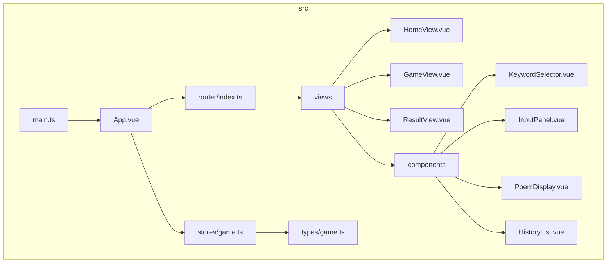
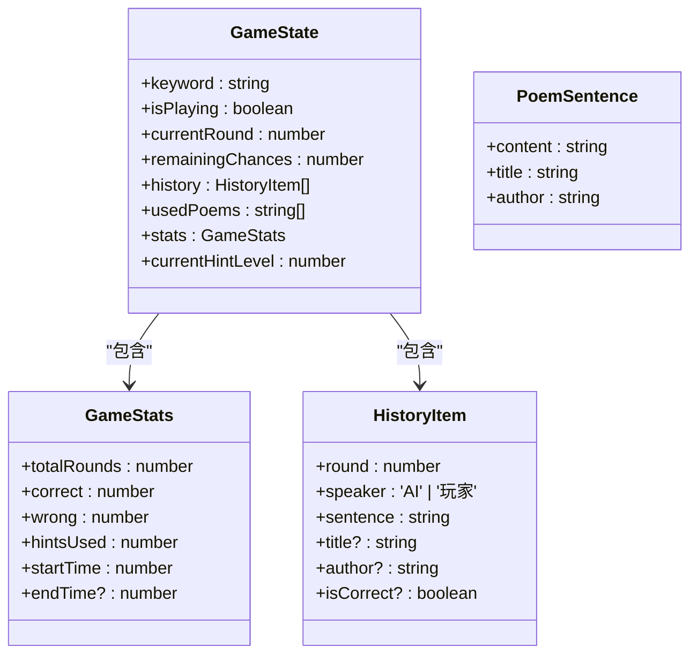
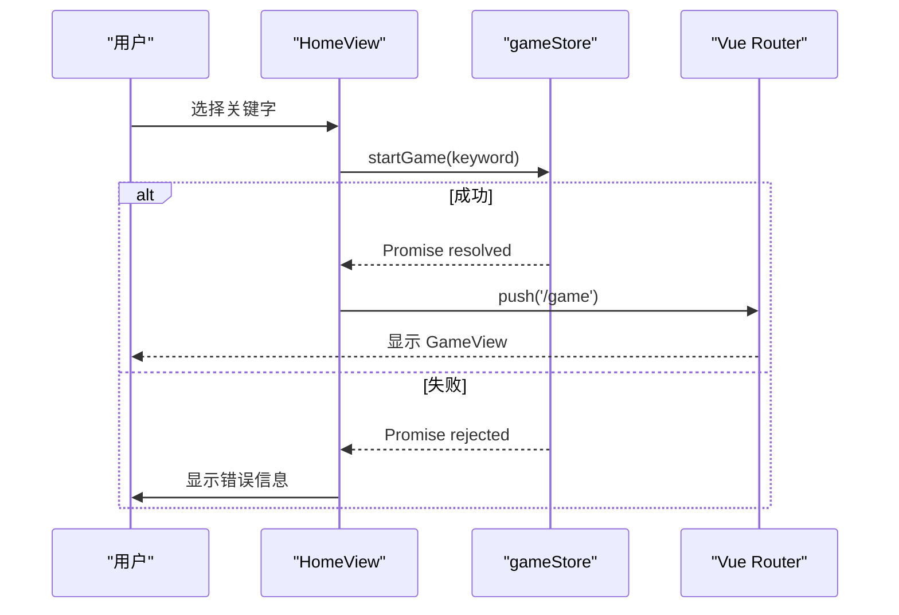
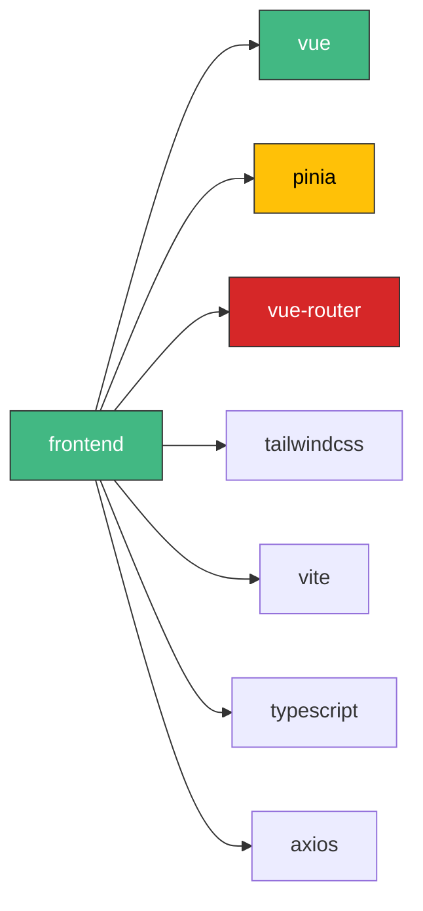

# 前端核心 UI

<cite>
**本文档中引用的文件**  
- [main.ts](file://frontend/src/main.ts)
- [App.vue](file://frontend/src/App.vue)
- [package.json](file://frontend/package.json)
- [router/index.ts](file://frontend/src/router/index.ts)
- [stores/game.ts](file://frontend/src/stores/game.ts)
- [types/game.ts](file://frontend/src/types/game.ts)
- [views/HomeView.vue](file://frontend/src/views/HomeView.vue)
- [views/GameView.vue](file://frontend/src/views/GameView.vue)
- [views/ResultView.vue](file://frontend/src/views/ResultView.vue)
- [components/InputPanel.vue](file://frontend/src/components/InputPanel.vue)
- [components/PoemDisplay.vue](file://frontend/src/components/PoemDisplay.vue)
- [components/HistoryList.vue](file://frontend/src/components/HistoryList.vue)
- [components/KeywordSelector.vue](file://frontend/src/components/KeywordSelector.vue)
- [assets/base.css](file://frontend/src/assets/base.css)
- [assets/main.css](file://frontend/src/assets/main.css)
- [vite.config.ts](file://frontend/vite.config.ts)
</cite>

## 目录
1. [简介](#简介)
2. [项目结构](#项目结构)
3. [核心组件](#核心组件)
4. [架构概览](#架构概览)
5. [详细组件分析](#详细组件分析)
6. [依赖分析](#依赖分析)
7. [性能考虑](#性能考虑)
8. [故障排除指南](#故障排除指南)
9. [结论](#结论)

## 简介
本项目是一个基于 Vue 3 和 TypeScript 的前端应用，实现了一个名为“飞花令”的中国传统诗词对战游戏。用户选择一个关键字后，与 AI 轮流说出包含该字的诗句，考验诗词储备。前端通过 Pinia 管理游戏状态，Vue Router 实现页面导航，并通过 REST API 与后端交互。UI 设计采用中国风主题，结合 Tailwind CSS 进行样式构建，提供流畅的用户体验。

## 项目结构
前端项目采用标准的 Vue + Vite 架构，按功能模块组织代码。核心逻辑集中在 `src` 目录下，包括视图、组件、状态管理和类型定义。



**图示来源**
- [main.ts](file://frontend/src/main.ts#L1-L15)
- [App.vue](file://frontend/src/App.vue#L1-L12)
- [router/index.ts](file://frontend/src/router/index.ts#L1-L26)

**本节来源**
- [frontend/src](file://frontend/src)

## 核心组件
项目的核心功能由 `stores/game.ts` 中的 Pinia Store 驱动，它管理着游戏的完整状态，包括关键字、回合数、历史记录和统计数据。`HomeView.vue` 提供游戏入口和关键字选择，`GameView.vue` 展示实时对战界面，`ResultView.vue` 则在游戏结束后显示统计结果。这些视图通过 `router/index.ts` 定义的路由进行切换。

**本节来源**
- [stores/game.ts](file://frontend/src/stores/game.ts#L1-L220)
- [views/HomeView.vue](file://frontend/src/views/HomeView.vue#L1-L69)
- [views/GameView.vue](file://frontend/src/views/GameView.vue#L1-L156)
- [views/ResultView.vue](file://frontend/src/views/ResultView.vue#L1-L118)

## 架构概览
整个前端应用遵循典型的 MVVM 模式，`main.ts` 作为入口点初始化 Vue 应用并挂载 App 根组件。App 组件通过 `RouterView` 动态渲染当前路由对应的视图。游戏逻辑与状态完全解耦，由 `gameStore` 统一管理，各视图组件通过 `useGameStore` 订阅状态变化并触发相应动作。

```mermaid
graph TD
A[main.ts] --> B[createApp(App)]
B --> C[App.vue]
C --> D[RouterView]
D --> E[HomeView]
D --> F[GameView]
D --> G[ResultView]
E --> H[KeywordSelector]
F --> I[InputPanel]
F --> J[PoemDisplay]
F --> K[HistoryList]
H --> M[gameStore.startGame]
I --> M[gameStore.verifyUserSentence]
M --> N[API Calls]
style A fill:#f9f,stroke:#333
style M fill:#ffcc00,stroke:#333
```

**图示来源**
- [main.ts](file://frontend/src/main.ts#L1-L15)
- [App.vue](file://frontend/src/App.vue#L1-L12)
- [stores/game.ts](file://frontend/src/stores/game.ts#L1-L220)

**本节来源**
- [main.ts](file://frontend/src/main.ts#L1-L15)
- [App.vue](file://frontend/src/App.vue#L1-L12)

## 详细组件分析
### 游戏状态管理分析
`gameStore` 是应用的核心，定义了 `GameState` 接口来规范所有状态字段。其 `actions` 方法封装了所有游戏逻辑，如 `startGame`、`verifyUserSentence` 和 `aiTurn`，这些方法通过 `fetch` 与后端 API 通信，并在成功后更新本地状态。



**图示来源**
- [stores/game.ts](file://frontend/src/stores/game.ts#L7-L220)
- [types/game.ts](file://frontend/src/types/game.ts#L1-L37)

**本节来源**
- [stores/game.ts](file://frontend/src/stores/game.ts#L1-L220)
- [types/game.ts](file://frontend/src/types/game.ts#L1-L37)

### 视图组件分析
#### 主页视图 (HomeView)
`HomeView` 是游戏的启动界面，它使用 `KeywordSelector` 组件让用户选择关键字。当用户选择后，`handleStart` 方法会调用 `gameStore.startGame`，并在成功后通过 `router.push('/game')` 导航至游戏界面。



**图示来源**
- [views/HomeView.vue](file://frontend/src/views/HomeView.vue#L1-L69)
- [stores/game.ts](file://frontend/src/stores/game.ts#L34-L77)

**本节来源**
- [views/HomeView.vue](file://frontend/src/views/HomeView.vue#L1-L69)

#### 游戏视图 (GameView)
`GameView` 是游戏的核心界面，它在加载时检查 `gameStore.isPlaying`，若为 `false` 则重定向回首页。它通过 `InputPanel` 接收用户输入，并将提交、提示和跳过等事件委托给 `gameStore` 的相应方法。

```mermaid
flowchart TD
Start([GameView 加载]) --> CheckState["检查 gameStore.isPlaying"]
CheckState --> |true| ShowUI["显示游戏界面"]
CheckState --> |false| Redirect["router.push('/')"]
ShowUI --> Display["展示 AI 诗句和统计数据"]
Display --> Input["等待用户在 InputPanel 输入"]
Input --> Submit["用户点击提交"]
Submit --> Verify["gameStore.verifyUserSentence()"]
Verify --> |有效| AI["gameStore.aiTurn()"]
Verify --> |无效| Decrement["remainingChances--"]
Decrement --> |<=0| End["gameStore.endGame()", router.push('/result')]
AI --> NextRound["进入下一回合"]
```

**图示来源**
- [views/GameView.vue](file://frontend/src/views/GameView.vue#L1-L156)
- [stores/game.ts](file://frontend/src/stores/game.ts#L84-L167)

**本节来源**
- [views/GameView.vue](file://frontend/src/views/GameView.vue#L1-L156)

## 依赖分析
前端项目依赖于现代的 Vue 生态系统。生产依赖包括 `vue`、`pinia` 和 `vue-router`，用于构建响应式应用和管理状态与路由。开发依赖则涵盖了 `vite` 作为构建工具，`typescript` 提供类型安全，`tailwindcss` 用于原子化 CSS 设计，以及 `eslint` 和 `prettier` 保证代码质量。



**图示来源**
- [package.json](file://frontend/package.json#L1-L52)

**本节来源**
- [package.json](file://frontend/package.json#L1-L52)

## 性能考虑
应用通过代码分割（`component: () => import('../views/GameView.vue')`）实现了路由级别的懒加载，优化了首屏加载时间。状态管理使用 Pinia，其响应式机制确保了 UI 只在相关状态变化时更新。UI 组件如 `HistoryList` 使用 `v-for` 的 `key` 属性和 `overflow-y-auto` 的虚拟滚动，保证了长列表的渲染性能。

## 故障排除指南
- **游戏无法开始**：检查后端服务是否在 `http://localhost:3000` 运行，并确认 `gameStore.startGame` 的 API 调用是否返回 200。
- **输入无响应**：确认 `InputPanel` 组件的 `disabled` prop 是否被正确设置，以及 `handleSubmit` 事件是否被正确绑定。
- **样式错乱**：检查 `vite.config.ts` 中的 `@` 别名配置是否正确，确保 `main.css` 被正确导入。
- **路由跳转失败**：验证 `router/index.ts` 中的路径定义与 `router.push()` 调用是否一致。

**本节来源**
- [stores/game.ts](file://frontend/src/stores/game.ts#L78-L80)
- [components/InputPanel.vue](file://frontend/src/components/InputPanel.vue#L55-L57)
- [vite.config.ts](file://frontend/vite.config.ts#L14-L16)
- [router/index.ts](file://frontend/src/router/index.ts#L8-L20)

## 结论
该前端项目结构清晰，职责分明。通过 Vue 3 的组合式 API 和 Pinia 状态管理，实现了复杂的游戏逻辑。UI 设计美观，用户体验流畅。与后端的 RESTful 交互设计合理，为一个功能完整的诗词对战游戏提供了坚实的前端基础。