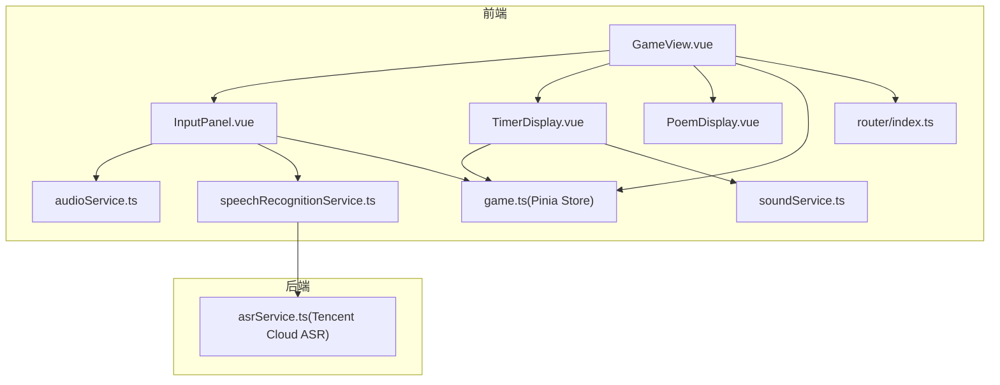
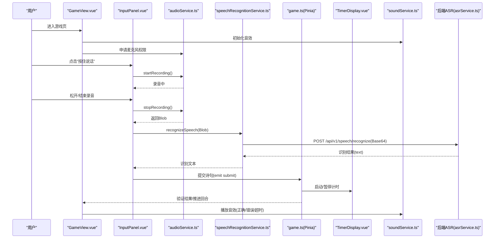
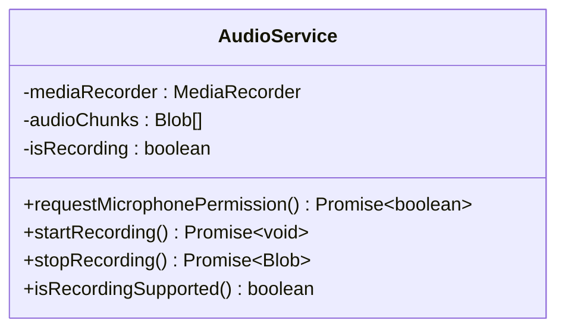
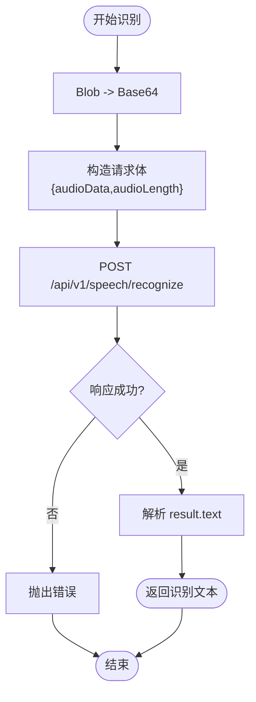
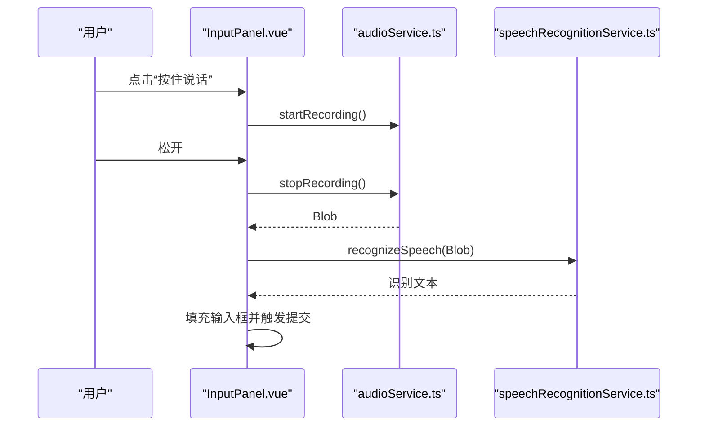
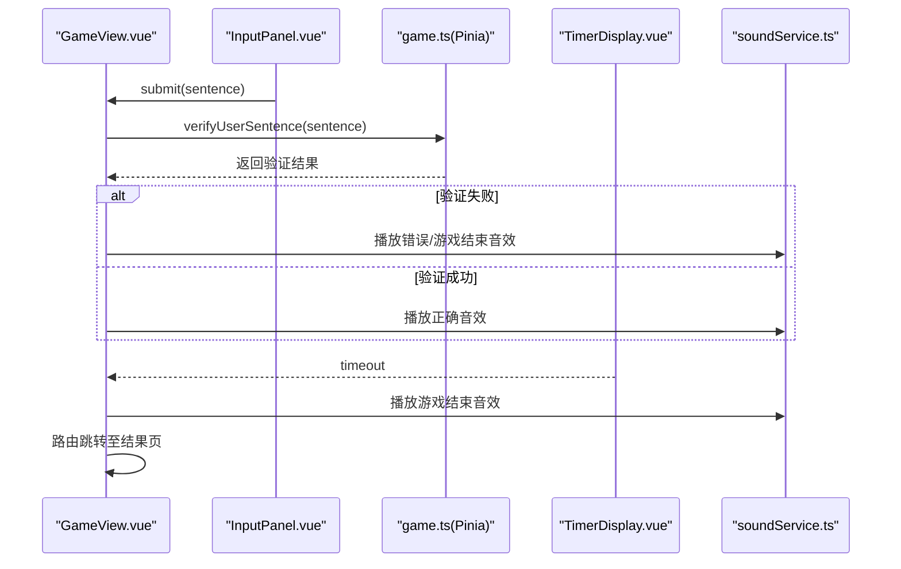
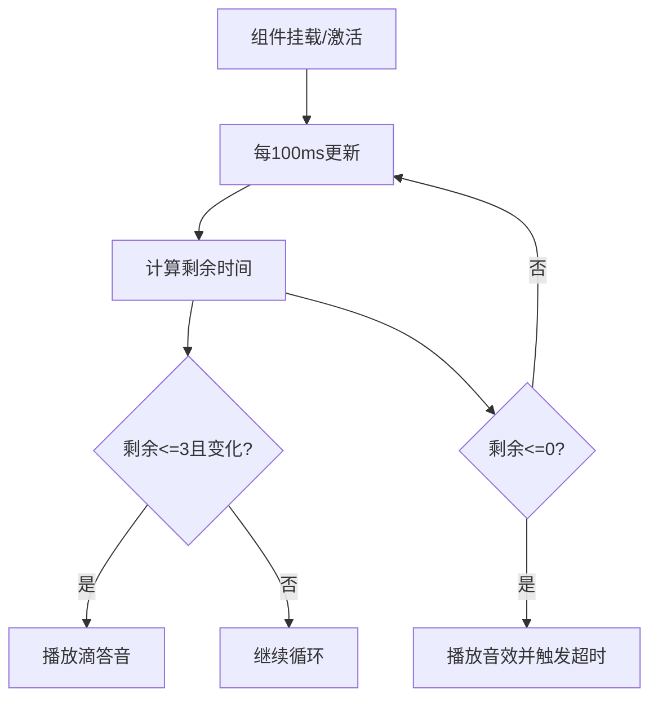
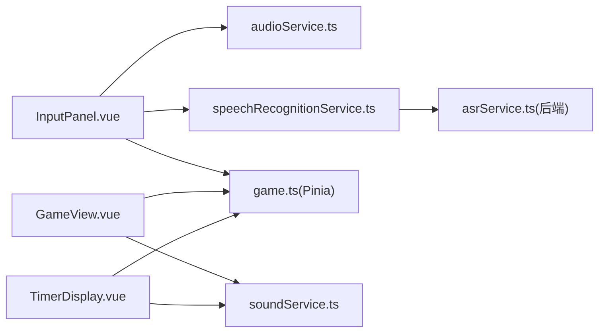

# 音频录制组件

<cite>
**本文引用的文件**
- [README.md](file://README.md)
- [frontend/src/services/audioService.ts](file://frontend/src/services/audioService.ts)
- [frontend/src/services/speechRecognitionService.ts](file://frontend/src/services/speechRecognitionService.ts)
- [frontend/src/services/soundService.ts](file://frontend/src/services/soundService.ts)
- [frontend/src/components/InputPanel.vue](file://frontend/src/components/InputPanel.vue)
- [frontend/src/views/GameView.vue](file://frontend/src/views/GameView.vue)
- [frontend/src/stores/game.ts](file://frontend/src/stores/game.ts)
- [frontend/src/components/TimerDisplay.vue](file://frontend/src/components/TimerDisplay.vue)
- [frontend/src/components/PoemDisplay.vue](file://frontend/src/components/PoemDisplay.vue)
- [frontend/src/router/index.ts](file://frontend/src/router/index.ts)
- [backend/src/asrService.ts](file://backend/src/asrService.ts)
</cite>

## 目录
1. [简介](#简介)
2. [项目结构](#项目结构)
3. [核心组件](#核心组件)
4. [架构总览](#架构总览)
5. [详细组件分析](#详细组件分析)
6. [依赖关系分析](#依赖关系分析)
7. [性能考量](#性能考量)
8. [故障排查指南](#故障排查指南)
9. [结论](#结论)
10. [附录](#附录)

## 简介
本文件聚焦“音频录制组件”的设计与实现，围绕前端录音能力、语音识别流程、UI交互与状态管理展开，帮助读者快速理解从“按住说话”到“提交诗句”的完整链路。该组件以 Vue3 + TypeScript 实现，结合浏览器 Web Audio API 与后端腾讯云 ASR 服务，提供移动端友好的语音输入体验。

## 项目结构
音频录制组件主要分布在前端服务层与视图层：
- 服务层：录音服务、语音识别服务、音效服务
- 视图层：输入面板组件、游戏视图、计时器组件、诗句展示组件
- 状态层：Pinia 游戏状态管理
- 路由层：页面导航

图表来源
- [frontend/src/views/GameView.vue](file://frontend/src/views/GameView.vue#L1-L201)
- [frontend/src/components/InputPanel.vue](file://frontend/src/components/InputPanel.vue#L1-L171)
- [frontend/src/components/TimerDisplay.vue](file://frontend/src/components/TimerDisplay.vue#L1-L152)
- [frontend/src/components/PoemDisplay.vue](file://frontend/src/components/PoemDisplay.vue#L1-L31)
- [frontend/src/services/audioService.ts](file://frontend/src/services/audioService.ts#L1-L78)
- [frontend/src/services/speechRecognitionService.ts](file://frontend/src/services/speechRecognitionService.ts#L1-L58)
- [frontend/src/services/soundService.ts](file://frontend/src/services/soundService.ts#L1-L148)
- [frontend/src/stores/game.ts](file://frontend/src/stores/game.ts#L1-L339)
- [frontend/src/router/index.ts](file://frontend/src/router/index.ts#L1-L26)
- [backend/src/asrService.ts](file://backend/src/asrService.ts#L1-L98)

章节来源
- [README.md](file://README.md#L1-L120)

## 核心组件
- 录音服务：封装浏览器 MediaRecorder，负责麦克风权限申请、录音启动/停止、音频数据收集与释放
- 语音识别服务：将录音 Blob 转 Base64 并调用后端 /api/v1/speech/recognize 接口，解析识别结果
- 音效服务：预加载音效、播放控制、静音与音量持久化
- 输入面板组件：提供文本输入、提示/跳过按钮、按住说话录音按钮、录音状态与错误提示
- 游戏视图：整合输入面板、计时器、历史记录与音效，协调游戏流程
- 计时器组件：基于 Pinia 状态驱动的倒计时，超时触发游戏逻辑
- 游戏状态管理：封装 API 调用、回合推进、统计与提示逻辑

章节来源
- [frontend/src/services/audioService.ts](file://frontend/src/services/audioService.ts#L1-L78)
- [frontend/src/services/speechRecognitionService.ts](file://frontend/src/services/speechRecognitionService.ts#L1-L58)
- [frontend/src/services/soundService.ts](file://frontend/src/services/soundService.ts#L1-L148)
- [frontend/src/components/InputPanel.vue](file://frontend/src/components/InputPanel.vue#L1-L171)
- [frontend/src/views/GameView.vue](file://frontend/src/views/GameView.vue#L1-L201)
- [frontend/src/stores/game.ts](file://frontend/src/stores/game.ts#L1-L339)
- [frontend/src/components/TimerDisplay.vue](file://frontend/src/components/TimerDisplay.vue#L1-L152)

## 架构总览
音频录制与识别的整体流程如下：

图表来源
- [frontend/src/views/GameView.vue](file://frontend/src/views/GameView.vue#L1-L201)
- [frontend/src/components/InputPanel.vue](file://frontend/src/components/InputPanel.vue#L1-L171)
- [frontend/src/services/audioService.ts](file://frontend/src/services/audioService.ts#L1-L78)
- [frontend/src/services/speechRecognitionService.ts](file://frontend/src/services/speechRecognitionService.ts#L1-L58)
- [frontend/src/stores/game.ts](file://frontend/src/stores/game.ts#L1-L339)
- [frontend/src/components/TimerDisplay.vue](file://frontend/src/components/TimerDisplay.vue#L1-L152)
- [frontend/src/services/soundService.ts](file://frontend/src/services/soundService.ts#L1-L148)
- [backend/src/asrService.ts](file://backend/src/asrService.ts#L1-L98)

## 详细组件分析

### 录音服务 AudioService
- 职责
  - 申请麦克风权限并及时释放轨道
  - 使用 MediaRecorder 捕获音频片段，聚合为 Blob
  - 提供录音状态查询与浏览器兼容性检测
- 关键点
  - 录音启动时创建 MediaRecorder 并注册 dataavailable 回调
  - 停止录音时合成 Blob，释放所有轨道
  - 支持检测浏览器是否支持 getUserMedia/MediaRecorder
- 复杂度
  - 启动/停止：O(1)
  - 数据聚合：O(n)，n 为音频片段数
- 错误处理
  - 权限失败、启动失败抛出错误，调用方需捕获
- 性能
  - 录音期间仅保存 Blob 片段，避免大内存占用
  - 录音结束后立即释放轨道，降低资源占用

图表来源
- [frontend/src/services/audioService.ts](file://frontend/src/services/audioService.ts#L1-L78)

章节来源
- [frontend/src/services/audioService.ts](file://frontend/src/services/audioService.ts#L1-L78)

### 语音识别服务 SpeechRecognitionService
- 职责
  - 将录音 Blob 转换为 Base64
  - 调用后端 /api/v1/speech/recognize 接口
  - 解析识别结果并返回文本
- 关键点
  - Base64 转换采用 FileReader，移除 data URL 前缀
  - 请求头 Content-Type 为 application/json; charset=utf-8
  - 对响应进行校验，失败时抛出错误
- 复杂度
  - Base64 转换：O(m)，m 为 Blob 大小
  - 网络请求：取决于后端响应时间
- 错误处理
  - HTTP 非 OK、识别失败、转换失败均抛出错误

图表来源
- [frontend/src/services/speechRecognitionService.ts](file://frontend/src/services/speechRecognitionService.ts#L1-L58)

章节来源
- [frontend/src/services/speechRecognitionService.ts](file://frontend/src/services/speechRecognitionService.ts#L1-L58)

### 输入面板 InputPanel
- 职责
  - 提供文本输入框与提交按钮
  - 提示/跳过按钮事件
  - “按住说话”录音按钮，支持鼠标与触摸事件
  - 录音状态指示、权限不支持提示、错误提示
- 关键点
  - 通过 audioService.isRecordingSupported() 判断浏览器支持
  - startRecording/stopRecording 与 recognizeSpeech 协作
  - 识别成功后自动填充输入框并触发提交
- 交互
  - 按钮禁用态与高亮态（录音中红色）

图表来源
- [frontend/src/components/InputPanel.vue](file://frontend/src/components/InputPanel.vue#L1-L171)
- [frontend/src/services/audioService.ts](file://frontend/src/services/audioService.ts#L1-L78)
- [frontend/src/services/speechRecognitionService.ts](file://frontend/src/services/speechRecognitionService.ts#L1-L58)

章节来源
- [frontend/src/components/InputPanel.vue](file://frontend/src/components/InputPanel.vue#L1-L171)

### 游戏视图 GameView
- 职责
  - 初始化音效与麦克风权限
  - 协调提交、提示、跳过、退出等事件
  - 根据验证结果播放音效、切换路由
- 关键点
  - 验证失败：根据剩余机会播放错误或游戏结束音效
  - 验证成功：播放正确音效；模糊匹配时显示提示
  - 超时：播放音效并结束游戏
- 与组件协作
  - 与 InputPanel 通信（submit/hint/skip）
  - 与 TimerDisplay 通信（timeout）
  - 与 Pinia 游戏状态交互

图表来源
- [frontend/src/views/GameView.vue](file://frontend/src/views/GameView.vue#L1-L201)
- [frontend/src/stores/game.ts](file://frontend/src/stores/game.ts#L1-L339)
- [frontend/src/components/TimerDisplay.vue](file://frontend/src/components/TimerDisplay.vue#L1-L152)
- [frontend/src/services/soundService.ts](file://frontend/src/services/soundService.ts#L1-L148)

章节来源
- [frontend/src/views/GameView.vue](file://frontend/src/views/GameView.vue#L1-L201)

### 计时器组件 TimerDisplay
- 职责
  - 基于 Pinia 状态驱动的倒计时
  - 最后3秒播放滴答音效
  - 超时触发游戏结束逻辑
- 关键点
  - 使用 setInterval 每100ms更新剩余时间
  - 通过 roundStartTime 与 timerDuration 计算剩余时间
  - 超时后播放音效并发出 timeout 事件

图表来源
- [frontend/src/components/TimerDisplay.vue](file://frontend/src/components/TimerDisplay.vue#L1-L152)
- [frontend/src/services/soundService.ts](file://frontend/src/services/soundService.ts#L1-L148)

章节来源
- [frontend/src/components/TimerDisplay.vue](file://frontend/src/components/TimerDisplay.vue#L1-L152)

### 音效服务 SoundService
- 职责
  - 预加载音效文件，支持播放/停止/停止全部
  - 静音与音量控制，持久化到 localStorage
- 关键点
  - 从 localStorage 读取 enabled/volume
  - 预加载失败不中断流程，继续后续播放
  - 播放前重置 currentTime 并设置音量

章节来源
- [frontend/src/services/soundService.ts](file://frontend/src/services/soundService.ts#L1-L148)

### 后端 ASR 服务
- 职责
  - 生成腾讯云 ASR 请求签名与头部
  - 调用 https://asr.tencentcloudapi.com 接口
  - 解析识别结果并返回文本
- 关键点
  - 使用 TC3-HMAC-SHA256 签名算法
  - 从环境变量读取 SecretId/SecretKey/AppId
  - 请求体包含采样率、格式、数据长度等参数

章节来源
- [backend/src/asrService.ts](file://backend/src/asrService.ts#L1-L98)

## 依赖关系分析
- 组件耦合
  - InputPanel 依赖 audioService 与 speechRecognitionService
  - GameView 依赖 Pinia 游戏状态与音效服务
  - TimerDisplay 依赖 Pinia 游戏状态与音效服务
- 外部依赖
  - 浏览器 Web Audio API（MediaRecorder、getUserMedia）
  - 腾讯云 ASR API（HTTPS）
  - 路由与状态管理（Vue Router、Pinia）

图表来源
- [frontend/src/components/InputPanel.vue](file://frontend/src/components/InputPanel.vue#L1-L171)
- [frontend/src/views/GameView.vue](file://frontend/src/views/GameView.vue#L1-L201)
- [frontend/src/components/TimerDisplay.vue](file://frontend/src/components/TimerDisplay.vue#L1-L152)
- [frontend/src/services/audioService.ts](file://frontend/src/services/audioService.ts#L1-L78)
- [frontend/src/services/speechRecognitionService.ts](file://frontend/src/services/speechRecognitionService.ts#L1-L58)
- [frontend/src/services/soundService.ts](file://frontend/src/services/soundService.ts#L1-L148)
- [frontend/src/stores/game.ts](file://frontend/src/stores/game.ts#L1-L339)
- [backend/src/asrService.ts](file://backend/src/asrService.ts#L1-L98)

章节来源
- [frontend/src/router/index.ts](file://frontend/src/router/index.ts#L1-L26)
- [frontend/src/stores/game.ts](file://frontend/src/stores/game.ts#L1-L339)

## 性能考量
- 录音阶段
  - 使用 MediaRecorder 分片存储，避免一次性加载到内存
  - 录音结束后立即释放轨道，减少后台占用
- 识别阶段
  - Base64 转换为同步读取，注意大文件可能阻塞主线程；建议在空闲时段或后台线程处理
  - 合理设置音频长度与采样率，平衡识别准确率与网络传输
- UI 响应
  - 计时器每100ms更新一次，频率适中；可考虑节流或使用 requestAnimationFrame 优化
  - 音效预加载失败不影响主流程，但建议在网络不佳时降级处理

## 故障排查指南
- 录音无法启动
  - 检查浏览器是否支持 getUserMedia/MediaRecorder
  - 确认麦克风权限已授予，必要时刷新页面重试
- 录音启动失败
  - 捕获异常并提示“录音启动失败，请检查麦克风权限”
- 语音识别失败
  - 检查 /api/v1/speech/recognize 接口是否可达
  - 确认 Base64 转换与请求体格式正确
  - 查看后端 ASR 服务日志与签名参数
- 超时或音效异常
  - 检查 TimerDisplay 的计时逻辑与音效播放
  - 确认音效文件路径与预加载状态

章节来源
- [frontend/src/services/audioService.ts](file://frontend/src/services/audioService.ts#L1-L78)
- [frontend/src/services/speechRecognitionService.ts](file://frontend/src/services/speechRecognitionService.ts#L1-L58)
- [frontend/src/components/TimerDisplay.vue](file://frontend/src/components/TimerDisplay.vue#L1-L152)
- [frontend/src/services/soundService.ts](file://frontend/src/services/soundService.ts#L1-L148)

## 结论
音频录制组件通过“浏览器录音 + 后端识别 + 前端状态管理”的分层设计，实现了流畅的语音输入体验。组件职责清晰、耦合度低，便于扩展与维护。建议在实际部署中关注麦克风权限、网络稳定性与音效加载策略，以提升用户体验。

## 附录
- API 路径
  - /api/v1/speech/recognize：语音识别接口（前端调用）
- 环境变量
  - VITE_API_BASE_URL：后端 API 基础地址（前端）
  - TENCENT_ASR_SECRET_ID/KEY/APP_ID：腾讯云 ASR 凭据（后端）

章节来源
- [frontend/src/stores/game.ts](file://frontend/src/stores/game.ts#L1-L339)
- [backend/src/asrService.ts](file://backend/src/asrService.ts#L1-L98)
- [README.md](file://README.md#L280-L372)