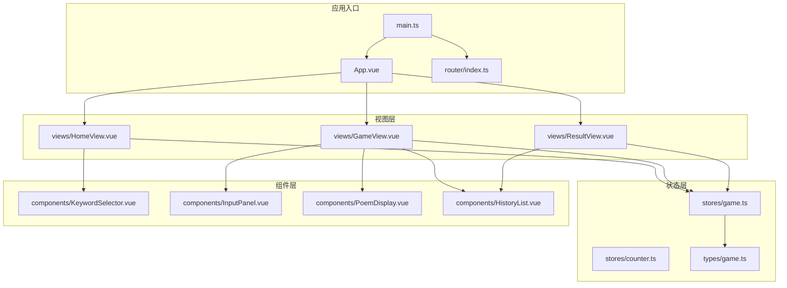
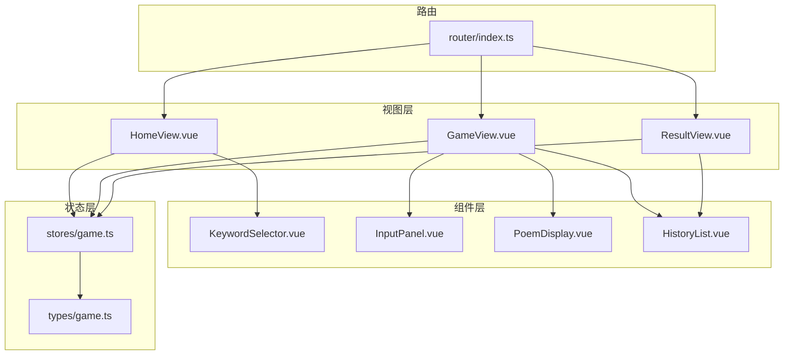
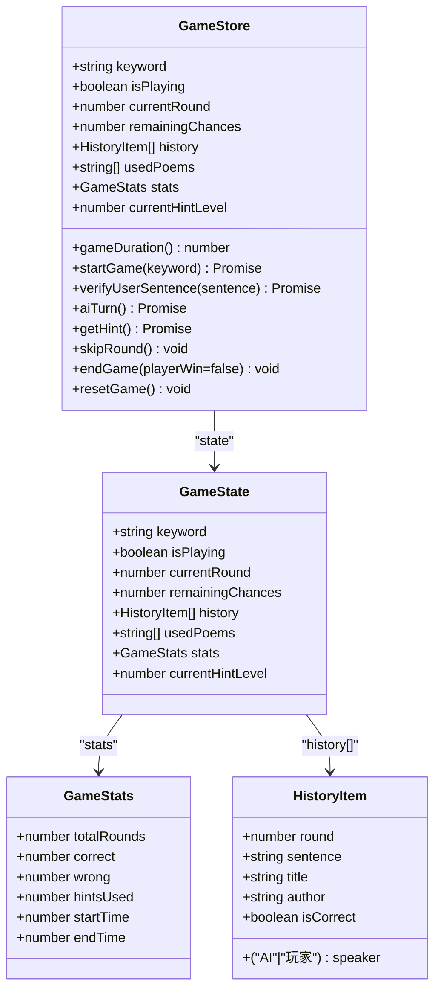
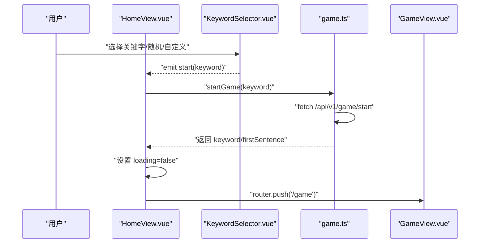
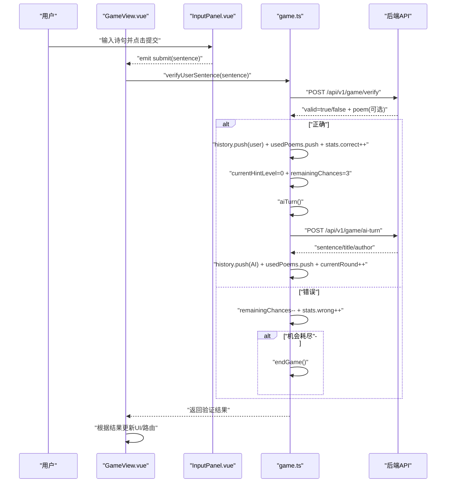
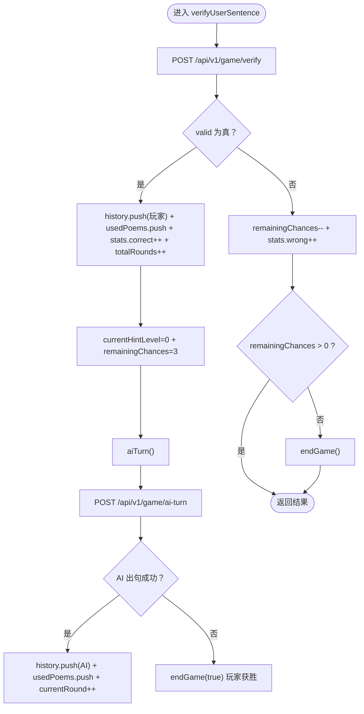
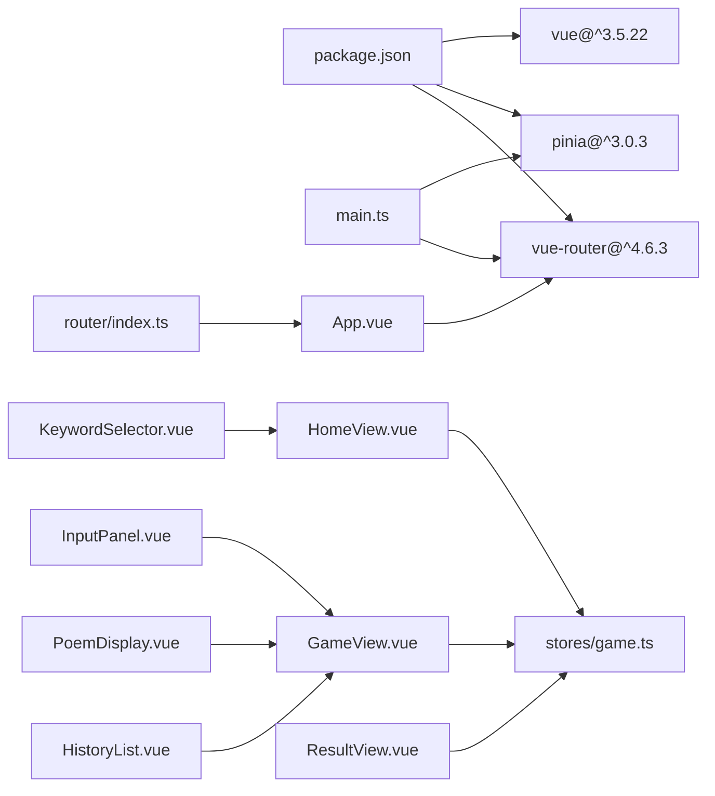

# 前端状态管理

<cite>
**本文引用的文件**
- [frontend/src/main.ts](file://frontend/src/main.ts)
- [frontend/src/App.vue](file://frontend/src/App.vue)
- [frontend/src/router/index.ts](file://frontend/src/router/index.ts)
- [frontend/src/stores/game.ts](file://frontend/src/stores/game.ts)
- [frontend/src/stores/counter.ts](file://frontend/src/stores/counter.ts)
- [frontend/src/types/game.ts](file://frontend/src/types/game.ts)
- [frontend/src/views/HomeView.vue](file://frontend/src/views/HomeView.vue)
- [frontend/src/views/GameView.vue](file://frontend/src/views/GameView.vue)
- [frontend/src/views/ResultView.vue](file://frontend/src/views/ResultView.vue)
- [frontend/src/components/KeywordSelector.vue](file://frontend/src/components/KeywordSelector.vue)
- [frontend/src/components/InputPanel.vue](file://frontend/src/components/InputPanel.vue)
- [frontend/src/components/PoemDisplay.vue](file://frontend/src/components/PoemDisplay.vue)
- [frontend/src/components/HistoryList.vue](file://frontend/src/components/HistoryList.vue)
- [frontend/package.json](file://frontend/package.json)
</cite>

## 目录
1. [简介](#简介)
2. [项目结构](#项目结构)
3. [核心组件](#核心组件)
4. [架构总览](#架构总览)
5. [详细组件分析](#详细组件分析)
6. [依赖关系分析](#依赖关系分析)
7. [性能考量](#性能考量)
8. [故障排查指南](#故障排查指南)
9. [结论](#结论)
10. [附录](#附录)

## 简介
本项目采用 Vue 3 + Pinia 实现前端状态管理，围绕“飞花令”诗词对战游戏构建。状态管理主要集中在 Pinia Store 中，通过集中式状态驱动视图渲染与交互流程；同时结合 Vue Router 实现页面级导航与视图切换。本文档从系统架构、组件关系、数据流与处理逻辑、集成点、错误处理与性能特征等维度进行深入解析，并提供可视化图示与排障建议，帮助读者快速理解并扩展该状态管理方案。

## 项目结构
前端采用基于功能模块的组织方式：
- 应用入口与全局配置：main.ts、App.vue、router/index.ts
- 状态层：stores 下的 game.ts、counter.ts
- 类型定义：types 下的 game.ts
- 视图层：views 下的 HomeView、GameView、ResultView
- 组件层：components 下的 KeywordSelector、InputPanel、PoemDisplay、HistoryList
- 依赖：package.json 中声明 Vue、Pinia、Vue Router 等

图表来源
- [frontend/src/main.ts](file://frontend/src/main.ts#L1-L15)
- [frontend/src/App.vue](file://frontend/src/App.vue#L1-L12)
- [frontend/src/router/index.ts](file://frontend/src/router/index.ts#L1-L26)
- [frontend/src/stores/game.ts](file://frontend/src/stores/game.ts#L1-L220)
- [frontend/src/stores/counter.ts](file://frontend/src/stores/counter.ts#L1-L13)
- [frontend/src/types/game.ts](file://frontend/src/types/game.ts#L1-L37)
- [frontend/src/views/HomeView.vue](file://frontend/src/views/HomeView.vue#L1-L69)
- [frontend/src/views/GameView.vue](file://frontend/src/views/GameView.vue#L1-L156)
- [frontend/src/views/ResultView.vue](file://frontend/src/views/ResultView.vue#L1-L118)
- [frontend/src/components/KeywordSelector.vue](file://frontend/src/components/KeywordSelector.vue#L1-L109)
- [frontend/src/components/InputPanel.vue](file://frontend/src/components/InputPanel.vue#L1-L106)
- [frontend/src/components/PoemDisplay.vue](file://frontend/src/components/PoemDisplay.vue#L1-L31)
- [frontend/src/components/HistoryList.vue](file://frontend/src/components/HistoryList.vue#L1-L41)

章节来源
- [frontend/src/main.ts](file://frontend/src/main.ts#L1-L15)
- [frontend/src/App.vue](file://frontend/src/App.vue#L1-L12)
- [frontend/src/router/index.ts](file://frontend/src/router/index.ts#L1-L26)

## 核心组件
- Pinia Store（game.ts）
  - 状态：keyword、isPlaying、currentRound、remainingChances、history、usedPoems、stats、currentHintLevel
  - 计算属性：gameDuration（基于 stats.startTime 与当前时间或 stats.endTime）
  - 动作：startGame、verifyUserSentence、aiTurn、getHint、skipRound、endGame、resetGame
  - 与后端 API 的交互：通过 fetch 请求 /api/v1/game/start、/api/v1/game/verify、/api/v1/game/ai-turn、/api/v1/game/hint、/api/v1/game/random-char
- 类型定义（types/game.ts）
  - PoemSentence、HistoryItem、GameStats、GameState
- 视图与组件
  - HomeView：触发游戏开始，调用 gameStore.startGame 并跳转到 /game
  - GameView：渲染游戏主界面，绑定状态并处理提交、提示、跳过、退出
  - ResultView：展示结果与统计数据，支持重新开始
  - KeywordSelector：提供热门关键字、随机关键字与自定义输入
  - InputPanel：输入诗句、触发提示与跳过
  - PoemDisplay：展示诗句与作者信息
  - HistoryList：展示对战历史

章节来源
- [frontend/src/stores/game.ts](file://frontend/src/stores/game.ts#L1-L220)
- [frontend/src/types/game.ts](file://frontend/src/types/game.ts#L1-L37)
- [frontend/src/views/HomeView.vue](file://frontend/src/views/HomeView.vue#L1-L69)
- [frontend/src/views/GameView.vue](file://frontend/src/views/GameView.vue#L1-L156)
- [frontend/src/views/ResultView.vue](file://frontend/src/views/ResultView.vue#L1-L118)
- [frontend/src/components/KeywordSelector.vue](file://frontend/src/components/KeywordSelector.vue#L1-L109)
- [frontend/src/components/InputPanel.vue](file://frontend/src/components/InputPanel.vue#L1-L106)
- [frontend/src/components/PoemDisplay.vue](file://frontend/src/components/PoemDisplay.vue#L1-L31)
- [frontend/src/components/HistoryList.vue](file://frontend/src/components/HistoryList.vue#L1-L41)

## 架构总览
整体采用“视图-状态-服务”的分层架构：
- 视图层负责用户交互与状态展示
- 状态层集中管理业务状态与副作用（异步动作）
- 服务层通过 fetch 与后端 API 通信，返回数据更新状态

图表来源
- [frontend/src/views/HomeView.vue](file://frontend/src/views/HomeView.vue#L1-L69)
- [frontend/src/views/GameView.vue](file://frontend/src/views/GameView.vue#L1-L156)
- [frontend/src/views/ResultView.vue](file://frontend/src/views/ResultView.vue#L1-L118)
- [frontend/src/components/KeywordSelector.vue](file://frontend/src/components/KeywordSelector.vue#L1-L109)
- [frontend/src/components/InputPanel.vue](file://frontend/src/components/InputPanel.vue#L1-L106)
- [frontend/src/components/PoemDisplay.vue](file://frontend/src/components/PoemDisplay.vue#L1-L31)
- [frontend/src/components/HistoryList.vue](file://frontend/src/components/HistoryList.vue#L1-L41)
- [frontend/src/stores/game.ts](file://frontend/src/stores/game.ts#L1-L220)
- [frontend/src/types/game.ts](file://frontend/src/types/game.ts#L1-L37)
- [frontend/src/router/index.ts](file://frontend/src/router/index.ts#L1-L26)

## 详细组件分析

### 游戏状态 Store（Pinia）
- 设计要点
  - 使用 defineStore 定义命名空间为 game 的 Store，集中管理游戏状态与行为
  - 状态字段覆盖关键字、回合、机会、历史、已用诗句、统计与提示等级
  - 计算属性 gameDuration 基于 startTime 与当前时间或 endTime 计算
  - 动作方法封装与后端 API 的交互，包括开始游戏、校验诗句、AI 回合、获取提示、跳过回合、结束与重置
- 数据结构复杂度
  - history 与 usedPoems 为线性增长，push 操作 O(1)，查询按需遍历
  - stats 字段为常量时间读写
- 错误处理
  - 所有 fetch 调用均包含 try/catch，错误日志输出并抛出，便于上层捕获
  - 针对 AI 无法出句场景，endGame(playerWin=true) 标记玩家胜利
- 性能影响
  - fetch 调用可能阻塞 UI，建议在视图层增加加载态与防抖
  - 大量历史记录渲染时，HistoryList 已采用虚拟滚动与节流策略（通过 max-h-96 与 overflow-y-auto）

图表来源
- [frontend/src/stores/game.ts](file://frontend/src/stores/game.ts#L1-L220)
- [frontend/src/types/game.ts](file://frontend/src/types/game.ts#L1-L37)

章节来源
- [frontend/src/stores/game.ts](file://frontend/src/stores/game.ts#L1-L220)
- [frontend/src/types/game.ts](file://frontend/src/types/game.ts#L1-L37)

### 视图与交互流程

#### 启动游戏流程（HomeView -> GameView）

图表来源
- [frontend/src/views/HomeView.vue](file://frontend/src/views/HomeView.vue#L1-L69)
- [frontend/src/components/KeywordSelector.vue](file://frontend/src/components/KeywordSelector.vue#L1-L109)
- [frontend/src/stores/game.ts](file://frontend/src/stores/game.ts#L1-L220)

章节来源
- [frontend/src/views/HomeView.vue](file://frontend/src/views/HomeView.vue#L1-L69)
- [frontend/src/components/KeywordSelector.vue](file://frontend/src/components/KeywordSelector.vue#L1-L109)
- [frontend/src/stores/game.ts](file://frontend/src/stores/game.ts#L1-L220)

#### 提交诗句与回合推进（GameView -> game.ts -> 后端）

图表来源
- [frontend/src/views/GameView.vue](file://frontend/src/views/GameView.vue#L1-L156)
- [frontend/src/components/InputPanel.vue](file://frontend/src/components/InputPanel.vue#L1-L106)
- [frontend/src/stores/game.ts](file://frontend/src/stores/game.ts#L1-L220)

章节来源
- [frontend/src/views/GameView.vue](file://frontend/src/views/GameView.vue#L1-L156)
- [frontend/src/components/InputPanel.vue](file://frontend/src/components/InputPanel.vue#L1-L106)
- [frontend/src/stores/game.ts](file://frontend/src/stores/game.ts#L1-L220)

#### 获取提示与跳过回合
- 获取提示：调用 gameStore.getHint，内部递增 currentHintLevel 与 stats.hintsUsed，并请求 /api/v1/game/hint
- 跳过回合：调用 gameStore.skipRound，减少 remainingChances，若机会耗尽则 endGame

章节来源
- [frontend/src/stores/game.ts](file://frontend/src/stores/game.ts#L1-L220)
- [frontend/src/views/GameView.vue](file://frontend/src/views/GameView.vue#L1-L156)

#### 结束与重置
- 结束游戏：endGame(playerWin=false) 设置 isPlaying=false、记录 endTime；当 playerWin=true 时，totalRounds=当前回合
- 重置游戏：resetGame 调用 $reset 恢复初始状态

章节来源
- [frontend/src/stores/game.ts](file://frontend/src/stores/game.ts#L1-L220)
- [frontend/src/views/ResultView.vue](file://frontend/src/views/ResultView.vue#L1-L118)

### 关键算法与流程图

#### 提交诗句决策流程

图表来源
- [frontend/src/stores/game.ts](file://frontend/src/stores/game.ts#L1-L220)

章节来源
- [frontend/src/stores/game.ts](file://frontend/src/stores/game.ts#L1-L220)

## 依赖关系分析
- 运行时依赖
  - Vue 3、Pinia、Vue Router
  - TailwindCSS、TypeScript、Vite
- 状态依赖
  - GameView、HomeView、ResultView 均依赖 game.ts
  - KeywordSelector 与 InputPanel 通过事件向 GameView 传递数据
- 外部接口
  - /api/v1/game/start、/api/v1/game/verify、/api/v1/game/ai-turn、/api/v1/game/hint、/api/v1/game/random-char

图表来源
- [frontend/package.json](file://frontend/package.json#L1-L52)
- [frontend/src/main.ts](file://frontend/src/main.ts#L1-L15)
- [frontend/src/router/index.ts](file://frontend/src/router/index.ts#L1-L26)
- [frontend/src/stores/game.ts](file://frontend/src/stores/game.ts#L1-L220)

章节来源
- [frontend/package.json](file://frontend/package.json#L1-L52)
- [frontend/src/main.ts](file://frontend/src/main.ts#L1-L15)
- [frontend/src/router/index.ts](file://frontend/src/router/index.ts#L1-L26)

## 性能考量
- 网络请求
  - fetch 调用可能阻塞 UI，建议在 GameView 中增加加载态与按钮禁用
  - 对高频操作（如提示）可考虑节流/去抖
- 渲染优化
  - HistoryList 已通过 max-h-96 与 overflow-y-auto 控制高度，避免大列表导致的重排
  - 可进一步引入虚拟滚动（例如 vue-virtual-scroller）以提升大数据集渲染性能
- 状态更新
  - 使用 Pinia 的响应式更新，避免手动 DOM 操作
  - 将计算属性 gameDuration 放置于 Store 中，减少视图重复计算

[本节为通用性能建议，不直接分析具体文件]

## 故障排查指南
- 启动游戏失败
  - 现象：HomeView 报错“开始游戏失败”
  - 排查：检查 /api/v1/game/start 是否可达，确认后端返回格式与错误信息
  - 参考路径：[frontend/src/views/HomeView.vue](file://frontend/src/views/HomeView.vue#L1-L69)、[frontend/src/stores/game.ts](file://frontend/src/stores/game.ts#L1-L220)
- 提交诗句错误
  - 现象：GameView 显示“答案错误”，remainingChances 减少
  - 排查：检查 /api/v1/game/verify 返回的 valid 字段与 message
  - 参考路径：[frontend/src/views/GameView.vue](file://frontend/src/views/GameView.vue#L1-L156)、[frontend/src/stores/game.ts](file://frontend/src/stores/game.ts#L1-L220)
- AI 无法出句
  - 现象：AI 出句失败，endGame(true) 玩家获胜
  - 排查：检查 /api/v1/game/ai-turn 返回状态码与错误信息
  - 参考路径：[frontend/src/stores/game.ts](file://frontend/src/stores/game.ts#L1-L220)
- 获取提示失败
  - 现象：InputPanel 显示“获取提示失败”
  - 排查：检查 /api/v1/game/hint 是否可用
  - 参考路径：[frontend/src/views/GameView.vue](file://frontend/src/views/GameView.vue#L1-L156)、[frontend/src/stores/game.ts](file://frontend/src/stores/game.ts#L1-L220)
- 随机关键字失败
  - 现象：KeywordSelector 显示“获取随机关键字失败”
  - 排查：检查 /api/v1/game/random-char 是否可达
  - 参考路径：[frontend/src/components/KeywordSelector.vue](file://frontend/src/components/KeywordSelector.vue#L1-L109)

章节来源
- [frontend/src/views/HomeView.vue](file://frontend/src/views/HomeView.vue#L1-L69)
- [frontend/src/views/GameView.vue](file://frontend/src/views/GameView.vue#L1-L156)
- [frontend/src/components/KeywordSelector.vue](file://frontend/src/components/KeywordSelector.vue#L1-L109)
- [frontend/src/stores/game.ts](file://frontend/src/stores/game.ts#L1-L220)

## 结论
本项目的状态管理以 Pinia 为核心，围绕 GameState 与 GameActions 构建了清晰的游戏生命周期：启动、回合推进、提示、跳过、结束与重置。通过类型定义确保数据结构一致性，通过视图层与组件层解耦交互逻辑，借助路由实现页面级导航。整体架构简洁、职责明确，易于扩展新的游戏规则与 UI 组件。

[本节为总结性内容，不直接分析具体文件]

## 附录
- 入口与全局配置
  - 应用初始化：创建 Vue 应用实例，挂载 Pinia 与路由
  - 参考路径：[frontend/src/main.ts](file://frontend/src/main.ts#L1-L15)、[frontend/src/App.vue](file://frontend/src/App.vue#L1-L12)、[frontend/src/router/index.ts](file://frontend/src/router/index.ts#L1-L26)
- 其他 Store 示例
  - counter.ts 展示了函数式 Store 的最小实现，可用于演示 Pinia 的不同写法
  - 参考路径：[frontend/src/stores/counter.ts](file://frontend/src/stores/counter.ts#L1-L13)

章节来源
- [frontend/src/main.ts](file://frontend/src/main.ts#L1-L15)
- [frontend/src/App.vue](file://frontend/src/App.vue#L1-L12)
- [frontend/src/router/index.ts](file://frontend/src/router/index.ts#L1-L26)
- [frontend/src/stores/counter.ts](file://frontend/src/stores/counter.ts#L1-L13)