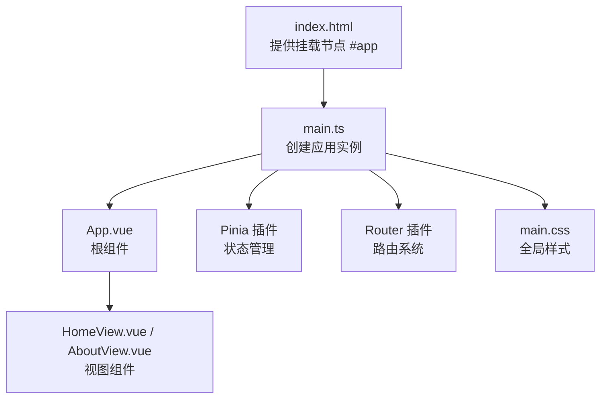
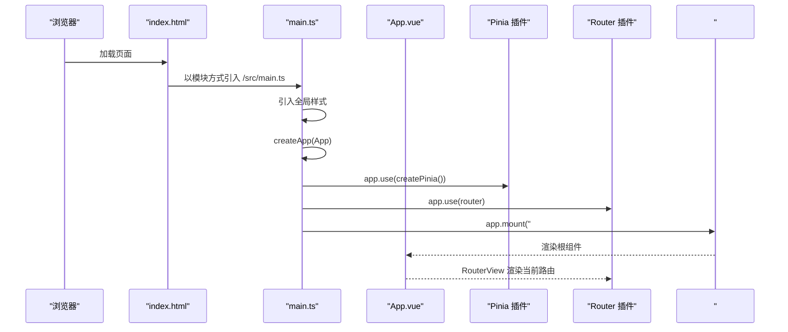
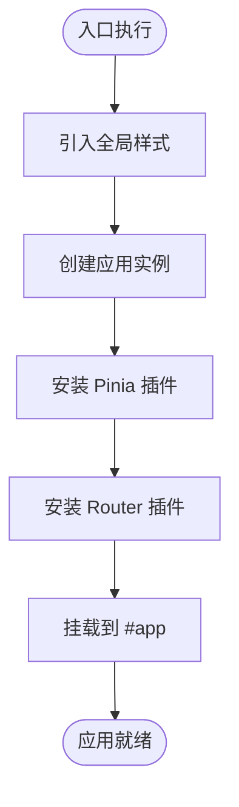
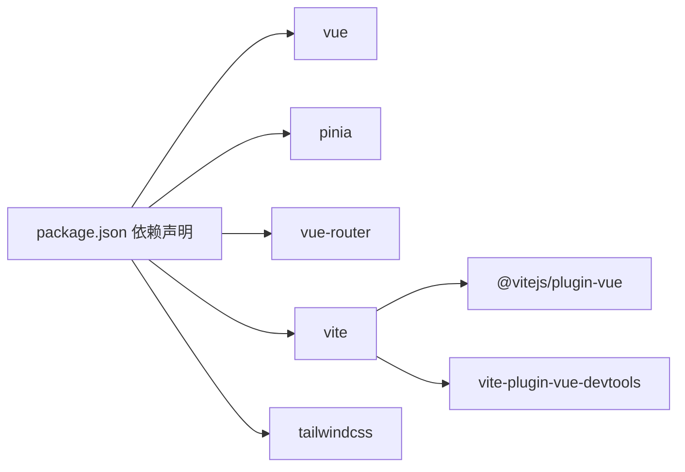
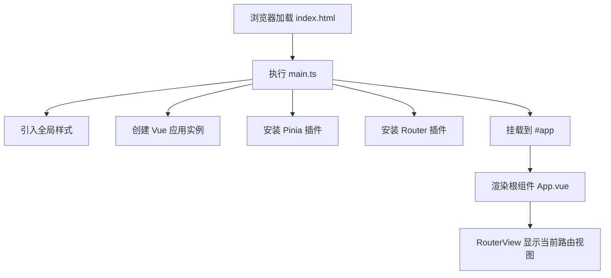

# 主入口文件

<cite>
**本文引用的文件**
- [frontend/src/main.ts](file://frontend/src/main.ts)
- [frontend/src/App.vue](file://frontend/src/App.vue)
- [frontend/src/router/index.ts](file://frontend/src/router/index.ts)
- [frontend/src/stores/counter.ts](file://frontend/src/stores/counter.ts)
- [frontend/src/assets/main.css](file://frontend/src/assets/main.css)
- [frontend/index.html](file://frontend/index.html)
- [frontend/package.json](file://frontend/package.json)
- [frontend/vite.config.ts](file://frontend/vite.config.ts)
- [frontend/tailwind.config.js](file://frontend/tailwind.config.js)
</cite>

## 目录
1. [简介](#简介)
2. [项目结构](#项目结构)
3. [核心组件](#核心组件)
4. [架构总览](#架构总览)
5. [详细组件分析](#详细组件分析)
6. [依赖关系分析](#依赖关系分析)
7. [性能考虑](#性能考虑)
8. [故障排查指南](#故障排查指南)
9. [结论](#结论)
10. [附录](#附录)

## 简介
本节聚焦于前端应用的启动入口文件 main.ts，系统性解析其初始化流程、依赖注入顺序、全局样式的加载位置与作用范围，并结合 Vue 3 组合式 API 的项目特性，为初学者绘制应用启动生命周期流程图，帮助快速理解从入口到挂载的完整过程。

## 项目结构
前端采用 Vite + Vue 3 + Pinia + Vue Router 的现代开发栈。入口文件位于 frontend/src/main.ts，负责创建 Vue 应用实例、安装插件（Pinia、Router）、挂载 DOM 节点。全局样式通过 main.css 在入口处统一引入，页面模板由 index.html 提供挂载容器。

图表来源
- [frontend/index.html](file://frontend/index.html#L9-L12)
- [frontend/src/main.ts](file://frontend/src/main.ts#L1-L15)
- [frontend/src/App.vue](file://frontend/src/App.vue#L1-L19)
- [frontend/src/router/index.ts](file://frontend/src/router/index.ts#L1-L24)
- [frontend/src/stores/counter.ts](file://frontend/src/stores/counter.ts#L1-L13)
- [frontend/src/assets/main.css](file://frontend/src/assets/main.css#L1-L2)

章节来源
- [frontend/index.html](file://frontend/index.html#L9-L12)
- [frontend/src/main.ts](file://frontend/src/main.ts#L1-L15)
- [frontend/package.json](file://frontend/package.json#L19-L23)

## 核心组件
- 入口脚本：在 main.ts 中完成以下步骤
  - 引入全局样式
  - 创建 Vue 应用实例
  - 安装 Pinia 状态管理插件
  - 安装 Vue Router 路由插件
  - 将应用挂载到 DOM 节点
- 根组件：App.vue 作为顶层容器，内部使用 RouterView 展示当前路由内容
- 路由系统：router/index.ts 定义首页与关于页路由，其中“关于”页采用动态导入实现懒加载
- 状态管理：stores/counter.ts 使用组合式 Store API 定义计数器状态与派生计算
- 全局样式：assets/main.css 在入口处引入，作用于整个应用

章节来源
- [frontend/src/main.ts](file://frontend/src/main.ts#L1-L15)
- [frontend/src/App.vue](file://frontend/src/App.vue#L1-L19)
- [frontend/src/router/index.ts](file://frontend/src/router/index.ts#L1-L24)
- [frontend/src/stores/counter.ts](file://frontend/src/stores/counter.ts#L1-L13)
- [frontend/src/assets/main.css](file://frontend/src/assets/main.css#L1-L2)

## 架构总览
下图展示了从浏览器加载到应用运行的关键交互路径，体现入口文件在初始化阶段的职责与顺序。

图表来源
- [frontend/index.html](file://frontend/index.html#L9-L12)
- [frontend/src/main.ts](file://frontend/src/main.ts#L1-L15)
- [frontend/src/App.vue](file://frontend/src/App.vue#L1-L19)
- [frontend/src/router/index.ts](file://frontend/src/router/index.ts#L1-L24)

## 详细组件分析

### 入口文件 main.ts 初始化流程
- 导入顺序与职责
  - 全局样式导入：确保样式在应用逻辑之前加载，避免首屏闪烁或样式覆盖问题
  - Vue 核心：createApp 创建应用实例
  - Pinia：createPinia 创建状态管理插件
  - App 根组件与 Router：分别作为根组件与路由系统
- 依赖注入顺序
  - 首先创建应用实例，随后按需安装插件；Pinia 与 Router 均通过 app.use(...) 注册
  - 挂载前完成所有插件注册，保证渲染阶段可访问状态与路由能力
- 应用挂载
  - 通过 app.mount('#app') 将应用挂载至 index.html 中的 #app 容器

图表来源
- [frontend/src/main.ts](file://frontend/src/main.ts#L1-L15)
- [frontend/index.html](file://frontend/index.html#L9-L12)

章节来源
- [frontend/src/main.ts](file://frontend/src/main.ts#L1-L15)
- [frontend/index.html](file://frontend/index.html#L9-L12)

### 根组件 App.vue 与 RouterView
- App.vue 作为顶层容器，内部仅包含 RouterView，用于承载当前路由对应的视图组件
- 该设计使路由切换直接反映在根组件的子树中，便于统一布局与导航

章节来源
- [frontend/src/App.vue](file://frontend/src/App.vue#L1-L19)

### 路由系统 router/index.ts
- 路由历史模式：基于浏览器 History API
- 路由定义：包含首页与“关于”页
- 动态导入：关于页采用动态导入，实现按需加载与代码分割，优化首屏性能

章节来源
- [frontend/src/router/index.ts](file://frontend/src/router/index.ts#L1-L24)

### 状态管理 stores/counter.ts
- 使用组合式 Store API 定义计数器状态与派生计算
- 该 Store 可在任意组件中通过 useCounterStore 访问，体现 Pinia 的轻量与易用

章节来源
- [frontend/src/stores/counter.ts](file://frontend/src/stores/counter.ts#L1-L13)

### 全局样式 assets/main.css
- 在入口处引入，确保样式优先加载
- 作用范围：对整个应用生效，可被 App.vue 与各视图组件继承或覆盖
- 与 Tailwind 配置联动：tailwind.config.js 指定扫描范围，确保按需生成样式

章节来源
- [frontend/src/main.ts](file://frontend/src/main.ts#L1-L15)
- [frontend/src/assets/main.css](file://frontend/src/assets/main.css#L1-L2)
- [frontend/tailwind.config.js](file://frontend/tailwind.config.js#L1-L11)

## 依赖关系分析
- 运行时依赖
  - Vue：框架核心
  - Pinia：状态管理
  - Vue Router：路由系统
- 构建时依赖
  - Vite：开发服务器与打包工具
  - Tailwind CSS：原子化样式框架
  - Vue 插件：Vite 的 Vue 支持与 DevTools

图表来源
- [frontend/package.json](file://frontend/package.json#L19-L49)
- [frontend/vite.config.ts](file://frontend/vite.config.ts#L1-L19)
- [frontend/tailwind.config.js](file://frontend/tailwind.config.js#L1-L11)

章节来源
- [frontend/package.json](file://frontend/package.json#L19-L49)
- [frontend/vite.config.ts](file://frontend/vite.config.ts#L1-L19)
- [frontend/tailwind.config.js](file://frontend/tailwind.config.js#L1-L11)

## 性能考虑
- 路由懒加载：关于页采用动态导入，减少初始包体积，提升首屏加载速度
- 全局样式预加载：入口处引入 main.css，避免样式 FOUC（Flash of Unstyled Content）
- 构建优化：Vite 默认启用模块热替换与按需编译，Tailwind 配置限定扫描范围，避免生成冗余样式

章节来源
- [frontend/src/router/index.ts](file://frontend/src/router/index.ts#L1-L24)
- [frontend/src/main.ts](file://frontend/src/main.ts#L1-L15)
- [frontend/tailwind.config.js](file://frontend/tailwind.config.js#L1-L11)

## 故障排查指南
- 应用未渲染或空白页
  - 检查 index.html 是否存在 #app 容器
  - 确认 main.ts 中 app.mount('#app') 是否执行
- 路由不生效
  - 确认 router/index.ts 已正确导出 router 实例并在 main.ts 中安装
  - 检查 App.vue 中是否包含 RouterView
- 样式异常
  - 确认 main.css 已在入口处引入
  - 若使用 Tailwind，确认 tailwind.config.js 的 content 路径包含目标文件
- 插件未生效
  - 确认 package.json 中已安装对应依赖
  - 确认 Vite 配置已启用相应插件

章节来源
- [frontend/index.html](file://frontend/index.html#L9-L12)
- [frontend/src/main.ts](file://frontend/src/main.ts#L1-L15)
- [frontend/src/App.vue](file://frontend/src/App.vue#L1-L19)
- [frontend/src/router/index.ts](file://frontend/src/router/index.ts#L1-L24)
- [frontend/src/assets/main.css](file://frontend/src/assets/main.css#L1-L2)
- [frontend/package.json](file://frontend/package.json#L19-L49)
- [frontend/vite.config.ts](file://frontend/vite.config.ts#L1-L19)
- [frontend/tailwind.config.js](file://frontend/tailwind.config.js#L1-L11)

## 结论
main.ts 作为 Vue 3 组合式 API 项目的启动入口，遵循“先样式、后实例、再插件、最后挂载”的清晰顺序。通过 Pinia 与 Vue Router 的集成，配合路由懒加载与全局样式的预加载策略，既保证了良好的用户体验，也为后续功能扩展提供了稳定基础。建议在新增功能时保持相同的注入顺序与模块化组织方式，确保应用结构清晰、易于维护。

## 附录
- 初学者启动生命周期流程图（概念示意）

[本图为概念流程图，无需图表来源]