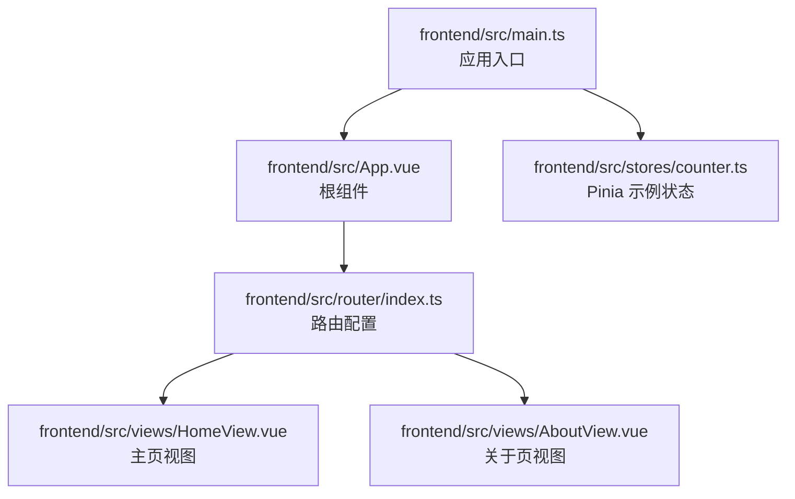
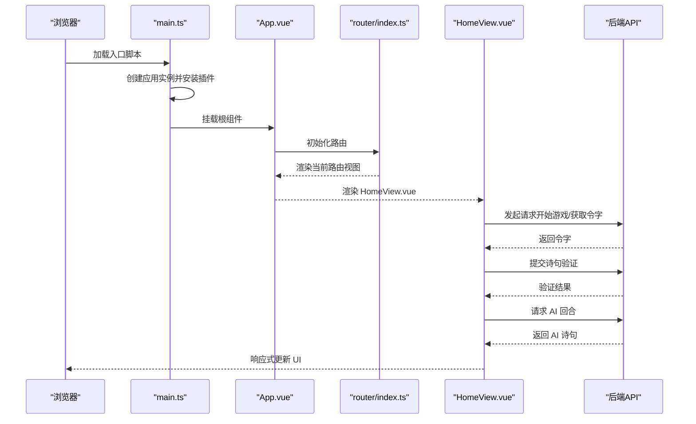
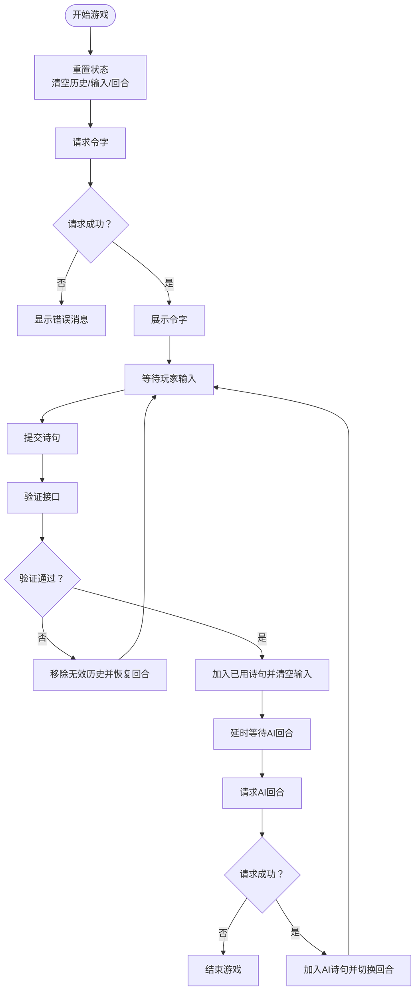
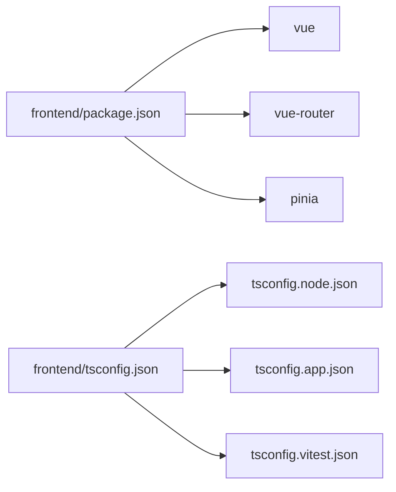

# 前端架构

<cite>
**本文引用的文件**
- [frontend/src/main.ts](file://frontend/src/main.ts)
- [frontend/src/App.vue](file://frontend/src/App.vue)
- [frontend/src/router/index.ts](file://frontend/src/router/index.ts)
- [frontend/src/views/HomeView.vue](file://frontend/src/views/HomeView.vue)
- [frontend/src/stores/counter.ts](file://frontend/src/stores/counter.ts)
- [frontend/src/views/AboutView.vue](file://frontend/src/views/AboutView.vue)
- [frontend/package.json](file://frontend/package.json)
- [frontend/tsconfig.json](file://frontend/tsconfig.json)
</cite>

## 目录
1. [引言](#引言)
2. [项目结构](#项目结构)
3. [核心组件](#核心组件)
4. [架构总览](#架构总览)
5. [详细组件分析](#详细组件分析)
6. [依赖关系分析](#依赖关系分析)
7. [性能考虑](#性能考虑)
8. [故障排查指南](#故障排查指南)
9. [结论](#结论)
10. [附录](#附录)

## 引言
本文件面向希望理解该前端应用架构的开发者，围绕 Vue 应用初始化、路由与状态管理的集成方式展开，重点解析：
- 如何在 main.ts 中完成应用挂载、引入 Pinia 与 Vue Router
- App.vue 作为根容器的布局职责
- HomeView.vue 使用组合式 API 管理游戏状态与交互流程
- counter.ts 展示 Pinia 的基本用法
- HomeView.vue 通过 fetch 调用后端 API 的完整流程：开始游戏→获取令字→提交诗句→接收 AI 回应
- 响应式数据绑定与模板渲染机制，帮助理解 UI 更新原理

## 项目结构
前端采用典型的单页应用（SPA）组织方式，核心入口位于 src/main.ts，路由定义于 src/router/index.ts，根组件 App.vue 负责承载 RouterView，视图组件位于 src/views 下，状态管理示例位于 src/stores。

图表来源
- [frontend/src/main.ts](file://frontend/src/main.ts#L1-L15)
- [frontend/src/App.vue](file://frontend/src/App.vue#L1-L19)
- [frontend/src/router/index.ts](file://frontend/src/router/index.ts#L1-L24)
- [frontend/src/views/HomeView.vue](file://frontend/src/views/HomeView.vue#L1-L232)
- [frontend/src/views/AboutView.vue](file://frontend/src/views/AboutView.vue#L1-L16)
- [frontend/src/stores/counter.ts](file://frontend/src/stores/counter.ts#L1-L13)

章节来源
- [frontend/src/main.ts](file://frontend/src/main.ts#L1-L15)
- [frontend/src/App.vue](file://frontend/src/App.vue#L1-L19)
- [frontend/src/router/index.ts](file://frontend/src/router/index.ts#L1-L24)
- [frontend/src/views/HomeView.vue](file://frontend/src/views/HomeView.vue#L1-L232)
- [frontend/src/views/AboutView.vue](file://frontend/src/views/AboutView.vue#L1-L16)
- [frontend/src/stores/counter.ts](file://frontend/src/stores/counter.ts#L1-L13)

## 核心组件
- 应用入口与插件注册：在 main.ts 中创建应用实例、安装 Pinia 与 Router，并挂载到 DOM。
- 根组件：App.vue 仅包含 RouterView，负责承载当前路由对应的视图。
- 路由系统：router/index.ts 定义首页与“关于”页的路由，其中“关于”页采用懒加载以优化首屏。
- 视图组件：HomeView.vue 实现飞花令游戏的核心交互；AboutView.vue 提供静态页面占位。
- 状态管理：stores/counter.ts 展示 Pinia 的最小可用 Store（ref、computed、返回值导出）。

章节来源
- [frontend/src/main.ts](file://frontend/src/main.ts#L1-L15)
- [frontend/src/App.vue](file://frontend/src/App.vue#L1-L19)
- [frontend/src/router/index.ts](file://frontend/src/router/index.ts#L1-L24)
- [frontend/src/views/HomeView.vue](file://frontend/src/views/HomeView.vue#L1-L232)
- [frontend/src/views/AboutView.vue](file://frontend/src/views/AboutView.vue#L1-L16)
- [frontend/src/stores/counter.ts](file://frontend/src/stores/counter.ts#L1-L13)

## 架构总览
下图展示从应用启动到路由渲染、再到视图交互的整体流程。

图表来源
- [frontend/src/main.ts](file://frontend/src/main.ts#L1-L15)
- [frontend/src/App.vue](file://frontend/src/App.vue#L1-L19)
- [frontend/src/router/index.ts](file://frontend/src/router/index.ts#L1-L24)
- [frontend/src/views/HomeView.vue](file://frontend/src/views/HomeView.vue#L1-L232)

## 详细组件分析

### 应用初始化与插件集成（main.ts）
- 创建应用实例并挂载根组件
- 安装 Pinia 插件，使全局可使用 Store
- 安装 Vue Router，启用路由导航
- 该流程确保后续组件可通过组合式 API 访问 Store，或通过 RouterView 渲染对应视图

章节来源
- [frontend/src/main.ts](file://frontend/src/main.ts#L1-L15)

### 根组件布局（App.vue）
- 仅包含 RouterView，用于承载当前路由对应的视图组件
- 通过样式限制容器宽度与内边距，提供统一的页面布局基础

章节来源
- [frontend/src/App.vue](file://frontend/src/App.vue#L1-L19)

### 路由系统（router/index.ts）
- 首页路由指向 HomeView.vue
- “关于”页采用动态导入实现懒加载，减少初始包体积
- 使用 createWebHistory 与 BASE_URL 配置历史模式

章节来源
- [frontend/src/router/index.ts](file://frontend/src/router/index.ts#L1-L24)

### Pinia 示例（stores/counter.ts）
- 使用 defineStore 定义一个名为“counter”的 Store
- 内部使用 ref 维护计数，computed 计算双倍值
- 返回值包含计数、双倍计数与自增方法，体现 Store 的最小可用形态

章节来源
- [frontend/src/stores/counter.ts](file://frontend/src/stores/counter.ts#L1-L13)

### 核心游戏视图（HomeView.vue）
- 组合式 API 状态
  - 使用 ref 定义游戏状态：是否开始、令字、用户输入、历史记录、已用诗句、消息提示、是否玩家回合
- 交互流程
  - 开始游戏：重置状态并发起请求获取令字
  - 提交诗句：校验输入与回合，向后端验证，成功则推进 AI 回合
  - AI 回合：请求后端生成 AI 诗句，更新历史与回合状态
- 模板与响应式
  - 通过 v-if 控制按钮与区域显示
  - v-for 渲染历史列表
  - v-model 双向绑定用户输入
  - 通过 message、isPlayerTurn 等 ref 控制 UI 状态与交互禁用

图表来源
- [frontend/src/views/HomeView.vue](file://frontend/src/views/HomeView.vue#L1-L232)

章节来源
- [frontend/src/views/HomeView.vue](file://frontend/src/views/HomeView.vue#L1-L232)

### 关于页视图（AboutView.vue）
- 提供静态内容，配合路由懒加载提升首屏性能
- 在大屏设备上提供居中布局样式

章节来源
- [frontend/src/views/AboutView.vue](file://frontend/src/views/AboutView.vue#L1-L16)

## 依赖关系分析
- 运行时依赖
  - vue：框架核心
  - vue-router：路由管理
  - pinia：状态管理
- 类型与构建工具
  - typescript、vite、tailwindcss、eslint、vitest 等
- 项目类型配置
  - tsconfig.json 通过 references 引入多份 tsconfig 文件，分别服务于 node、app 与测试环境

图表来源
- [frontend/package.json](file://frontend/package.json#L1-L51)
- [frontend/tsconfig.json](file://frontend/tsconfig.json#L1-L15)

章节来源
- [frontend/package.json](file://frontend/package.json#L1-L51)
- [frontend/tsconfig.json](file://frontend/tsconfig.json#L1-L15)

## 性能考虑
- 路由懒加载：将“关于”页设置为动态导入，避免首屏加载无关资源
- 组件拆分：根组件仅承担容器职责，业务逻辑集中在视图组件，便于维护与按需加载
- 响应式粒度：HomeView.vue 将状态拆分为多个 ref，避免不必要的整体重渲染
- UI 禁用：通过 isPlayerTurn 控制输入框与按钮的禁用状态，减少无效交互

## 故障排查指南
- 后端服务未运行
  - 症状：获取令字、提交诗句、AI 回合均报错
  - 排查：确认后端监听地址与端口（默认本地 3000），确保 API 路径正确
- 网络异常
  - 症状：请求失败提示
  - 排查：检查跨域配置、防火墙、代理设置
- 路由访问异常
  - 症状：空白页或 404
  - 排查：确认路由路径与组件映射，检查 history 模式下的服务器配置
- 状态未更新
  - 症状：UI 不随输入变化
  - 排查：确认 v-model 绑定的 ref 是否被修改，模板中是否使用了正确的响应式变量

章节来源
- [frontend/src/views/HomeView.vue](file://frontend/src/views/HomeView.vue#L1-L232)
- [frontend/src/router/index.ts](file://frontend/src/router/index.ts#L1-L24)

## 结论
该前端应用采用清晰的分层架构：入口负责插件注册，根组件负责路由容器，视图组件承载业务逻辑，Pinia 提供轻量状态管理示例。HomeView.vue 通过组合式 API 与 fetch 实现完整的游戏交互流程，展示了响应式数据驱动 UI 的机制。建议在实际项目中进一步：
- 将 fetch 抽象为独立的服务模块，集中处理错误与拦截器
- 对 HomeView 的状态进行模块化拆分，提升可维护性
- 补充单元测试与端到端测试，保障交互稳定性

## 附录
- 术语
  - 组合式 API：Vue 3 推荐的逻辑复用与状态管理方式，包括 ref、reactive、computed、watch 等
  - Pinia：Vue 官方推荐的状态管理库，支持组合式 API 与模块化 Store
  - RouterView：路由占位符，用于渲染当前匹配的路由组件