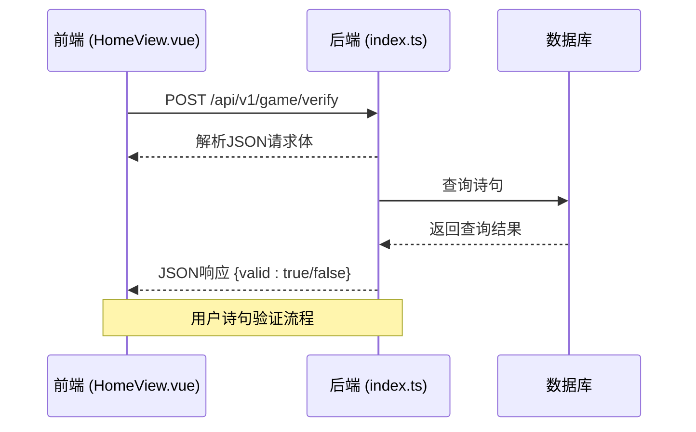
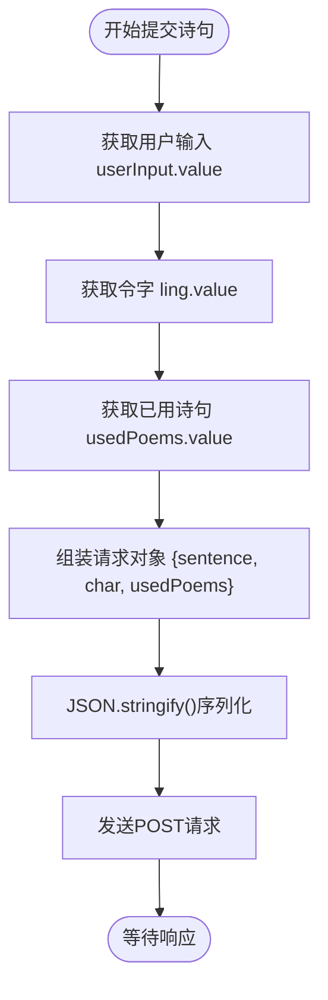

# API请求构造

<cite>
**本文档中引用的文件**  
- [HomeView.vue](file://frontend/src/views/HomeView.vue)
- [index.ts](file://backend/src/index.ts)
- [seed.ts](file://backend/prisma/seed.ts)
- [vite.config.ts](file://frontend/vite.config.ts)
</cite>

## 目录
1. [简介](#简介)
2. [API_BASE_URL的定义与作用](#api_base_url的定义与作用)
3. [POST请求配置详解](#post请求配置详解)
4. [请求体序列化机制](#请求体序列化机制)
5. [业务字段解析](#业务字段解析)
6. [调试建议](#调试建议)

## 简介
本文档详细解析前端组件`HomeView.vue`中`submitSentence`和`aiTurn`函数发起的POST请求构造过程。重点分析请求配置中的关键要素，包括基础URL、请求头设置、请求体序列化方式以及传递的业务参数。结合前后端代码，说明这些请求如何与后端API交互，实现飞花令游戏的核心逻辑。

**Section sources**
- [HomeView.vue](file://frontend/src/views/HomeView.vue#L4-L84)

## API_BASE_URL的定义与作用
在`HomeView.vue`文件中，第4行定义了常量`API_BASE_URL = 'http://localhost:3000/api/v1'`，该地址指向本地运行的后端服务。此常量作为所有API请求的基础路径，确保前端能够正确访问后端提供的RESTful接口。通过集中定义基础URL，提高了代码的可维护性，便于在不同环境下进行配置调整。

该配置与后端`index.ts`中的路由前缀`/api/v1`完全匹配，形成完整的请求路径，如`/api/v1/game/verify`和`/api/v1/game/ai-turn`。

**Section sources**
- [HomeView.vue](file://frontend/src/views/HomeView.vue#L4)
- [index.ts](file://backend/src/index.ts#L13-L51)

## POST请求配置详解
`submitSentence`和`aiTurn`函数均使用`fetch` API发起POST请求，其配置对象包含三个核心属性：

1. **method**: 明确设置为`'POST'`，指示服务器这是一个数据提交请求。
2. **headers**: 设置`Content-Type: 'application/json'`，告知服务器请求体为JSON格式，服务器需以相应方式解析。
3. **body**: 通过`JSON.stringify()`将JavaScript对象转换为JSON字符串，作为请求体发送。

这种配置模式符合现代Web API的标准实践，确保前后端数据交换的规范性和可靠性。

**Diagram sources**
- [HomeView.vue](file://frontend/src/views/HomeView.vue#L40-L62)
- [index.ts](file://backend/src/index.ts#L24-L48)

**Section sources**
- [HomeView.vue](file://frontend/src/views/HomeView.vue#L40-L62)
- [index.ts](file://backend/src/index.ts#L24-L48)

## 请求体序列化机制
在发送POST请求时，JavaScript对象不能直接作为请求体传输，必须序列化为字符串。`JSON.stringify()`方法将包含`sentence`、`char`、`usedPoems`等属性的JavaScript对象转换为标准JSON格式的字符串。

这一转换至关重要，因为HTTP协议传输的是文本数据。后端使用`app.use(express.json())`中间件自动解析JSON字符串为JavaScript对象，存储在`req.body`中，从而实现数据的无缝传递。

**Section sources**
- [HomeView.vue](file://frontend/src/views/HomeView.vue#L44-L45)
- [index.ts](file://backend/src/index.ts#L10)

## 业务字段解析
POST请求中传递的字段具有明确的业务含义：

- **sentence**: 用户输入的诗句内容，用于验证是否符合游戏规则。
- **char**: 当前游戏的"令字"，由`startGame`函数从后端获取，存储在`ling.value`中。
- **usedPoems**: 已使用诗句的数组，防止重复使用同一诗句，维护游戏状态。

这些字段在`submitSentence`中动态组装，其中`sentence`取自`userInput.value`，`char`取自`ling.value`，`usedPoems`取自`usedPoems.value`，体现了前端状态管理与API请求的紧密结合。

**Diagram sources**
- [HomeView.vue](file://frontend/src/views/HomeView.vue#L37-L45)
- [index.ts](file://backend/src/index.ts#L25)

**Section sources**
- [HomeView.vue](file://frontend/src/views/HomeView.vue#L37-L45)
- [index.ts](file://backend/src/index.ts#L25)

## 调试建议
要调试这些API请求，可使用浏览器开发者工具：
1. 打开开发者工具（F12），切换到"网络"（Network）标签页。
2. 触发`submitSentence`或`aiTurn`操作。
3. 在网络请求列表中找到`verify`或`ai-turn`的POST请求。
4. 点击请求，查看"标头"（Headers）确认`Content-Type`为`application/json`。
5. 查看"请求载荷"（Request Payload）验证JSON数据结构是否正确。
6. 查看"响应"（Response）检查服务器返回结果。

通过这种方式，可以实时监控请求的完整生命周期，快速定位前后端交互中的问题。

**Section sources**
- [HomeView.vue](file://frontend/src/views/HomeView.vue#L40-L84)
- [index.ts](file://backend/src/index.ts#L24-L71)