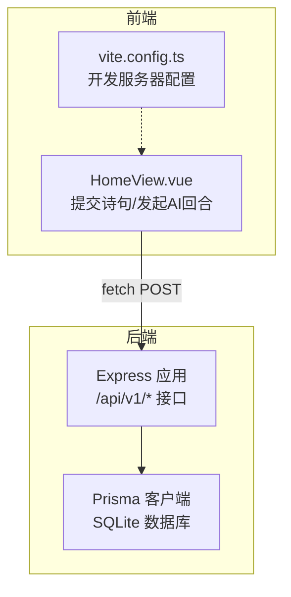
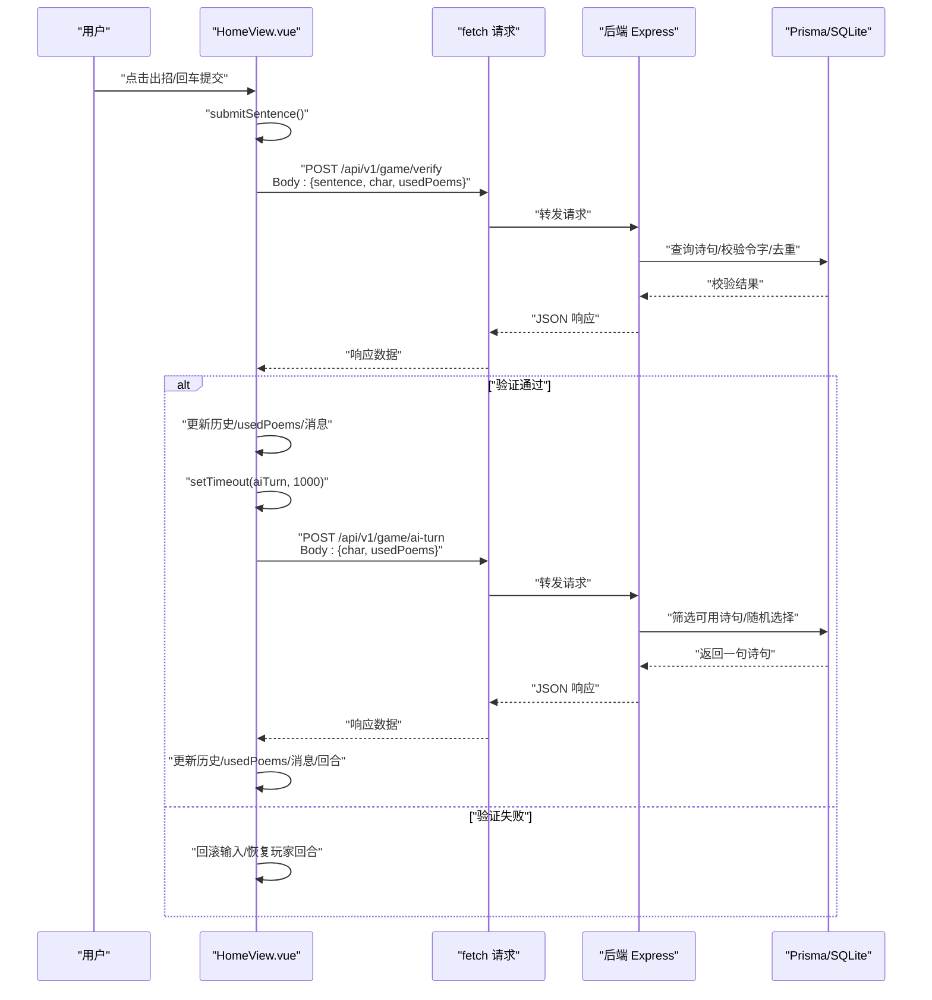
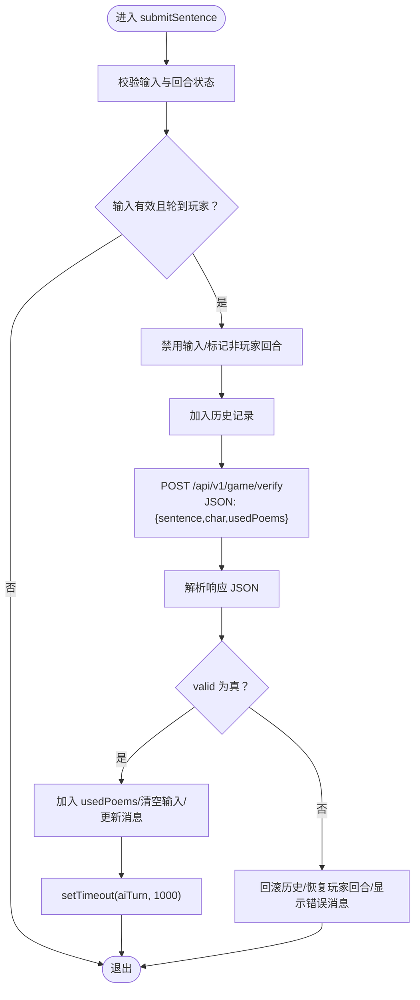
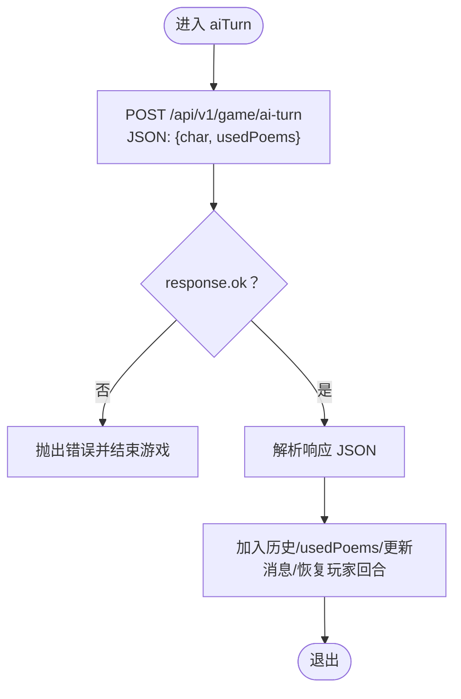
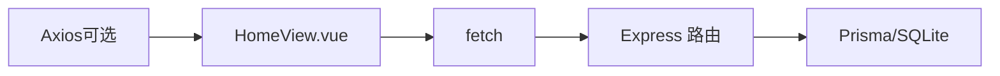
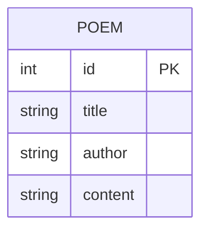

# API集成与异步通信

<cite>
**本文引用的文件**
- [HomeView.vue](file://frontend/src/views/HomeView.vue)
- [后端入口 index.ts](file://backend/src/index.ts)
- [前端 Vite 配置 vite.config.ts](file://frontend/vite.config.ts)
- [前端 package.json](file://frontend/package.json)
- [后端 package.json](file://backend/package.json)
- [Prisma 迁移 migration.sql](file://backend/prisma/migrations/20251104061144_init/migration.sql)
- [种子数据 seed.ts](file://backend/prisma/seed.ts)
</cite>

## 目录
1. [引言](#引言)
2. [项目结构](#项目结构)
3. [核心组件](#核心组件)
4. [架构总览](#架构总览)
5. [详细组件分析](#详细组件分析)
6. [依赖关系分析](#依赖关系分析)
7. [性能考量](#性能考量)
8. [故障排查指南](#故障排查指南)
9. [结论](#结论)
10. [附录](#附录)

## 引言
本文件聚焦于前端 HomeView.vue 中通过原生 fetch 实现的异步 API 调用模式，系统性解析 submitSentence 与 aiTurn 两个核心方法的请求构造、响应处理与错误边界策略；同时说明 setTimeout 在 AI 响应延迟中的作用与实现原理，并结合网络调试技巧给出针对 CORS、404、500 等常见失败场景的诊断步骤，最后对 Axios 等 HTTP 客户端替代方案进行简要对比与建议。

## 项目结构
- 前端采用 Vue 3 单文件组件，HomeView.vue 承载飞花令游戏交互逻辑与 API 调用。
- 后端基于 Express 提供 REST 接口，使用 Prisma 访问 SQLite 数据库，启用 CORS 支持。
- 前端通过 Vite 构建，开发服务器默认运行在本地端口（由 Vite 配置决定），与后端服务端口一致或跨域访问需正确配置。

图表来源
- [HomeView.vue](file://frontend/src/views/HomeView.vue#L1-L120)
- [后端入口 index.ts](file://backend/src/index.ts#L1-L77)
- [前端 Vite 配置 vite.config.ts](file://frontend/vite.config.ts#L1-L19)

章节来源
- [HomeView.vue](file://frontend/src/views/HomeView.vue#L1-L120)
- [后端入口 index.ts](file://backend/src/index.ts#L1-L77)
- [前端 Vite 配置 vite.config.ts](file://frontend/vite.config.ts#L1-L19)

## 核心组件
- API 基础地址：统一在组件内定义基础路径，便于后续迁移与维护。
- 游戏状态：
  - 游戏是否开始、当前令字、历史记录、已用诗句集合、消息提示、玩家回合标记。
- 关键方法：
  - startGame：获取随机令字并更新 UI。
  - submitSentence：校验用户输入并调用后端验证接口，成功后延时触发 aiTurn。
  - aiTurn：向后端请求 AI 回合，接收 AI 诗句并更新 UI。

章节来源
- [HomeView.vue](file://frontend/src/views/HomeView.vue#L1-L120)

## 架构总览
下图展示从用户交互到后端处理与回传的整体流程，映射到实际代码位置。

图表来源
- [HomeView.vue](file://frontend/src/views/HomeView.vue#L32-L90)
- [后端入口 index.ts](file://backend/src/index.ts#L1-L77)

## 详细组件分析

### submitSentence 方法的异步请求流程
- 请求构造
  - 使用 fetch 发起 POST 请求，目标为“/api/v1/game/verify”。
  - 设置请求头 Content-Type 为 application/json。
  - 请求体为 JSON 字符串，包含字段：sentence（用户输入）、char（当前令字）、usedPoems（已用诗句列表）。
- 响应处理
  - 将响应体解析为 JSON。
  - 若 valid 为真：将当前诗句加入 usedPoems，清空输入框，更新消息提示，使用 setTimeout 延迟 1000ms 触发 aiTurn。
  - 若 valid 为假：显示错误消息，回滚历史记录，恢复玩家回合。
- 错误边界
  - 捕获异常时，设置通用失败提示并恢复玩家回合。
  - 对 response.ok 的判断可作为非 2xx 状态码的兜底处理（尽管此处未显式使用）。

图表来源
- [HomeView.vue](file://frontend/src/views/HomeView.vue#L32-L62)

章节来源
- [HomeView.vue](file://frontend/src/views/HomeView.vue#L32-L62)

### aiTurn 方法的异步请求流程
- 请求构造
  - 使用 fetch 发起 POST 请求，目标为“/api/v1/game/ai-turn”。
  - 设置请求头 Content-Type 为 application/json。
  - 请求体为 JSON 字符串，包含字段：char（当前令字）、usedPoems（已用诗句列表）。
- 响应处理
  - 若响应非 ok，抛出错误并提示“AI 也想不出来了！你赢了！”。
  - 解析响应 JSON，取 sentence 字段，加入历史与 usedPoems，更新消息与回合状态。
- 错误边界
  - 捕获异常时，设置错误消息并结束游戏（gameStarted=false）。

图表来源
- [HomeView.vue](file://frontend/src/views/HomeView.vue#L64-L84)

章节来源
- [HomeView.vue](file://frontend/src/views/HomeView.vue#L64-L84)

### setTimeout 在 AI 响应延迟中的应用
- 目的：在用户验证通过后，给 AI 一轮“思考时间”，提升交互真实感与节奏控制。
- 实现原理：在 submitSentence 成功分支中，调用 setTimeout(aiTurn, 1000)，1000ms 后执行 aiTurn。
- 注意事项：
  - 若用户在等待期间离开页面或游戏结束，需确保不会继续触发后续逻辑。
  - 可根据需要调整延迟时长，平衡体验与性能。

章节来源
- [HomeView.vue](file://frontend/src/views/HomeView.vue#L48-L56)

### POST 请求构造要点
- Content-Type 头：必须设置为 application/json，确保后端能正确解析 JSON 请求体。
- JSON 序列化：使用 JSON.stringify 将对象转换为字符串，避免后端解析失败。
- 请求体字段：
  - submitSentence：包含 sentence、char、usedPoems。
  - aiTurn：包含 char、usedPoems。
- 后端对应处理：
  - /api/v1/game/verify：校验令字、重复性与是否存在。
  - /api/v1/game/ai-turn：按令字筛选可用诗句并返回一句。

章节来源
- [HomeView.vue](file://frontend/src/views/HomeView.vue#L32-L90)
- [后端入口 index.ts](file://backend/src/index.ts#L1-L77)

### 错误边界处理策略
- 通用网络错误：捕获异常，提示“请求失败，请检查网络”，并恢复玩家回合。
- 业务错误：根据后端返回的 valid/message 或状态码（如 404）进行提示与回滚。
- 游戏状态：当 AI 无法找到可用诗句时，结束游戏并提示胜利。

章节来源
- [HomeView.vue](file://frontend/src/views/HomeView.vue#L48-L62)
- [HomeView.vue](file://frontend/src/views/HomeView.vue#L70-L84)
- [后端入口 index.ts](file://backend/src/index.ts#L1-L77)

## 依赖关系分析
- 前端依赖
  - Vue 3：组件与响应式状态管理。
  - Axios：存在于依赖列表，可用于替换 fetch，提供拦截器、超时、重试等能力。
- 后端依赖
  - Express：提供 REST 接口。
  - Prisma：ORM 访问 SQLite。
  - CORS：允许前端跨域访问。
- 数据模型
  - Poem 表包含 id、title、author、content 字段，用于存储诗词内容。

图表来源
- [前端 package.json](file://frontend/package.json#L1-L51)
- [后端 package.json](file://backend/package.json#L1-L30)
- [HomeView.vue](file://frontend/src/views/HomeView.vue#L1-L120)
- [后端入口 index.ts](file://backend/src/index.ts#L1-L77)
- [Prisma 迁移 migration.sql](file://backend/prisma/migrations/20251104061144_init/migration.sql#L1-L7)

章节来源
- [前端 package.json](file://frontend/package.json#L1-L51)
- [后端 package.json](file://backend/package.json#L1-L30)
- [Prisma 迁移 migration.sql](file://backend/prisma/migrations/20251104061144_init/migration.sql#L1-L7)

## 性能考量
- 请求合并与节流：在高频输入场景下，可考虑对 submitSentence 增加防抖或节流，减少无效请求。
- 前端缓存：对已验证过的诗句可做本地缓存，避免重复请求。
- 后端优化：在 /api/v1/game/ai-turn 中可增加索引或预筛选，提高查询效率。
- 超时与重试：若改用 Axios，可配置超时与自动重试，改善弱网环境下的用户体验。

## 故障排查指南
- CORS 问题
  - 现象：浏览器控制台出现跨域错误。
  - 诊断：确认后端已启用 CORS 中间件；前后端端口/协议一致或代理配置正确。
  - 参考：后端已启用 cors 中间件。
- 404 未找到
  - 现象：接口返回 404。
  - 诊断：检查路由路径是否正确；确认后端已启动且监听端口；数据库中是否有诗词数据。
  - 参考：后端随机令字接口在无数据时返回 404。
- 500 服务器内部错误
  - 现象：接口返回 500。
  - 诊断：查看后端日志；检查 Prisma 查询与数据库连接；确认请求体字段完整。
- 网络调试技巧
  - 浏览器开发者工具 Network 面板：观察请求头、请求体、响应状态与响应体。
  - 控制台 Console：查看错误堆栈与自定义提示。
  - 后端日志：定位具体异常与 SQL 执行情况。
- 本地开发注意事项
  - 前端与后端端口需保持一致或正确配置代理，避免跨域。
  - Vite 默认开发服务器端口由配置决定，确保与后端端口一致或通过代理转发。

章节来源
- [后端入口 index.ts](file://backend/src/index.ts#L1-L77)
- [前端 Vite 配置 vite.config.ts](file://frontend/vite.config.ts#L1-L19)

## 结论
HomeView.vue 中的 fetch 使用模式清晰地体现了“请求构造—响应解析—状态更新—错误处理”的闭环。submitSentence 与 aiTurn 分别承担用户验证与 AI 回合的核心职责，配合 setTimeout 实现自然的交互节奏。对于更复杂的网络需求，可评估引入 Axios 等 HTTP 客户端以获得拦截器、超时与重试等增强能力；但在当前场景下，原生 fetch 已足以满足功能与性能要求。

## 附录
- 数据模型概览（Poem）

图表来源
- [Prisma 迁移 migration.sql](file://backend/prisma/migrations/20251104061144_init/migration.sql#L1-L7)
- [种子数据 seed.ts](file://backend/prisma/seed.ts#L1-L52)