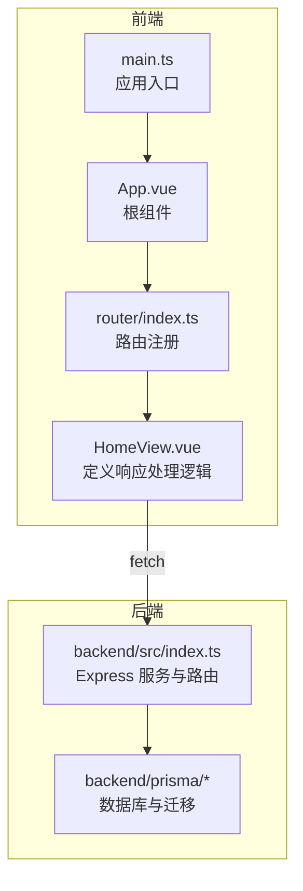
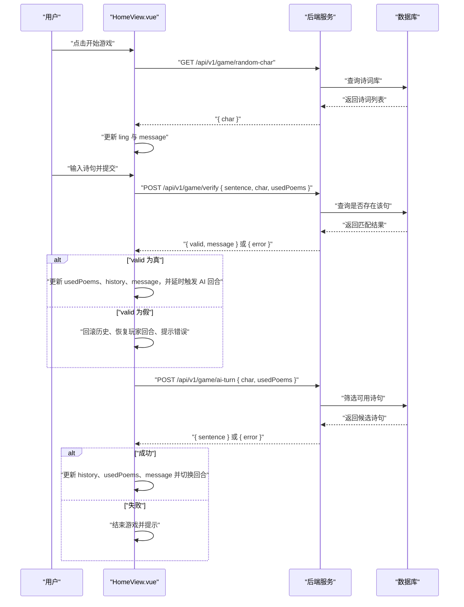
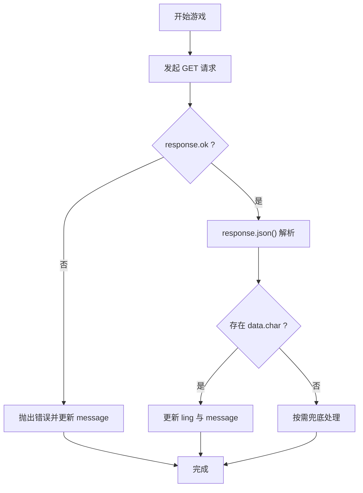
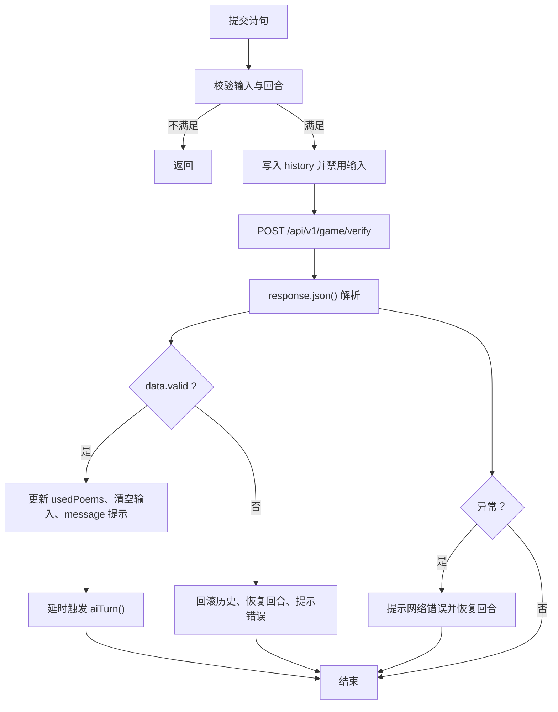
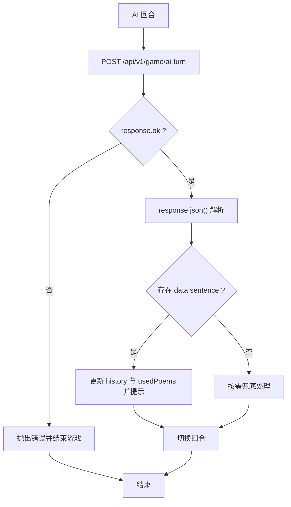
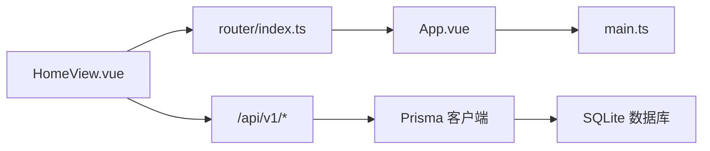

# 响应处理机制

<cite>
**本文引用的文件**
- [HomeView.vue](file://frontend/src/views/HomeView.vue)
- [index.ts](file://backend/src/index.ts)
- [seed.ts](file://backend/prisma/seed.ts)
- [migration.sql](file://backend/prisma/migrations/20251104061144_init/migration.sql)
- [index.ts](file://frontend/src/router/index.ts)
- [App.vue](file://frontend/src/App.vue)
- [main.ts](file://frontend/src/main.ts)
</cite>

## 目录
1. [引言](#引言)
2. [项目结构](#项目结构)
3. [核心组件](#核心组件)
4. [架构总览](#架构总览)
5. [详细组件分析](#详细组件分析)
6. [依赖关系分析](#依赖关系分析)
7. [性能考量](#性能考量)
8. [故障排查指南](#故障排查指南)
9. [结论](#结论)

## 引言
本文聚焦于前端 HomeView.vue 中对后端 API 的响应处理机制，系统梳理以下方法的响应解析流程：
- startGame：获取令字并更新前端状态
- submitSentence：提交诗句并根据验证结果更新历史与状态
- aiTurn：触发 AI 回合并更新历史与状态

重点说明：
- response.json() 的异步解析机制与异常捕获
- response.ok 判断与 HTTP 状态码的关系
- 成功与失败响应的数据结构差异
- 如何从响应中提取关键字段（例如 data.char、data.valid、data.sentence）并更新前端状态（ling、history、usedPoems 等）

## 项目结构
前端采用 Vue3 + TypeScript + Vite 架构；后端采用 Node.js + Express + Prisma（SQLite），路由统一前缀为 /api/v1。

图表来源
- [HomeView.vue](file://frontend/src/views/HomeView.vue#L1-L84)
- [App.vue](file://frontend/src/App.vue#L1-L19)
- [main.ts](file://frontend/src/main.ts#L1-L15)
- [index.ts](file://frontend/src/router/index.ts#L1-L24)
- [index.ts](file://backend/src/index.ts#L1-L78)
- [migration.sql](file://backend/prisma/migrations/20251104061144_init/migration.sql#L1-L8)

章节来源
- [HomeView.vue](file://frontend/src/views/HomeView.vue#L1-L84)
- [index.ts](file://backend/src/index.ts#L1-L78)
- [seed.ts](file://backend/prisma/seed.ts#L1-L53)
- [migration.sql](file://backend/prisma/migrations/20251104061144_init/migration.sql#L1-L8)
- [index.ts](file://frontend/src/router/index.ts#L1-L24)
- [App.vue](file://frontend/src/App.vue#L1-L19)
- [main.ts](file://frontend/src/main.ts#L1-L15)

## 核心组件
- HomeView.vue：负责游戏生命周期控制与 API 调用，维护游戏状态（gameStarted、ling、userInput、history、usedPoems、message、isPlayerTurn），并在响应解析后更新这些状态。
- 后端 index.ts：提供三个 API：
  - GET /api/v1/game/random-char：返回随机令字
  - POST /api/v1/game/verify：校验用户诗句是否符合规则
  - POST /api/v1/game/ai-turn：返回 AI 生成的诗句

章节来源
- [HomeView.vue](file://frontend/src/views/HomeView.vue#L1-L84)
- [index.ts](file://backend/src/index.ts#L12-L72)

## 架构总览
下图展示了从前端调用到后端响应再到前端状态更新的完整链路。

图表来源
- [HomeView.vue](file://frontend/src/views/HomeView.vue#L14-L84)
- [index.ts](file://backend/src/index.ts#L12-L72)
- [seed.ts](file://backend/prisma/seed.ts#L1-L53)
- [migration.sql](file://backend/prisma/migrations/20251104061144_init/migration.sql#L1-L8)

## 详细组件分析

### startGame 方法的响应解析
- 发起请求：向 /api/v1/game/random-char 获取令字
- 响应解析：使用 response.json() 异步解析为 JS 对象
- 错误处理：若 response.ok 为 false，抛出错误；否则读取 data.char 并更新 ling 与 message
- 关键状态更新：重置历史与已用诗句，准备进入对局

图表来源
- [HomeView.vue](file://frontend/src/views/HomeView.vue#L14-L30)
- [index.ts](file://backend/src/index.ts#L12-L21)

章节来源
- [HomeView.vue](file://frontend/src/views/HomeView.vue#L14-L30)
- [index.ts](file://backend/src/index.ts#L12-L21)

### submitSentence 方法的响应解析
- 输入校验：仅当用户输入非空且当前为玩家回合时允许提交
- 历史记录：将用户输入推入 history，并禁用输入
- 请求发送：POST /api/v1/game/verify，携带 { sentence, char, usedPoems }
- 响应解析：response.json() 返回 { valid, message } 或 { error }
- 分支逻辑：
  - valid 为真：将句子加入 usedPoems，清空输入，更新 message，并延时触发 aiTurn
  - valid 为假：回滚历史、恢复玩家回合、显示错误消息
- 异常处理：网络错误时提示“请求失败，请检查网络”，并恢复玩家回合

图表来源
- [HomeView.vue](file://frontend/src/views/HomeView.vue#L32-L62)
- [index.ts](file://backend/src/index.ts#L23-L48)

章节来源
- [HomeView.vue](file://frontend/src/views/HomeView.vue#L32-L62)
- [index.ts](file://backend/src/index.ts#L23-L48)

### aiTurn 方法的响应解析
- 请求发送：POST /api/v1/game/ai-turn，携带 { char, usedPoems }
- 响应解析：response.json() 返回 { sentence } 或 { error }
- 成功分支：将 AI 句子加入 history 与 usedPoems，更新 message 并切换回合
- 失败分支：提示错误并结束游戏（gameStarted=false）

图表来源
- [HomeView.vue](file://frontend/src/views/HomeView.vue#L64-L84)
- [index.ts](file://backend/src/index.ts#L50-L72)

章节来源
- [HomeView.vue](file://frontend/src/views/HomeView.vue#L64-L84)
- [index.ts](file://backend/src/index.ts#L50-L72)

### 响应数据结构与字段提取
- GET /api/v1/game/random-char
  - 成功响应：{ char }
  - 字段提取：data.char
  - 应用：更新 ling 与 message
- POST /api/v1/game/verify
  - 成功响应：{ valid, message }
  - 失败响应：{ error }（例如参数缺失或诗词库为空）
  - 字段提取：data.valid、data.message
  - 应用：根据 valid 更新 usedPoems、history、message，并决定是否继续 AI 回合
- POST /api/v1/game/ai-turn
  - 成功响应：{ sentence }
  - 失败响应：{ error }（例如无可用诗句）
  - 字段提取：data.sentence
  - 应用：更新 history、usedPoems、message，并切换回合

章节来源
- [index.ts](file://backend/src/index.ts#L12-L72)
- [HomeView.vue](file://frontend/src/views/HomeView.vue#L14-L84)

## 依赖关系分析
- HomeView.vue 依赖：
  - 路由：router/index.ts 将 HomeView 注册为根路径组件
  - 应用入口：main.ts 初始化 Pinia 与路由
  - 后端 API：通过 fetch 调用 /api/v1/* 接口
- 后端依赖：
  - Prisma 客户端访问 SQLite 数据库
  - 表结构：Poem(id, title, author, content)，内容来自 seed.ts 的格式化数据

图表来源
- [HomeView.vue](file://frontend/src/views/HomeView.vue#L1-L84)
- [index.ts](file://frontend/src/router/index.ts#L1-L24)
- [App.vue](file://frontend/src/App.vue#L1-L19)
- [main.ts](file://frontend/src/main.ts#L1-L15)
- [index.ts](file://backend/src/index.ts#L1-L78)
- [seed.ts](file://backend/prisma/seed.ts#L1-L53)
- [migration.sql](file://backend/prisma/migrations/20251104061144_init/migration.sql#L1-L8)

章节来源
- [HomeView.vue](file://frontend/src/views/HomeView.vue#L1-L84)
- [index.ts](file://frontend/src/router/index.ts#L1-L24)
- [App.vue](file://frontend/src/App.vue#L1-L19)
- [main.ts](file://frontend/src/main.ts#L1-L15)
- [index.ts](file://backend/src/index.ts#L1-L78)
- [seed.ts](file://backend/prisma/seed.ts#L1-L53)
- [migration.sql](file://backend/prisma/migrations/20251104061144_init/migration.sql#L1-L8)

## 性能考量
- fetch 为浏览器原生异步接口，response.json() 返回 Promise，避免阻塞主线程
- 在 submitSentence 中使用 setTimeout 触发 aiTurn，可减少连续渲染压力
- 前端状态更新集中在响应解析后进行，避免重复计算
- 后端查询使用 Prisma 的过滤与去重逻辑，降低无效请求概率

[本节为通用建议，无需列出章节来源]

## 故障排查指南
- 网络错误
  - 现象：submitSentence 与 aiTurn 的 catch 分支会设置 message 为“请求失败，请检查网络”
  - 排查：确认后端服务已启动、端口与路由正确、跨域已开启
- 400 参数缺失
  - 现象：verify 接口在缺少 sentence 或 char 时返回 { error: '缺少参数' }
  - 排查：确保前端在请求体中包含 { sentence, char, usedPoems }
- 404 诗词库为空或无可用诗句
  - 现象：random-char 在诗词库为空时返回 { error: '诗词库为空' }；ai-turn 在无可用诗句时返回 { error: 'AI也想不出来了' }
  - 排查：执行 seed 脚本初始化数据；确认 usedPoems 不会完全占满可用诗句
- 响应 ok 与状态码
  - response.ok 为 true 时，表示 HTTP 状态码在 200-299 区间；后端在错误场景可能返回 4xx，此时 response.ok 为 false，前端会抛错并走 catch 分支
  - 建议：在前端对 response.ok 与 status 进行双重判断，增强健壮性

章节来源
- [HomeView.vue](file://frontend/src/views/HomeView.vue#L14-L84)
- [index.ts](file://backend/src/index.ts#L12-L72)

## 结论
HomeView.vue 对后端 API 的响应处理遵循“请求 -> 解析 -> 分支 -> 更新状态”的清晰流程。通过 response.ok 与 response.json() 的配合，前端能够可靠地区分成功与失败响应，并据此更新 ling、history、usedPoems、message 与 isPlayerTurn 等状态。后端 API 的数据结构简单明确，便于前端稳定解析。建议在生产环境中进一步完善状态码与错误信息的统一化处理，提升用户体验与可维护性。