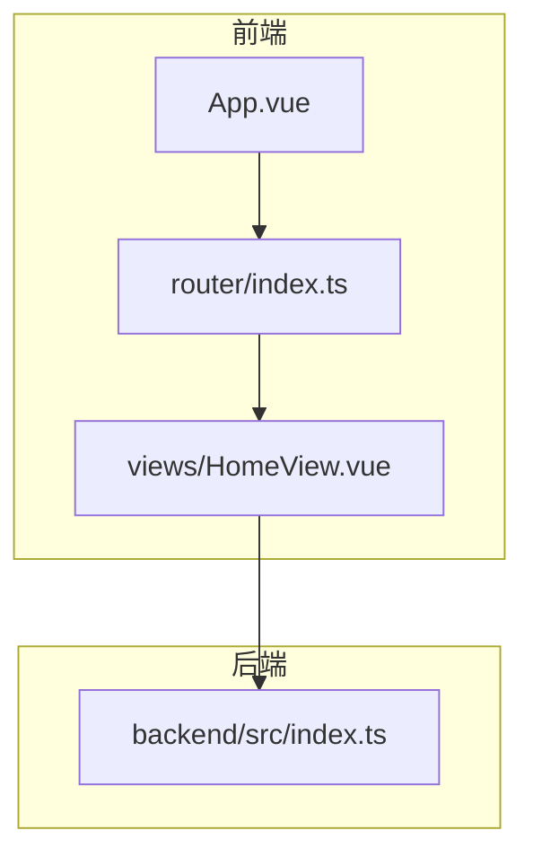
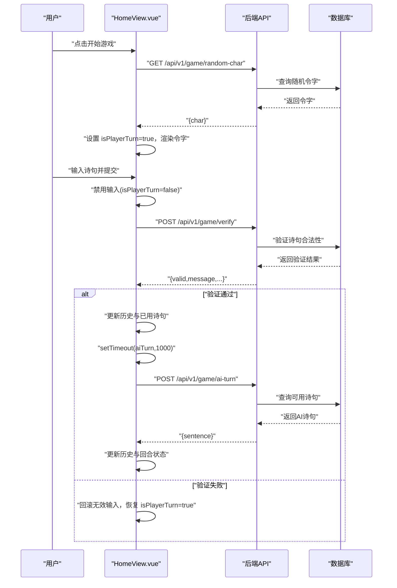
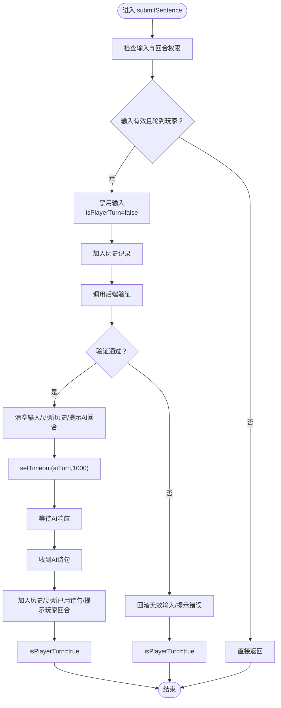
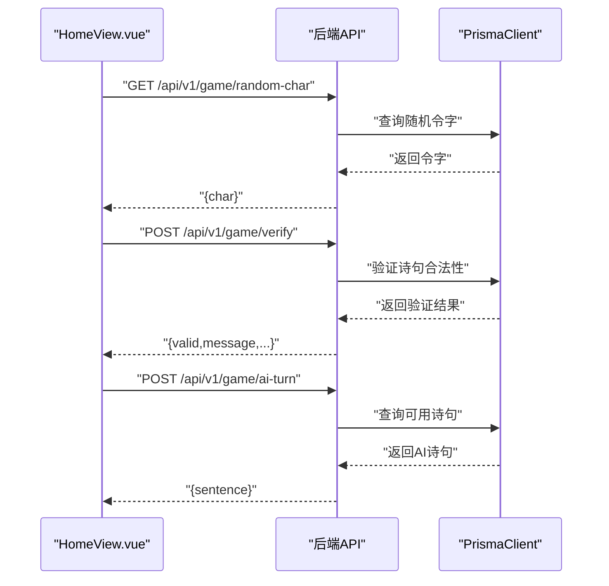
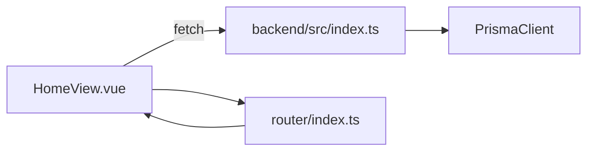
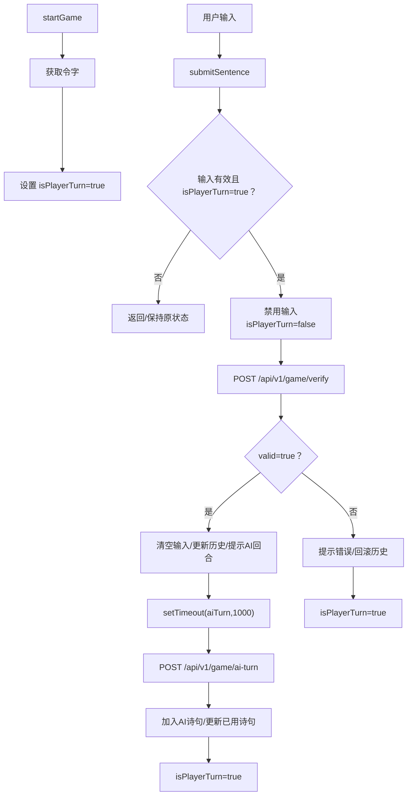

# 异步流程控制

<cite>
**本文引用的文件**
- [frontend/src/views/HomeView.vue](file://frontend/src/views/HomeView.vue)
- [frontend/src/router/index.ts](file://frontend/src/router/index.ts)
- [frontend/src/App.vue](file://frontend/src/App.vue)
- [backend/src/index.ts](file://backend/src/index.ts)
</cite>

## 目录
1. [引言](#引言)
2. [项目结构](#项目结构)
3. [核心组件](#核心组件)
4. [架构总览](#架构总览)
5. [详细组件分析](#详细组件分析)
6. [依赖关系分析](#依赖关系分析)
7. [性能考量](#性能考量)
8. [故障排查指南](#故障排查指南)
9. [结论](#结论)
10. [附录：异步状态流转流程图](#附录异步状态流转流程图)

## 引言
本文件聚焦于 HomeView.vue 中基于 Promise 的异步流程控制设计，系统性解析“回合制交互”的时序管理、setTimeout 在 aiTurn 调用中的延迟效果及用户体验优化、isPlayerTurn 如何协调用户与 AI 的交替操作以避免并发请求冲突，并结合 submitSentence 中“先禁用输入再延迟调用 AI”的策略，说明前端如何模拟“等待-响应”的真实对战节奏。同时提供可直接映射到源码的流程图，帮助读者快速理解关键异步状态流转。

## 项目结构
- 前端采用 Vue 3 单文件组件与 Composition API，路由通过 vue-router 管理，App.vue 作为根容器承载 RouterView。
- HomeView.vue 实现飞花令游戏的核心交互逻辑，包括开始游戏、提交诗句、AI 回合、历史记录与状态提示等。
- 后端使用 Express 提供 REST API，包含随机令字、验证诗句、AI 回合、搜索诗句与诗人作品等接口。

图表来源
- [frontend/src/App.vue](file://frontend/src/App.vue#L1-L18)
- [frontend/src/router/index.ts](file://frontend/src/router/index.ts#L1-L23)
- [frontend/src/views/HomeView.vue](file://frontend/src/views/HomeView.vue#L1-L232)
- [backend/src/index.ts](file://backend/src/index.ts#L1-L186)

章节来源
- [frontend/src/App.vue](file://frontend/src/App.vue#L1-L18)
- [frontend/src/router/index.ts](file://frontend/src/router/index.ts#L1-L23)

## 核心组件
- HomeView.vue
  - 状态管理：gameStarted、ling（令字）、userInput、history（历史）、usedPoems（已用诗句）、message（提示）、isPlayerTurn（当前回合）。
  - 关键方法：
    - startGame：拉取随机令字，初始化游戏状态。
    - submitSentence：校验输入、禁用输入、调用后端验证、根据结果决定是否延迟触发 AI 回合。
    - aiTurn：向后端请求 AI 诗句，更新历史与回合状态。
  - 视图绑定：输入框与按钮受 isPlayerTurn 控制；回车触发提交；消息区域显示状态提示。

章节来源
- [frontend/src/views/HomeView.vue](file://frontend/src/views/HomeView.vue#L1-L232)

## 架构总览
前后端通过 HTTP API 通信，HomeView.vue 作为前端控制器，负责：
- 初始化游戏与令字获取；
- 用户回合的输入校验与验证；
- 成功后的短暂延迟以模拟“思考”；
- AI 回合的请求与状态切换；
- 错误处理与游戏结束判定。

图表来源
- [frontend/src/views/HomeView.vue](file://frontend/src/views/HomeView.vue#L14-L84)
- [backend/src/index.ts](file://backend/src/index.ts#L13-L77)
- [backend/src/index.ts](file://backend/src/index.ts#L80-L127)

## 详细组件分析

### 组件：HomeView.vue 的异步流程与回合制时序
- 入口与初始化
  - startGame：发起一次随机令字请求，成功后将令字写入状态并允许玩家出招。
- 用户回合
  - submitSentence：
    - 输入校验与回合检查：若输入为空或非玩家回合则直接返回。
    - 禁用输入：将 isPlayerTurn 设为 false，阻止重复提交与并发请求。
    - 发起验证请求：携带当前令字与已用诗句列表，等待后端返回验证结果。
    - 结果分支：
      - 验证通过：清空输入、加入历史、提示“轮到AI了”，随后通过 setTimeout 延迟 1000ms 调用 aiTurn。
      - 验证失败：显示错误消息、回滚历史、恢复 isPlayerTurn=true。
- AI 回合
  - aiTurn：
    - 请求 AI 诗句，成功后加入历史与已用诗句，提示“该你了”，并将 isPlayerTurn 设为 true。
    - 失败时显示错误消息并结束游戏（gameStarted=false）。

图表来源
- [frontend/src/views/HomeView.vue](file://frontend/src/views/HomeView.vue#L31-L84)

章节来源
- [frontend/src/views/HomeView.vue](file://frontend/src/views/HomeView.vue#L14-L84)

### setTimeout 在 aiTurn 调用中的延迟效果与用户体验优化
- 延迟机制
  - submitSentence 在验证通过后，使用 setTimeout 将 aiTurn 延迟 1000ms 执行。
- 用户体验优化
  - 明确的“思考时间”反馈：在用户看到“轮到AI了”的提示后，等待约 1 秒，再展示 AI 的响应，营造真实对战节奏。
  - 防止用户过早输入：在 setTimeout 期间，输入框仍处于禁用状态，确保不会出现重复提交。
- 时序保障
  - 通过禁用输入与延迟调用，保证同一回合内仅一次 AI 请求被触发，避免并发请求导致的状态错乱。

章节来源
- [frontend/src/views/HomeView.vue](file://frontend/src/views/HomeView.vue#L48-L56)
- [frontend/src/views/HomeView.vue](file://frontend/src/views/HomeView.vue#L64-L84)

### isPlayerTurn 布尔值的回合协调与并发控制
- 协调机制
  - 玩家回合：isPlayerTurn=true，输入框启用，按钮可用。
  - AI 回合：isPlayerTurn=false，输入框禁用，按钮禁用。
- 并发控制
  - submitSentence 在进入验证前即禁用输入，避免用户在验证过程中重复提交。
  - aiTurn 完成后才恢复 isPlayerTurn=true，确保回合顺序严格交替。
- 视图联动
  - 模板层通过 :disabled 绑定 isPlayerTurn，实现 UI 与逻辑的一致性。

章节来源
- [frontend/src/views/HomeView.vue](file://frontend/src/views/HomeView.vue#L11-L13)
- [frontend/src/views/HomeView.vue](file://frontend/src/views/HomeView.vue#L31-L40)
- [frontend/src/views/HomeView.vue](file://frontend/src/views/HomeView.vue#L106-L114)

### 前端模拟“等待-响应”节奏：先禁用输入再延迟调用 AI
- 流程拆解
  - 禁用输入：submitSentence 一进入就将 isPlayerTurn=false，阻止用户继续输入。
  - 展示提示：显示“轮到AI了…”等状态消息，告知用户等待。
  - 延迟调用：setTimeout 在 1000ms 后执行 aiTurn，模拟 AI 思考。
  - 接收响应：收到 AI 诗句后更新历史与回合状态，恢复输入。
- 对比分析
  - 若无禁用与延迟，可能出现用户在 AI 响应前再次提交，造成并发与状态混乱。
  - 通过“禁用-等待-响应-启用”的闭环，前端稳定地模拟了回合制节奏。

章节来源
- [frontend/src/views/HomeView.vue](file://frontend/src/views/HomeView.vue#L31-L56)
- [frontend/src/views/HomeView.vue](file://frontend/src/views/HomeView.vue#L64-L84)

### 后端 API 对异步流程的支撑
- 随机令字：GET /api/v1/game/random-char
- 验证诗句：POST /api/v1/game/verify
- AI 回合：POST /api/v1/game/ai-turn
- 搜索诗句/诗人作品：额外接口用于扩展功能

图表来源
- [backend/src/index.ts](file://backend/src/index.ts#L13-L77)
- [backend/src/index.ts](file://backend/src/index.ts#L80-L127)

章节来源
- [backend/src/index.ts](file://backend/src/index.ts#L13-L77)
- [backend/src/index.ts](file://backend/src/index.ts#L80-L127)

## 依赖关系分析
- 组件耦合
  - HomeView.vue 与后端 API 存在运行时耦合，通过 fetch 发起 HTTP 请求。
  - 模板层与逻辑层通过响应式状态 isPlayerTurn 强耦合，确保 UI 与业务逻辑一致。
- 外部依赖
  - vue-router：路由到 HomeView.vue。
  - Express + Prisma：提供 REST API 与数据库访问。
- 潜在风险
  - 缺少全局并发锁：当前通过 isPlayerTurn 与禁用输入实现简单并发控制，未见全局锁或队列机制。
  - 错误处理：部分分支会重置 isPlayerTurn 或结束游戏，需关注异常路径的用户体验一致性。

图表来源
- [frontend/src/views/HomeView.vue](file://frontend/src/views/HomeView.vue#L1-L232)
- [frontend/src/router/index.ts](file://frontend/src/router/index.ts#L1-L23)
- [backend/src/index.ts](file://backend/src/index.ts#L1-L186)

章节来源
- [frontend/src/router/index.ts](file://frontend/src/router/index.ts#L1-L23)
- [frontend/src/views/HomeView.vue](file://frontend/src/views/HomeView.vue#L1-L232)
- [backend/src/index.ts](file://backend/src/index.ts#L1-L186)

## 性能考量
- 前端
  - 使用 ref 管理状态，避免不必要的重渲染；模板中通过 :disabled 控制输入，减少无效交互。
  - setTimeout 仅用于 UI 节奏控制，不阻塞主线程。
- 后端
  - 查询限制：随机令字与 AI 回合均限制返回数量，降低数据库压力。
  - 精确匹配：验证与查询使用 contains 与大小写不敏感模式，兼顾准确性与性能。
- 建议
  - 若并发量增大，可在前端引入请求去抖/节流或统一的请求队列，避免重复请求。
  - 对网络异常进行更细粒度的重试与提示，提升稳定性。

[本节为通用性能讨论，不直接分析具体文件，故无章节来源]

## 故障排查指南
- 症状：输入框无法输入
  - 可能原因：当前处于 AI 回合（isPlayerTurn=false）。
  - 处理：等待 AI 响应后，isPlayerTurn 将自动恢复。
- 症状：点击“出招”无反应
  - 可能原因：输入为空或非玩家回合。
  - 处理：确认输入内容与回合状态。
- 症状：验证失败但历史被回滚
  - 可能原因：诗句不含令字或已被使用。
  - 处理：根据提示修正输入。
- 症状：AI 一直不响应
  - 可能原因：后端查询不到可用诗句或网络异常。
  - 处理：检查后端日志与网络连通性；必要时重启服务。

章节来源
- [frontend/src/views/HomeView.vue](file://frontend/src/views/HomeView.vue#L31-L84)
- [backend/src/index.ts](file://backend/src/index.ts#L80-L127)

## 结论
HomeView.vue 通过 Promise 驱动的异步流程与明确的回合状态控制，实现了稳定的回合制交互。isPlayerTurn 与输入禁用机制有效防止并发请求冲突；setTimeout 在 aiTurn 调用中的延迟显著提升了“等待-响应”的真实感与节奏感。后端 API 提供了简洁可靠的验证与 AI 生成能力，整体架构清晰、职责分明，易于扩展与维护。

[本节为总结性内容，不直接分析具体文件，故无章节来源]

## 附录：异步状态流转流程图
以下流程图直接映射到 HomeView.vue 的关键函数与状态变化，便于快速定位实现位置。

图表来源
- [frontend/src/views/HomeView.vue](file://frontend/src/views/HomeView.vue#L14-L84)
- [backend/src/index.ts](file://backend/src/index.ts#L33-L77)
- [backend/src/index.ts](file://backend/src/index.ts#L80-L127)