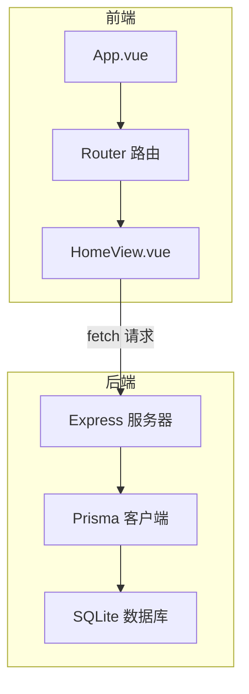
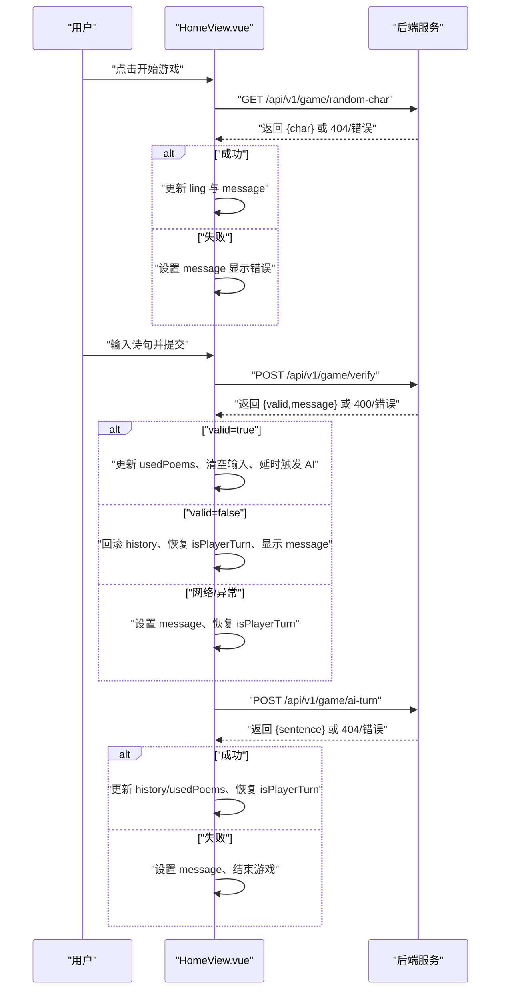
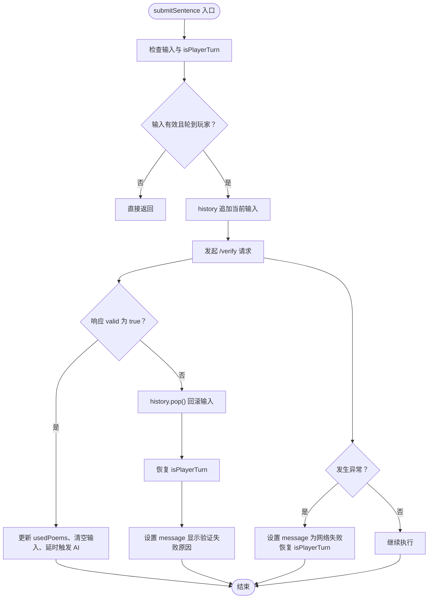
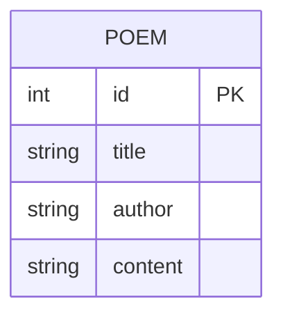
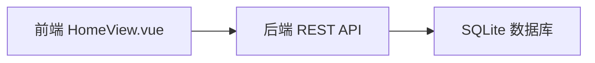

# 错误处理与边界控制

<cite>
**本文引用的文件**
- [HomeView.vue](file://frontend/src/views/HomeView.vue)
- [index.ts](file://backend/src/index.ts)
- [schema.prisma](file://backend/prisma/schema.prisma)
- [seed.ts](file://backend/prisma/seed.ts)
- [index.ts](file://frontend/src/router/index.ts)
- [App.vue](file://frontend/src/App.vue)
- [main.ts](file://frontend/src/main.ts)
</cite>

## 目录
1. [引言](#引言)
2. [项目结构](#项目结构)
3. [核心组件](#核心组件)
4. [架构总览](#架构总览)
5. [详细组件分析](#详细组件分析)
6. [依赖分析](#依赖分析)
7. [性能考虑](#性能考虑)
8. [故障排查指南](#故障排查指南)
9. [结论](#结论)
10. [附录](#附录)

## 引言
本文件聚焦于前端视图组件 HomeView.vue 中的错误处理策略与边界控制，系统性解析以下主题：
- 异步请求中 try-catch 的应用模式与职责划分
- 不同错误场景的捕获与用户反馈：网络异常、HTTP 错误状态（如 404、500）、后端业务验证失败
- 错误消息通过 message.value 的展示机制
- submitSentence 失败时对 history 的回滚逻辑
- isPlayerTurn 状态在防止重复提交中的作用
- 增强错误处理的建议：超时机制、重试逻辑、更细粒度的状态提示

## 项目结构
前端采用 Vue 3 单文件组件与路由集成，HomeView.vue 作为游戏主界面，负责令字获取、诗句提交、AI 回合与历史记录展示；后端基于 Express 提供 REST 接口，使用 Prisma 访问 SQLite 数据库。

图表来源
- [App.vue](file://frontend/src/App.vue#L1-L19)
- [index.ts](file://frontend/src/router/index.ts#L1-L24)
- [HomeView.vue](file://frontend/src/views/HomeView.vue#L1-L120)
- [index.ts](file://backend/src/index.ts#L1-L78)
- [schema.prisma](file://backend/prisma/schema.prisma#L1-L19)

章节来源
- [App.vue](file://frontend/src/App.vue#L1-L19)
- [index.ts](file://frontend/src/router/index.ts#L1-L24)
- [HomeView.vue](file://frontend/src/views/HomeView.vue#L1-L120)
- [index.ts](file://backend/src/index.ts#L1-L78)
- [schema.prisma](file://backend/prisma/schema.prisma#L1-L19)

## 核心组件
- HomeView.vue
  - 状态管理：gameStarted、ling、userInput、history、usedPoems、message、isPlayerTurn
  - 关键方法：startGame、submitSentence、aiTurn
  - 视图绑定：message 展示状态与错误；history 展示对话；输入框与按钮受 isPlayerTurn 控制

章节来源
- [HomeView.vue](file://frontend/src/views/HomeView.vue#L1-L120)

## 架构总览
HomeView.vue 通过 fetch 发起三个 API 请求：
- 获取令字：GET /api/v1/game/random-char
- 提交诗句验证：POST /api/v1/game/verify
- AI 回合：POST /api/v1/game/ai-turn

后端根据业务规则返回 JSON 结果，前端在各处使用 try-catch 与 response.ok 判断进行错误捕获与用户反馈。

图表来源
- [HomeView.vue](file://frontend/src/views/HomeView.vue#L1-L120)
- [index.ts](file://backend/src/index.ts#L1-L78)

## 详细组件分析

### 错误处理策略概览
- 统一通过 try-catch 捕获 fetch 抛出的异常（网络错误、解析失败）
- 使用 response.ok 判断 HTTP 状态是否正常，非正常时抛出错误
- 将错误信息统一写入 message.value，驱动视图层展示
- 在 submitSentence 失败时回滚 history 并恢复 isPlayerTurn，避免状态错乱
- 在 aiTurn 失败时将 gameStarted 置为 false，结束游戏流程

章节来源
- [HomeView.vue](file://frontend/src/views/HomeView.vue#L1-L120)

### 异步请求中的 try-catch 应用模式
- startGame：获取令字时，若 response.ok 为 false 则抛出错误；catch 中统一设置 message
- submitSentence：提交诗句时，先校验 isPlayerTurn 与输入有效性；catch 中统一设置 message 并恢复 isPlayerTurn
- aiTurn：AI 回合时，若 response.ok 为 false 则抛出错误；catch 中设置 message 并结束游戏

章节来源
- [HomeView.vue](file://frontend/src/views/HomeView.vue#L1-L120)

### 不同错误场景与反馈机制

#### 场景一：网络异常
- 表现：fetch 抛出异常，进入 catch 分支
- 处理：设置 message 为“请求失败，请检查网络”，并将 isPlayerTurn 置回 true
- 影响：阻止重复提交，恢复交互状态

章节来源
- [HomeView.vue](file://frontend/src/views/HomeView.vue#L32-L62)

#### 场景二：HTTP 错误状态（如 404、500）
- startGame：当后端返回 404（如诗词库为空）时，response.ok 为 false，抛出错误并设置 message
- aiTurn：当后端返回 404（AI 无可用诗句）时，response.ok 为 false，抛出错误并设置 message，同时结束游戏

章节来源
- [HomeView.vue](file://frontend/src/views/HomeView.vue#L14-L30)
- [HomeView.vue](file://frontend/src/views/HomeView.vue#L64-L84)
- [index.ts](file://backend/src/index.ts#L12-L21)
- [index.ts](file://backend/src/index.ts#L50-L72)

#### 场景三：后端业务验证失败
- submitSentence：后端返回 { valid: false, message }，前端根据 message 更新 message.value，并回滚 history、恢复 isPlayerTurn
- 典型错误包括：缺少参数、未包含令字、已使用过、未找到对应诗句

章节来源
- [HomeView.vue](file://frontend/src/views/HomeView.vue#L32-L62)
- [index.ts](file://backend/src/index.ts#L23-L48)

### 错误消息展示机制
- message.value 作为单一错误/状态信息源，贯穿所有关键操作
- 视图层通过模板绑定直接展示 message，形成一致的用户反馈

章节来源
- [HomeView.vue](file://frontend/src/views/HomeView.vue#L87-L118)

### submitSentence 失败时的历史回滚
- 当后端验证失败或网络异常时，前端会移除本次无效输入（history.pop()），确保历史记录与实际状态一致
- 同时恢复 isPlayerTurn，允许用户重新输入

图表来源
- [HomeView.vue](file://frontend/src/views/HomeView.vue#L32-L62)

章节来源
- [HomeView.vue](file://frontend/src/views/HomeView.vue#L32-L62)

### isPlayerTurn 状态控制与重复提交防护
- 提交前置为 false，防止用户在提交过程中重复点击
- 成功或失败分支均恢复为 true，保证后续可继续交互
- 输入框与按钮 disabled 绑定到 isPlayerTurn，直观反映当前阶段

章节来源
- [HomeView.vue](file://frontend/src/views/HomeView.vue#L32-L62)
- [HomeView.vue](file://frontend/src/views/HomeView.vue#L96-L118)

### 数据模型与后端约束
- Poem 模型包含 id、title、author、content 字段
- 后端在多个接口中对输入进行校验与过滤，如参数完整性、令字包含、重复使用、可用诗句筛选

图表来源
- [schema.prisma](file://backend/prisma/schema.prisma#L1-L19)

章节来源
- [schema.prisma](file://backend/prisma/schema.prisma#L1-L19)
- [seed.ts](file://backend/prisma/seed.ts#L1-L53)
- [index.ts](file://backend/src/index.ts#L1-L78)

## 依赖分析
- 前端依赖：Vue 3、vue-router、pinia
- 后端依赖：express、@prisma/client、cors、sqlite3
- 数据库：SQLite（Prisma 管理）

图表来源
- [HomeView.vue](file://frontend/src/views/HomeView.vue#L1-L120)
- [index.ts](file://backend/src/index.ts#L1-L78)
- [schema.prisma](file://backend/prisma/schema.prisma#L1-L19)

章节来源
- [HomeView.vue](file://frontend/src/views/HomeView.vue#L1-L120)
- [index.ts](file://backend/src/index.ts#L1-L78)
- [schema.prisma](file://backend/prisma/schema.prisma#L1-L19)

## 性能考虑
- fetch 默认无超时，建议在生产环境增加超时控制，避免长时间挂起阻塞 UI
- 对频繁调用的接口（如 /verify）可考虑节流/防抖，减少无效请求
- 前端渲染历史列表时注意大数据量场景的虚拟滚动优化（当前模板未实现）
- 后端查询可结合索引与分页策略，避免全表扫描

## 故障排查指南
- 网络问题
  - 症状：message 显示“请求失败，请检查网络”
  - 排查：确认后端服务已启动、端口开放、CORS 已启用
- 404 场景
  - startGame：诗词库为空导致随机令字失败
  - aiTurn：无可用诗句导致 AI 回合失败
  - 排查：检查数据库是否已初始化种子数据
- 参数缺失
  - submitSentence：后端返回缺少参数错误
  - 排查：确认前端传参完整（sentence、char、usedPoems）
- 业务验证失败
  - 诗句未包含令字、已使用过、未找到对应诗句
  - 排查：核对 usedPoems 是否正确同步、令字是否正确获取

章节来源
- [HomeView.vue](file://frontend/src/views/HomeView.vue#L1-L120)
- [index.ts](file://backend/src/index.ts#L1-L78)
- [seed.ts](file://backend/prisma/seed.ts#L1-L53)

## 结论
HomeView.vue 的错误处理策略以 try-catch 为核心，结合 response.ok 判断与 message.value 统一反馈，实现了对网络异常、HTTP 错误与业务验证失败的覆盖。通过 isPlayerTurn 防止重复提交，通过 history 回滚保持状态一致性。为进一步提升健壮性，建议引入超时与重试机制、细化错误分类与提示、完善边界条件处理。

## 附录

### 增强错误处理的建议
- 超时机制
  - 在 fetch 中加入 AbortController，设定超时时间，超时后中断请求并提示用户
- 重试逻辑
  - 对幂等请求（如获取令字）在特定错误码下自动重试，限制最大次数与退避间隔
- 更细粒度的错误分类
  - 区分网络错误、HTTP 状态错误、业务错误，分别设置 message 与 UI 反馈
- 用户引导
  - 在 message 中提供简要操作指引（如“请稍后再试”、“检查输入内容”）
- 日志与监控
  - 在开发环境输出错误堆栈，在生产环境上报错误摘要，便于定位问题

### API 行为参考
- GET /api/v1/game/random-char
  - 返回：{ char }
  - 可能错误：404（诗词库为空）
- POST /api/v1/game/verify
  - 请求体：{ sentence, char, usedPoems }
  - 返回：{ valid, message }
  - 可能错误：400（缺少参数）
- POST /api/v1/game/ai-turn
  - 请求体：{ char, usedPoems }
  - 返回：{ sentence }
  - 可能错误：404（无可用诗句）

章节来源
- [index.ts](file://backend/src/index.ts#L1-L78)