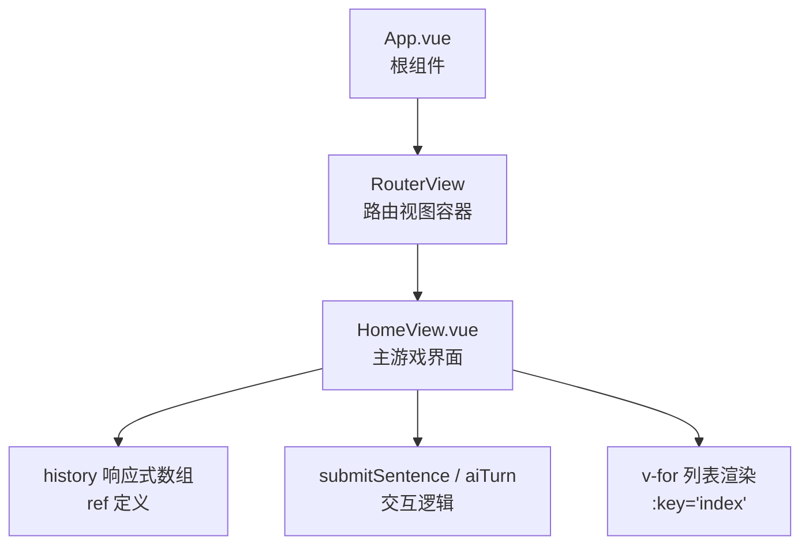
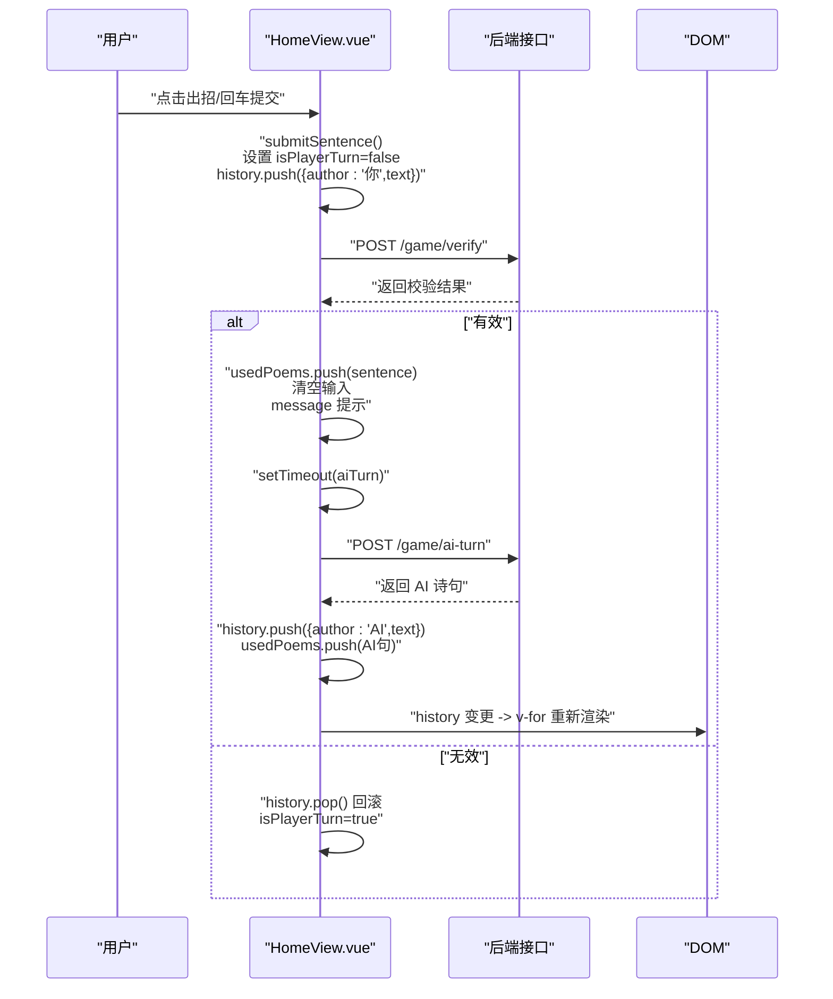
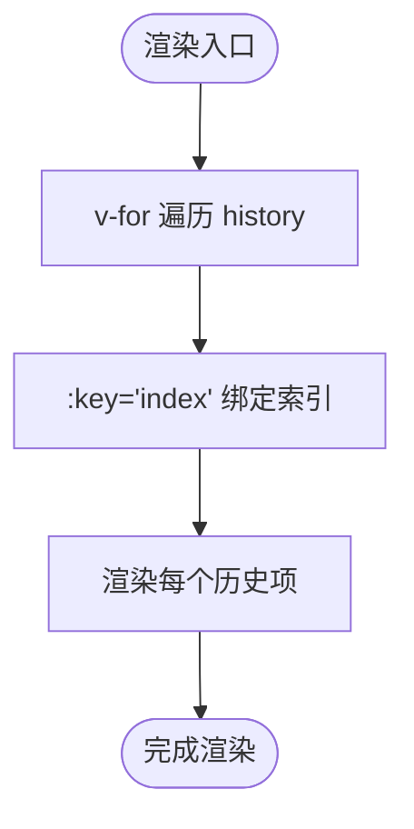
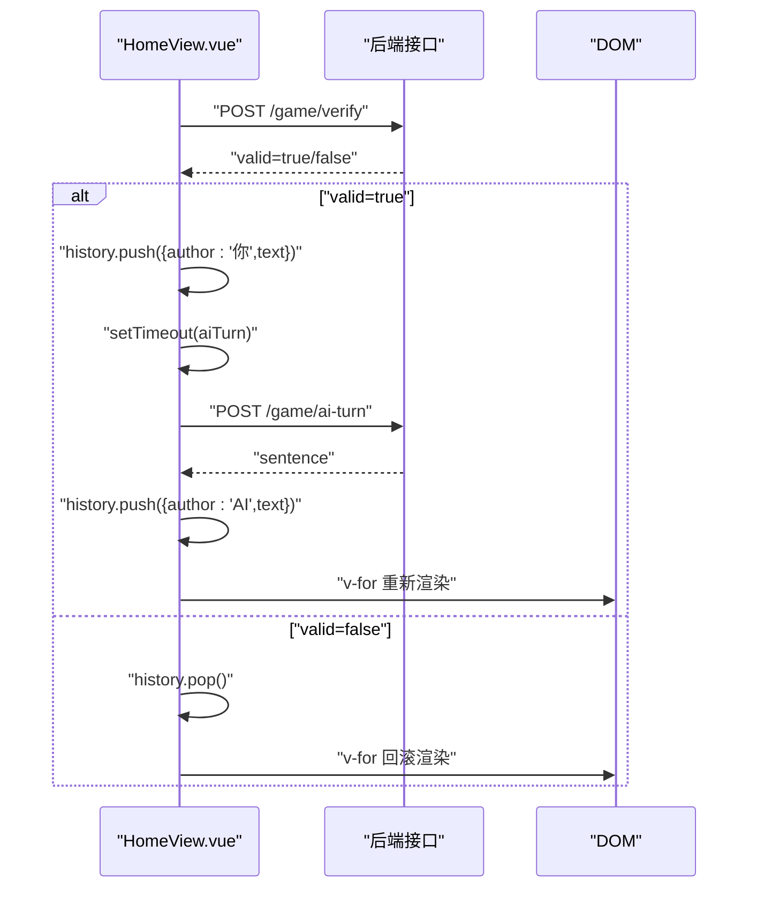
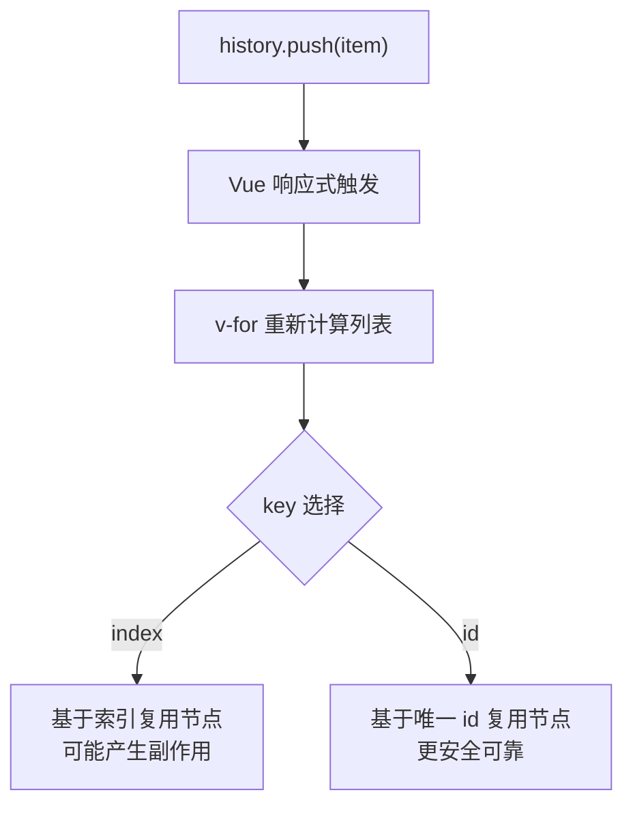
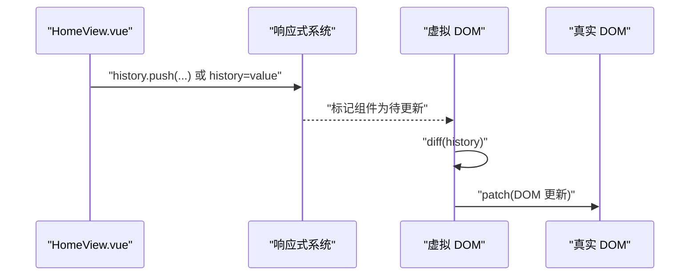
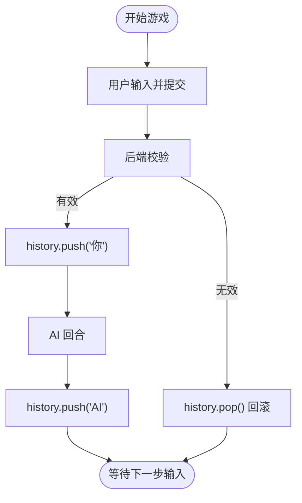
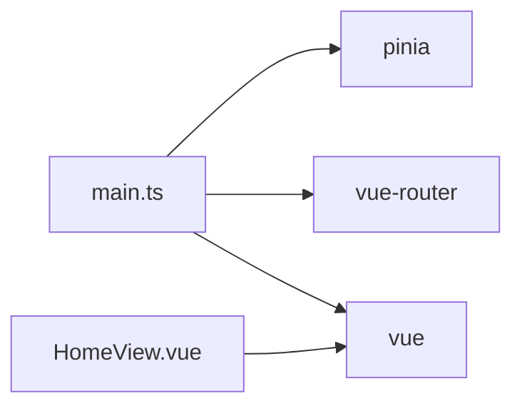

# 响应式列表渲染与动态更新

<cite>
**本文引用的文件**
- [frontend/src/views/HomeView.vue](file://frontend/src/views/HomeView.vue)
- [frontend/src/main.ts](file://frontend/src/main.ts)
- [frontend/src/router/index.ts](file://frontend/src/router/index.ts)
- [frontend/src/App.vue](file://frontend/src/App.vue)
- [frontend/package.json](file://frontend/package.json)
- [frontend/package-lock.json](file://frontend/package-lock.json)
</cite>

## 目录
1. [简介](#简介)
2. [项目结构](#项目结构)
3. [核心组件](#核心组件)
4. [架构总览](#架构总览)
5. [详细组件分析](#详细组件分析)
6. [依赖分析](#依赖分析)
7. [性能考虑](#性能考虑)
8. [故障排查指南](#故障排查指南)
9. [结论](#结论)

## 简介
本文件围绕 Vue 应用中 v-for 指令对响应式数组 history 的渲染与动态更新进行深入解析，重点说明：
- 列表渲染中 :key="index" 的作用与潜在风险（索引复用问题）
- history 数组在 submitSentence 和 aiTurn 中通过 push 操作新增对话项时，Vue 如何检测变化并更新 DOM
- 结合实际交互流程，展示用户与 AI 的对话如何被实时追加到历史记录中

## 项目结构
该前端项目采用 Vue 3 + Vite 架构，使用 Pinia 进行状态管理、Vue Router 进行页面路由，HomeView 作为主游戏界面承载对话历史渲染与交互逻辑。

图表来源
- [frontend/src/App.vue](file://frontend/src/App.vue#L1-L19)
- [frontend/src/router/index.ts](file://frontend/src/router/index.ts#L1-L24)
- [frontend/src/views/HomeView.vue](file://frontend/src/views/HomeView.vue#L1-L120)

章节来源
- [frontend/src/App.vue](file://frontend/src/App.vue#L1-L19)
- [frontend/src/router/index.ts](file://frontend/src/router/index.ts#L1-L24)
- [frontend/src/views/HomeView.vue](file://frontend/src/views/HomeView.vue#L1-L120)

## 核心组件
- HomeView.vue：定义并维护游戏状态（是否开始、令字、用户输入、历史记录、已用诗句、消息提示、回合状态），实现开始游戏、提交诗句、AI 回合等交互逻辑，并负责将对话项渲染为列表。
- main.ts：应用入口，注册 Pinia 与路由，挂载根组件。
- App.vue：提供应用容器与基础样式。
- router/index.ts：定义路由，将根路径映射到 HomeView。

章节来源
- [frontend/src/views/HomeView.vue](file://frontend/src/views/HomeView.vue#L1-L120)
- [frontend/src/main.ts](file://frontend/src/main.ts#L1-L14)
- [frontend/src/App.vue](file://frontend/src/App.vue#L1-L19)
- [frontend/src/router/index.ts](file://frontend/src/router/index.ts#L1-L24)

## 架构总览
下图展示了从用户交互到 DOM 更新的端到端流程，包括数据变更、响应式触发与渲染更新。

图表来源
- [frontend/src/views/HomeView.vue](file://frontend/src/views/HomeView.vue#L32-L84)

章节来源
- [frontend/src/views/HomeView.vue](file://frontend/src/views/HomeView.vue#L32-L84)

## 详细组件分析

### 历史记录数组与列表渲染
- 数据结构：history 是一个 ref 包裹的数组，元素为包含 author 与 text 的对象；用于存储“你”与“AI”的对话项。
- 列表渲染：模板中使用 v-for 遍历 history，并以 :key="index" 绑定索引作为键值。
- 样式区分：根据 author 动态绑定类名，分别渲染用户与 AI 的历史项。

图表来源
- [frontend/src/views/HomeView.vue](file://frontend/src/views/HomeView.vue#L96-L103)

章节来源
- [frontend/src/views/HomeView.vue](file://frontend/src/views/HomeView.vue#L96-L103)

### 提交诗句与 AI 回合的交互流程
- submitSentence：校验输入与回合状态，向后端验证诗句有效性；若有效则推进到 AI 回合；若无效则回滚历史并恢复玩家回合。
- aiTurn：向后端请求 AI 的诗句，成功后将 AI 诗句加入历史并切换回合。

图表来源
- [frontend/src/views/HomeView.vue](file://frontend/src/views/HomeView.vue#L32-L84)

章节来源
- [frontend/src/views/HomeView.vue](file://frontend/src/views/HomeView.vue#L32-L84)

### :key='index' 的作用与潜在风险
- 作用：为每个列表项提供稳定且唯一的标识，帮助 Vue 在 diff 时识别节点的插入、移动与删除。
- 潜在风险（索引复用问题）：
  - 当列表项顺序发生变化或存在重复内容时，使用索引作为 key 可能导致 Vue 将“旧位置的节点”复用到“新位置”，从而引发错误的状态绑定或动画异常。
  - 在本项目中，history.push 新增项位于末尾，且每次新增都是唯一的新条目，因此 :key="index" 在当前场景下可工作；但若后续改为中间插入、删除或存在重复文本，建议改用唯一 id 作为 key。

图表来源
- [frontend/src/views/HomeView.vue](file://frontend/src/views/HomeView.vue#L96-L103)

章节来源
- [frontend/src/views/HomeView.vue](file://frontend/src/views/HomeView.vue#L96-L103)

### Vue 如何检测变化并更新 DOM
- 响应式原理：history 由 ref 定义，属于浅层响应式。对其直接赋值或调用数组方法（如 push）会触发响应式更新。
- 触发链路：
  - submitSentence/aiTurn 调用 push 后，history 发生变更
  - Vue 基于响应式系统检测到数组变化，触发组件重新渲染
  - v-for 重新遍历 history 并根据 :key 决定节点复用策略，最终更新 DOM

图表来源
- [frontend/src/views/HomeView.vue](file://frontend/src/views/HomeView.vue#L32-L84)

章节来源
- [frontend/src/views/HomeView.vue](file://frontend/src/views/HomeView.vue#L32-L84)

### 实时追加对话的完整流程
- 用户输入诗句并提交：history 追加一条“你”的记录，随后进入 AI 回合。
- AI 回合：后端返回 AI 诗句，history 追加一条“AI”的记录，UI 即时显示。
- 错误回滚：若诗句无效，history.pop() 回滚上一条记录，恢复玩家回合。

图表来源
- [frontend/src/views/HomeView.vue](file://frontend/src/views/HomeView.vue#L32-L84)

章节来源
- [frontend/src/views/HomeView.vue](file://frontend/src/views/HomeView.vue#L32-L84)

## 依赖分析
- 运行时依赖
  - vue：提供响应式系统与模板编译能力
  - pinia：状态管理（本项目未在 HomeView 中直接使用，但应用入口已注册）
  - vue-router：路由管理
- 开发时依赖
  - vite、@vitejs/plugin-vue、typescript 等构建与类型支持工具

图表来源
- [frontend/src/main.ts](file://frontend/src/main.ts#L1-L14)
- [frontend/package.json](file://frontend/package.json#L19-L49)

章节来源
- [frontend/src/main.ts](file://frontend/src/main.ts#L1-L14)
- [frontend/package.json](file://frontend/package.json#L19-L49)
- [frontend/package-lock.json](file://frontend/package-lock.json#L2646-L2715)

## 性能考虑
- 列表渲染优化
  - 使用稳定的 key 可减少不必要的节点复用与重排。当前使用 :key="index" 在末尾追加场景下表现尚可，但建议未来迁移到基于唯一 id 的 key，以避免索引复用带来的潜在问题。
- 数据变更粒度
  - history.push 为就地修改，Vue 能高效检测到变化；若后续改为频繁中间插入/删除，可考虑使用更细粒度的数据结构或分页策略，降低 diff 成本。
- 渲染范围控制
  - 历史区域已设置最大高度与滚动，避免长列表造成布局抖动。

章节来源
- [frontend/src/views/HomeView.vue](file://frontend/src/views/HomeView.vue#L96-L103)
- [frontend/src/views/HomeView.vue](file://frontend/src/views/HomeView.vue#L169-L178)

## 故障排查指南
- 提交按钮不可用
  - 检查 isPlayerTurn 是否为 true；非玩家回合时按钮会被禁用。
- 输入无效回滚
  - 若后端返回无效，history 会 pop 最后一项；确认网络请求与后端返回字段一致。
- 列表不更新
  - 确认 history.push 已执行且未被其他逻辑覆盖；检查 :key 是否正确绑定。
- AI 回合无响应
  - 检查 /game/ai-turn 接口是否可达；确认返回格式包含 sentence 字段。

章节来源
- [frontend/src/views/HomeView.vue](file://frontend/src/views/HomeView.vue#L32-L84)
- [frontend/src/views/HomeView.vue](file://frontend/src/views/HomeView.vue#L96-L103)

## 结论
- 本项目通过 ref 定义 history 响应式数组，并在模板中使用 v-for 与 :key="index" 实现对话历史的动态渲染。
- submitSentence 与 aiTurn 通过 push 操作将用户与 AI 的对话项实时追加到历史中，Vue 响应式系统检测到变化后触发 DOM 更新。
- 当前使用索引作为 key 在末尾追加场景下可用，但存在索引复用风险；建议在未来迁移到基于唯一 id 的 key，以提升稳定性与可维护性。
- 通过合理的交互流程与错误回滚机制，实现了流畅的用户与 AI 对话体验。