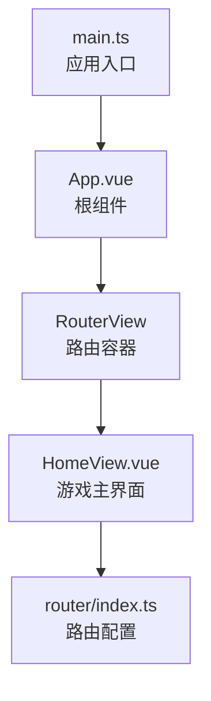
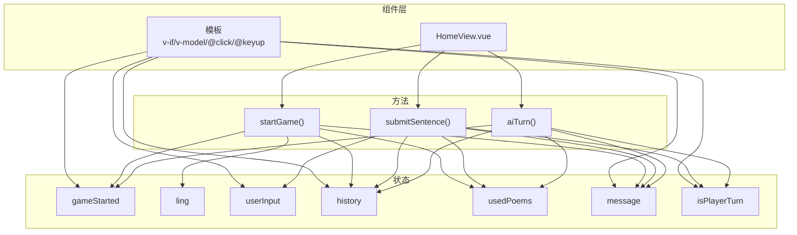
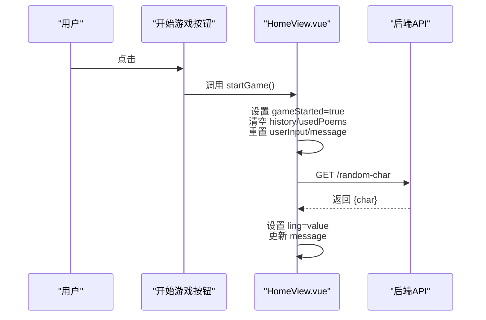
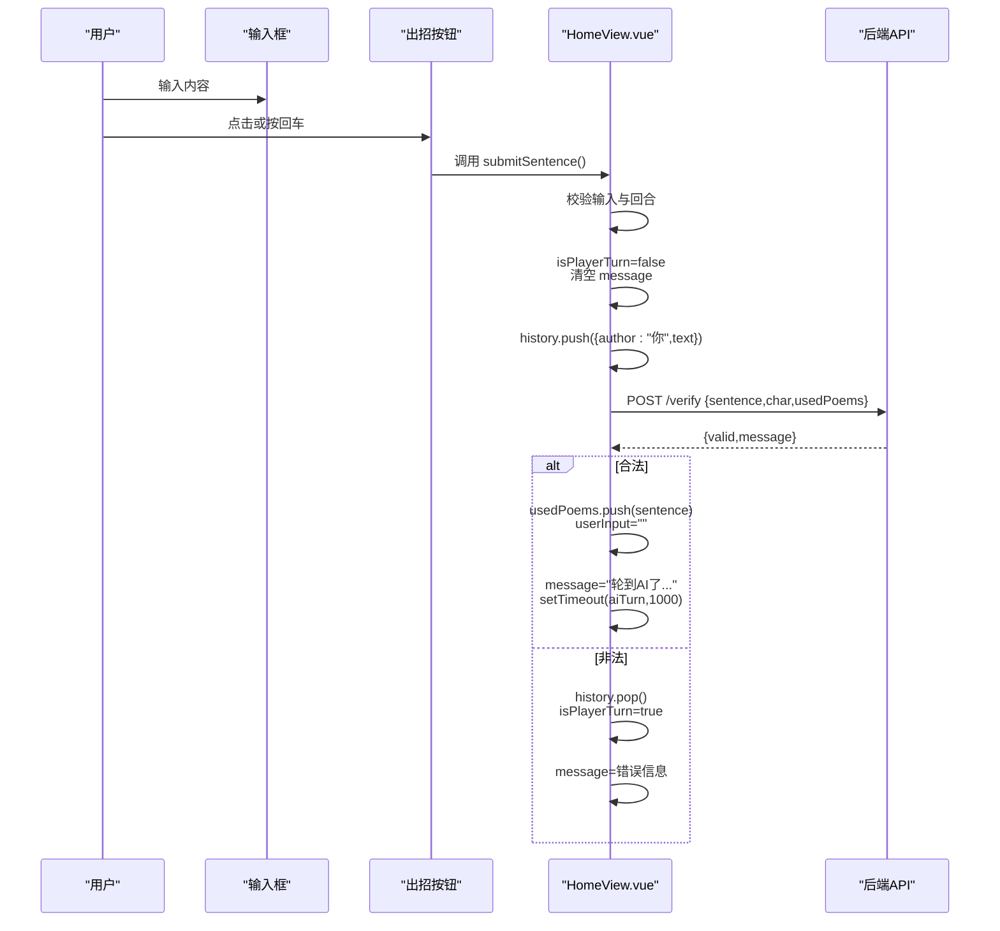
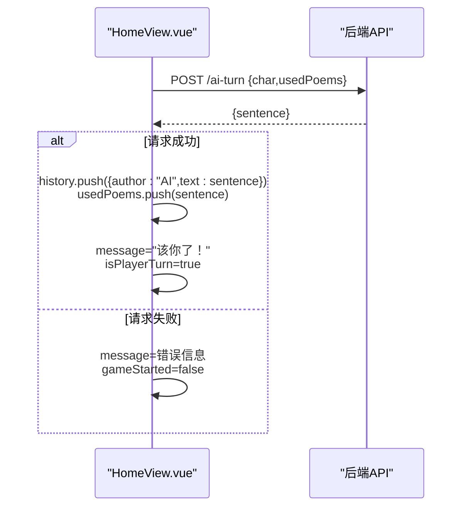
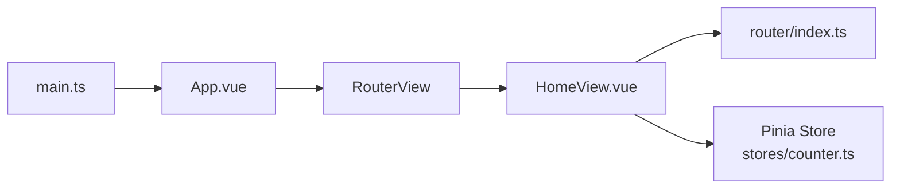

# 响应式变量声明与管理

<cite>
**本文引用的文件列表**
- [HomeView.vue](file://frontend/src/views/HomeView.vue)
- [router/index.ts](file://frontend/src/router/index.ts)
- [main.ts](file://frontend/src/main.ts)
- [App.vue](file://frontend/src/App.vue)
- [stores/counter.ts](file://frontend/src/stores/counter.ts)
</cite>

## 目录
1. [引言](#引言)
2. [项目结构](#项目结构)
3. [核心组件](#核心组件)
4. [架构总览](#架构总览)
5. [详细组件分析](#详细组件分析)
6. [依赖关系分析](#依赖关系分析)
7. [性能考量](#性能考量)
8. [故障排查指南](#故障排查指南)
9. [结论](#结论)

## 引言
本文件围绕 HomeView.vue 中使用 Vue 3 Composition API 的 ref 函数声明响应式变量展开，系统梳理 gameStarted、ling、userInput、history、usedPoems、message 和 isPlayerTurn 等核心状态的声明与使用方式；解释 ref 对基本类型与引用类型的响应性支持，以及模板中对 ref 自动解包的机制；并结合 startGame、submitSentence 和 aiTurn 等函数，说明如何通过 .value 修改状态，以及这些变更如何驱动组件更新。

## 项目结构
HomeView 是前端路由默认指向的视图组件，负责“飞花令”游戏的交互逻辑与渲染。应用通过 Vue Router 将 HomeView 挂载到根组件 App.vue 上，再由 main.ts 初始化 Pinia 并挂载应用。

图表来源
- [main.ts](file://frontend/src/main.ts#L1-L15)
- [App.vue](file://frontend/src/App.vue#L1-L19)
- [router/index.ts](file://frontend/src/router/index.ts#L1-L24)
- [HomeView.vue](file://frontend/src/views/HomeView.vue#L1-L118)

章节来源
- [main.ts](file://frontend/src/main.ts#L1-L15)
- [App.vue](file://frontend/src/App.vue#L1-L19)
- [router/index.ts](file://frontend/src/router/index.ts#L1-L24)

## 核心组件
HomeView.vue 使用 <script setup> 语法与 Composition API，集中声明并管理游戏所需的核心状态，同时定义启动游戏、提交诗句、AI 回合等关键方法。以下是对各状态字段的职责与响应式行为的说明。

- gameStarted：布尔型，控制是否进入游戏区域（开始按钮隐藏、游戏区显示）
- ling：字符串型，本轮“令字”，用于校验玩家与 AI 输入的诗句是否包含该字
- userInput：字符串型，玩家输入框的当前值，双向绑定至模板
- history：数组型，记录历史对话项，每项包含作者与文本
- usedPoems：数组型，记录已使用的诗句，避免重复
- message：字符串型，用于向用户展示提示信息（如“游戏开始！”、“轮到AI了...”等）
- isPlayerTurn：布尔型，指示当前回合归属（true 表示玩家回合）

这些状态均通过 ref 声明，具备响应式能力，可在模板中直接使用而无需 .value（自动解包），并在方法中通过 .value 进行修改。

章节来源
- [HomeView.vue](file://frontend/src/views/HomeView.vue#L1-L118)

## 架构总览
下图展示了 HomeView 的核心状态与方法之间的交互关系，以及模板层如何消费这些状态。

图表来源
- [HomeView.vue](file://frontend/src/views/HomeView.vue#L1-L118)

## 详细组件分析

### 响应式变量与自动解包
- 基本类型（布尔、字符串）：gameStarted、ling、isPlayerTurn、message 通过 ref 声明后，在模板中可直接使用，无需 .value。当方法中通过 .value 修改时，会触发响应式更新，进而重新渲染相关 DOM。
- 引用类型（数组、对象）：history 为数组，元素为对象；usedPoems 为字符串数组。同样通过 ref 声明，模板中可直接遍历与访问；方法中通过 .value 赋值或 push 等变异操作均可触发响应式更新。

模板中的自动解包机制：
- 在 <script setup> 中，顶层声明的 ref 变量在模板中会被自动解包为原始值，因此可以直接写成 {{ message }}、v-model="userInput"、v-for="item in history" 等形式，无需手动添加 .value。
- 当在方法内部修改 .value 时，Vue 的响应式系统会检测到变化并触发依赖该状态的渲染更新。

章节来源
- [HomeView.vue](file://frontend/src/views/HomeView.vue#L1-L118)

### 方法调用流程与状态变更

#### 启动游戏：startGame
- 触发时机：点击“开始游戏”按钮
- 关键步骤：
  - 设置 gameStarted 为 true，清空 history 与 usedPoems，重置 userInput 与 message
  - 调用后端接口获取令字，成功后将 ling 设为返回字符，并更新 message 提示
  - 失败时设置 message 为错误信息

图表来源
- [HomeView.vue](file://frontend/src/views/HomeView.vue#L14-L30)

章节来源
- [HomeView.vue](file://frontend/src/views/HomeView.vue#L14-L30)

#### 提交诗句：submitSentence
- 触发时机：点击“出招”按钮或按回车
- 关键步骤：
  - 校验 userInput 非空且当前为玩家回合
  - 禁止玩家继续输入（isPlayerTurn=false），清空 message
  - 将当前输入推入 history，作为“你”的记录
  - 调用后端接口验证诗句合法性
    - 若合法：将句子加入 usedPoems，清空 userInput，提示“轮到AI了...”，延时执行 aiTurn
    - 若非法：回滚历史（移除最后一条）、恢复 isPlayerTurn=true，并提示错误信息
  - 异常处理：网络错误时设置 message 并恢复 isPlayerTurn=true

图表来源
- [HomeView.vue](file://frontend/src/views/HomeView.vue#L32-L62)

章节来源
- [HomeView.vue](file://frontend/src/views/HomeView.vue#L32-L62)

#### AI 回合：aiTurn
- 触发时机：submitSentence 成功后的延时回调
- 关键步骤：
  - 调用后端接口获取 AI 的诗句
  - 将 AI 的句子加入 history 与 usedPoems，更新 message 为“该你了了”
  - 恢复 isPlayerTurn=true，允许玩家再次输入
  - 失败时设置 message 并结束游戏（gameStarted=false）

图表来源
- [HomeView.vue](file://frontend/src/views/HomeView.vue#L64-L84)

章节来源
- [HomeView.vue](file://frontend/src/views/HomeView.vue#L64-L84)

### 模板中的状态消费与交互
- 条件渲染：v-if 控制“开始游戏”按钮与“游戏区”的切换
- 文本展示：{{ message }} 显示实时提示
- 列表渲染：v-for 遍历 history，区分“你”与“AI”的条目
- 表单绑定：v-model 双向绑定 userInput，@keyup.enter 触发提交
- 交互禁用：根据 isPlayerTurn 决定输入框与按钮的禁用状态

章节来源
- [HomeView.vue](file://frontend/src/views/HomeView.vue#L87-L118)

## 依赖关系分析
- 组件依赖：HomeView 依赖 Vue 的 ref 与 <script setup> 语法；模板依赖 Vue 的指令（v-if、v-model、v-for、@click、@keyup）
- 路由依赖：router/index.ts 将 HomeView 注册为根路径，默认加载 HomeView
- 应用入口：main.ts 初始化应用、注册路由与 Pinia，App.vue 作为根容器承载 RouterView
- 状态对比：stores/counter.ts 展示了在 Pinia Store 中同样使用 ref 的模式，便于理解 ref 在不同层级的使用一致性

图表来源
- [main.ts](file://frontend/src/main.ts#L1-L15)
- [App.vue](file://frontend/src/App.vue#L1-L19)
- [router/index.ts](file://frontend/src/router/index.ts#L1-L24)
- [HomeView.vue](file://frontend/src/views/HomeView.vue#L1-L118)
- [stores/counter.ts](file://frontend/src/stores/counter.ts#L1-L13)

章节来源
- [main.ts](file://frontend/src/main.ts#L1-L15)
- [App.vue](file://frontend/src/App.vue#L1-L19)
- [router/index.ts](file://frontend/src/router/index.ts#L1-L24)
- [stores/counter.ts](file://frontend/src/stores/counter.ts#L1-L13)

## 性能考量
- 避免不必要的深层响应：history 与 usedPoems 为数组，频繁 push/pop 对性能影响较小；但应避免在模板中对大数组进行无谓的全量替换，优先使用就地变异（如 push、pop、splice）以减少重排成本
- 合理使用延时：aiTurn 中的 1000ms 延时可提升交互体验，但需注意在组件卸载时清理定时器，防止内存泄漏
- 网络请求节流：在高频交互场景下，可考虑对 submitSentence 的触发频率进行限制，避免短时间内多次请求

## 故障排查指南
- 无法获取令字：检查 startGame 中的 fetch 调用与 API 响应，确认 message 是否被正确设置
- 诗句校验失败：检查 submitSentence 的错误分支，确认 message 与 isPlayerTurn 的回滚逻辑
- AI 回合异常：检查 aiTurn 的错误处理，确认 gameStarted 是否被正确置为 false
- 输入框不可用：确认 isPlayerTurn 的状态流转是否符合预期（提交后置为 false，AI 回合后置为 true）

章节来源
- [HomeView.vue](file://frontend/src/views/HomeView.vue#L14-L84)

## 结论
HomeView.vue 通过 Composition API 的 ref 函数统一管理游戏状态，实现了清晰的状态声明、直观的模板解包与可靠的响应式更新。startGame、submitSentence 与 aiTurn 三个关键方法分别对应游戏生命周期的不同阶段，通过 .value 修改状态，配合模板指令完成用户交互与界面更新。该模式简洁、可维护性强，适合在小型到中型应用中推广使用。