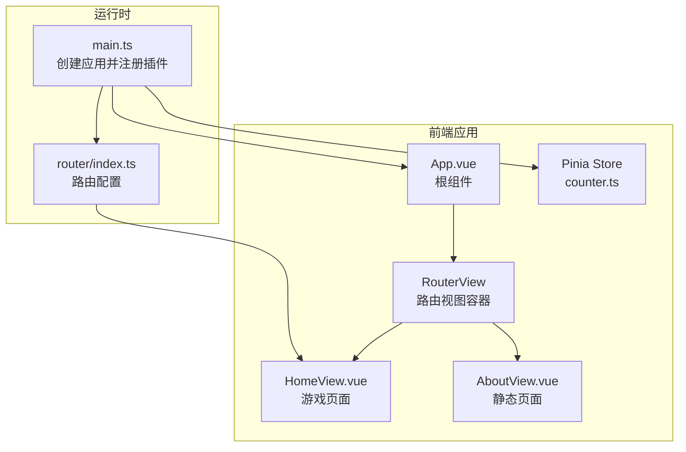
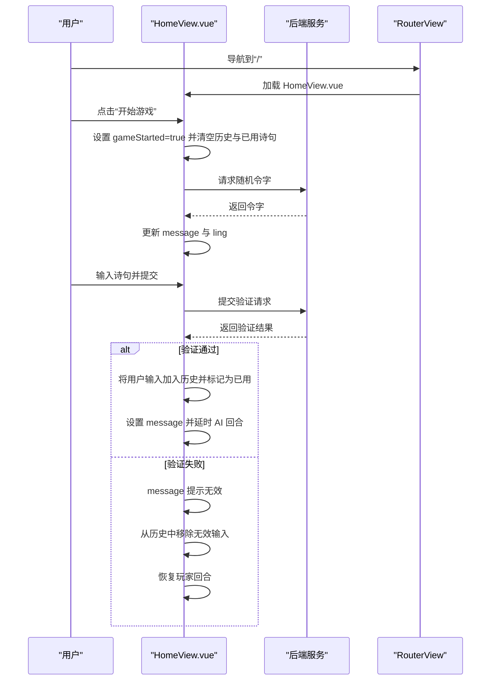
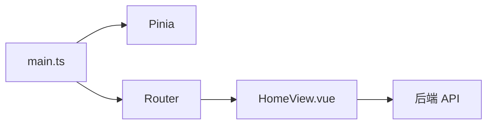

# 响应式最佳实践与常见陷阱

<cite>
**本文引用的文件**
- [HomeView.vue](file://frontend/src/views/HomeView.vue)
- [counter.ts](file://frontend/src/stores/counter.ts)
- [main.ts](file://frontend/src/main.ts)
- [router/index.ts](file://frontend/src/router/index.ts)
- [App.vue](file://frontend/src/App.vue)
- [GEMINI.md](file://GEMINI.md)
</cite>

## 目录
1. [引言](#引言)
2. [项目结构](#项目结构)
3. [核心组件](#核心组件)
4. [架构总览](#架构总览)
5. [详细组件分析](#详细组件分析)
6. [依赖关系分析](#依赖关系分析)
7. [性能考量](#性能考量)
8. [故障排查指南](#故障排查指南)
9. [结论](#结论)
10. [附录](#附录)

## 引言
本文件聚焦于 HomeView.vue 中的响应式状态管理实践，结合 Vue3 的响应式系统特性，总结在单文件组件中应遵循的最佳实践，包括：
- 避免直接替换响应式数组（例如 history.value = []）导致的响应性丢失
- 正确选择 ref 与 reactive 的场景
- 错误处理中直接修改数组的潜在风险与修复建议
- 性能优化建议（为 v-for 添加稳定 key、避免在模板中执行复杂计算）

同时，本文将通过代码级图示与来源标注，帮助读者快速定位问题与改进点。

## 项目结构
前端采用 Vue3 + TypeScript + Pinia 架构，路由通过 vue-router 管理。HomeView.vue 作为游戏页面，负责维护游戏状态与用户交互；counter.ts 展示了 Pinia Store 的典型用法；main.ts 初始化应用与 Pinia；router/index.ts 定义路由；App.vue 作为根组件包裹 RouterView。



**图表来源**
- [main.ts](file://frontend/src/main.ts#L1-L15)
- [router/index.ts](file://frontend/src/router/index.ts#L1-L24)
- [App.vue](file://frontend/src/App.vue#L1-L19)
- [HomeView.vue](file://frontend/src/views/HomeView.vue#L1-L120)
- [counter.ts](file://frontend/src/stores/counter.ts#L1-L13)

**章节来源**
- [main.ts](file://frontend/src/main.ts#L1-L15)
- [router/index.ts](file://frontend/src/router/index.ts#L1-L24)
- [App.vue](file://frontend/src/App.vue#L1-L19)
- [HomeView.vue](file://frontend/src/views/HomeView.vue#L1-L120)
- [counter.ts](file://frontend/src/stores/counter.ts#L1-L13)

## 核心组件
- HomeView.vue：包含游戏状态（是否开始、令字、历史记录、已用诗句、消息、玩家回合）、异步交互逻辑（开始游戏、提交诗句、AI 回合）以及模板渲染。
- counter.ts：展示 Pinia Store 的 ref + computed 模式，体现响应式数据与派生状态的正确用法。

**章节来源**
- [HomeView.vue](file://frontend/src/views/HomeView.vue#L1-L120)
- [counter.ts](file://frontend/src/stores/counter.ts#L1-L13)

## 架构总览
HomeView.vue 在模板中通过 v-model 和 v-for 绑定响应式数据，通过事件处理器发起异步请求并更新状态。路由通过 RouterView 动态加载 HomeView.vue，Pinia 在应用入口初始化后可被任意组件使用。



**图表来源**
- [HomeView.vue](file://frontend/src/views/HomeView.vue#L1-L120)
- [router/index.ts](file://frontend/src/router/index.ts#L1-L24)

## 详细组件分析

### 响应式数组的正确操作与常见陷阱
- 现象与问题
  - 在错误处理分支中，直接对 history.value 调用 pop() 来移除无效输入，这会直接修改原数组对象，可能引发以下风险：
    - 如果后续逻辑依赖于数组引用的稳定性，直接修改可能破坏某些依赖引用的假设。
    - 在复杂模板中，若未提供稳定 key 或依赖索引 key，直接修改数组顺序或长度可能导致 DOM 重用异常，出现视觉错位或状态错配。
  - 在开始游戏时，将 history.value 赋值为空数组，这种“整体替换”在 Vue3 响应式系统中通常仍能触发更新，但在更复杂的场景下，使用 splice 或重新赋值并确保响应性更稳妥。

- 改进建议
  - 使用不可变更新策略：通过创建新数组的方式替代直接替换或就地修改，例如使用过滤或切片生成新数组，从而保证响应式链路清晰、可追踪。
  - 对于列表渲染，务必提供稳定 key，避免使用 index 作为 key，防止元素位置变化导致的重用问题。
  - 在模板中避免执行复杂计算，将计算结果缓存到响应式变量中，减少不必要的重渲染。

- 参考实现路径
  - 错误处理中移除无效输入的位置：[HomeView.vue](file://frontend/src/views/HomeView.vue#L53-L57)
  - 开始游戏时清空历史与已用诗句的位置：[HomeView.vue](file://frontend/src/views/HomeView.vue#L14-L20)
  - 列表渲染与 key 的使用：[HomeView.vue](file://frontend/src/views/HomeView.vue#L96-L104)

**章节来源**
- [HomeView.vue](file://frontend/src/views/HomeView.vue#L14-L20)
- [HomeView.vue](file://frontend/src/views/HomeView.vue#L32-L62)
- [HomeView.vue](file://frontend/src/views/HomeView.vue#L96-L104)

### ref 与 reactive 的选择
- 在 HomeView.vue 中，所有状态均使用 ref 声明，包括布尔标志、字符串、数组与对象数组。这种方式简单直观，适合小型组件的状态管理。
- 对于需要深层响应性的复杂对象，可考虑使用 reactive；但对于简单标量与数组，ref 更加轻量且语义明确。
- Pinia Store 的示例展示了 ref + computed 的组合，体现了响应式数据与派生状态的清晰分离。

- 参考实现路径
  - HomeView.vue 中的状态声明与使用：[HomeView.vue](file://frontend/src/views/HomeView.vue#L6-L13)
  - Pinia Store 的 ref + computed 示例：[counter.ts](file://frontend/src/stores/counter.ts#L1-L13)

**章节来源**
- [HomeView.vue](file://frontend/src/views/HomeView.vue#L6-L13)
- [counter.ts](file://frontend/src/stores/counter.ts#L1-L13)

### 错误处理中的数组修改风险与修复
- 风险点
  - 直接调用 history.value.pop() 修改数组，可能在以下情况下产生副作用：
    - 模板中使用 index 作为 key，当数组长度变化时，可能导致元素重用错位。
    - 若存在外部监听器或依赖数组引用的逻辑，直接修改可能破坏预期行为。
- 修复建议
  - 使用不可变更新：通过过滤或切片生成新数组，再赋值给响应式变量，确保响应式链路完整。
  - 在模板中为 v-for 提供稳定 key，优先使用唯一标识符而非索引，降低重用带来的不确定性。

- 参考实现路径
  - 错误处理中 pop 的使用：[HomeView.vue](file://frontend/src/views/HomeView.vue#L53-L57)
  - 列表渲染 key 的使用：[HomeView.vue](file://frontend/src/views/HomeView.vue#L96-L104)

**章节来源**
- [HomeView.vue](file://frontend/src/views/HomeView.vue#L53-L57)
- [HomeView.vue](file://frontend/src/views/HomeView.vue#L96-L104)

### 模板中的复杂计算与性能
- 现状
  - 当前模板中未见复杂计算，仅进行简单的字符串拼接与条件渲染。
- 建议
  - 避免在模板中执行复杂计算（如过滤、排序、聚合等），将结果缓存到响应式变量中，减少每次渲染的开销。
  - 对于大列表渲染，确保提供稳定 key，避免不必要的 DOM 重排与重绘。

- 参考实现路径
  - 列表渲染与 key 的使用：[HomeView.vue](file://frontend/src/views/HomeView.vue#L96-L104)

**章节来源**
- [HomeView.vue](file://frontend/src/views/HomeView.vue#L96-L104)

### 类图：HomeView.vue 的响应式状态模型
```mermaid
classDiagram
class HomeView {
+boolean gameStarted
+string ling
+string userInput
+{author,text}[] history
+string[] usedPoems
+string message
+boolean isPlayerTurn
+startGame()
+submitSentence()
+aiTurn()
}
```

**图表来源**
- [HomeView.vue](file://frontend/src/views/HomeView.vue#L1-L120)

## 依赖关系分析
- 应用入口 main.ts 注册 Pinia 与路由，使组件可在运行时访问全局状态与导航能力。
- RouterView 动态加载 HomeView.vue，使其成为当前路由下的活跃视图。
- HomeView.vue 内部通过 fetch 发起 API 请求，更新本地响应式状态。



**图表来源**
- [main.ts](file://frontend/src/main.ts#L1-L15)
- [router/index.ts](file://frontend/src/router/index.ts#L1-L24)
- [HomeView.vue](file://frontend/src/views/HomeView.vue#L1-L120)

**章节来源**
- [main.ts](file://frontend/src/main.ts#L1-L15)
- [router/index.ts](file://frontend/src/router/index.ts#L1-L24)
- [HomeView.vue](file://frontend/src/views/HomeView.vue#L1-L120)

## 性能考量
- 为 v-for 添加稳定 key
  - 当前使用 index 作为 key，建议改用唯一标识符（如历史项的唯一 ID）。这可以显著减少 DOM 重用带来的重排与状态错配风险。
  - 参考路径：[HomeView.vue](file://frontend/src/views/HomeView.vue#L96-L104)
- 避免在模板中执行复杂计算
  - 将过滤、排序、聚合等计算结果缓存到响应式变量中，减少渲染成本。
- 不可变更新
  - 使用不可变更新策略（如过滤、切片生成新数组）替代直接替换或就地修改，有助于保持响应式链路稳定与可追踪。

**章节来源**
- [HomeView.vue](file://frontend/src/views/HomeView.vue#L96-L104)

## 故障排查指南
- 常见症状
  - 列表渲染错位或闪烁：多因 key 不稳定或直接修改数组导致的重用异常。
  - 错误提示后历史记录未恢复：检查错误处理分支是否正确移除无效输入。
- 排查步骤
  - 确认错误处理分支中是否使用了不可变更新策略（生成新数组再赋值）。
  - 检查 v-for 的 key 是否稳定且唯一。
  - 在模板中避免复杂计算，必要时将结果缓存到响应式变量。
- 参考实现路径
  - 错误处理与历史记录更新：[HomeView.vue](file://frontend/src/views/HomeView.vue#L53-L57)
  - 列表渲染与 key 的使用：[HomeView.vue](file://frontend/src/views/HomeView.vue#L96-L104)

**章节来源**
- [HomeView.vue](file://frontend/src/views/HomeView.vue#L53-L57)
- [HomeView.vue](file://frontend/src/views/HomeView.vue#L96-L104)

## 结论
- 在 HomeView.vue 中，响应式状态管理以 ref 为主，配合模板绑定与异步交互，实现了清晰的游戏流程控制。
- 关键改进点在于：避免直接替换或就地修改响应式数组，采用不可变更新策略；为 v-for 提供稳定 key；避免在模板中执行复杂计算。
- 这些实践有助于提升用户体验、减少渲染抖动与状态错配，并增强代码的可维护性与可测试性。

## 附录
- 项目背景与约定
  - 项目采用 Vue3 + TypeScript + Tailwind CSS，后端使用 Node.js + Express + Prisma。
  - 项目约定包括统一 API 前缀、组件与工具函数的目录规范等。
  
**章节来源**
- [GEMINI.md](file://GEMINI.md#L1-L21)