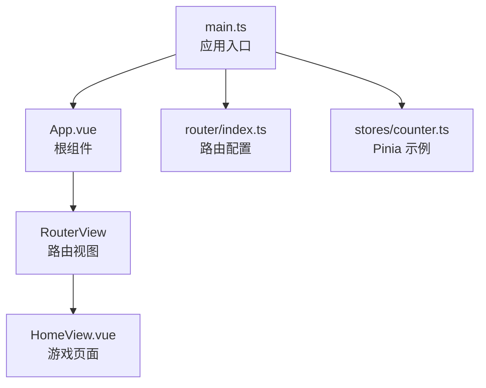
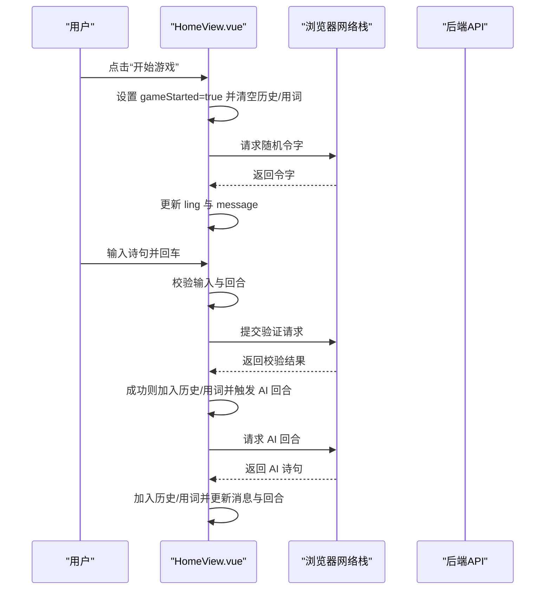
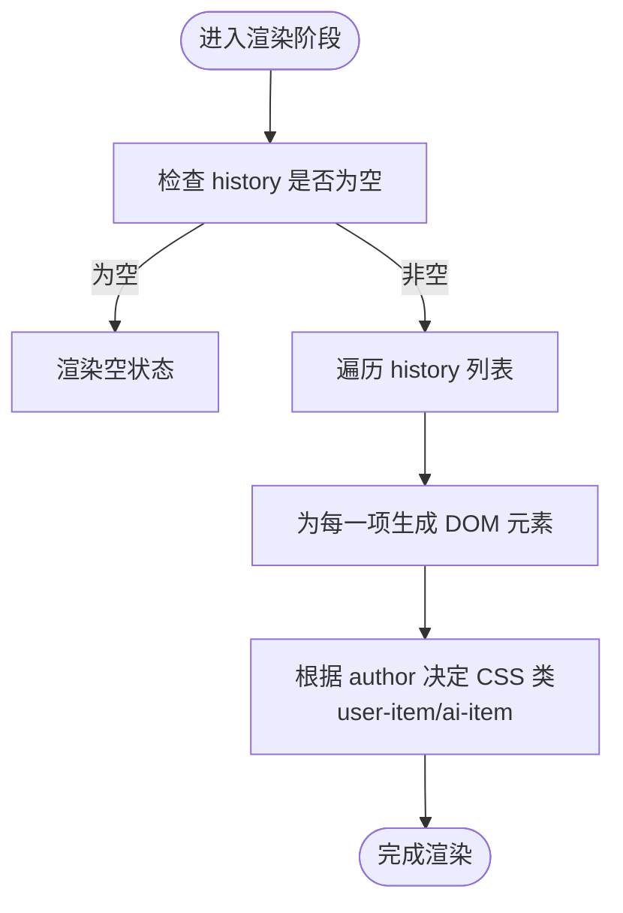
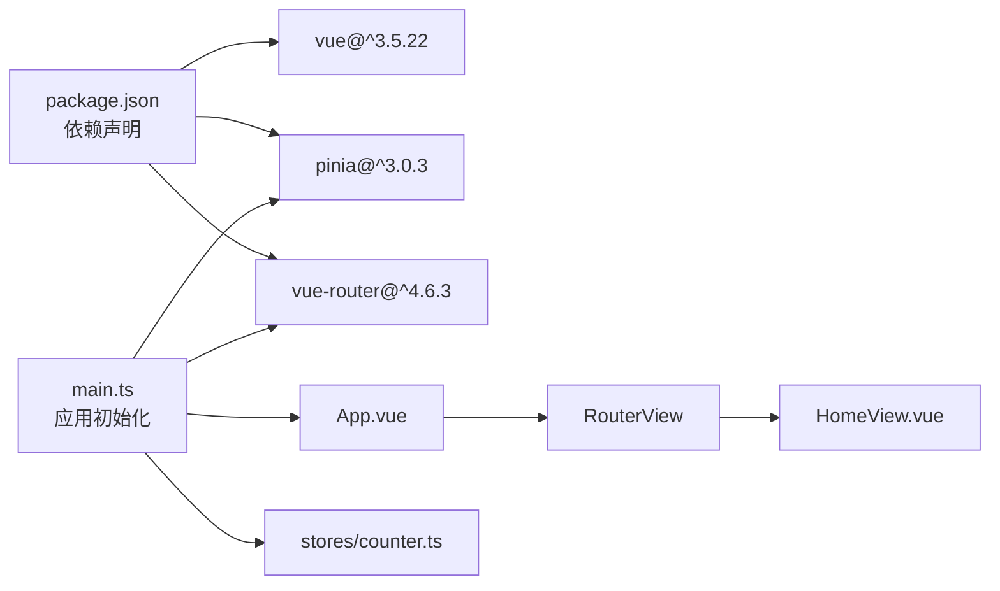

# 响应式状态管理

<cite>
**本文引用的文件列表**
- [frontend/src/views/HomeView.vue](file://frontend/src/views/HomeView.vue)
- [frontend/src/stores/counter.ts](file://frontend/src/stores/counter.ts)
- [frontend/src/main.ts](file://frontend/src/main.ts)
- [frontend/src/router/index.ts](file://frontend/src/router/index.ts)
- [frontend/src/App.vue](file://frontend/src/App.vue)
- [frontend/package.json](file://frontend/package.json)
</cite>

## 目录
1. [引言](#引言)
2. [项目结构](#项目结构)
3. [核心组件](#核心组件)
4. [架构总览](#架构总览)
5. [详细组件分析](#详细组件分析)
6. [依赖关系分析](#依赖关系分析)
7. [性能考虑](#性能考虑)
8. [故障排查指南](#故障排查指南)
9. [结论](#结论)

## 引言
本文件系统性阐述基于 Vue 3 Composition API 的响应式状态管理，重点围绕 HomeView 页面中的 ref 变量（gameStarted、ling、userInput、history、usedPoems、message、isPlayerTurn）的声明与更新机制；解释 v-model 如何与 userInput 建立双向绑定，以及 v-for 如何基于 history 响应式数组实现对话记录的动态渲染；说明 CSS 类绑定（user-item/ai-item）如何依据数据状态实现视觉区分；并提供响应式陷阱（如直接数组赋值）的规避方案与性能优化建议（如 key 属性使用）。

## 项目结构
前端采用 Vue 3 + Vite + Pinia + vue-router 架构：
- 应用入口在 main.ts 中创建应用并挂载，注册 Pinia 和路由。
- 路由配置将首页指向 HomeView 组件。
- HomeView 是本次响应式状态管理的重点页面，包含完整的交互逻辑与模板渲染。
- counter.ts 展示了 Pinia Store 的典型写法，便于对比理解不同状态管理模式。

图表来源
- [frontend/src/main.ts](file://frontend/src/main.ts#L1-L15)
- [frontend/src/App.vue](file://frontend/src/App.vue#L1-L19)
- [frontend/src/router/index.ts](file://frontend/src/router/index.ts#L1-L24)
- [frontend/src/views/HomeView.vue](file://frontend/src/views/HomeView.vue#L1-L120)
- [frontend/src/stores/counter.ts](file://frontend/src/stores/counter.ts#L1-L13)

章节来源
- [frontend/src/main.ts](file://frontend/src/main.ts#L1-L15)
- [frontend/src/router/index.ts](file://frontend/src/router/index.ts#L1-L24)
- [frontend/src/App.vue](file://frontend/src/App.vue#L1-L19)

## 核心组件
- HomeView.vue：定义并使用多个 ref 状态，处理用户输入、历史记录、消息提示与回合控制，并通过模板指令实现双向绑定与动态渲染。
- counter.ts：展示 Pinia Store 的响应式写法，强调 ref/computed/increment 的组合，便于理解与对比。

章节来源
- [frontend/src/views/HomeView.vue](file://frontend/src/views/HomeView.vue#L1-L120)
- [frontend/src/stores/counter.ts](file://frontend/src/stores/counter.ts#L1-L13)

## 架构总览
从运行时视角看，应用启动后，main.ts 注册 Pinia 与路由；App.vue 包裹 RouterView；路由命中 HomeView 后，组件内部通过 Composition API 声明与更新响应式状态，模板层通过 v-model、v-for、类绑定等指令驱动 UI 更新。

图表来源
- [frontend/src/views/HomeView.vue](file://frontend/src/views/HomeView.vue#L1-L120)

## 详细组件分析

### 响应式变量与更新机制
- 变量声明：在脚本区通过 ref 声明多个响应式变量，包括游戏开关、令字、用户输入、历史记录、已用诗句、消息提示与玩家回合标志。
- 更新方式：通过函数异步调用 fetch 获取数据，成功后直接修改对应 ref 的 value，从而触发模板自动更新。
- 关键点：
  - history 作为数组，通过 push 追加新条目，Vue 响应式系统会检测到变更并重渲染相关区域。
  - usedPoems 用于去重与传递给后端，避免重复使用同一诗句。
  - isPlayerTurn 控制输入框与按钮的禁用状态，配合 v-if/v-bind 实现交互约束。

章节来源
- [frontend/src/views/HomeView.vue](file://frontend/src/views/HomeView.vue#L1-L120)

### v-model 与 userInput 的双向绑定
- 模板中 input 使用 v-model 绑定 userInput，使输入框的值与 userInput 始终保持一致。
- 用户输入实时反映到 userInput，提交时读取其 value，避免了手动同步的繁琐与出错风险。
- 输入框在非玩家回合时被禁用，防止非法操作。

章节来源
- [frontend/src/views/HomeView.vue](file://frontend/src/views/HomeView.vue#L87-L137)

### v-for 与 history 的动态渲染
- 模板中使用 v-for 遍历 history 数组，为每个条目渲染一个历史项。
- 当 history 发生变化（push 或 pop），对应的 DOM 会被高效更新，无需手动操作真实 DOM。
- 当前使用 :key="index"，在无唯一标识时可保证列表正确重排；若历史项可能被删除或顺序变化，建议改用唯一 id 以提升性能与稳定性。

图表来源
- [frontend/src/views/HomeView.vue](file://frontend/src/views/HomeView.vue#L87-L137)

章节来源
- [frontend/src/views/HomeView.vue](file://frontend/src/views/HomeView.vue#L87-L137)

### CSS 类绑定与视觉区分
- 通过 :class 绑定对象形式，根据 item.author 的值选择 user-item 或 ai-item 类名。
- 对应样式分别设置不同的背景色，实现用户与 AI 输出的视觉区分，提升可读性与交互反馈。

章节来源
- [frontend/src/views/HomeView.vue](file://frontend/src/views/HomeView.vue#L87-L137)

### 响应式陷阱与规避方案
- 陷阱示例：直接对 history 赋值为新数组（例如 history = [...]），这不会触发响应式更新，因为 ref 本身未变，只是改变了引用。
- 规避方案：
  - 使用数组方法进行就地修改，如 push、pop、splice 等，这些方法会触发响应式更新。
  - 若需替换整个数组，应重新赋值 ref 的 value，而非直接替换引用。
  - 在需要稳定 key 的场景，优先使用唯一 id 作为 :key，避免仅用索引导致的重排问题。

章节来源
- [frontend/src/views/HomeView.vue](file://frontend/src/views/HomeView.vue#L1-L120)

### 性能优化建议
- 使用稳定的唯一 key：当前使用 :key="index"，在列表频繁插入/删除时可能引发不必要的重排。建议改为基于唯一 id 的 key，以减少 DOM 复用成本。
- 避免不必要的大数组深拷贝：在更新 history/usedPoems 时，尽量只做浅层更新，减少序列化/反序列化开销。
- 合理拆分渲染：将历史列表与输入区域分离，确保只有相关区域重渲染，降低整体重绘压力。
- 事件节流/防抖：在高频输入场景下，可对输入事件进行节流/防抖，减少无效请求与状态更新。

章节来源
- [frontend/src/views/HomeView.vue](file://frontend/src/views/HomeView.vue#L87-L137)

## 依赖关系分析
- 运行时依赖：Vue 3、Pinia、vue-router。
- 应用入口 main.ts 注册 Pinia 与路由，App.vue 作为根容器包裹 RouterView。
- HomeView 作为路由组件，内部通过 Composition API 管理状态，模板层通过指令与样式实现交互与展示。
- counter.ts 作为 Pinia Store 的示例，展示了另一种集中式状态管理模式，可与组件内局部状态互补使用。

图表来源
- [frontend/package.json](file://frontend/package.json#L1-L51)
- [frontend/src/main.ts](file://frontend/src/main.ts#L1-L15)
- [frontend/src/App.vue](file://frontend/src/App.vue#L1-L19)
- [frontend/src/router/index.ts](file://frontend/src/router/index.ts#L1-L24)
- [frontend/src/views/HomeView.vue](file://frontend/src/views/HomeView.vue#L1-L120)
- [frontend/src/stores/counter.ts](file://frontend/src/stores/counter.ts#L1-L13)

章节来源
- [frontend/package.json](file://frontend/package.json#L1-L51)
- [frontend/src/main.ts](file://frontend/src/main.ts#L1-L15)
- [frontend/src/router/index.ts](file://frontend/src/router/index.ts#L1-L24)
- [frontend/src/stores/counter.ts](file://frontend/src/stores/counter.ts#L1-L13)

## 性能考虑
- 列表渲染：优先使用稳定且唯一的 key，避免仅用索引导致的重排与子组件状态丢失。
- 状态粒度：将大型数组拆分为更细粒度的状态，减少无关更新触发的重渲染范围。
- 异步请求：合并请求、缓存结果、避免重复请求，减少 UI 卡顿。
- 样式与布局：合理使用 scoped 样式，避免深层选择器带来的重绘放大。

## 故障排查指南
- 输入框不可用：检查 isPlayerTurn 的值是否为 false，确认按钮与输入框的禁用状态绑定是否生效。
- 历史记录不显示：确认 history 是否被正确 push，以及 v-for 的 key 是否稳定；若使用 index 作为 key，当列表顺序变化或删除时可能出现异常。
- 消息提示不更新：检查 message 的赋值路径是否覆盖所有分支（成功/失败/异常），确保每次更新都修改 ref 的 value。
- AI 回合异常：检查后端接口返回格式与错误处理分支，确保在异常时恢复 gameStarted/isPlayerTurn 状态。

章节来源
- [frontend/src/views/HomeView.vue](file://frontend/src/views/HomeView.vue#L1-L120)

## 结论
本项目通过 Vue 3 Composition API 将状态与行为解耦，借助 ref 的响应式能力实现了简洁高效的交互流程。v-model、v-for 与类绑定共同构建了直观的用户界面；通过合理的 key 设计与数组更新策略，可有效规避响应式陷阱并提升渲染性能。同时，Pinia Store 的存在为更大规模的状态管理提供了扩展空间。建议在后续迭代中引入更稳定的唯一 key 与更细粒度的状态拆分，以进一步增强可维护性与性能表现。