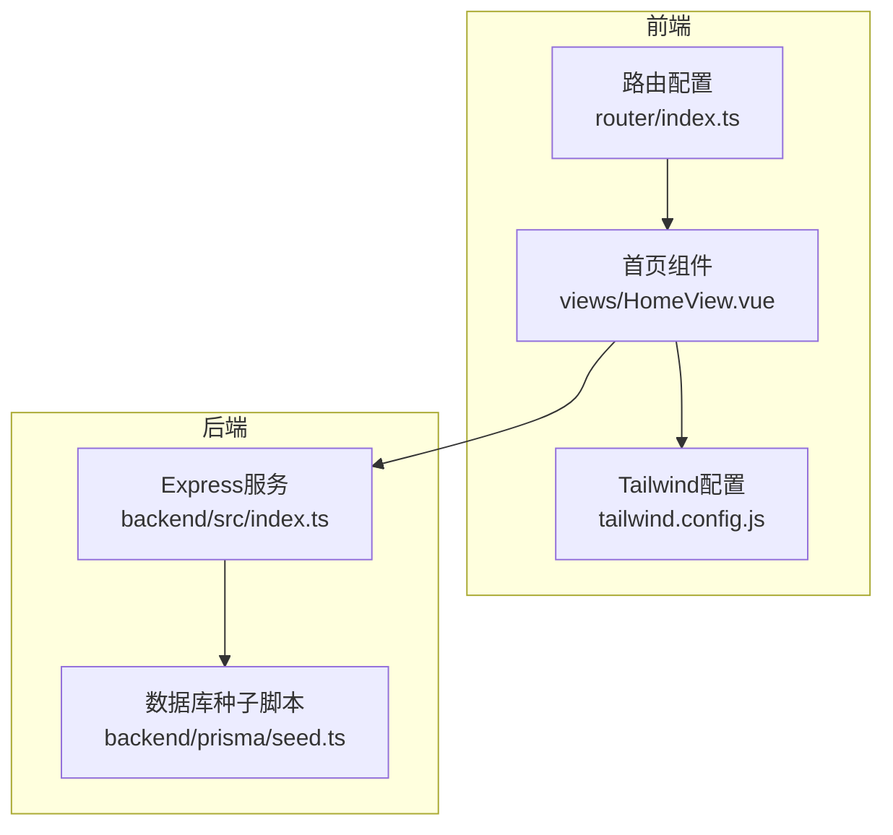
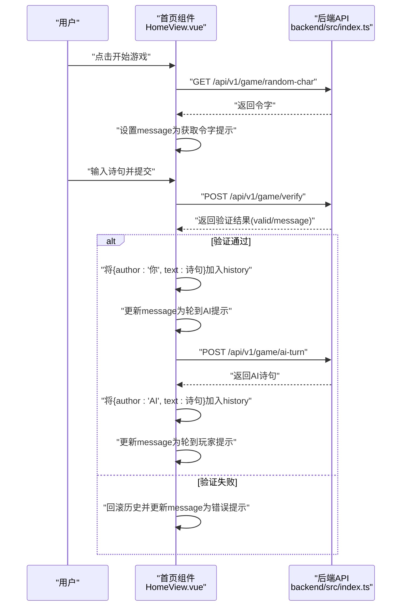
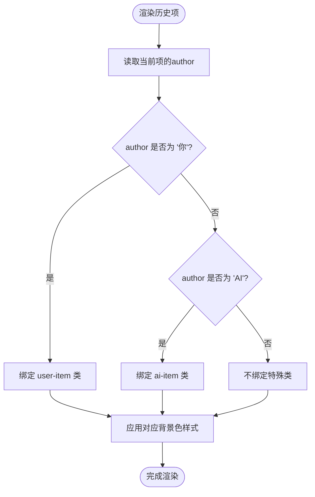
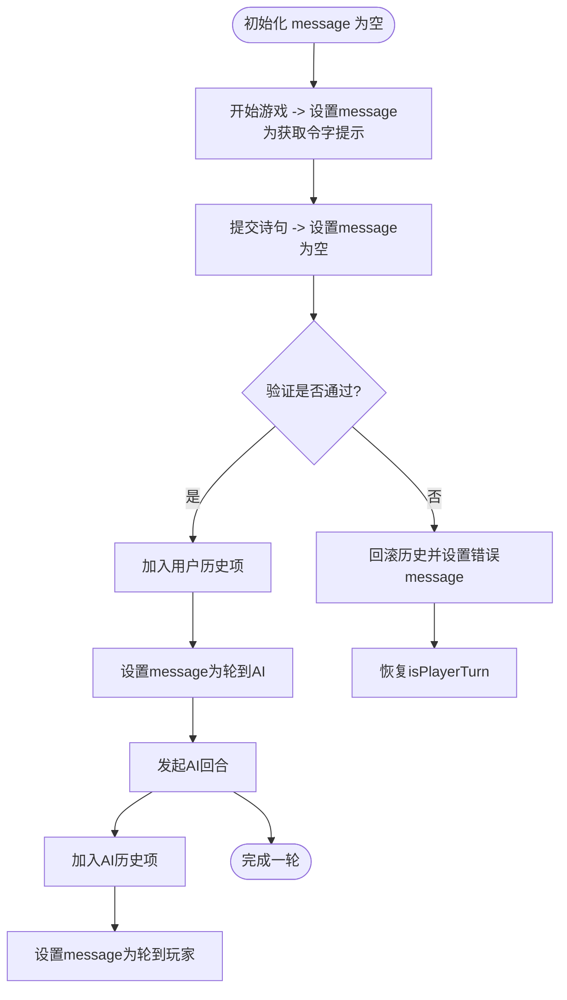
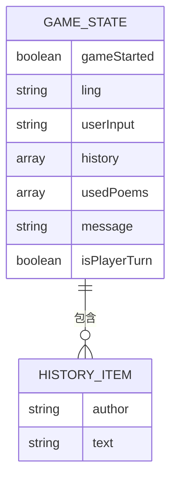
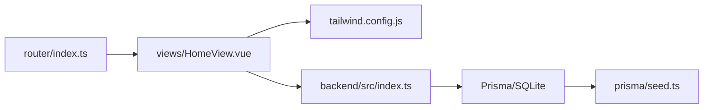

# 条件样式绑定与视觉反馈

<cite>
**本文引用的文件**
- [frontend/src/views/HomeView.vue](file://frontend/src/views/HomeView.vue)
- [frontend/src/router/index.ts](file://frontend/src/router/index.ts)
- [frontend/tailwind.config.js](file://frontend/tailwind.config.js)
- [backend/src/index.ts](file://backend/src/index.ts)
- [backend/prisma/seed.ts](file://backend/prisma/seed.ts)
- [GEMINI.md](file://GEMINI.md)
</cite>

## 目录
1. [引言](#引言)
2. [项目结构](#项目结构)
3. [核心组件](#核心组件)
4. [架构总览](#架构总览)
5. [详细组件分析](#详细组件分析)
6. [依赖关系分析](#依赖关系分析)
7. [性能考量](#性能考量)
8. [故障排查指南](#故障排查指南)
9. [结论](#结论)

## 引言
本篇文档聚焦于前端Vue组件中如何通过:class指令依据历史记录项的author字段动态绑定CSS类，从而实现“用户”与“AI”的视觉区分；同时解释Tailwind CSS背景色类如何配合数据状态驱动界面变化，并说明status-message中的{{ message }}插值如何实时反映游戏状态提示，为用户提供清晰的操作反馈。文档将结合实际源码路径进行说明，避免直接粘贴代码内容。

## 项目结构
- 前端采用Vue3 + TypeScript + Tailwind CSS，路由通过vue-router配置，首页组件位于HomeView.vue。
- 后端采用Node.js + Express + Prisma，提供飞花令相关的API接口，包括随机令字、验证诗句、AI回合等。
- 数据库通过Prisma初始化，种子脚本导入若干经典诗词条目，供游戏逻辑使用。

图表来源
- [frontend/src/router/index.ts](file://frontend/src/router/index.ts#L1-L24)
- [frontend/src/views/HomeView.vue](file://frontend/src/views/HomeView.vue#L87-L118)
- [frontend/tailwind.config.js](file://frontend/tailwind.config.js#L1-L11)
- [backend/src/index.ts](file://backend/src/index.ts#L1-L184)
- [backend/prisma/seed.ts](file://backend/prisma/seed.ts#L1-L53)

章节来源
- [frontend/src/router/index.ts](file://frontend/src/router/index.ts#L1-L24)
- [frontend/tailwind.config.js](file://frontend/tailwind.config.js#L1-L11)
- [GEMINI.md](file://GEMINI.md#L1-L21)

## 核心组件
- 首页组件负责：
  - 管理游戏生命周期（开始、回合切换、结束）。
  - 维护历史记录数组，每条记录包含author与text。
  - 通过消息状态message向用户反馈当前操作提示。
  - 使用:class条件绑定实现“用户/AI”不同背景色的视觉区分。

章节来源
- [frontend/src/views/HomeView.vue](file://frontend/src/views/HomeView.vue#L1-L118)
- [frontend/src/views/HomeView.vue](file://frontend/src/views/HomeView.vue#L120-L231)

## 架构总览
下图展示了从用户交互到后端API调用，再到历史记录与状态消息更新的完整流程。

图表来源
- [frontend/src/views/HomeView.vue](file://frontend/src/views/HomeView.vue#L14-L84)
- [backend/src/index.ts](file://backend/src/index.ts#L13-L76)
- [backend/src/index.ts](file://backend/src/index.ts#L78-L125)

## 详细组件分析

### 条件样式绑定：基于author字段动态类名
- 在首页模板中，历史记录列表通过v-for渲染，每个历史项使用:class进行条件绑定：
  - 当author为“你”时，绑定user-item类；
  - 当author为“AI”时，绑定ai-item类。
- 对应的CSS类定义分别设置了不同的背景色，用于直观区分用户与AI发言。

图表来源
- [frontend/src/views/HomeView.vue](file://frontend/src/views/HomeView.vue#L99-L103)
- [frontend/src/views/HomeView.vue](file://frontend/src/views/HomeView.vue#L186-L192)

章节来源
- [frontend/src/views/HomeView.vue](file://frontend/src/views/HomeView.vue#L99-L103)
- [frontend/src/views/HomeView.vue](file://frontend/src/views/HomeView.vue#L186-L192)

### Tailwind CSS背景色类与数据状态驱动
- user-item类使用浅绿色背景，ai-item类使用更浅的绿色背景，二者均通过纯CSS类实现，未使用内联样式。
- 由于类名绑定完全依赖author字段的值，因此无需额外的Tailwind工具类，即可实现“数据驱动UI”的效果。
- 若需扩展更多视觉层次，可在Tailwind配置中添加自定义颜色或扩展现有颜色集，但当前项目未引入额外定制。

章节来源
- [frontend/src/views/HomeView.vue](file://frontend/src/views/HomeView.vue#L186-L192)
- [frontend/tailwind.config.js](file://frontend/tailwind.config.js#L1-L11)

### status-message插值：实时反映游戏状态
- message响应式变量承载当前游戏提示文本，模板中通过{{ message }}进行插值显示。
- 生命周期内各阶段会更新message：
  - 开始游戏：提示正在获取令字；
  - 成功获取令字：提示本轮令字；
  - 用户提交有效诗句：提示轮到AI；
  - AI回合：提示轮到玩家；
  - 提交无效或异常：提示错误信息并回滚历史。
- 输入框与按钮根据isPlayerTurn状态禁用/启用，进一步强化状态反馈。

图表来源
- [frontend/src/views/HomeView.vue](file://frontend/src/views/HomeView.vue#L14-L84)
- [frontend/src/views/HomeView.vue](file://frontend/src/views/HomeView.vue#L96-L117)

章节来源
- [frontend/src/views/HomeView.vue](file://frontend/src/views/HomeView.vue#L14-L84)
- [frontend/src/views/HomeView.vue](file://frontend/src/views/HomeView.vue#L96-L117)

### 数据模型与API交互
- 历史记录项的数据结构包含author与text两个字段，author取值为“你”或“AI”，text为对应的诗句内容。
- 后端提供以下接口：
  - GET /api/v1/game/random-char：返回一个随机令字；
  - POST /api/v1/game/verify：验证用户诗句是否包含令字且未重复；
  - POST /api/v1/game/ai-turn：返回AI可使用的包含令字的诗句。
- 前端通过fetch调用这些接口，将返回结果写入history与message，形成闭环的状态驱动UI。

图表来源
- [frontend/src/views/HomeView.vue](file://frontend/src/views/HomeView.vue#L6-L13)
- [frontend/src/views/HomeView.vue](file://frontend/src/views/HomeView.vue#L99-L103)
- [backend/src/index.ts](file://backend/src/index.ts#L13-L76)
- [backend/src/index.ts](file://backend/src/index.ts#L78-L125)

章节来源
- [frontend/src/views/HomeView.vue](file://frontend/src/views/HomeView.vue#L6-L13)
- [frontend/src/views/HomeView.vue](file://frontend/src/views/HomeView.vue#L99-L103)
- [backend/src/index.ts](file://backend/src/index.ts#L13-L76)
- [backend/src/index.ts](file://backend/src/index.ts#L78-L125)

## 依赖关系分析
- 路由层：router/index.ts将根路径映射至HomeView.vue，保证页面入口正确。
- 组件层：HomeView.vue内部管理游戏状态、历史记录与消息提示，并通过API层与后端交互。
- 样式层：Tailwind CSS提供基础样式与颜色体系，user-item/ai-item类用于视觉区分。
- 数据层：后端Express服务提供REST接口，Prisma访问SQLite数据库，seed.ts初始化示例数据。

图表来源
- [frontend/src/router/index.ts](file://frontend/src/router/index.ts#L1-L24)
- [frontend/src/views/HomeView.vue](file://frontend/src/views/HomeView.vue#L87-L118)
- [frontend/tailwind.config.js](file://frontend/tailwind.config.js#L1-L11)
- [backend/src/index.ts](file://backend/src/index.ts#L1-L184)
- [backend/prisma/seed.ts](file://backend/prisma/seed.ts#L1-L53)

章节来源
- [frontend/src/router/index.ts](file://frontend/src/router/index.ts#L1-L24)
- [frontend/tailwind.config.js](file://frontend/tailwind.config.js#L1-L11)
- [GEMINI.md](file://GEMINI.md#L1-L21)

## 性能考量
- 历史记录渲染：使用v-for按索引渲染，建议在历史量较大时考虑虚拟滚动或分页加载，以减少DOM节点数量。
- API调用：后端对查询做了take限制与字段裁剪，前端应避免频繁触发不必要的请求，例如在输入框失焦或确认键按下时再发起验证。
- 样式计算：条件类绑定为O(n)遍历，通常开销较小；若未来扩展更多作者类型，建议集中维护author枚举，便于样式与逻辑一致性。

## 故障排查指南
- 无法获取令字
  - 现象：message显示错误信息，游戏无法继续。
  - 排查：检查后端服务是否启动、/api/v1/game/random-char是否可达、数据库是否已初始化。
  - 参考路径：[frontend/src/views/HomeView.vue](file://frontend/src/views/HomeView.vue#L14-L30)，[backend/src/index.ts](file://backend/src/index.ts#L13-L31)
- 诗句验证失败
  - 现象：message显示无效提示，历史记录回滚。
  - 排查：确认输入包含令字、未重复使用、后端verify接口返回valid为true。
  - 参考路径：[frontend/src/views/HomeView.vue](file://frontend/src/views/HomeView.vue#L32-L62)，[backend/src/index.ts](file://backend/src/index.ts#L33-L76)
- AI回合异常
  - 现象：message显示AI无法思考，游戏结束。
  - 排查：确认后端ai-turn接口可用、数据库中是否存在包含令字的诗句。
  - 参考路径：[frontend/src/views/HomeView.vue](file://frontend/src/views/HomeView.vue#L64-L84)，[backend/src/index.ts](file://backend/src/index.ts#L78-L125)
- 样式未生效
  - 现象：历史项无背景色差异。
  - 排查：确认author值为“你”或“AI”，检查user-item/ai-item类是否被覆盖或未编译。
  - 参考路径：[frontend/src/views/HomeView.vue](file://frontend/src/views/HomeView.vue#L99-L103)，[frontend/src/views/HomeView.vue](file://frontend/src/views/HomeView.vue#L186-L192)

章节来源
- [frontend/src/views/HomeView.vue](file://frontend/src/views/HomeView.vue#L14-L84)
- [backend/src/index.ts](file://backend/src/index.ts#L13-L125)

## 结论
本项目通过简洁的响应式数据与条件类绑定，实现了“用户/AI”发言的清晰视觉区分；status-message插值则将游戏状态实时传达给用户。后端API提供了稳定的令字获取、诗句验证与AI回合能力，配合前端的事件驱动与状态管理，形成了流畅的交互体验。未来可在历史记录渲染与API调用频率方面做进一步优化，以提升性能与用户体验。