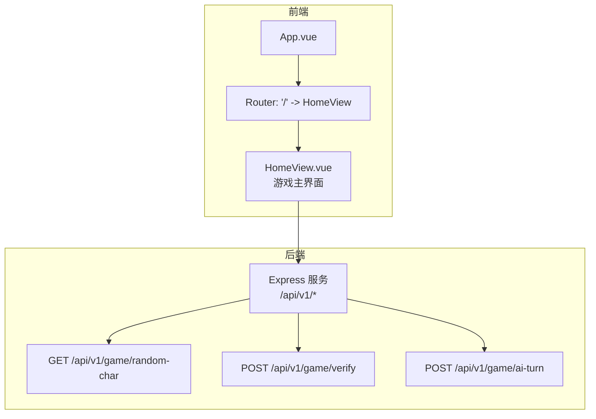
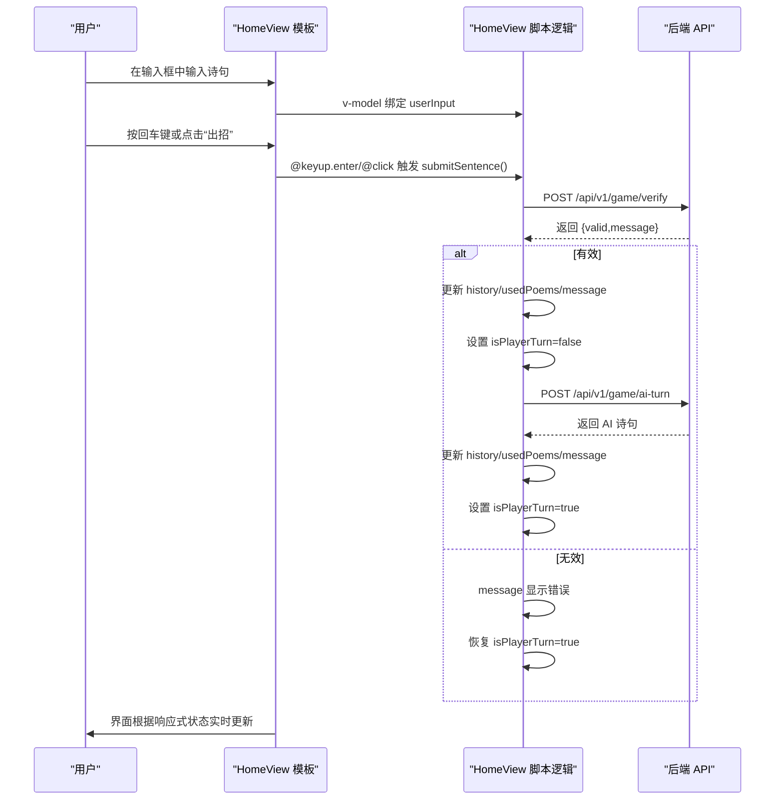
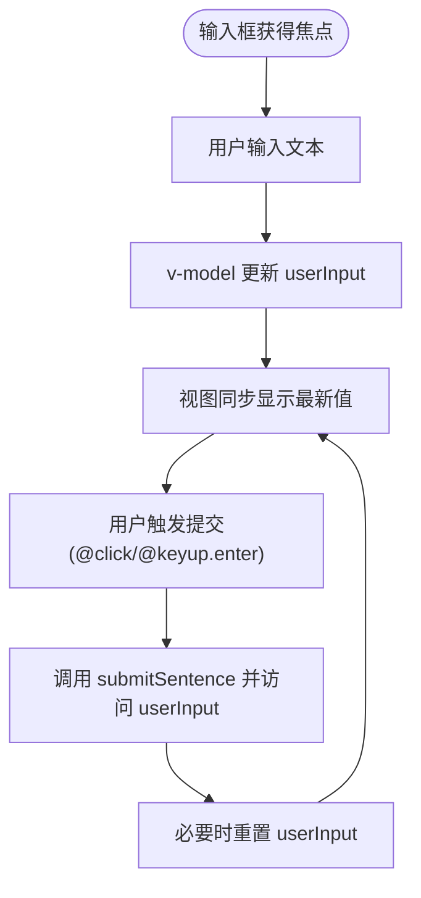
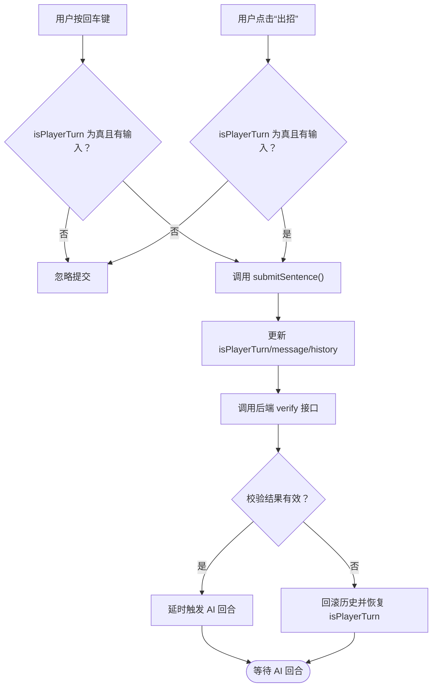
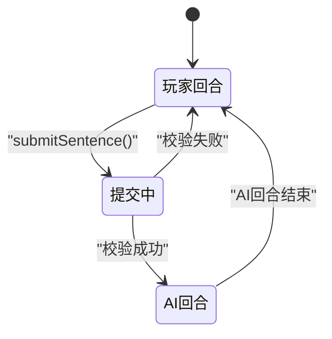
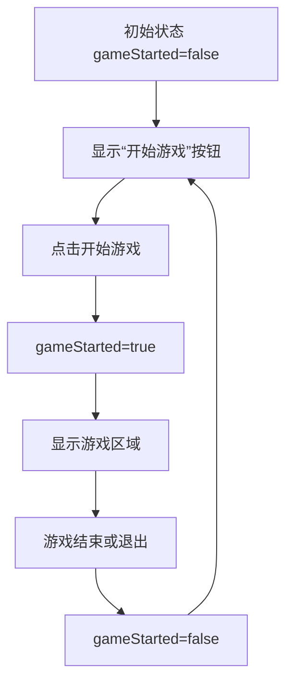
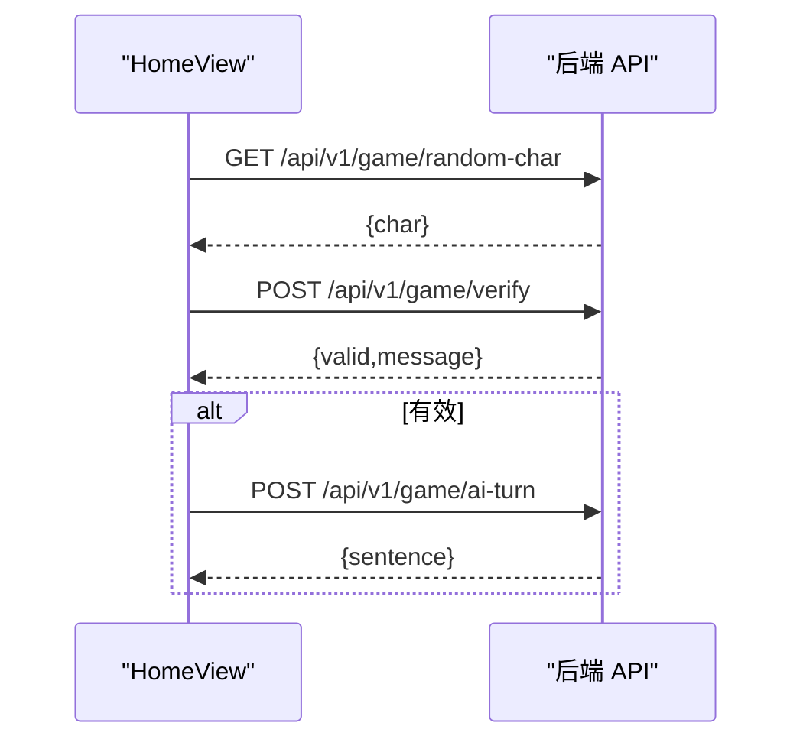
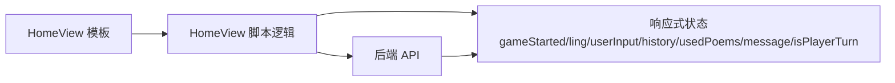

# 模板数据绑定与用户交互

<cite>
**本文引用的文件**
- [frontend/src/views/HomeView.vue](file://frontend/src/views/HomeView.vue)
- [frontend/src/App.vue](file://frontend/src/App.vue)
- [frontend/src/router/index.ts](file://frontend/src/router/index.ts)
- [frontend/src/main.ts](file://frontend/src/main.ts)
- [backend/src/index.ts](file://backend/src/index.ts)
</cite>

## 目录
1. [简介](#简介)
2. [项目结构](#项目结构)
3. [核心组件](#核心组件)
4. [架构总览](#架构总览)
5. [详细组件分析](#详细组件分析)
6. [依赖关系分析](#依赖关系分析)
7. [性能考量](#性能考量)
8. [故障排查指南](#故障排查指南)
9. [结论](#结论)

## 简介
本节聚焦于前端模板中的数据绑定与用户交互机制，重点解释：
- 输入框通过 v-model 与响应式 ref 实现双向数据绑定，确保用户输入实时同步到响应式状态；
- @keyup.enter 与 @click 事件监听如何触发提交逻辑，并结合 isPlayerTurn 控制按钮与输入框的禁用状态；
- v-if 基于 gameStarted 控制“开始游戏”按钮与游戏区域的条件渲染，使界面状态与数据状态保持一致。

## 项目结构
- 前端采用 Vue 3 单页应用，使用 Vue Router 进行页面路由，使用 Pinia 进行状态管理（本功能未直接使用）。
- HomeView 是游戏主界面，包含飞花令的核心交互逻辑与模板。
- 后端提供三个 API：获取令字、校验诗句、AI 回合。

图表来源
- [frontend/src/App.vue](file://frontend/src/App.vue#L1-L19)
- [frontend/src/router/index.ts](file://frontend/src/router/index.ts#L1-L24)
- [frontend/src/views/HomeView.vue](file://frontend/src/views/HomeView.vue#L87-L137)
- [backend/src/index.ts](file://backend/src/index.ts#L1-L78)

章节来源
- [frontend/src/App.vue](file://frontend/src/App.vue#L1-L19)
- [frontend/src/router/index.ts](file://frontend/src/router/index.ts#L1-L24)
- [frontend/src/main.ts](file://frontend/src/main.ts#L1-L15)

## 核心组件
- HomeView：定义并维护游戏状态（gameStarted、ling、userInput、history、usedPoems、message、isPlayerTurn），并通过异步函数与后端 API 交互，驱动模板渲染与用户交互。

关键响应式状态与用途
- gameStarted：控制“开始游戏”按钮与游戏区域的显示/隐藏。
- ling：当前轮次的令字，用于校验用户输入是否包含该字符。
- userInput：用户输入的诗句，通过 v-model 双向绑定。
- history：历史记录数组，展示玩家与 AI 的出句。
- usedPoems：已使用的诗句集合，避免重复使用。
- message：状态提示文本，如“轮到AI了…”、“无效的诗句”等。
- isPlayerTurn：回合控制，true 表示轮到玩家，false 表示轮到 AI。

章节来源
- [frontend/src/views/HomeView.vue](file://frontend/src/views/HomeView.vue#L1-L30)

## 架构总览
下图展示了从用户输入到后端验证再到界面更新的完整流程，包括模板层的数据绑定与事件监听。

图表来源
- [frontend/src/views/HomeView.vue](file://frontend/src/views/HomeView.vue#L87-L137)
- [frontend/src/views/HomeView.vue](file://frontend/src/views/HomeView.vue#L32-L84)
- [backend/src/index.ts](file://backend/src/index.ts#L12-L48)
- [backend/src/index.ts](file://backend/src/index.ts#L50-L72)

## 详细组件分析

### 数据绑定：v-model 与 userInput 的双向同步
- 绑定方式：模板中通过 v-model 将 input 元素与 userInput 响应式变量建立双向绑定。
- 实时性：用户在输入框中输入内容会立即更新 userInput；同时，当脚本逻辑重置 userInput 时，输入框也会清空，保证视图与状态一致。
- 使用场景：作为 submitSentence 的输入源，参与后端校验与历史记录。

图表来源
- [frontend/src/views/HomeView.vue](file://frontend/src/views/HomeView.vue#L106-L115)

章节来源
- [frontend/src/views/HomeView.vue](file://frontend/src/views/HomeView.vue#L106-L115)

### 事件监听：@keyup.enter 与 @click 触发 submitSentence
- 回车提交：@keyup.enter 绑定到输入框，用户按回车键即可触发提交逻辑。
- 点击提交：按钮 @click 同样触发 submitSentence，便于鼠标操作。
- 提交前置条件：只有当 userInput 存在且 isPlayerTurn 为真时才允许提交，否则直接返回。

图表来源
- [frontend/src/views/HomeView.vue](file://frontend/src/views/HomeView.vue#L32-L84)
- [frontend/src/views/HomeView.vue](file://frontend/src/views/HomeView.vue#L106-L115)

章节来源
- [frontend/src/views/HomeView.vue](file://frontend/src/views/HomeView.vue#L32-L84)
- [frontend/src/views/HomeView.vue](file://frontend/src/views/HomeView.vue#L106-L115)

### 按钮与输入框的禁用状态：isPlayerTurn 的响应式控制
- 禁用条件：当 isPlayerTurn 为假时，输入框与按钮均被禁用，防止非轮次操作。
- 切换时机：
  - 提交前：isPlayerTurn 设为假，阻止重复提交；
  - 校验失败：恢复 isPlayerTurn 为真；
  - 校验成功：进入 AI 回合，稍后恢复为真。
- 视觉反馈：禁用态样式由 :disabled 与 button:disabled 样式控制，提升可感知性。

图表来源
- [frontend/src/views/HomeView.vue](file://frontend/src/views/HomeView.vue#L32-L84)
- [frontend/src/views/HomeView.vue](file://frontend/src/views/HomeView.vue#L106-L115)
- [frontend/src/views/HomeView.vue](file://frontend/src/views/HomeView.vue#L208-L231)

章节来源
- [frontend/src/views/HomeView.vue](file://frontend/src/views/HomeView.vue#L106-L115)
- [frontend/src/views/HomeView.vue](file://frontend/src/views/HomeView.vue#L208-L231)

### 条件渲染：v-if 基于 gameStarted 控制界面显示
- “开始游戏”按钮：当 gameStarted 为假时显示，点击后启动游戏并设置 gameStarted 为真。
- 游戏区域：当 gameStarted 为真时显示，包含状态消息、历史记录、输入区与按钮。
- 一致性保障：通过响应式状态驱动 v-if，确保界面与数据状态保持一致，避免在未开始时出现交互。

图表来源
- [frontend/src/views/HomeView.vue](file://frontend/src/views/HomeView.vue#L92-L116)

章节来源
- [frontend/src/views/HomeView.vue](file://frontend/src/views/HomeView.vue#L92-L116)

### 后端接口与数据流补充
- 获取令字：随机选择一首诗中的一个字符作为令字。
- 校验诗句：检查是否包含令字、是否已使用、是否存在于诗词库。
- AI 回合：根据令字筛选可用诗句，返回一条合适的句子。

图表来源
- [frontend/src/views/HomeView.vue](file://frontend/src/views/HomeView.vue#L14-L30)
- [frontend/src/views/HomeView.vue](file://frontend/src/views/HomeView.vue#L32-L84)
- [backend/src/index.ts](file://backend/src/index.ts#L12-L48)
- [backend/src/index.ts](file://backend/src/index.ts#L50-L72)

章节来源
- [backend/src/index.ts](file://backend/src/index.ts#L12-L48)
- [backend/src/index.ts](file://backend/src/index.ts#L50-L72)

## 依赖关系分析
- 模板依赖：HomeView 模板依赖脚本逻辑中的响应式状态与方法，事件绑定与条件渲染均基于这些状态。
- 脚本依赖：submitSentence 依赖 isPlayerTurn、userInput、history、usedPoems、message；aiTurn 依赖 usedPoems、ling。
- 外部依赖：fetch 请求依赖后端 API，API 的行为直接影响前端状态更新与 UI 呈现。

图表来源
- [frontend/src/views/HomeView.vue](file://frontend/src/views/HomeView.vue#L1-L30)
- [frontend/src/views/HomeView.vue](file://frontend/src/views/HomeView.vue#L32-L84)
- [frontend/src/views/HomeView.vue](file://frontend/src/views/HomeView.vue#L87-L137)
- [backend/src/index.ts](file://backend/src/index.ts#L12-L48)
- [backend/src/index.ts](file://backend/src/index.ts#L50-L72)

章节来源
- [frontend/src/views/HomeView.vue](file://frontend/src/views/HomeView.vue#L1-L30)
- [frontend/src/views/HomeView.vue](file://frontend/src/views/HomeView.vue#L32-L84)
- [frontend/src/views/HomeView.vue](file://frontend/src/views/HomeView.vue#L87-L137)

## 性能考量
- 事件触发频率：输入框频繁更新，但仅在提交时进行网络请求，避免不必要的 IO。
- UI 更新粒度：history 使用 v-for 渲染列表，建议在数据量较大时考虑虚拟滚动或分页。
- 网络请求：提交与 AI 回合均需网络请求，建议在 UI 上增加加载指示，提升用户体验。
- 状态更新：isPlayerTurn 的切换能有效防止重复提交，减少无效请求。

## 故障排查指南
- 无法获取令字
  - 现象：message 显示获取失败。
  - 排查：确认后端服务运行正常，网络可达；检查 API 返回状态码与错误信息。
  - 关联位置：[frontend/src/views/HomeView.vue](file://frontend/src/views/HomeView.vue#L14-L30)，[backend/src/index.ts](file://backend/src/index.ts#L12-L21)
- 诗句校验失败
  - 现象：message 显示无效原因，历史记录回滚。
  - 排查：确认输入包含令字、未重复使用、存在于诗词库；检查后端 verify 接口逻辑。
  - 关联位置：[frontend/src/views/HomeView.vue](file://frontend/src/views/HomeView.vue#L32-L84)，[backend/src/index.ts](file://backend/src/index.ts#L23-L48)
- AI 回合异常
  - 现象：message 显示 AI 无法继续，游戏结束。
  - 排查：检查可用诗句筛选逻辑，确认 usedPoems 与 char 匹配；检查后端返回状态。
  - 关联位置：[frontend/src/views/HomeView.vue](file://frontend/src/views/HomeView.vue#L64-L84)，[backend/src/index.ts](file://backend/src/index.ts#L50-L72)
- 输入框不可用
  - 现象：输入框与按钮处于禁用状态。
  - 排查：确认 isPlayerTurn 是否为假；检查提交流程是否正确切换状态。
  - 关联位置：[frontend/src/views/HomeView.vue](file://frontend/src/views/HomeView.vue#L106-L115)，[frontend/src/views/HomeView.vue](file://frontend/src/views/HomeView.vue#L208-L231)

章节来源
- [frontend/src/views/HomeView.vue](file://frontend/src/views/HomeView.vue#L14-L30)
- [frontend/src/views/HomeView.vue](file://frontend/src/views/HomeView.vue#L32-L84)
- [frontend/src/views/HomeView.vue](file://frontend/src/views/HomeView.vue#L64-L84)
- [frontend/src/views/HomeView.vue](file://frontend/src/views/HomeView.vue#L106-L115)
- [frontend/src/views/HomeView.vue](file://frontend/src/views/HomeView.vue#L208-L231)
- [backend/src/index.ts](file://backend/src/index.ts#L12-L48)
- [backend/src/index.ts](file://backend/src/index.ts#L50-L72)

## 结论
- v-model 将用户输入与 userInput 实现双向绑定，确保输入实时反映在响应式状态中；
- @keyup.enter 与 @click 事件统一委托给 submitSentence，配合 isPlayerTurn 实现回合控制；
- v-if 基于 gameStarted 条件渲染，保证界面与数据状态一致；
- 整体流程清晰、职责分离明确，前后端通过简洁的 API 完成交互闭环。