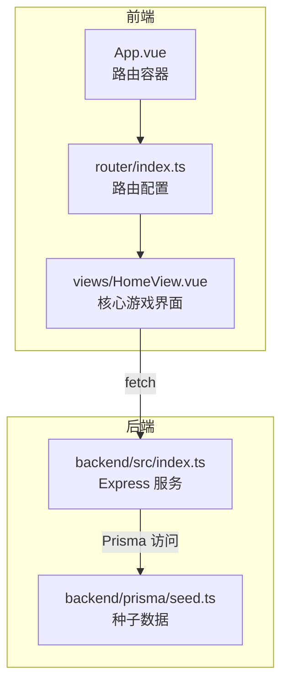
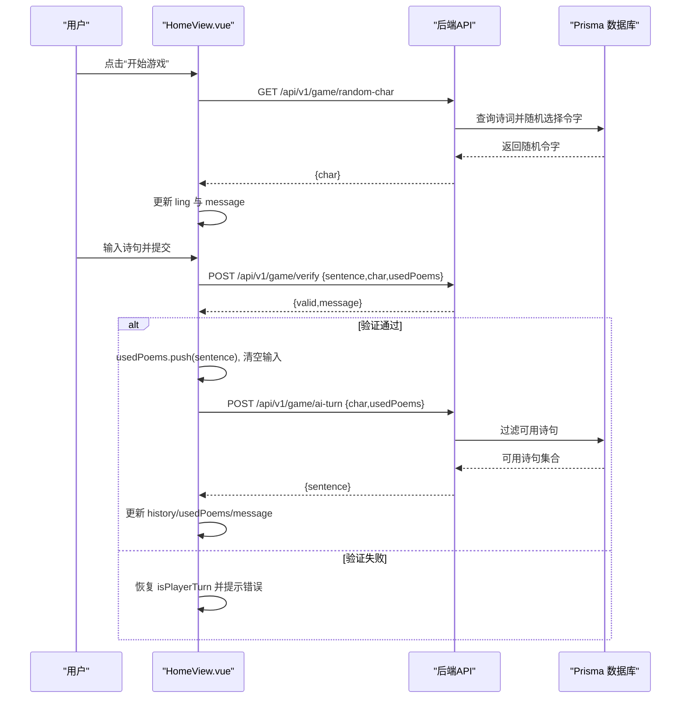
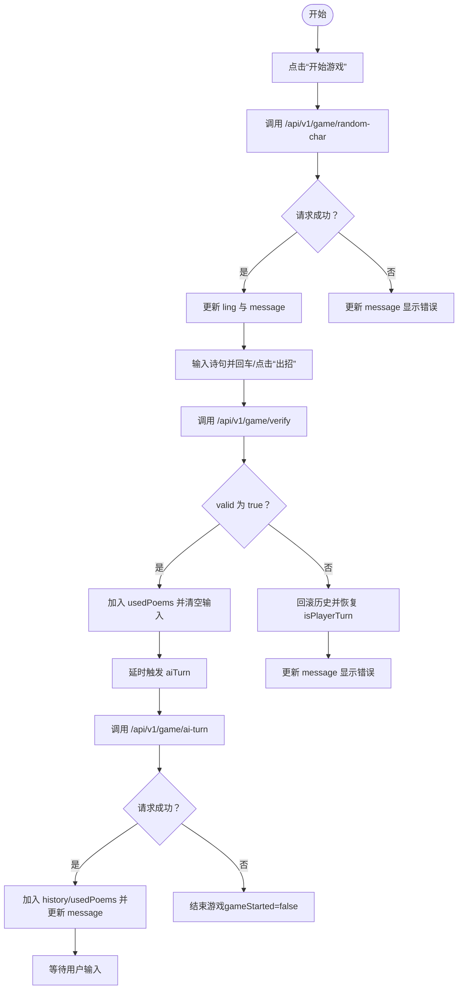

# 核心UI组件

<cite>
**本文引用的文件**
- [HomeView.vue](file://frontend/src/views/HomeView.vue)
- [index.ts（后端）](file://backend/src/index.ts)
- [seed.ts（后端）](file://backend/prisma/seed.ts)
- [App.vue](file://frontend/src/App.vue)
- [router/index.ts](file://frontend/src/router/index.ts)
- [package.json（前端）](file://frontend/package.json)
</cite>

## 目录
1. [简介](#简介)
2. [项目结构](#项目结构)
3. [核心组件](#核心组件)
4. [架构总览](#架构总览)
5. [详细组件分析](#详细组件分析)
6. [依赖分析](#依赖分析)
7. [性能考虑](#性能考虑)
8. [故障排查指南](#故障排查指南)
9. [结论](#结论)

## 简介
本文件对飞花令游戏的核心界面 HomeView.vue 进行深入解析，覆盖模板结构、组合式API（ref）的使用、三个核心方法的异步流程与错误处理，以及模板指令（v-model、v-for、v-if）在UI交互中的作用。文档还提供数据流与用户操作的映射关系图，帮助读者从零到一理解从前端到后端的完整交互链路。

## 项目结构
- 前端采用 Vue 3 单页应用，通过 vue-router 将 HomeView 作为根路径页面。
- 后端基于 Express 提供 REST API，使用 Prisma 访问本地数据库，内置诗词种子数据。
- 前端通过 fetch 调用后端接口，完成“获取令字”“验证诗句”“AI回合”等流程。

图表来源
- [App.vue](file://frontend/src/App.vue#L1-L19)
- [router/index.ts](file://frontend/src/router/index.ts#L1-L24)
- [HomeView.vue](file://frontend/src/views/HomeView.vue#L1-L120)
- [index.ts（后端）](file://backend/src/index.ts#L1-L78)
- [seed.ts（后端）](file://backend/prisma/seed.ts#L1-L53)

章节来源
- [App.vue](file://frontend/src/App.vue#L1-L19)
- [router/index.ts](file://frontend/src/router/index.ts#L1-L24)
- [HomeView.vue](file://frontend/src/views/HomeView.vue#L1-L120)
- [index.ts（后端）](file://backend/src/index.ts#L1-L78)
- [seed.ts（后端）](file://backend/prisma/seed.ts#L1-L53)

## 核心组件
- 组件职责：承载飞花令游戏的主界面，负责令字获取、玩家输入、历史记录展示、AI回合与消息提示。
- 关键响应式状态：
  - gameStarted：控制是否进入游戏区域
  - ling：当前轮次的令字
  - userInput：玩家输入框内容
  - history：对话历史（作者与文本）
  - usedPoems：已使用的诗句集合
  - message：状态提示信息
  - isPlayerTurn：当前回合归属（true为玩家）

章节来源
- [HomeView.vue](file://frontend/src/views/HomeView.vue#L1-L85)

## 架构总览
下图展示了从用户点击“开始游戏”到AI回合结束的端到端流程，包括前后端交互与状态流转。

图表来源
- [HomeView.vue](file://frontend/src/views/HomeView.vue#L14-L84)
- [index.ts（后端）](file://backend/src/index.ts#L12-L72)

## 详细组件分析

### 组合式API与响应式变量
- 使用 ref 定义的响应式变量及其用途：
  - gameStarted：控制“开始游戏”按钮与游戏区域的显示切换
  - ling：本轮令字，用于验证玩家输入是否包含该字符
  - userInput：绑定输入框，支持回车提交与按钮提交
  - history：数组，存储每一步的作者与诗句，用于历史展示
  - usedPoems：数组，记录已使用的诗句，避免重复
  - message：字符串，用于向用户反馈状态或错误信息
  - isPlayerTurn：布尔值，控制输入框与按钮的启用/禁用状态，决定回合归属
- 响应式更新机制：
  - 所有变量通过 ref 包裹，赋值时自动触发视图更新
  - 在异步流程中，先设置 isPlayerTurn=false 防止重复提交；验证通过后再恢复回合

章节来源
- [HomeView.vue](file://frontend/src/views/HomeView.vue#L6-L13)

### 模板指令与UI交互
- v-if 条件渲染：
  - 当 gameStarted 为 false 时显示“开始游戏”按钮
  - 当 gameStarted 为 true 时显示游戏区域（状态消息、历史、输入区）
- v-for 列表渲染：
  - 遍历 history 数组，按条目作者区分样式类（用户/AI），并展示作者与诗句
- v-model 双向绑定：
  - 将 userInput 与输入框双向绑定，支持键盘事件与按钮提交
- 事件绑定：
  - @keyup.enter 触发 submitSentence
  - @click 触发 startGame 与 submitSentence
  - input/disabled 控制输入框在非玩家回合时不可编辑
- 样式与布局：
  - 使用 scoped 样式定义容器、按钮、输入框、历史列表等视觉层次

章节来源
- [HomeView.vue](file://frontend/src/views/HomeView.vue#L87-L118)
- [HomeView.vue](file://frontend/src/views/HomeView.vue#L120-L232)

### 核心方法：startGame（获取令字）
- 流程要点：
  - 设置 gameStarted=true，清空历史与已用诗句，重置输入与消息
  - 调用后端 GET /api/v1/game/random-char 获取令字
  - 成功时将 char 写入 ling，并更新 message 显示令字
  - 失败时捕获异常并显示错误消息
- 错误处理：
  - 对非 OK 响应抛出错误，统一在 catch 中设置 message

章节来源
- [HomeView.vue](file://frontend/src/views/HomeView.vue#L14-L30)
- [index.ts（后端）](file://backend/src/index.ts#L12-L21)

### 核心方法：submitSentence（验证用户输入并触发AI回合）
- 流程要点：
  - 校验输入非空且当前为玩家回合，否则直接返回
  - 设置 isPlayerTurn=false，清空 message，将当前输入推入 history
  - 调用后端 POST /api/v1/game/verify，携带 sentence、char、usedPoems
  - 若验证通过：
    - 将句子加入 usedPoems，清空输入
    - message 提示“轮到AI了”，延时执行 aiTurn
  - 若验证失败：
    - message 显示具体原因，回滚历史并恢复 isPlayerTurn
  - 异常处理：网络错误时提示“请求失败，请检查网络”，并恢复 isPlayerTurn
- 错误处理：
  - 对无效输入、重复使用、不在诗词库等情况，后端返回 valid=false 与 message
  - 前端根据返回值分支处理

章节来源
- [HomeView.vue](file://frontend/src/views/HomeView.vue#L32-L62)
- [index.ts（后端）](file://backend/src/index.ts#L23-L48)

### 核心方法：aiTurn（AI回合）
- 流程要点：
  - 调用后端 POST /api/v1/game/ai-turn，携带 char 与 usedPoems
  - 成功时将返回的 AI 诗句加入 history 与 usedPoems，更新 message 为“该你了！”并恢复 isPlayerTurn
  - 失败时捕获异常，message 显示错误，gameStarted=false 结束游戏
- 错误处理：
  - 后端可能因无可用诗句而返回 404，前端据此结束游戏并提示

章节来源
- [HomeView.vue](file://frontend/src/views/HomeView.vue#L64-L84)
- [index.ts（后端）](file://backend/src/index.ts#L50-L72)

### 数据流与用户操作映射图
下图以流程图形式展示从用户输入到状态更新的关键节点，体现 v-model、v-for、v-if 的协同作用与数据流向。

图表来源
- [HomeView.vue](file://frontend/src/views/HomeView.vue#L14-L84)
- [index.ts（后端）](file://backend/src/index.ts#L12-L72)

## 依赖分析
- 前端依赖：
  - Vue 3（组合式API、ref、模板语法）
  - vue-router（路由到 HomeView）
  - TailwindCSS（样式）
- 后端依赖：
  - Express（HTTP 服务器）
  - Prisma（数据库访问）
  - CORS（跨域支持）
- 数据模型与种子：
  - 后端通过 seed.ts 初始化诗词数据，包含多首经典诗作，content 由段落拼接而成
  - Prisma 模型与迁移文件位于 prisma/migrations 下

章节来源
- [package.json（前端）](file://frontend/package.json#L1-L51)
- [index.ts（后端）](file://backend/src/index.ts#L1-L78)
- [seed.ts（后端）](file://backend/prisma/seed.ts#L1-L53)

## 性能考虑
- 请求节流：submitSentence 中在提交后立即禁用输入与按钮，避免重复提交导致的并发请求
- UI延迟：aiTurn 采用短延迟触发，提升交互体验但需注意频繁触发时的用户体验
- 列表渲染：history 使用 v-for 渲染，建议在数据量较大时考虑虚拟滚动或分页策略（当前项目规模较小，无需额外优化）
- 网络健壮性：对 fetch 的错误进行统一捕获与提示，避免未处理异常导致的崩溃

## 故障排查指南
- 无法获取令字
  - 检查后端服务是否启动，端口与路径是否正确
  - 查看后端日志，确认 Prisma 是否成功加载种子数据
- 诗句验证失败
  - 确认输入包含令字、未重复使用、且存在于诗词库中
  - 检查 usedPoems 传递是否正确
- AI 回合失败
  - 当无可用诗句时后端会返回 404，前端会结束游戏并提示
- UI 不响应
  - 确认 gameStarted 与 isPlayerTurn 的状态是否符合预期
  - 检查输入框是否被禁用（非玩家回合）

章节来源
- [HomeView.vue](file://frontend/src/views/HomeView.vue#L14-L84)
- [index.ts（后端）](file://backend/src/index.ts#L12-L72)

## 结论
HomeView.vue 以简洁的组合式API与清晰的模板指令实现了飞花令的核心交互：从令字获取、玩家输入验证到AI回合生成。通过合理的状态管理与错误处理，组件在前后端协作下提供了流畅的用户体验。后续可考虑引入虚拟滚动、更丰富的提示与重试机制，进一步提升性能与可维护性。