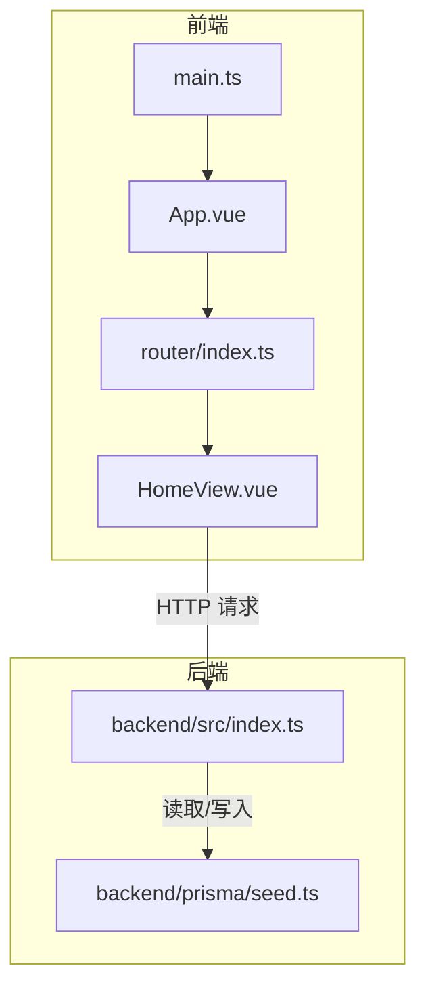
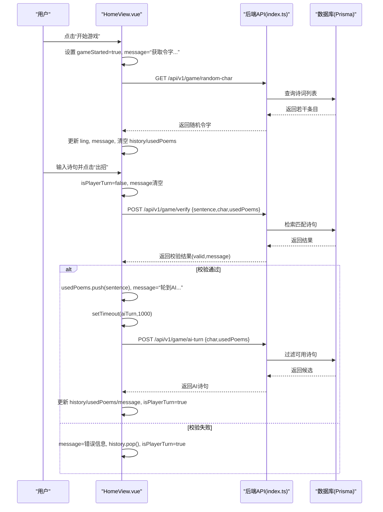
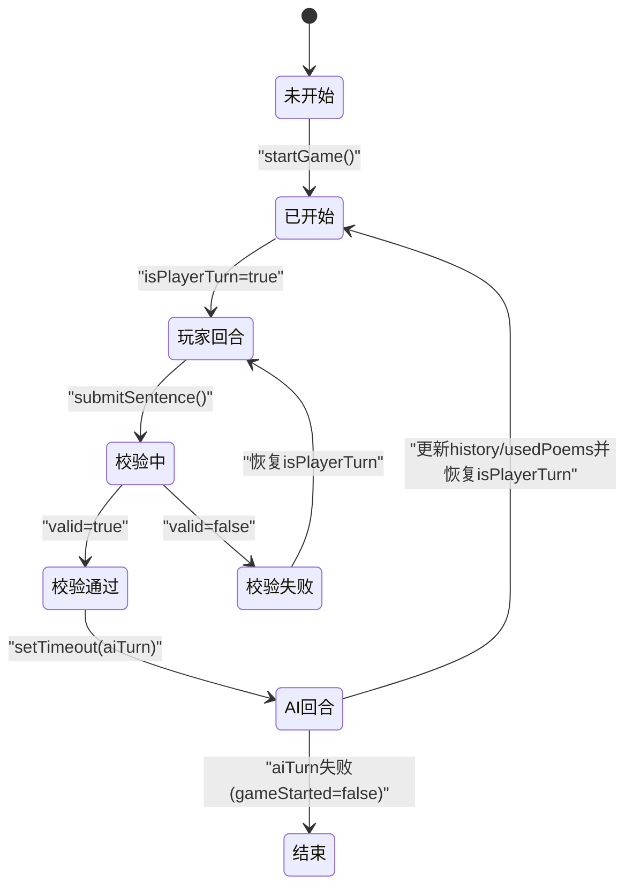
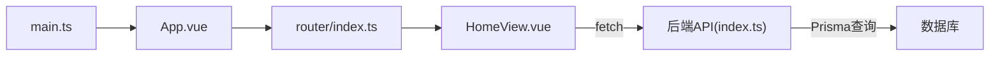

# 游戏控制逻辑

<cite>
**本文引用的文件**
- [HomeView.vue](file://frontend/src/views/HomeView.vue)
- [index.ts（后端API）](file://backend/src/index.ts)
- [seed.ts（后端种子数据）](file://backend/prisma/seed.ts)
- [main.ts（前端入口）](file://frontend/src/main.ts)
- [App.vue](file://frontend/src/App.vue)
- [router/index.ts](file://frontend/src/router/index.ts)
</cite>

## 目录
1. [引言](#引言)
2. [项目结构](#项目结构)
3. [核心组件](#核心组件)
4. [架构总览](#架构总览)
5. [详细组件分析](#详细组件分析)
6. [依赖关系分析](#依赖关系分析)
7. [性能考量](#性能考量)
8. [故障排查指南](#故障排查指南)
9. [结论](#结论)

## 引言
本文件聚焦于 HomeView.vue 中“飞花令”游戏的控制逻辑，系统性解析以下主题：
- 响应式状态 gameStarted、isPlayerTurn 如何驱动 UI 条件渲染
- startGame 初始化流程与后端 API 的交互
- ref 响应式系统在状态管理中的作用
- history 数组与 usedPoems 数组的数据结构设计及在防重复与记录过程中的作用
- 完整的状态流转图：从开始到结束的游戏生命周期
- 常见异常场景（如无法开始游戏）的排查方法

## 项目结构
前端采用 Vue 3 单文件组件与 Vue Router 路由，后端使用 Express + Prisma 提供 REST API。HomeView.vue 作为游戏主界面，负责状态管理与 UI 渲染；后端提供随机令字、诗句校验、AI 回合等接口。

图表来源
- [App.vue](file://frontend/src/App.vue#L1-L19)
- [router/index.ts](file://frontend/src/router/index.ts#L1-L24)
- [HomeView.vue](file://frontend/src/views/HomeView.vue#L1-L118)
- [index.ts（后端API）](file://backend/src/index.ts#L1-L78)
- [seed.ts（后端种子数据）](file://backend/prisma/seed.ts#L1-L53)

章节来源
- [main.ts（前端入口）](file://frontend/src/main.ts#L1-L15)
- [App.vue](file://frontend/src/App.vue#L1-L19)
- [router/index.ts](file://frontend/src/router/index.ts#L1-L24)
- [HomeView.vue](file://frontend/src/views/HomeView.vue#L1-L118)
- [index.ts（后端API）](file://backend/src/index.ts#L1-L78)
- [seed.ts（后端种子数据）](file://backend/prisma/seed.ts#L1-L53)

## 核心组件
- 响应式状态
  - gameStarted：控制“开始游戏”按钮是否显示，以及游戏区域是否渲染
  - isPlayerTurn：控制玩家输入框与按钮是否可用，决定回合制顺序
  - ling：当前轮次的令字，来源于后端随机获取
  - userInput：玩家输入的诗句
  - history：记录双方出招历史，元素为对象，包含作者与文本
  - usedPoems：已使用的诗句集合，用于防重复
  - message：状态提示信息，贯穿整个游戏生命周期
- 关键方法
  - startGame：初始化游戏状态并请求后端随机令字
  - submitSentence：提交玩家诗句，调用后端校验并推进回合
  - aiTurn：向后端请求 AI 回合，更新历史与状态

章节来源
- [HomeView.vue](file://frontend/src/views/HomeView.vue#L1-L118)

## 架构总览
下图展示了从前端发起请求到后端处理与返回的完整链路，以及状态在各阶段的变化。

图表来源
- [HomeView.vue](file://frontend/src/views/HomeView.vue#L14-L84)
- [index.ts（后端API）](file://backend/src/index.ts#L12-L72)

## 详细组件分析

### 响应式变量与UI条件渲染
- gameStarted
  - 作用：控制“开始游戏”按钮与游戏区域的显示/隐藏
  - 影响：当为 false 时显示按钮；为 true 时渲染游戏区域
- isPlayerTurn
  - 作用：控制输入框与按钮的禁用状态，决定回合制
  - 影响：为 true 时允许玩家输入；为 false 时禁用输入
- message
  - 作用：实时反馈当前状态（开始、获取令字、校验结果、AI回合等）
- history 与 usedPoems
  - history：记录双方出招，用于展示对战过程
  - usedPoems：记录已使用诗句，避免重复

章节来源
- [HomeView.vue](file://frontend/src/views/HomeView.vue#L1-L118)

### startGame：初始化与令字获取
- 初始化步骤
  - gameStarted=true
  - 清空 history 与 usedPoems
  - 清空 userInput
  - message=“游戏开始！正在获取令字...”
- 后端交互
  - 请求 GET /api/v1/game/random-char
  - 成功：将返回的令字赋给 ling，并更新 message
  - 失败：捕获错误并设置 message

章节来源
- [HomeView.vue](file://frontend/src/views/HomeView.vue#L14-L30)
- [index.ts（后端API）](file://backend/src/index.ts#L12-L21)

### submitSentence：玩家回合与校验
- 触发条件
  - 用户输入非空且 isPlayerTurn=true
- 执行流程
  - isPlayerTurn=false
  - 将本次输入加入 history
  - 请求 POST /api/v1/game/verify，携带 sentence、char、usedPoems
  - 校验通过：将句子加入 usedPoems，清空输入，message=“轮到AI...”，延时执行 aiTurn
  - 校验失败：message=错误信息，回滚历史，恢复 isPlayerTurn=true
- 错误处理
  - 网络异常：message=“请求失败，请检查网络”，恢复 isPlayerTurn=true

章节来源
- [HomeView.vue](file://frontend/src/views/HomeView.vue#L32-L62)
- [index.ts（后端API）](file://backend/src/index.ts#L23-L48)

### aiTurn：AI回合与状态恢复
- 请求 POST /api/v1/game/ai-turn，携带 char 与 usedPoems
- 成功：将 AI 诗句加入 history 与 usedPoems，更新 message=“该你了！”，isPlayerTurn=true
- 失败：message=错误信息，gameStarted=false（视为游戏结束）

章节来源
- [HomeView.vue](file://frontend/src/views/HomeView.vue#L64-L84)
- [index.ts（后端API）](file://backend/src/index.ts#L50-L72)

### 数据结构设计与复杂度
- history：数组，元素为对象（作者、文本）。每次新增 O(1)，渲染按长度线性展开
- usedPoems：字符串数组，用于去重判断。查找包含关系为 O(n)，n 为已用诗句数
- 优化建议
  - 使用 Set 替代数组进行去重判断，可将查找降为 O(1)
  - 对历史记录做上限限制，避免无限增长导致渲染卡顿

章节来源
- [HomeView.vue](file://frontend/src/views/HomeView.vue#L1-L118)

### 状态流转图：从开始到结束

图表来源
- [HomeView.vue](file://frontend/src/views/HomeView.vue#L14-L84)

### UI 条件渲染与交互细节
- v-if 控制“开始游戏”按钮与游戏区域
- v-model 双向绑定 userInput
- :disabled 绑定 isPlayerTurn，实现回合制输入控制
- v-for 渲染 history，区分用户与 AI 的样式类

章节来源
- [HomeView.vue](file://frontend/src/views/HomeView.vue#L87-L118)

## 依赖关系分析
- 前端依赖
  - Vue 3（组合式 API、ref 响应式）
  - Vue Router（路由到 HomeView.vue）
  - Pinia（应用状态管理，当前页面未直接使用）
- 后端依赖
  - Express（HTTP 服务）
  - Prisma（数据库访问）
  - CORS（跨域支持）

图表来源
- [HomeView.vue](file://frontend/src/views/HomeView.vue#L1-L118)
- [index.ts（后端API）](file://backend/src/index.ts#L1-L78)
- [router/index.ts](file://frontend/src/router/index.ts#L1-L24)
- [App.vue](file://frontend/src/App.vue#L1-L19)
- [main.ts（前端入口）](file://frontend/src/main.ts#L1-L15)

章节来源
- [HomeView.vue](file://frontend/src/views/HomeView.vue#L1-L118)
- [index.ts（后端API）](file://backend/src/index.ts#L1-L78)
- [router/index.ts](file://frontend/src/router/index.ts#L1-L24)
- [App.vue](file://frontend/src/App.vue#L1-L19)
- [main.ts（前端入口）](file://frontend/src/main.ts#L1-L15)

## 性能考量
- 网络请求
  - startGame 与两次 API 请求（随机令字、校验、AI 回合）均在网络不稳定时可能阻塞 UI
  - 建议增加 loading 状态与超时控制
- 数据结构
  - usedPoems 使用数组进行包含判断，随规模增大性能下降
  - 建议改用 Set 以提升查找效率
- DOM 渲染
  - history 随回合增长，建议限制最大长度或分页加载

[本节为通用性能建议，不直接分析具体文件]

## 故障排查指南
- 无法开始游戏
  - 检查后端服务是否启动（默认端口 3000），确认 CORS 是否允许
  - 查看浏览器开发者工具 Network 面板，确认 GET /api/v1/game/random-char 是否返回 200
  - 若返回 404 或错误信息，检查数据库是否已导入种子数据
- 诗句校验失败
  - 确认输入包含令字；确认未重复使用同一诗句
  - 检查后端 verify 接口返回的 valid 与 message 字段
- AI 回合异常
  - 若返回“AI也想不出来了”，表示可用诗句耗尽，游戏结束
  - 检查后端 ai-turn 接口是否正确过滤 usedPoems
- UI 不响应
  - 确认 gameStarted 与 isPlayerTurn 的值是否符合预期
  - 检查 message 是否被错误覆盖

章节来源
- [HomeView.vue](file://frontend/src/views/HomeView.vue#L14-L84)
- [index.ts（后端API）](file://backend/src/index.ts#L12-L72)
- [seed.ts（后端种子数据）](file://backend/prisma/seed.ts#L1-L53)

## 结论
HomeView.vue 通过少量响应式变量实现了清晰的回合制飞花令游戏控制：gameStarted 与 isPlayerTurn 决定 UI 显示与交互，startGame 初始化并获取令字，submitSentence 与 aiTurn 分别处理玩家与 AI 的回合推进。history 与 usedPoems 共同保证了对战过程的可视化与规则约束。建议后续优化包括：将 usedPoems 改为 Set、限制历史长度、增加网络错误与超时处理，以进一步提升性能与用户体验。