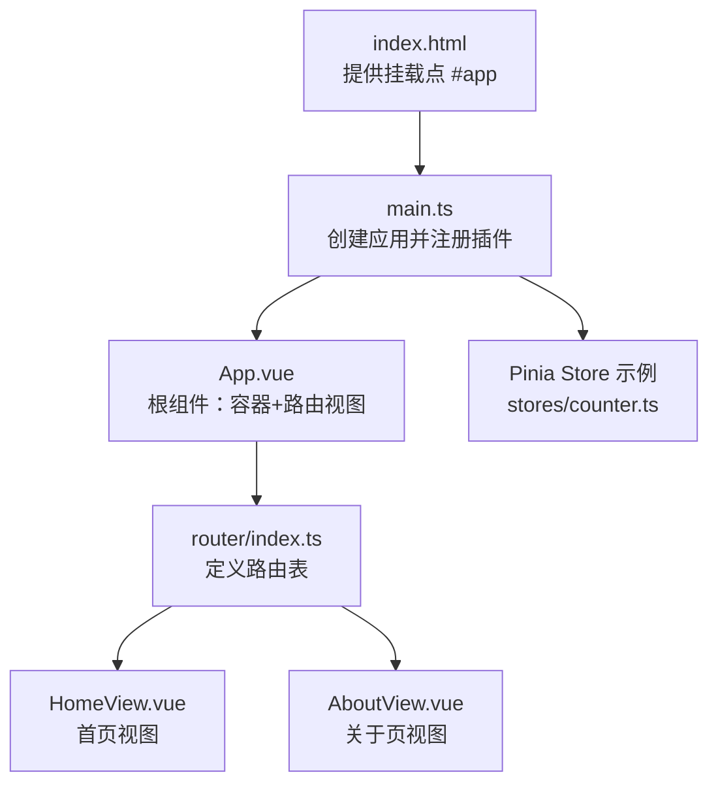
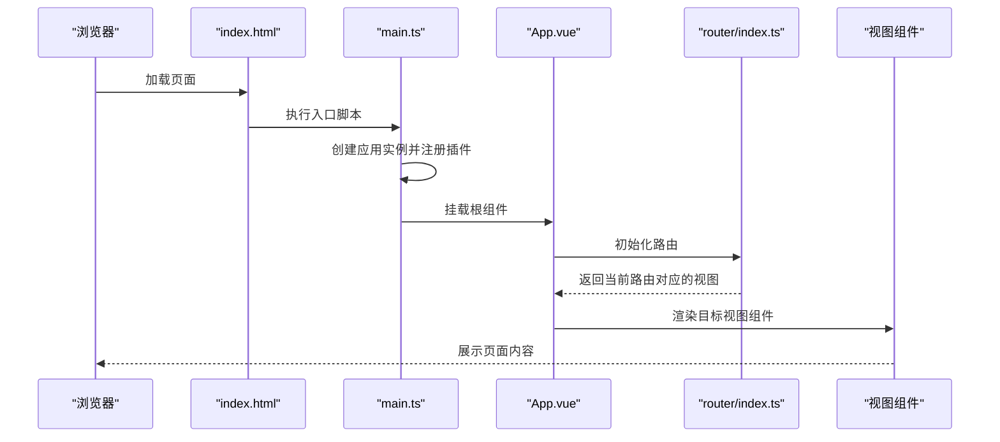
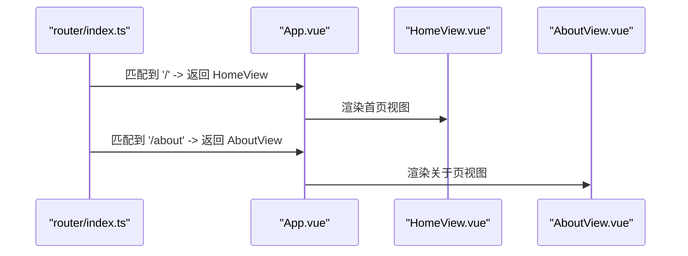
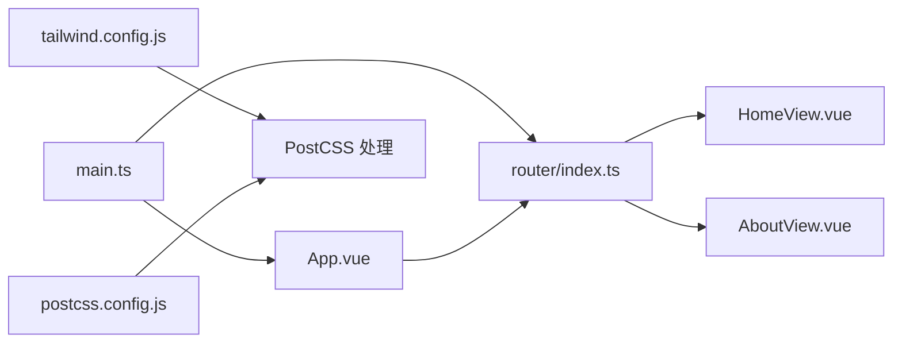

# 根组件App

<cite>
**本文引用的文件**
- [frontend/src/App.vue](file://frontend/src/App.vue)
- [frontend/src/main.ts](file://frontend/src/main.ts)
- [frontend/src/router/index.ts](file://frontend/src/router/index.ts)
- [frontend/src/views/HomeView.vue](file://frontend/src/views/HomeView.vue)
- [frontend/src/views/AboutView.vue](file://frontend/src/views/AboutView.vue)
- [frontend/tailwind.config.js](file://frontend/tailwind.config.js)
- [frontend/postcss.config.js](file://frontend/postcss.config.js)
- [frontend/index.html](file://frontend/index.html)
</cite>

## 目录
1. [引言](#引言)
2. [项目结构](#项目结构)
3. [核心组件](#核心组件)
4. [架构总览](#架构总览)
5. [详细组件分析](#详细组件分析)
6. [依赖关系分析](#依赖关系分析)
7. [性能考量](#性能考量)
8. [故障排查指南](#故障排查指南)
9. [结论](#结论)

## 引言
本文件聚焦于前端根组件 App.vue 的结构设计与职责边界，系统性解析其采用的组合式 API 写法、通过 RouterView 实现的动态路由视图渲染机制、scoped 样式的作用范围与 #app-container 容器的布局约束（最大宽度、居中、内边距），并结合 Tailwind CSS 配置说明响应式设计基础，最后阐明该组件在整个 UI 架构中的枢纽地位与扩展点。

## 项目结构
前端采用 Vite + Vue 3 + Pinia + vue-router + Tailwind CSS 的现代单页应用栈。入口 HTML 提供挂载点，应用通过 main.ts 创建并注入插件，App.vue 作为根组件承载路由视图容器，路由模块定义页面级视图组件，视图组件各自负责业务逻辑与局部样式。

图表来源
- [frontend/index.html](file://frontend/index.html#L1-L14)
- [frontend/src/main.ts](file://frontend/src/main.ts#L1-L15)
- [frontend/src/App.vue](file://frontend/src/App.vue#L1-L19)
- [frontend/src/router/index.ts](file://frontend/src/router/index.ts#L1-L24)
- [frontend/src/views/HomeView.vue](file://frontend/src/views/HomeView.vue#L1-L232)
- [frontend/src/views/AboutView.vue](file://frontend/src/views/AboutView.vue#L1-L16)

章节来源
- [frontend/index.html](file://frontend/index.html#L1-L14)
- [frontend/src/main.ts](file://frontend/src/main.ts#L1-L15)
- [frontend/src/App.vue](file://frontend/src/App.vue#L1-L19)
- [frontend/src/router/index.ts](file://frontend/src/router/index.ts#L1-L24)

## 核心组件
- 组合式 API 与脚本语法糖
  - 使用 <script setup> 语法糖声明模板依赖，仅导入 RouterView 并在模板中直接使用，简洁明了。
  - 该写法属于 Vue 3 组合式 API 的推荐实践，无需显式 return 暴露响应式数据与方法，减少样板代码。
- 动态路由视图渲染
  - 通过 <RouterView /> 将当前路由匹配到的视图组件渲染为根容器内的内容区，实现页面切换的无刷新体验。
- 样式与布局
  - 使用 scoped 样式限定 #app-container 的作用域，设置最大宽度、水平居中与内边距，确保内容在桌面端具有舒适的阅读与交互空间。
  - 字体族设置统一基础排版，提升跨平台一致性。

章节来源
- [frontend/src/App.vue](file://frontend/src/App.vue#L1-L19)

## 架构总览
App.vue 在应用架构中承担“枢纽”角色：
- 作为路由视图的根容器，承接所有页面级视图组件的渲染；
- 通过全局插件注册（Pinia、Router）与入口挂载点形成应用启动链路；
- 通过 Tailwind CSS 与 PostCSS 生态提供一致的响应式基础。

图表来源
- [frontend/index.html](file://frontend/index.html#L1-L14)
- [frontend/src/main.ts](file://frontend/src/main.ts#L1-L15)
- [frontend/src/App.vue](file://frontend/src/App.vue#L1-L19)
- [frontend/src/router/index.ts](file://frontend/src/router/index.ts#L1-L24)

## 详细组件分析

### 组件结构与职责
- 结构组成
  - 模板层：一个带 id 的容器元素包裹 RouterView，作为所有页面视图的统一出口。
  - 脚本层：<script setup> 导入 RouterView，保持最小化依赖。
  - 样式层：scoped 样式限定 #app-container，控制最大宽度、居中与内边距。
- 职责边界
  - 不承载业务逻辑，避免根组件臃肿；
  - 专注于路由视图容器与基础布局，便于后续扩展（如全局导航、骨架屏、错误边界等）。

章节来源
- [frontend/src/App.vue](file://frontend/src/App.vue#L1-L19)

### 组合式 API 与脚本语法糖
- 采用 <script setup> 的优势
  - 声明式导入与使用，减少样板代码；
  - 与 TSX/TS 集成更自然，类型推导友好；
  - 与编译时宏（如 defineProps、defineEmits）配合紧密。
- 在根组件中的实践
  - 仅导入 RouterView，避免在根组件引入复杂状态；
  - 保持模板极简，利于维护与扩展。

章节来源
- [frontend/src/App.vue](file://frontend/src/App.vue#L1-L19)

### RouterView 动态路由视图渲染
- 工作流程
  - 应用启动后，main.ts 注册路由插件；
  - App.vue 作为根组件，内部通过 RouterView 渲染当前路由对应视图；
  - 路由切换时，RouterView 会根据路径匹配更新渲染的子组件。
- 路由定义参考
  - 路由表包含首页与关于页两条路径，其中关于页采用懒加载以优化首屏体积。

图表来源
- [frontend/src/router/index.ts](file://frontend/src/router/index.ts#L1-L24)
- [frontend/src/views/HomeView.vue](file://frontend/src/views/HomeView.vue#L1-L232)
- [frontend/src/views/AboutView.vue](file://frontend/src/views/AboutView.vue#L1-L16)

章节来源
- [frontend/src/router/index.ts](file://frontend/src/router/index.ts#L1-L24)
- [frontend/src/views/HomeView.vue](file://frontend/src/views/HomeView.vue#L1-L232)
- [frontend/src/views/AboutView.vue](file://frontend/src/views/AboutView.vue#L1-L16)

### scoped 样式与 #app-container 布局限制
- 作用机制
  - scoped 样式通过编译期处理，为选择器添加唯一后缀，使样式仅作用于当前组件，避免全局污染。
- #app-container 的布局约束
  - 最大宽度：限制内容区在宽屏下的横向宽度，避免文字过长影响可读性。
  - 水平居中：margin: 0 auto 实现水平方向的视觉居中，提升对称美感。
  - 内边距：padding: 2rem 为内容提供充足的留白，改善移动端与桌面端的触控与阅读体验。
- 字体族：统一的基础字体栈，提升跨平台一致性与可读性。

章节来源
- [frontend/src/App.vue](file://frontend/src/App.vue#L1-L19)

### 响应式设计基础与 Tailwind CSS 配置
- Tailwind CSS 配置
  - content 指向 HTML 与源码目录，确保按需生成类名，避免打包冗余样式。
  - theme.extend 留空，表示默认主题即可满足当前项目需求。
- PostCSS 配置
  - 启用 tailwindcss 与 autoprefixer 插件，自动注入与补全 CSS 规则，提升兼容性与开发效率。
- 在根组件中的意义
  - 虽然根组件未直接使用 Tailwind 类，但 Tailwind 的按需扫描与自动前缀能力为各视图组件提供了强大的响应式工具集，保证在不同设备上的表现一致。

章节来源
- [frontend/tailwind.config.js](file://frontend/tailwind.config.js#L1-L11)
- [frontend/postcss.config.js](file://frontend/postcss.config.js#L1-L6)

### 在整体 UI 架构中的枢纽地位
- 启动与挂载
  - main.ts 负责创建应用实例、注册 Pinia 与 Router，并将 App.vue 挂载至 #app。
- 视图容器
  - App.vue 作为 RouterView 的父容器，统一承载所有页面视图，是路由切换的“门面”。
- 扩展点
  - 可在此处增加全局导航、骨架屏、错误边界、全局提示等横切关注点；
  - 可引入全局状态或共享逻辑，但需谨慎避免破坏根组件的轻量化定位。

章节来源
- [frontend/src/main.ts](file://frontend/src/main.ts#L1-L15)
- [frontend/src/App.vue](file://frontend/src/App.vue#L1-L19)

## 依赖关系分析
- 入口依赖
  - main.ts 依赖 App.vue、router/index.ts 与 Pinia，形成应用启动链路。
- 根组件依赖
  - App.vue 依赖 RouterView，用于动态渲染视图。
- 路由依赖
  - router/index.ts 依赖视图组件（HomeView.vue、AboutView.vue），定义页面级路由。
- 样式与构建
  - Tailwind CSS 与 PostCSS 配置为全局样式与响应式能力提供支撑。

图表来源
- [frontend/src/main.ts](file://frontend/src/main.ts#L1-L15)
- [frontend/src/App.vue](file://frontend/src/App.vue#L1-L19)
- [frontend/src/router/index.ts](file://frontend/src/router/index.ts#L1-L24)
- [frontend/src/views/HomeView.vue](file://frontend/src/views/HomeView.vue#L1-L232)
- [frontend/src/views/AboutView.vue](file://frontend/src/views/AboutView.vue#L1-L16)
- [frontend/tailwind.config.js](file://frontend/tailwind.config.js#L1-L11)
- [frontend/postcss.config.js](file://frontend/postcss.config.js#L1-L6)

章节来源
- [frontend/src/main.ts](file://frontend/src/main.ts#L1-L15)
- [frontend/src/App.vue](file://frontend/src/App.vue#L1-L19)
- [frontend/src/router/index.ts](file://frontend/src/router/index.ts#L1-L24)

## 性能考量
- 路由懒加载
  - 关于页采用动态导入，路由访问时才加载对应代码块，降低首屏包体与初次渲染压力。
- 根组件轻量化
  - 仅保留 RouterView 与基础布局，避免在根组件引入重型逻辑或状态，有助于保持首屏渲染与切换性能稳定。
- Tailwind 按需扫描
  - content 配置确保仅生成实际使用的类名，减少 CSS 体积，提升构建与运行效率。

章节来源
- [frontend/src/router/index.ts](file://frontend/src/router/index.ts#L1-L24)
- [frontend/tailwind.config.js](file://frontend/tailwind.config.js#L1-L11)

## 故障排查指南
- 页面空白或路由不生效
  - 检查 main.ts 是否正确注册 Router 与 Pinia，并确认 App.vue 已被挂载到 #app。
  - 确认 index.html 中存在 id 为 app 的挂载节点。
- 路由切换无变化
  - 检查路由表是否包含目标路径，确认 RouterView 是否存在于 App.vue 模板中。
- 样式未生效或被覆盖
  - 确认样式为 scoped，且选择器未被外部样式覆盖；必要时调整选择器优先级或移除 scoped 以进行调试。
- 响应式异常
  - 检查 Tailwind CSS 与 PostCSS 插件是否启用，content 配置是否包含当前文件路径。

章节来源
- [frontend/src/main.ts](file://frontend/src/main.ts#L1-L15)
- [frontend/src/App.vue](file://frontend/src/App.vue#L1-L19)
- [frontend/src/router/index.ts](file://frontend/src/router/index.ts#L1-L24)
- [frontend/index.html](file://frontend/index.html#L1-L14)
- [frontend/tailwind.config.js](file://frontend/tailwind.config.js#L1-L11)
- [frontend/postcss.config.js](file://frontend/postcss.config.js#L1-L6)

## 结论
App.vue 以极简结构承担起路由视图容器与基础布局的枢纽职责。通过 <script setup> 的组合式 API 写法与 RouterView 的动态渲染机制，实现了清晰的页面切换与良好的可维护性。scoped 样式与 #app-container 的布局约束确保了内容在桌面端的舒适呈现，而 Tailwind CSS 与 PostCSS 的配置为全站响应式能力打下坚实基础。未来可在根组件上安全地扩展横切关注点，同时保持其轻量化与高内聚的设计原则。