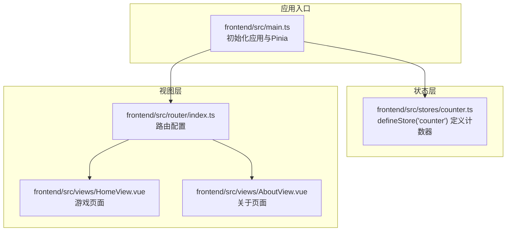
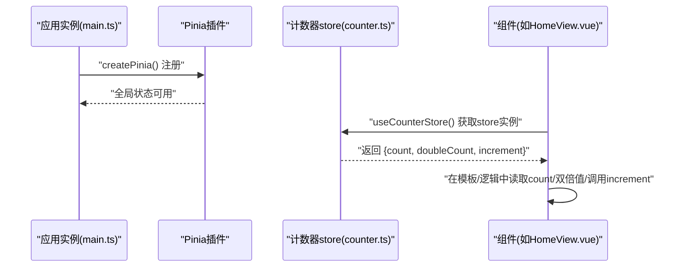
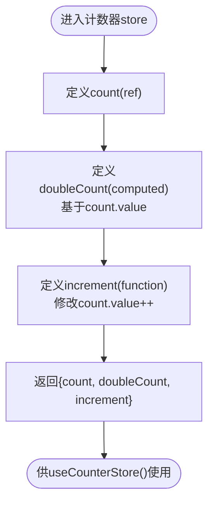
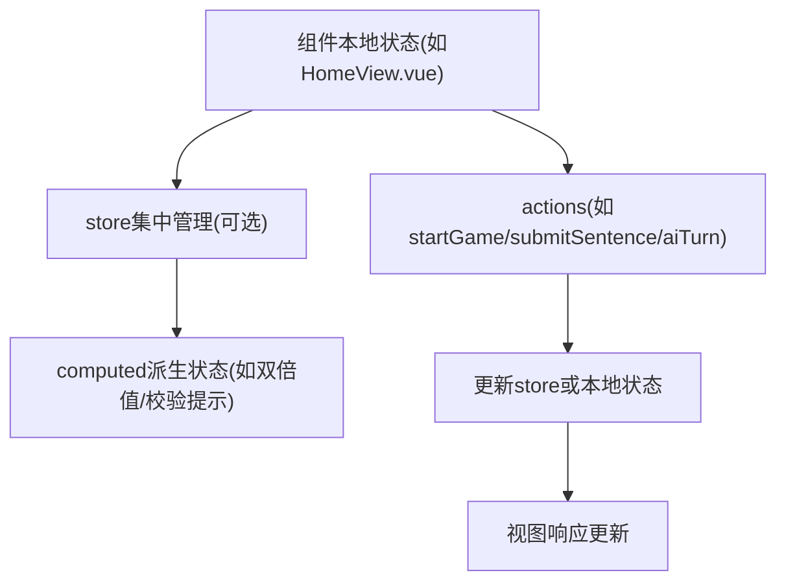
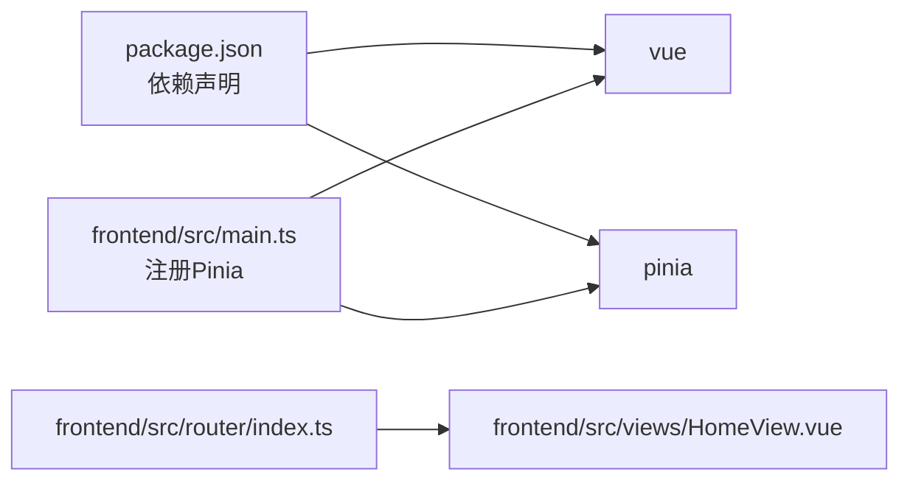

# 状态管理

<cite>
**本文引用的文件**
- [frontend/src/stores/counter.ts](file://frontend/src/stores/counter.ts)
- [frontend/src/main.ts](file://frontend/src/main.ts)
- [frontend/src/router/index.ts](file://frontend/src/router/index.ts)
- [frontend/src/views/HomeView.vue](file://frontend/src/views/HomeView.vue)
- [frontend/src/views/AboutView.vue](file://frontend/src/views/AboutView.vue)
- [frontend/package.json](file://frontend/package.json)
</cite>

## 目录
1. [引言](#引言)
2. [项目结构](#项目结构)
3. [核心组件](#核心组件)
4. [架构总览](#架构总览)
5. [详细组件分析](#详细组件分析)
6. [依赖分析](#依赖分析)
7. [性能考虑](#性能考虑)
8. [故障排查指南](#故障排查指南)
9. [结论](#结论)
10. [附录](#附录)

## 引言
本文件围绕 Pinia 状态管理库在前端项目中的使用展开，以 counter.ts 为例，系统讲解 defineStore 的创建方式、状态定义与响应式原理，并结合项目现有代码说明其可扩展性，为后续管理游戏状态（如 usedPoems、history 等）提供实践参考。同时给出在组件中使用 useCounterStore 的代码模板路径，帮助快速落地。

## 项目结构
- 前端采用 Vue 3 + Vite 架构，通过 createPinia 初始化 Pinia 并挂载到应用实例上。
- 状态仓库集中于 frontend/src/stores 目录，当前仅包含一个计数示例 store：counter.ts。
- 路由位于 frontend/src/router/index.ts，首页路由指向 HomeView.vue，About 页面按需加载。
- 组件层未直接使用 counter.ts 中的状态，但已具备引入与使用的条件。

图表来源
- [frontend/src/main.ts](file://frontend/src/main.ts#L1-L15)
- [frontend/src/stores/counter.ts](file://frontend/src/stores/counter.ts#L1-L13)
- [frontend/src/router/index.ts](file://frontend/src/router/index.ts#L1-L24)
- [frontend/src/views/HomeView.vue](file://frontend/src/views/HomeView.vue#L1-L232)
- [frontend/src/views/AboutView.vue](file://frontend/src/views/AboutView.vue#L1-L16)

章节来源
- [frontend/src/main.ts](file://frontend/src/main.ts#L1-L15)
- [frontend/src/router/index.ts](file://frontend/src/router/index.ts#L1-L24)

## 核心组件
- 计数器 store（counter.ts）
  - 使用 defineStore('counter', ...) 创建全局 store，返回值包含 count（ref）、doubleCount（computed）与 increment（function），形成典型的“状态 + 行为”的组合。
  - 该 store 作为全局状态容器，可在任意组件中通过 useCounterStore 获取并使用。

章节来源
- [frontend/src/stores/counter.ts](file://frontend/src/stores/counter.ts#L1-L13)

## 架构总览
Pinia 在本项目中的集成方式：
- 应用启动时调用 createPinia() 并通过 app.use(createPinia()) 注册到 Vue 应用实例。
- 各业务 store 在各自模块中定义，通过 defineStore 导出 useCounterStore 等钩子函数供组件使用。
- 组件通过组合式 API 在<script setup>中引入并使用 store，实现跨组件共享状态与行为。

图表来源
- [frontend/src/main.ts](file://frontend/src/main.ts#L1-L15)
- [frontend/src/stores/counter.ts](file://frontend/src/stores/counter.ts#L1-L13)
- [frontend/src/views/HomeView.vue](file://frontend/src/views/HomeView.vue#L1-L232)

## 详细组件分析

### 计数器 store（counter.ts）解析
- 定义与导出
  - 通过 defineStore('counter', ...) 创建名为 'counter' 的全局 store。
  - 返回对象包含 count（ref）、doubleCount（computed）与 increment（function）。
- 响应式原理
  - count 为 ref，作为可变状态；当 count.value 改变时，依赖它的 doubleCount 会自动重新计算；increment 修改 count.value 触发依赖更新。
- 可扩展性
  - 当前 store 仅作示例，但其结构天然适合扩展：将 count 替换为更复杂的数据结构（如对象或数组），并在返回对象中暴露更多 getter/computed 与 action，即可承载更丰富的业务状态。

图表来源
- [frontend/src/stores/counter.ts](file://frontend/src/stores/counter.ts#L1-L13)

章节来源
- [frontend/src/stores/counter.ts](file://frontend/src/stores/counter.ts#L1-L13)

### 在组件中使用 useCounterStore 的模板路径
以下为在组件中使用计数器 store 的模板路径（请根据实际需要替换为具体文件路径）：
- 在组件的<script setup>中引入 useCounterStore
  - 模板路径：[frontend/src/views/HomeView.vue](file://frontend/src/views/HomeView.vue#L1-L232)
- 在组件逻辑中获取 store 实例并使用
  - 模板路径：[frontend/src/views/HomeView.vue](file://frontend/src/views/HomeView.vue#L1-L232)
- 在组件模板中绑定 count、doubleCount 或触发 increment
  - 模板路径：[frontend/src/views/HomeView.vue](file://frontend/src/views/HomeView.vue#L1-L232)

章节来源
- [frontend/src/views/HomeView.vue](file://frontend/src/views/HomeView.vue#L1-L232)

### 面向未来的可扩展性：从计数器到游戏状态
- 当前示例展示了最小可用的状态管理模式，可直接迁移到更复杂的业务场景：
  - 将计数状态替换为游戏状态集合（如 usedPoems、history、isPlayerTurn、message 等）。
  - 将 increment 替换为更丰富的动作（如 startGame、submitSentence、aiTurn 等），这些已在 HomeView.vue 中体现。
  - 将 computed 用于派生状态（如当前回合状态、校验结果提示等）。
- 这种模式与现有 HomeView.vue 的数据流高度契合：组件内维护本地状态（gameStarted、ling、userInput 等），store 则负责跨组件共享与持久化状态。

图表来源
- [frontend/src/views/HomeView.vue](file://frontend/src/views/HomeView.vue#L1-L232)
- [frontend/src/stores/counter.ts](file://frontend/src/stores/counter.ts#L1-L13)

章节来源
- [frontend/src/views/HomeView.vue](file://frontend/src/views/HomeView.vue#L1-L232)
- [frontend/src/stores/counter.ts](file://frontend/src/stores/counter.ts#L1-L13)

## 依赖分析
- 外部依赖
  - pinia：版本 ^3.0.3，提供 defineStore、store 实例化与响应式能力。
  - vue：版本 ^3.5.22，提供 ref、computed、组合式 API。
- 内部依赖
  - main.ts 通过 createPinia() 注册 Pinia 插件，使全局 store 可用。
  - router/index.ts 提供路由配置，HomeView.vue 作为首页组件承载游戏交互。

图表来源
- [frontend/package.json](file://frontend/package.json#L1-L51)
- [frontend/src/main.ts](file://frontend/src/main.ts#L1-L15)
- [frontend/src/router/index.ts](file://frontend/src/router/index.ts#L1-L24)
- [frontend/src/views/HomeView.vue](file://frontend/src/views/HomeView.vue#L1-L232)

章节来源
- [frontend/package.json](file://frontend/package.json#L1-L51)
- [frontend/src/main.ts](file://frontend/src/main.ts#L1-L15)
- [frontend/src/router/index.ts](file://frontend/src/router/index.ts#L1-L24)

## 性能考虑
- 响应式粒度
  - 使用 ref 精确追踪可变状态，computed 仅在依赖变化时重算，避免不必要的渲染。
- 组件与 store 解耦
  - 将业务状态集中在 store，组件只关心展示与交互，降低重复计算与副作用。
- 大规模状态管理
  - 当状态增多时，建议拆分多个 store 或按功能域划分模块，保持单一职责与清晰边界。

## 故障排查指南
- 未注册 Pinia 插件
  - 现象：useCounterStore 报错或无法获取 store 实例。
  - 排查：确认 main.ts 已调用 app.use(createPinia())。
  - 参考路径：[frontend/src/main.ts](file://frontend/src/main.ts#L1-L15)
- store 未正确导出
  - 现象：组件无法导入 useCounterStore。
  - 排查：确认 counter.ts 使用 defineStore 并导出 useCounterStore。
  - 参考路径：[frontend/src/stores/counter.ts](file://frontend/src/stores/counter.ts#L1-L13)
- 组件未在<script setup>中使用
  - 现象：模板无法访问 store 数据。
  - 排查：确保在<script setup>中引入并使用 store。
  - 参考路径：[frontend/src/views/HomeView.vue](file://frontend/src/views/HomeView.vue#L1-L232)

章节来源
- [frontend/src/main.ts](file://frontend/src/main.ts#L1-L15)
- [frontend/src/stores/counter.ts](file://frontend/src/stores/counter.ts#L1-L13)
- [frontend/src/views/HomeView.vue](file://frontend/src/views/HomeView.vue#L1-L232)

## 结论
通过 counter.ts 的示例，我们验证了 Pinia 在 Vue 3 中的简洁使用模式：defineStore 创建全局 store，返回 ref/computed/action 形成响应式状态与行为。该模式具备良好的可扩展性，能够平滑过渡到更复杂的业务场景（如游戏状态管理）。结合现有路由与组件结构，可快速在组件中引入并使用 store，实现跨组件共享与统一管理。

## 附录
- 在组件中使用 useCounterStore 的模板路径（请按需替换为具体文件路径）：
  - 引入与使用：[frontend/src/views/HomeView.vue](file://frontend/src/views/HomeView.vue#L1-L232)
  - store 定义：[frontend/src/stores/counter.ts](file://frontend/src/stores/counter.ts#L1-L13)
  - 应用注册：[frontend/src/main.ts](file://frontend/src/main.ts#L1-L15)
  - 路由配置：[frontend/src/router/index.ts](file://frontend/src/router/index.ts#L1-L24)