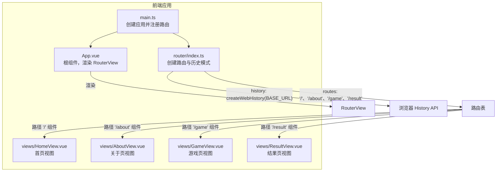
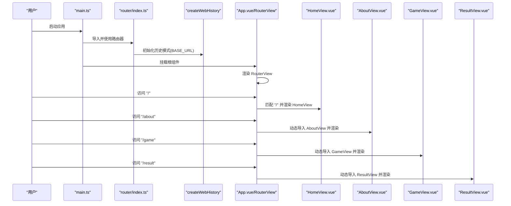
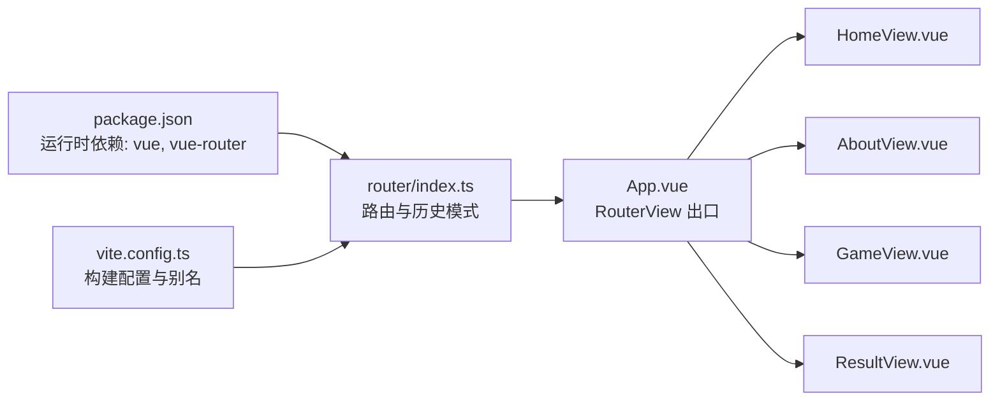

# 路由配置

<cite>
**本文引用的文件**
- [frontend/src/router/index.ts](file://frontend/src/router/index.ts) - *新增 /game 和 /result 路由*
- [frontend/src/main.ts](file://frontend/src/main.ts)
- [frontend/src/App.vue](file://frontend/src/App.vue)
- [frontend/src/views/HomeView.vue](file://frontend/src/views/HomeView.vue)
- [frontend/src/views/AboutView.vue](file://frontend/src/views/AboutView.vue)
- [frontend/src/views/GameView.vue](file://frontend/src/views/GameView.vue) - *新增游戏视图组件*
- [frontend/src/views/ResultView.vue](file://frontend/src/views/ResultView.vue) - *新增结果展示视图组件*
- [frontend/package.json](file://frontend/package.json)
- [frontend/vite.config.ts](file://frontend/vite.config.ts)
- [frontend/env.d.ts](file://frontend/env.d.ts)
</cite>

## 更新摘要
**变更内容**
- 在 `routes` 数组中新增 `/game` 与 `/result` 两条路由，分别对应 `GameView.vue` 和 `ResultView.vue` 组件
- 所有新增路由均采用懒加载（动态导入）方式，提升首屏加载性能
- 更新文档结构以反映新功能，并补充相关组件分析
- 新增架构图与序列图，展示游戏流程中的路由跳转逻辑

## 目录
1. [简介](#简介)
2. [项目结构](#项目结构)
3. [核心组件](#核心组件)
4. [架构总览](#架构总览)
5. [详细组件分析](#详细组件分析)
6. [依赖分析](#依赖分析)
7. [性能考量](#性能考量)
8. [故障排查指南](#故障排查指南)
9. [结论](#结论)
10. [附录：路由跳转使用示例](#附录路由跳转使用示例)

## 简介
本文件围绕 Vue Router 的配置实现进行系统化解析，重点说明以下内容：
- createRouter 与 createWebHistory 的职责与协作关系
- routes 数组中“/”、“/about”、“/game”与“/result”的路由定义方式
- HomeView 的直接引入与 AboutView、GameView、ResultView 的懒加载（代码分割）差异及性能优势
- BASE_URL 环境变量在 History 模式下的作用
- 前端导航机制与路由跳转的实践建议

## 项目结构
前端采用 Vite + Vue 3 + Vue Router 4 的典型单页应用结构。路由配置集中在 router/index.ts，应用入口在 main.ts 中挂载路由实例；页面视图位于 views 目录，根组件 App.vue 使用 RouterView 承载当前路由组件。

**图表来源**
- [frontend/src/main.ts](file://frontend/src/main.ts#L1-L15)
- [frontend/src/App.vue](file://frontend/src/App.vue#L1-L19)
- [frontend/src/router/index.ts](file://frontend/src/router/index.ts#L1-L26)
- [frontend/src/views/HomeView.vue](file://frontend/src/views/HomeView.vue#L1-L69)
- [frontend/src/views/AboutView.vue](file://frontend/src/views/AboutView.vue#L1-L16)
- [frontend/src/views/GameView.vue](file://frontend/src/views/GameView.vue#L1-L156)
- [frontend/src/views/ResultView.vue](file://frontend/src/views/ResultView.vue#L1-L118)

## 核心组件
- 路由器实例：通过 createRouter 创建，负责管理路由表、匹配规则与导航行为。
- 历史模式：通过 createWebHistory 引入浏览器 History API，支持 URL 变更与前进后退。
- 路由表：routes 数组定义路径、名称与组件映射；其中“/”为直引组件，“/about”、“/game”、“/result”为动态导入组件。
- 视图组件：HomeView、AboutView、GameView 与 ResultView 分别作为首页、关于页、游戏页与结果页的承载组件。

**章节来源**
- [frontend/src/router/index.ts](file://frontend/src/router/index.ts#L1-L26)
- [frontend/src/views/HomeView.vue](file://frontend/src/views/HomeView.vue#L1-L69)
- [frontend/src/views/AboutView.vue](file://frontend/src/views/AboutView.vue#L1-L16)
- [frontend/src/views/GameView.vue](file://frontend/src/views/GameView.vue#L1-L156)
- [frontend/src/views/ResultView.vue](file://frontend/src/views/ResultView.vue#L1-L118)

## 架构总览
下图展示了从应用启动到路由渲染的关键流程，以及 History 模式与 BASE_URL 的作用位置。

**图表来源**
- [frontend/src/main.ts](file://frontend/src/main.ts#L1-L15)
- [frontend/src/router/index.ts](file://frontend/src/router/index.ts#L1-L26)
- [frontend/src/App.vue](file://frontend/src/App.vue#L1-L19)
- [frontend/src/views/HomeView.vue](file://frontend/src/views/HomeView.vue#L1-L69)
- [frontend/src/views/AboutView.vue](file://frontend/src/views/AboutView.vue#L1-L16)
- [frontend/src/views/GameView.vue](file://frontend/src/views/GameView.vue#L1-L156)
- [frontend/src/views/ResultView.vue](file://frontend/src/views/ResultView.vue#L1-L118)

## 详细组件分析

### 路由器与历史模式：createRouter 与 createWebHistory
- createRouter：用于创建路由器实例，接收 history 与 routes 两个关键配置项。history 决定导航如何影响 URL，routes 定义路径到组件的映射。
- createWebHistory：基于浏览器 History API 实现的前端路由历史模式，适合现代浏览器与静态部署场景。其构造函数接收 BASE_URL，用于处理子路径部署（如将应用部署在子目录时的基准路径）。

**章节来源**
- [frontend/src/router/index.ts](file://frontend/src/router/index.ts#L1-L26)

### 路由表：routes 数组中的“/”、“/about”、“/game”与“/result”
- “/”路由：使用直接引入的方式绑定 HomeView 组件，属于同步加载，首屏即可获得该组件资源，有利于首屏渲染性能。
- “/about”路由：使用动态导入（路由级代码分割）的方式绑定 AboutView 组件，仅在访问该路径时按需加载，减少初始包体积。
- “/game”路由：使用动态导入方式绑定 GameView 组件，专用于诗词对战游戏界面，支持游戏状态管理与交互逻辑。
- “/result”路由：使用动态导入方式绑定 ResultView 组件，用于展示游戏结束后的统计信息与评价。

**章节来源**
- [frontend/src/router/index.ts](file://frontend/src/router/index.ts#L1-L26)
- [frontend/src/views/HomeView.vue](file://frontend/src/views/HomeView.vue#L1-L69)
- [frontend/src/views/AboutView.vue](file://frontend/src/views/AboutView.vue#L1-L16)
- [frontend/src/views/GameView.vue](file://frontend/src/views/GameView.vue#L1-L156)
- [frontend/src/views/ResultView.vue](file://frontend/src/views/ResultView.vue#L1-L118)

### 代码分割与懒加载的差异与性能优势
- 直接引入（HomeView）：构建时将组件打包进主包，无需额外网络请求，首屏渲染更快；但会增加初始包大小。
- 动态导入（AboutView、GameView、ResultView）：构建时生成独立的代码块，仅在访问对应路径时下载，显著降低首屏包体积，改善首屏加载时间；适用于低频或功能型页面。

**章节来源**
- [frontend/src/router/index.ts](file://frontend/src/router/index.ts#L1-L26)

### BASE_URL 在 History 模式中的作用
- BASE_URL 来源于 Vite 的 import.meta.env，通常用于子路径部署场景。当应用部署在子目录（例如 /my-app/）时，设置 BASE_URL 可确保浏览器 History API 正确处理路径前缀，避免刷新或手动输入子路径导致的 404。
- 在 createWebHistory 中传入 BASE_URL，可保证 push/replace/go 等导航操作与浏览器地址栏保持一致，且不会因部署路径而产生错误。

**章节来源**
- [frontend/src/router/index.ts](file://frontend/src/router/index.ts#L1-L26)
- [frontend/vite.config.ts](file://frontend/vite.config.ts#L1-L19)
- [frontend/env.d.ts](file://frontend/env.d.ts#L1-L2)

### 应用挂载与路由渲染
- main.ts 中创建应用并注册路由，随后挂载到 DOM。
- App.vue 使用 RouterView 作为路由出口，根据当前 URL 自动渲染对应组件。

**章节来源**
- [frontend/src/main.ts](file://frontend/src/main.ts#L1-L15)
- [frontend/src/App.vue](file://frontend/src/App.vue#L1-L19)

## 依赖分析
- 运行时依赖：vue 与 vue-router 由 package.json 指定版本，确保路由功能与 Vue 3 兼容。
- 构建工具：Vite 提供 import.meta.env 支持与模块解析别名，便于开发与生产构建。

**图表来源**
- [frontend/package.json](file://frontend/package.json#L1-L51)
- [frontend/vite.config.ts](file://frontend/vite.config.ts#L1-L19)
- [frontend/src/router/index.ts](file://frontend/src/router/index.ts#L1-L26)
- [frontend/src/App.vue](file://frontend/src/App.vue#L1-L19)
- [frontend/src/views/HomeView.vue](file://frontend/src/views/HomeView.vue#L1-L69)
- [frontend/src/views/AboutView.vue](file://frontend/src/views/AboutView.vue#L1-L16)
- [frontend/src/views/GameView.vue](file://frontend/src/views/GameView.vue#L1-L156)
- [frontend/src/views/ResultView.vue](file://frontend/src/views/ResultView.vue#L1-L118)

## 性能考量
- 首屏优化：将高频访问的首页组件直引，减少首屏网络请求；将低频访问的页面组件懒加载，降低初始包体积。
- 代码分割：利用动态导入生成独立 chunk，结合浏览器缓存策略，可进一步提升二次访问体验。
- History 模式：在静态部署场景下，合理设置 BASE_URL 可避免路径问题带来的重定向与 404，间接提升用户体验。
- 新增路由 `/game` 与 `/result` 均采用懒加载，确保游戏相关资源不会影响首页加载速度。

[本节为通用性能建议，不直接分析具体文件]

## 故障排查指南
- 访问“/game”或“/result”白屏或报错
  - 检查 GameView.vue 或 ResultView.vue 是否存在且路径正确
  - 确认动态导入语法是否被构建工具识别（Vite 默认支持）
  - 若部署在子目录，确认 BASE_URL 设置是否与实际部署路径一致
- 刷新页面 404 或路径异常
  - 确认使用 History 模式且已传入 BASE_URL
  - 确保服务器支持前端回退（SPA 部署时通常需要配置回退到 index.html）
- 首屏加载缓慢
  - 将非关键页面改为懒加载
  - 对大组件进行拆分，避免单个包过大

[本节为通用排查建议，不直接分析具体文件]

## 结论
本项目通过 createRouter 与 createWebHistory 构建了清晰的前端路由体系，routes 数组以“/”、“/about”、“/game”与“/result”四条路径分别演示了直引与懒加载两种策略。BASE_URL 的合理使用确保了子路径部署场景下的导航一致性。整体设计兼顾了首屏性能与后续页面的按需加载，符合现代前端应用的最佳实践。

[本节为总结性内容，不直接分析具体文件]

## 附录：路由跳转使用示例
以下示例展示常见的路由跳转方式，适用于模板或脚本逻辑中：
- 编程式导航（在组件脚本中使用）
  - 跳转到“/”首页
  - 跳转到“/about”关于页
  - 跳转到“/game”游戏页
  - 跳转到“/result”结果页
- 命名路由跳转
  - 使用命名路由“home”、“about”、“game”与“result”进行跳转
- 带参数与查询的跳转
  - 传递参数与查询字符串
- 返回上一页
  - 使用 go(-1) 返回上一历史记录

提示
- 示例代码请参考 Vue Router 文档中的编程式导航与命名路由部分，结合本项目中的路由配置进行实践。

[本节为概念性示例说明，不直接分析具体文件]