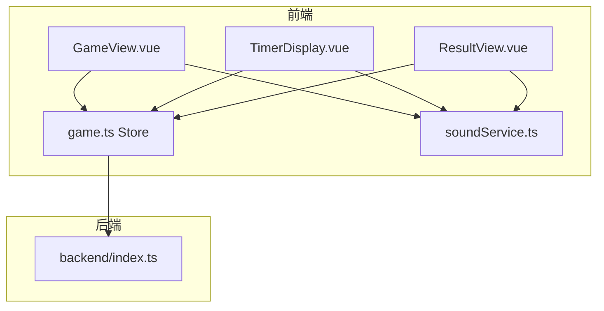
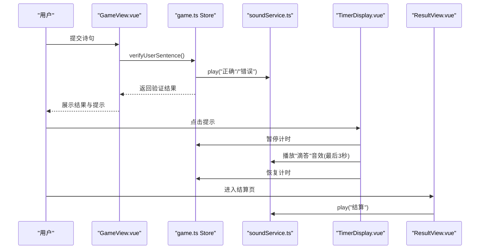
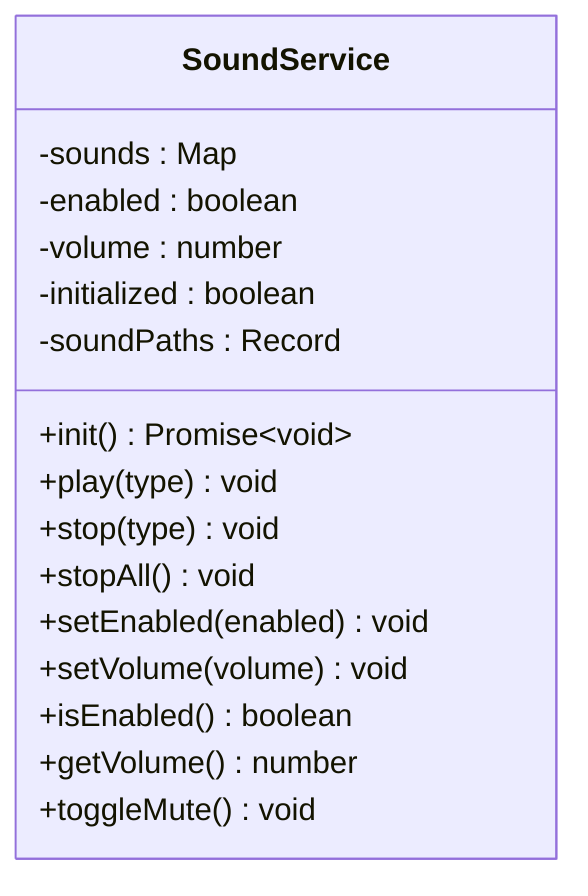
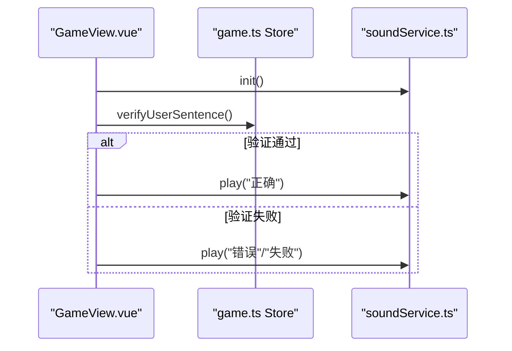
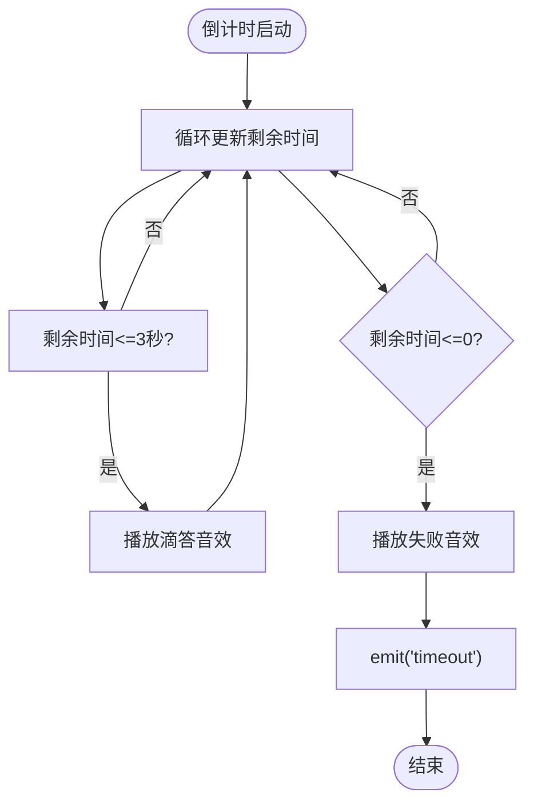
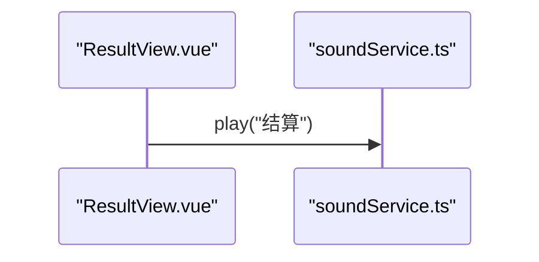
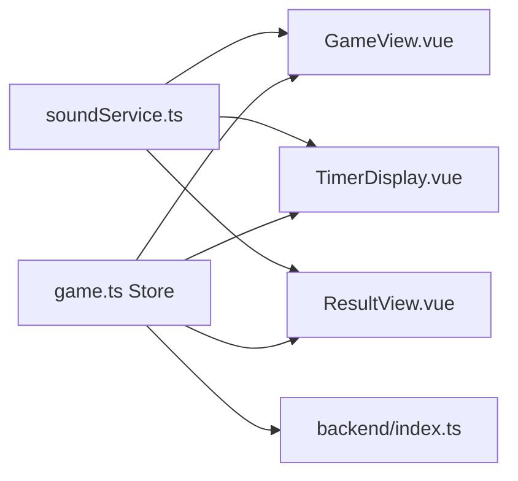

# 音效服务

<cite>
**本文引用的文件**
- [soundService.ts](file://frontend/src/services/soundService.ts)
- [GameView.vue](file://frontend/src/views/GameView.vue)
- [TimerDisplay.vue](file://frontend/src/components/TimerDisplay.vue)
- [ResultView.vue](file://frontend/src/views/ResultView.vue)
- [game.ts](file://frontend/src/stores/game.ts)
- [game.ts 类型定义](file://frontend/src/types/game.ts)
- [README.md](file://README.md)
- [IMPLEMENTATION_SUMMARY.md](file://IMPLEMENTATION_SUMMARY.md)
- [backend index.ts](file://backend/src/index.ts)
- [migration.sql](file://backend/prisma/migrations/20251104061144_init/migration.sql)
</cite>

## 目录
1. [简介](#简介)
2. [项目结构](#项目结构)
3. [核心组件](#核心组件)
4. [架构总览](#架构总览)
5. [详细组件分析](#详细组件分析)
6. [依赖关系分析](#依赖关系分析)
7. [性能考量](#性能考量)
8. [故障排查指南](#故障排查指南)
9. [结论](#结论)
10. [附录](#附录)

## 简介
本文件聚焦“音效服务”的设计与实现，覆盖前端音效服务模块、与游戏视图及倒计时组件的联动、以及与后端接口的整体协作。文档旨在帮助开发者快速理解音效系统的职责边界、初始化流程、播放策略、状态持久化与错误处理，并提供可视化图表辅助理解。

## 项目结构
- 前端采用 Vue3 + TypeScript，音效服务位于 frontend/src/services/soundService.ts。
- 游戏主界面 GameView.vue 通过 soundService 播放正确/错误/失败等音效。
- 倒计时组件 TimerDisplay.vue 在最后3秒播放“滴答”音效。
- 结算页 ResultView.vue 在进入时播放“结算”音效。
- 游戏状态 store 中包含音效开关与音量持久化逻辑，便于跨组件共享。

图表来源
- [GameView.vue](file://frontend/src/views/GameView.vue#L1-L120)
- [TimerDisplay.vue](file://frontend/src/components/TimerDisplay.vue#L1-L120)
- [ResultView.vue](file://frontend/src/views/ResultView.vue#L1-L80)
- [game.ts](file://frontend/src/stores/game.ts#L1-L120)
- [soundService.ts](file://frontend/src/services/soundService.ts#L1-L148)
- [backend index.ts](file://backend/src/index.ts#L1-L120)

章节来源
- [README.md](file://README.md#L1-L21)
- [IMPLEMENTATION_SUMMARY.md](file://IMPLEMENTATION_SUMMARY.md#L22-L32)

## 核心组件
- 音效服务模块（soundService.ts）
  - 负责音效资源的初始化、预加载、播放、停止、音量与开关控制。
  - 使用 Map 存储已加载的音频对象，避免重复创建。
  - 通过 localStorage 持久化音效开关与音量。
- 游戏视图（GameView.vue）
  - 在提交诗句后根据结果播放正确/错误/失败音效。
  - 与 store 的 remainingChances 协作决定播放哪类音效。
- 倒计时组件（TimerDisplay.vue）
  - 在剩余时间小于等于3秒时周期性触发“滴答”音效。
  - 与 store 的 timerActive、timeRemaining、timerDuration 协作。
- 结算页（ResultView.vue）
  - 页面挂载时播放“结算”音效，营造完成感。
- 游戏状态（game.ts）
  - 提供音效开关与音量的读写方法，并持久化到 localStorage。
  - 与 API 交互时负责传递音效状态给后端（如需要）。

章节来源
- [soundService.ts](file://frontend/src/services/soundService.ts#L1-L148)
- [GameView.vue](file://frontend/src/views/GameView.vue#L1-L120)
- [TimerDisplay.vue](file://frontend/src/components/TimerDisplay.vue#L1-L120)
- [ResultView.vue](file://frontend/src/views/ResultView.vue#L1-L80)
- [game.ts](file://frontend/src/stores/game.ts#L1-L120)

## 架构总览
音效服务在整个系统中的作用是为用户行为提供即时反馈，贯穿游戏开始、进行、失败与结算阶段。其与视图层通过事件与状态联动，与状态管理通过本地存储同步，与后端通过 API 交互保持一致性。

图表来源
- [GameView.vue](file://frontend/src/views/GameView.vue#L1-L120)
- [TimerDisplay.vue](file://frontend/src/components/TimerDisplay.vue#L1-L120)
- [ResultView.vue](file://frontend/src/views/ResultView.vue#L1-L80)
- [game.ts](file://frontend/src/stores/game.ts#L1-L120)
- [soundService.ts](file://frontend/src/services/soundService.ts#L1-L148)

## 详细组件分析

### 音效服务模块（soundService.ts）
- 设计要点
  - 单例模式导出，全局唯一实例。
  - 使用 Map<SoundType, HTMLAudioElement> 缓存音频，避免重复加载。
  - 初始化时遍历音效路径映射，逐个预加载，监听 canplaythrough 或 error，保证健壮性。
  - 支持启用/禁用、音量调节、切换静音、停止与停止全部音效。
  - 通过 localStorage 恢复音效开关与音量，提升用户体验的一致性。
- 关键流程
  - 初始化流程：遍历音效路径 -> 创建 Audio -> 设置 preload/auto -> 监听事件 -> 加入缓存。
  - 播放流程：检查开关 -> 获取缓存音频 -> 重置 currentTime -> 设置音量 -> play() 并捕获异常。
  - 音量与开关变更：更新内存值 -> 写入 localStorage -> 遍历更新所有音频音量或必要时停止全部。

图表来源
- [soundService.ts](file://frontend/src/services/soundService.ts#L1-L148)

章节来源
- [soundService.ts](file://frontend/src/services/soundService.ts#L1-L148)

### 游戏视图（GameView.vue）与音效联动
- 行为说明
  - 初始化时调用 soundService.init()，确保音效可用。
  - 提交诗句后根据结果播放“正确”或“错误/失败”音效。
  - 当 remainingChances 为0时播放失败音效，并跳转结算页。
  - 对于模糊匹配结果，先播放正确音效，再在输入面板显示提示。
- 与 store 的关系
  - 读取 store 中的音效开关与音量，确保与 UI 设置一致。
  - 通过 store 的状态变化驱动音效播放时机。

图表来源
- [GameView.vue](file://frontend/src/views/GameView.vue#L1-L120)
- [game.ts](file://frontend/src/stores/game.ts#L140-L220)
- [soundService.ts](file://frontend/src/services/soundService.ts#L1-L148)

章节来源
- [GameView.vue](file://frontend/src/views/GameView.vue#L1-L120)
- [game.ts](file://frontend/src/stores/game.ts#L140-L220)

### 倒计时组件（TimerDisplay.vue）与音效联动
- 行为说明
  - 基于 timerActive 与 roundStartTime 计算剩余时间。
  - 当剩余时间在(0,3]区间内，每秒触发一次“滴答”音效。
  - 超时后播放失败音效并通知父组件。
- 与 store 的关系
  - 读取 timerDuration、timeRemaining、timerActive。
  - 通过 emit('timeout') 通知 GameView.vue 执行后续逻辑。

图表来源
- [TimerDisplay.vue](file://frontend/src/components/TimerDisplay.vue#L1-L120)
- [soundService.ts](file://frontend/src/services/soundService.ts#L1-L148)

章节来源
- [TimerDisplay.vue](file://frontend/src/components/TimerDisplay.vue#L1-L120)

### 结算页（ResultView.vue）与音效联动
- 行为说明
  - 页面挂载时播放“结算”音效，营造完成感。
  - 与分享/保存图片功能配合，形成完整的体验闭环。

图表来源
- [ResultView.vue](file://frontend/src/views/ResultView.vue#L1-L80)
- [soundService.ts](file://frontend/src/services/soundService.ts#L1-L148)

章节来源
- [ResultView.vue](file://frontend/src/views/ResultView.vue#L1-L80)

### 游戏状态（game.ts）与音效
- 行为说明
  - 提供 setSoundEnabled/setSoundVolume 方法，持久化到 localStorage。
  - 读取 localStorage 初始化音效开关与音量。
- 与 store 的关系
  - 与视图层通过响应式状态联动，确保 UI 与音效设置一致。

章节来源
- [game.ts](file://frontend/src/stores/game.ts#L1-L120)
- [game.ts 类型定义](file://frontend/src/types/game.ts#L1-L48)

## 依赖关系分析
- 前端依赖
  - soundService.ts 依赖浏览器原生 HTMLAudioElement，不引入第三方音效库。
  - GameView.vue、TimerDisplay.vue、ResultView.vue 依赖 soundService.ts 的枚举与实例。
  - game.ts 依赖 localStorage 与 API（后端），并通过 store 管理音效状态。
- 后端依赖
  - 后端未直接依赖音效服务，但提供游戏 API，供前端 store 调用以驱动音效播放时机。

图表来源
- [soundService.ts](file://frontend/src/services/soundService.ts#L1-L148)
- [GameView.vue](file://frontend/src/views/GameView.vue#L1-L120)
- [TimerDisplay.vue](file://frontend/src/components/TimerDisplay.vue#L1-L120)
- [ResultView.vue](file://frontend/src/views/ResultView.vue#L1-L80)
- [game.ts](file://frontend/src/stores/game.ts#L1-L120)
- [backend index.ts](file://backend/src/index.ts#L1-L120)

章节来源
- [backend index.ts](file://backend/src/index.ts#L1-L120)
- [migration.sql](file://backend/prisma/migrations/20251104061144_init/migration.sql#L1-L8)

## 性能考量
- 预加载策略
  - 初始化时对所有音效执行 preload，减少首次播放延迟。
  - 监听 canplaythrough 或 error，避免阻塞初始化流程。
- 播放策略
  - 使用 currentTime=0 重置音频，避免重复创建导致的内存占用。
  - 音量与开关变更时批量更新已缓存的音频，避免多次 DOM 操作。
- 浏览器限制
  - 音效初始化通常需要用户交互触发（浏览器自动播放策略），因此在 GameView.vue 挂载时调用 init()，确保在用户操作后完成初始化。
- 建议优化
  - 若未来音效数量增长，可考虑按需懒加载与 LRU 缓存策略。
  - 对高频“滴答”音效，可在组件内部节流或去抖，避免过于频繁触发。

[本节为通用指导，无需列出具体文件来源]

## 故障排查指南
- 音效无法播放
  - 确认已在用户交互后调用 soundService.init()。
  - 检查浏览器自动播放策略限制，尝试在页面交互后再初始化。
  - 确认 public/sounds 目录下存在对应 MP3 文件，且路径与枚举映射一致。
- 音效不生效或无声
  - 检查 store 中音效开关与音量是否被禁用或设为0。
  - 确认 localStorage 中 soundEnabled/soundVolume 是否被意外修改。
- 初始化失败
  - 查看控制台错误日志，确认 canplaythrough/error 事件是否触发。
  - 如遇网络问题，可重试或检查静态资源访问权限。
- 倒计时“滴答”音效异常
  - 检查 TimerDisplay.vue 的剩余时间计算与 emit('timeout') 逻辑。
  - 确认 soundService.play("tick") 被正确调用。

章节来源
- [soundService.ts](file://frontend/src/services/soundService.ts#L1-L148)
- [GameView.vue](file://frontend/src/views/GameView.vue#L1-L120)
- [TimerDisplay.vue](file://frontend/src/components/TimerDisplay.vue#L1-L120)
- [game.ts](file://frontend/src/stores/game.ts#L1-L120)

## 结论
音效服务通过简洁的单例封装与预加载机制，为游戏提供了及时、一致的听觉反馈。它与视图层、倒计时组件和状态管理紧密协作，在不同游戏阶段（开始、进行、失败、结算）提供恰当的音效，显著提升了用户体验。后续可进一步完善音效资源管理与 UI 控制面板，以满足更丰富的交互需求。

[本节为总结性内容，无需列出具体文件来源]

## 附录
- 音效类型枚举与路径映射
  - 正确：用于答对时播放。
  - 错误：用于单次答错时播放。
  - 失败：用于游戏结束或机会耗尽时播放。
  - 结算：用于进入结算页时播放。
  - 滴答：用于倒计时最后3秒播放。
- 音效文件准备
  - 需要将 MP3 文件放置在 frontend/public/sounds/ 目录下，文件名与枚举映射一致。
- 运行与测试
  - 后端启动后，前端方可调用 API；音效功能需在用户交互后初始化。

章节来源
- [IMPLEMENTATION_SUMMARY.md](file://IMPLEMENTATION_SUMMARY.md#L22-L32)
- [soundService.ts](file://frontend/src/services/soundService.ts#L1-L148)