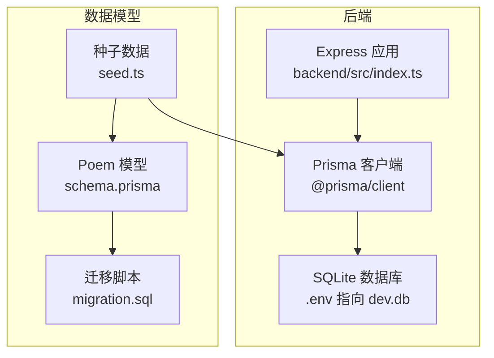
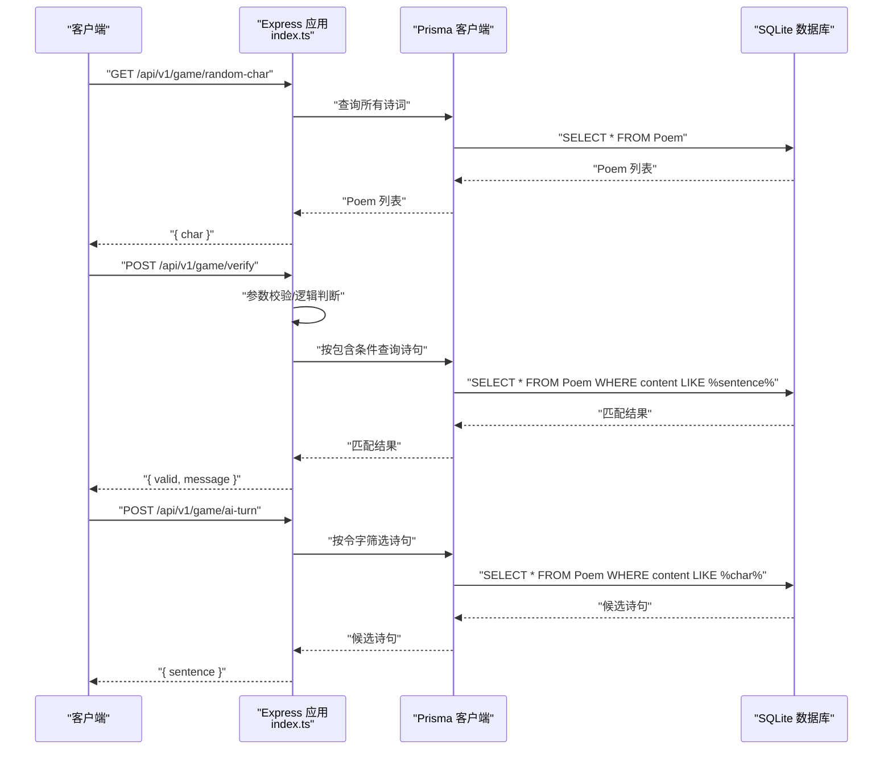
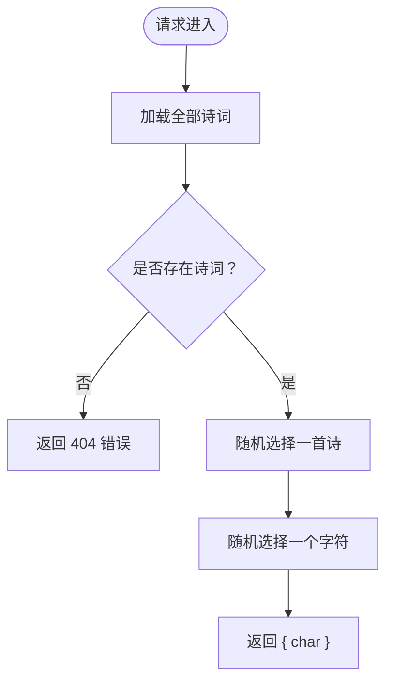
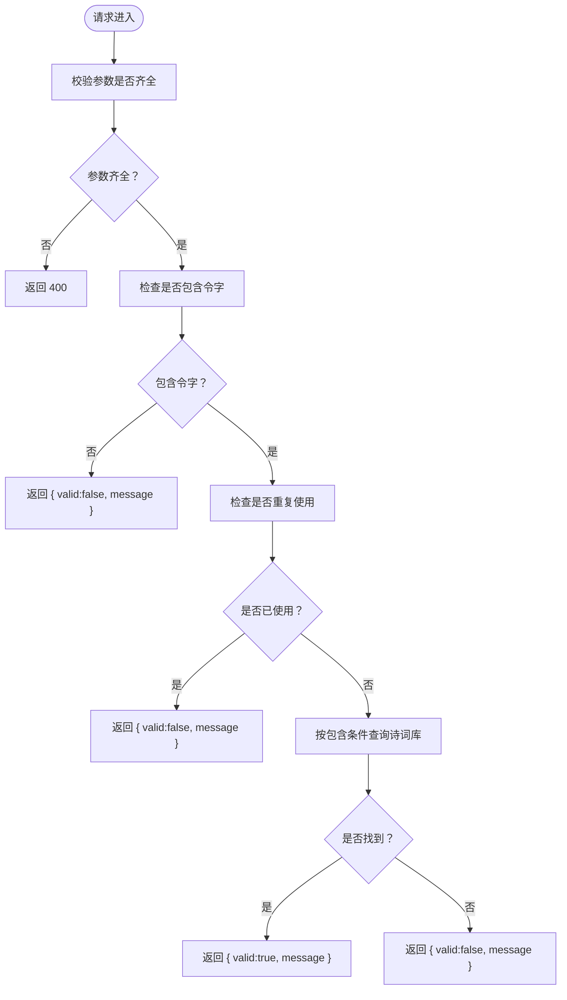
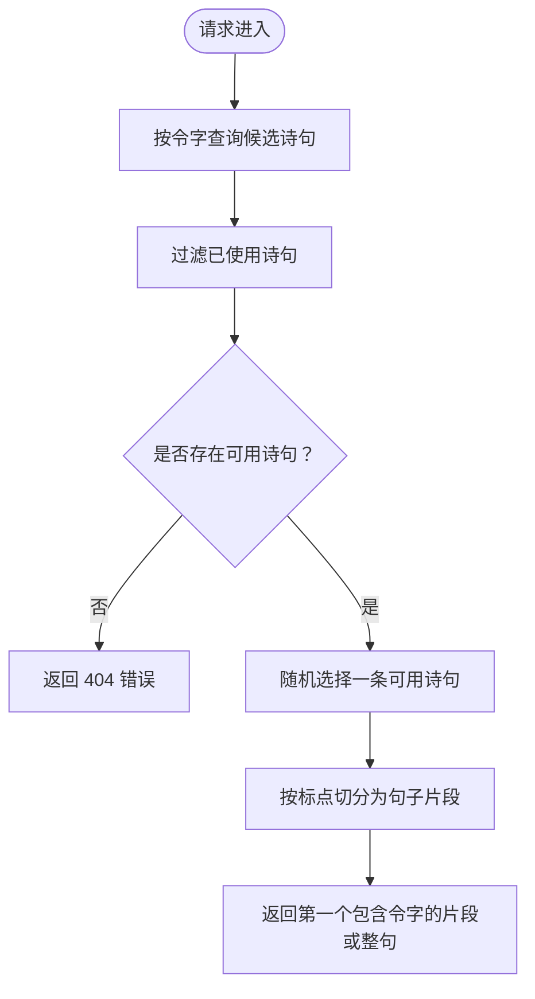
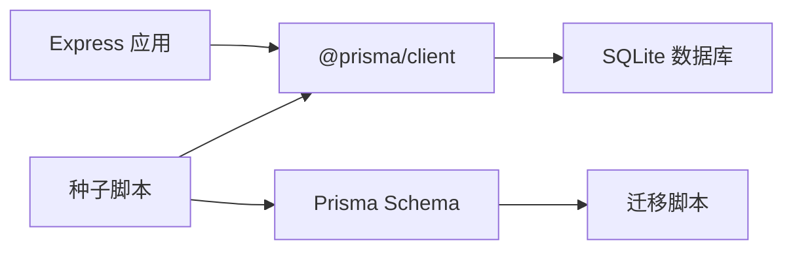
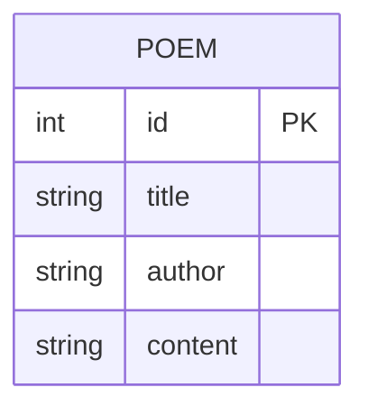

# API路由设计

<cite>
**本文引用的文件**
- [backend/src/index.ts](file://backend/src/index.ts)
- [backend/prisma/schema.prisma](file://backend/prisma/schema.prisma)
- [backend/prisma/seed.ts](file://backend/prisma/seed.ts)
- [backend/prisma/migrations/20251104061144_init/migration.sql](file://backend/prisma/migrations/20251104061144_init/migration.sql)
- [backend/.env](file://backend/.env)
- [backend/package.json](file://backend/package.json)
</cite>

## 目录
1. [简介](#简介)
2. [项目结构](#项目结构)
3. [核心组件](#核心组件)
4. [架构总览](#架构总览)
5. [详细组件分析](#详细组件分析)
6. [依赖关系分析](#依赖关系分析)
7. [性能考量](#性能考量)
8. [故障排查指南](#故障排查指南)
9. [结论](#结论)
10. [附录](#附录)

## 简介
本设计文档围绕后端API路由进行系统化梳理，重点覆盖以下三个RESTful接口：
- GET /api/v1/game/random-char：从诗词库中随机选取一句，并提取其中的一个令字作为提示。
- POST /api/v1/game/verify：校验用户输入的诗句是否包含令字、是否重复使用以及是否存在于诗词库。
- POST /api/v1/game/ai-turn：根据令字筛选可用诗句，返回AI回合的应答。

文档将逐项说明请求参数、响应格式、状态码含义、异步处理流程、条件判断与数据库查询的集成方式，并给出调试技巧、常见错误原因（如400/404）与测试用例构造建议。

## 项目结构
后端采用Express框架搭建，使用Prisma管理SQLite数据库。路由集中在入口文件中，数据库模型定义于Prisma Schema，种子脚本负责初始化示例数据。

图表来源
- [backend/src/index.ts](file://backend/src/index.ts#L1-L78)
- [backend/prisma/schema.prisma](file://backend/prisma/schema.prisma#L1-L19)
- [backend/prisma/migrations/20251104061144_init/migration.sql](file://backend/prisma/migrations/20251104061144_init/migration.sql#L1-L8)
- [backend/prisma/seed.ts](file://backend/prisma/seed.ts#L1-L53)
- [backend/.env](file://backend/.env#L1-L1)

章节来源
- [backend/src/index.ts](file://backend/src/index.ts#L1-L78)
- [backend/prisma/schema.prisma](file://backend/prisma/schema.prisma#L1-L19)
- [backend/prisma/migrations/20251104061144_init/migration.sql](file://backend/prisma/migrations/20251104061144_init/migration.sql#L1-L8)
- [backend/prisma/seed.ts](file://backend/prisma/seed.ts#L1-L53)
- [backend/.env](file://backend/.env#L1-L1)

## 核心组件
- 路由层：在入口文件中定义三个API端点，分别处理随机令字获取、用户诗句验证与AI回合应答。
- 数据访问层：通过Prisma客户端对SQLite数据库进行查询与写入。
- 数据模型：Poem实体包含id、title、author、content字段，content用于存储完整诗句内容。
- 初始化流程：通过种子脚本将多首诗词合并为content存入数据库，供后续随机抽取与匹配使用。

章节来源
- [backend/src/index.ts](file://backend/src/index.ts#L1-L78)
- [backend/prisma/schema.prisma](file://backend/prisma/schema.prisma#L1-L19)
- [backend/prisma/seed.ts](file://backend/prisma/seed.ts#L1-L53)

## 架构总览
下图展示了三个API端点与数据库交互的整体流程，包括请求进入、参数校验、数据库查询与响应返回。

图表来源
- [backend/src/index.ts](file://backend/src/index.ts#L12-L72)
- [backend/prisma/schema.prisma](file://backend/prisma/schema.prisma#L13-L18)

## 详细组件分析

### 接口一：GET /api/v1/game/random-char
- 功能概述：从诗词库中随机挑选一首诗，再从该诗内容中随机挑选一个字符作为令字，返回给前端。
- 请求参数：无
- 响应格式：JSON对象，包含一个字符字段。
- 状态码：
  - 200 成功：返回随机令字。
  - 404 未找到：当诗词库为空时返回错误信息。
- 执行流程要点：
  - 异步加载全部Poem记录。
  - 若列表为空，直接返回404。
  - 否则随机选择一首诗与一个字符，返回结果。
- 关键实现位置：
  - [随机抽取令字逻辑](file://backend/src/index.ts#L12-L21)

图表来源
- [backend/src/index.ts](file://backend/src/index.ts#L12-L21)

章节来源
- [backend/src/index.ts](file://backend/src/index.ts#L12-L21)

### 接口二：POST /api/v1/game/verify
- 功能概述：验证用户提交的诗句是否满足游戏规则：必须包含令字、不能重复使用、且必须存在于诗词库。
- 请求参数（JSON）：
  - sentence：用户输入的诗句字符串。
  - char：当前轮次的令字。
  - usedPoems：已使用的诗句数组（用于去重检查）。
- 响应格式：JSON对象，包含valid布尔值与message字符串。
- 状态码：
  - 200 成功：返回验证结果（valid=true/false）。
  - 400 缺少参数：当sentence或char缺失时返回。
- 执行流程要点：
  - 参数校验：若缺少必要字段，返回400。
  - 令字包含性检查：若诗句不包含令字，返回false。
  - 重复使用检查：若usedPoems中已包含该句，返回false。
  - 诗词库存在性检查：通过Prisma查询content包含sentence的记录，若存在返回true，否则返回false。
- 关键实现位置：
  - [参数校验与重复使用检查](file://backend/src/index.ts#L23-L48)
  - [诗词库匹配查询](file://backend/src/index.ts#L39-L47)

图表来源
- [backend/src/index.ts](file://backend/src/index.ts#L23-L48)

章节来源
- [backend/src/index.ts](file://backend/src/index.ts#L23-L48)

### 接口三：POST /api/v1/game/ai-turn
- 功能概述：根据当前令字筛选可用诗句，排除已被使用的诗句，随机返回一条可使用的诗句片段。
- 请求参数（JSON）：
  - char：当前轮次的令字。
  - usedPoems：已使用的诗句数组。
- 响应格式：JSON对象，包含sentence字段。
- 状态码：
  - 200 成功：返回一条可用诗句。
  - 404 未找到：当无法找到可用诗句时返回错误信息。
- 执行流程要点：
  - 使用令字筛选所有包含该字符的诗句。
  - 过滤掉已被usedPoems中包含的整句。
  - 若过滤后为空，返回404。
  - 否则随机选择一条可用诗句，按标点切分后返回第一条包含令字的片段；若无分片，则返回整句。
- 关键实现位置：
  - [按令字筛选与过滤](file://backend/src/index.ts#L50-L72)
  - [AI应答返回逻辑](file://backend/src/index.ts#L64-L72)

图表来源
- [backend/src/index.ts](file://backend/src/index.ts#L50-L72)

章节来源
- [backend/src/index.ts](file://backend/src/index.ts#L50-L72)

## 依赖关系分析
- 外部依赖：
  - Express：提供HTTP服务与路由能力。
  - Prisma Client：提供类型安全的数据访问层。
  - SQLite：轻量级本地数据库，配合Prisma进行CRUD。
- 内部依赖：
  - 入口文件依赖Prisma客户端进行数据库操作。
  - 种子脚本依赖Prisma客户端创建初始数据。
  - 数据模型与迁移脚本确保数据库结构一致。

图表来源
- [backend/src/index.ts](file://backend/src/index.ts#L1-L78)
- [backend/prisma/schema.prisma](file://backend/prisma/schema.prisma#L1-L19)
- [backend/prisma/seed.ts](file://backend/prisma/seed.ts#L1-L53)
- [backend/prisma/migrations/20251104061144_init/migration.sql](file://backend/prisma/migrations/20251104061144_init/migration.sql#L1-L8)
- [backend/package.json](file://backend/package.json#L1-L30)

章节来源
- [backend/src/index.ts](file://backend/src/index.ts#L1-L78)
- [backend/prisma/schema.prisma](file://backend/prisma/schema.prisma#L1-L19)
- [backend/prisma/seed.ts](file://backend/prisma/seed.ts#L1-L53)
- [backend/prisma/migrations/20251104061144_init/migration.sql](file://backend/prisma/migrations/20251104061144_init/migration.sql#L1-L8)
- [backend/package.json](file://backend/package.json#L1-L30)

## 性能考量
- 随机选择策略：
  - GET接口对全量Poem进行随机选择，适合小规模数据；若数据量增大，建议在数据库侧进行随机抽样以减少内存占用。
- 查询效率：
  - verify接口使用“包含”查询，可能触发全表扫描；建议在content字段建立索引以提升匹配速度。
  - ai-turn接口同样使用“包含”查询，建议优化索引与过滤策略。
- 并发与连接：
  - Prisma默认连接池配置适用于开发场景；生产环境需根据并发量调整连接数与超时设置。
- 前端交互：
  - 对于高频调用的AI回合，可在前端做节流与缓存策略，避免重复请求。

## 故障排查指南
- 400 缺少参数（verify）：
  - 现象：verify接口返回参数缺失错误。
  - 原因：请求体缺少sentence或char字段。
  - 处理：确保前端正确传递参数。
  - 参考实现位置：[参数校验](file://backend/src/index.ts#L23-L33)
- 404 诗词库为空（random-char）：
  - 现象：random-char接口返回“诗词库为空”。
  - 原因：数据库中尚未导入任何Poem。
  - 处理：运行种子脚本导入示例数据。
  - 参考实现位置：[空库处理](file://backend/src/index.ts#L12-L17)
- 404 AI找不到可用诗句（ai-turn）：
  - 现象：ai-turn接口返回“AI也想不出来了”。
  - 原因：按令字筛选后无可用诗句，或被usedPoems完全占用。
  - 处理：扩大usedPoems范围或更换令字。
  - 参考实现位置：[AI回合法则](file://backend/src/index.ts#L50-L72)
- 数据库未初始化：
  - 现象：启动后无数据。
  - 原因：未执行种子脚本或迁移。
  - 处理：执行种子脚本导入数据。
  - 参考实现位置：[种子脚本](file://backend/prisma/seed.ts#L1-L53)，[环境变量](file://backend/.env#L1-L1)

章节来源
- [backend/src/index.ts](file://backend/src/index.ts#L12-L72)
- [backend/prisma/seed.ts](file://backend/prisma/seed.ts#L1-L53)
- [backend/.env](file://backend/.env#L1-L1)

## 结论
本设计文档系统梳理了三个核心API的实现逻辑与数据流，明确了参数、响应、状态码与关键执行路径。通过Prisma与SQLite的组合，实现了简单高效的诗词游戏后端能力。建议在生产环境中进一步完善索引、连接池与错误监控，并在前端做好参数校验与用户体验优化。

## 附录

### 数据模型定义
- Poem实体包含以下字段：
  - id：自增主键
  - title：标题
  - author：作者
  - content：完整诗句内容（用于随机抽取与匹配）

图表来源
- [backend/prisma/schema.prisma](file://backend/prisma/schema.prisma#L13-L18)

### 初始化与迁移
- 环境变量DATABASE_URL指向本地SQLite文件。
- 迁移脚本创建Poem表。
- 种子脚本将示例数据写入content字段。

章节来源
- [backend/.env](file://backend/.env#L1-L1)
- [backend/prisma/migrations/20251104061144_init/migration.sql](file://backend/prisma/migrations/20251104061144_init/migration.sql#L1-L8)
- [backend/prisma/seed.ts](file://backend/prisma/seed.ts#L1-L53)

### 测试用例构造建议
- GET /api/v1/game/random-char
  - 正常：确保数据库中有至少一条Poem记录，断言返回包含一个字符的对象。
  - 边界：清空数据库后断言404。
- POST /api/v1/game/verify
  - 正常：传入包含令字且未使用的诗句，断言valid为true。
  - 异常1：缺少参数，断言400。
  - 异常2：不包含令字，断言valid为false。
  - 异常3：重复使用，断言valid为false。
  - 异常4：不存在于诗词库，断言valid为false。
- POST /api/v1/game/ai-turn
  - 正常：传入有效令字与空usedPoems，断言返回一条包含令字的句子。
  - 异常：传入usedPoems占满所有候选，断言404。