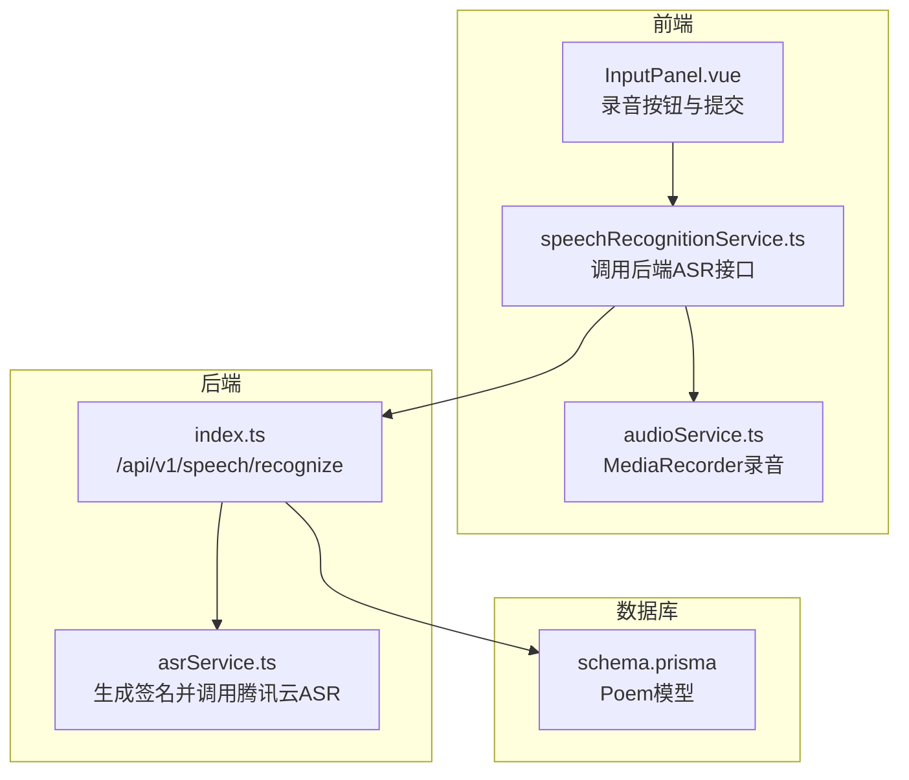
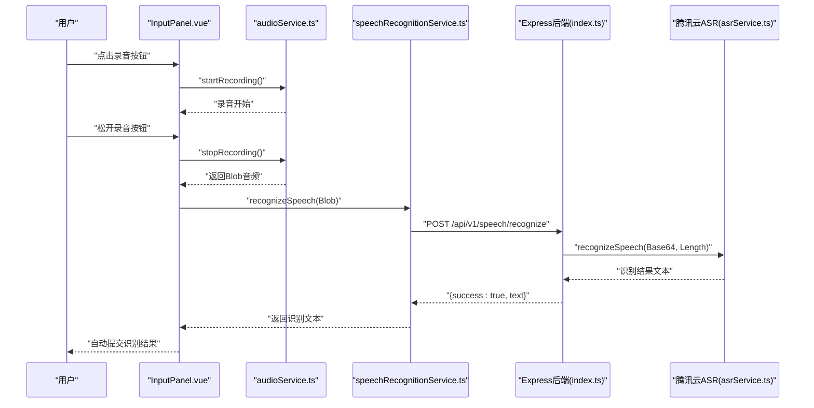
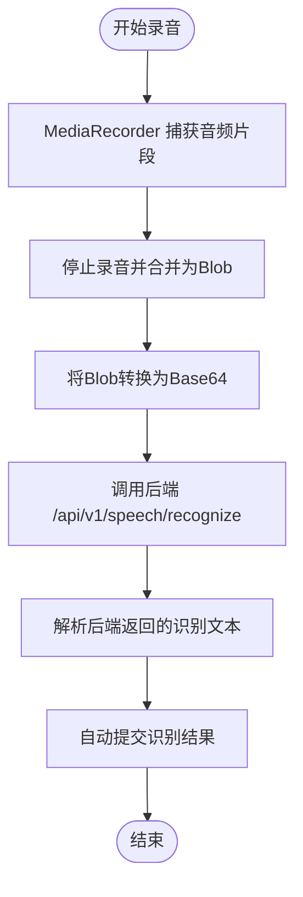
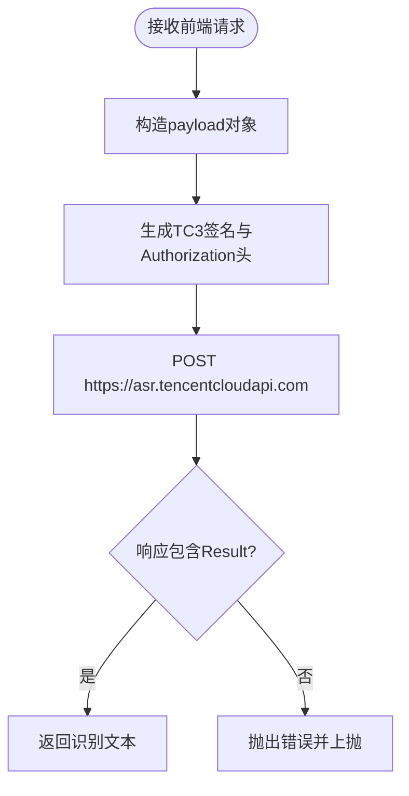
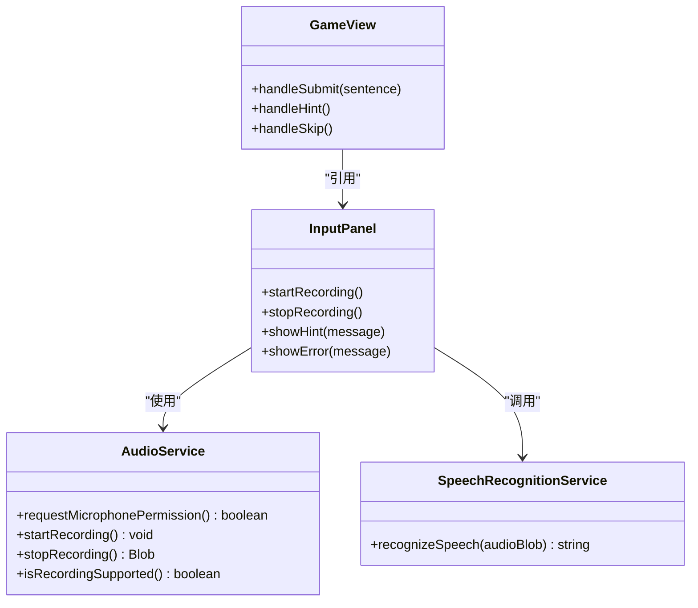
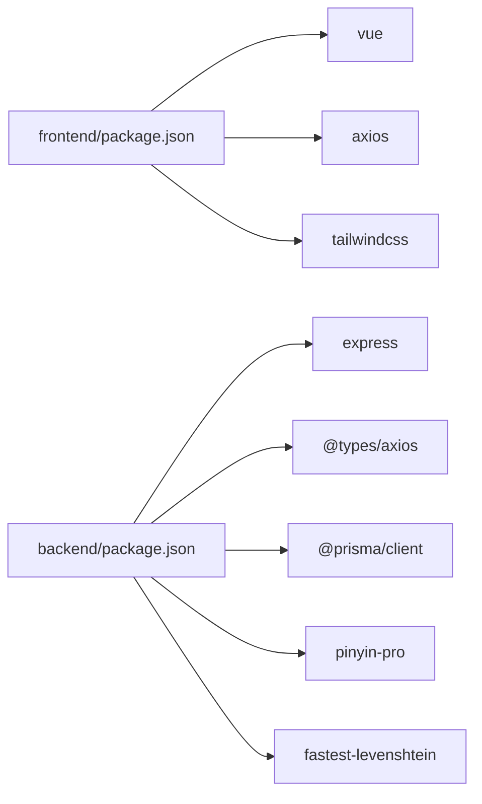

# Asr Service

<cite>
**本文引用的文件列表**
- [backend/src/asrService.ts](file://backend/src/asrService.ts)
- [backend/src/index.ts](file://backend/src/index.ts)
- [frontend/src/services/speechRecognitionService.ts](file://frontend/src/services/speechRecognitionService.ts)
- [frontend/src/services/audioService.ts](file://frontend/src/services/audioService.ts)
- [frontend/src/components/InputPanel.vue](file://frontend/src/components/InputPanel.vue)
- [frontend/src/views/GameView.vue](file://frontend/src/views/GameView.vue)
- [backend/prisma/schema.prisma](file://backend/prisma/schema.prisma)
- [backend/package.json](file://backend/package.json)
- [frontend/package.json](file://frontend/package.json)
</cite>

## 目录
1. [简介](#简介)
2. [项目结构](#项目结构)
3. [核心组件](#核心组件)
4. [架构总览](#架构总览)
5. [详细组件分析](#详细组件分析)
6. [依赖关系分析](#依赖关系分析)
7. [性能考量](#性能考量)
8. [故障排查指南](#故障排查指南)
9. [结论](#结论)

## 简介
本文件聚焦于“语音识别服务（ASR）”在项目中的实现与集成，涵盖从前端录音、语音识别调用，到后端对接腾讯云ASR API的完整流程。文档旨在帮助开发者快速理解 ASR 的工作原理、关键数据流、错误处理策略以及部署与性能优化要点。

## 项目结构
- 前端负责录音采集、语音识别请求封装与结果展示，位于 frontend/src/services 与 frontend/src/components。
- 后端提供统一 API，其中包含语音识别接口，内部调用腾讯云 ASR 并返回识别文本。
- 数据库模型用于存储诗词内容，供游戏逻辑验证使用。

图表来源
- [frontend/src/components/InputPanel.vue](file://frontend/src/components/InputPanel.vue#L1-L171)
- [frontend/src/services/speechRecognitionService.ts](file://frontend/src/services/speechRecognitionService.ts#L1-L58)
- [frontend/src/services/audioService.ts](file://frontend/src/services/audioService.ts#L1-L78)
- [backend/src/index.ts](file://backend/src/index.ts#L346-L370)
- [backend/src/asrService.ts](file://backend/src/asrService.ts#L1-L98)
- [backend/prisma/schema.prisma](file://backend/prisma/schema.prisma#L1-L19)

章节来源
- [frontend/src/components/InputPanel.vue](file://frontend/src/components/InputPanel.vue#L1-L171)
- [frontend/src/services/speechRecognitionService.ts](file://frontend/src/services/speechRecognitionService.ts#L1-L58)
- [frontend/src/services/audioService.ts](file://frontend/src/services/audioService.ts#L1-L78)
- [backend/src/index.ts](file://backend/src/index.ts#L346-L370)
- [backend/src/asrService.ts](file://backend/src/asrService.ts#L1-L98)
- [backend/prisma/schema.prisma](file://backend/prisma/schema.prisma#L1-L19)

## 核心组件
- 前端语音识别服务：封装将 Blob 转 Base64 并调用后端 /api/v1/speech/recognize 的逻辑。
- 前端录音服务：基于 MediaRecorder 实现录音采集与权限申请。
- 后端 ASR 服务：生成腾讯云 TC3-HMAC-SHA256 签名，构造 Authorization 头，调用 asr.tencentcloudapi.com。
- 后端 Express API：接收前端请求，校验参数，调用 ASR 服务并返回识别结果。

章节来源
- [frontend/src/services/speechRecognitionService.ts](file://frontend/src/services/speechRecognitionService.ts#L1-L58)
- [frontend/src/services/audioService.ts](file://frontend/src/services/audioService.ts#L1-L78)
- [backend/src/asrService.ts](file://backend/src/asrService.ts#L1-L98)
- [backend/src/index.ts](file://backend/src/index.ts#L346-L370)

## 架构总览
下图展示了从用户按下录音按钮到收到识别结果的端到端流程。

图表来源
- [frontend/src/components/InputPanel.vue](file://frontend/src/components/InputPanel.vue#L123-L157)
- [frontend/src/services/audioService.ts](file://frontend/src/services/audioService.ts#L21-L64)
- [frontend/src/services/speechRecognitionService.ts](file://frontend/src/services/speechRecognitionService.ts#L1-L58)
- [backend/src/index.ts](file://backend/src/index.ts#L346-L370)
- [backend/src/asrService.ts](file://backend/src/asrService.ts#L66-L98)

## 详细组件分析

### 前端录音与语音识别流程
- 录音采集：通过 MediaRecorder 捕获音频片段，最终合并为 Blob。录音结束后释放媒体轨道，避免资源泄露。
- 语音识别：将 Blob 转为 Base64 字符串，携带音频大小发送至后端 /api/v1/speech/recognize；后端返回识别文本后，前端自动填充输入框并提交。

图表来源
- [frontend/src/services/audioService.ts](file://frontend/src/services/audioService.ts#L21-L64)
- [frontend/src/services/speechRecognitionService.ts](file://frontend/src/services/speechRecognitionService.ts#L1-L58)
- [frontend/src/components/InputPanel.vue](file://frontend/src/components/InputPanel.vue#L123-L157)

章节来源
- [frontend/src/services/audioService.ts](file://frontend/src/services/audioService.ts#L1-L78)
- [frontend/src/services/speechRecognitionService.ts](file://frontend/src/services/speechRecognitionService.ts#L1-L58)
- [frontend/src/components/InputPanel.vue](file://frontend/src/components/InputPanel.vue#L123-L157)

### 后端腾讯云 ASR 签名与请求
- 环境变量：从环境变量读取 SecretId、SecretKey、AppId，用于生成签名。
- 签名算法：实现 TC3-HMAC-SHA256 规范，生成 Canonical Request、StringToSign，并计算 Signature。
- 请求头：构造 Authorization、X-TC-* 系列头部，POST 到 asr.tencentcloudapi.com。
- 业务接口：/api/v1/speech/recognize 接收 Base64 音频与长度，调用识别函数并返回结果。

图表来源
- [backend/src/asrService.ts](file://backend/src/asrService.ts#L12-L43)
- [backend/src/asrService.ts](file://backend/src/asrService.ts#L46-L63)
- [backend/src/asrService.ts](file://backend/src/asrService.ts#L66-L98)
- [backend/src/index.ts](file://backend/src/index.ts#L346-L370)

章节来源
- [backend/src/asrService.ts](file://backend/src/asrService.ts#L1-L98)
- [backend/src/index.ts](file://backend/src/index.ts#L346-L370)

### 前端组件与服务的交互
- InputPanel.vue：负责录音按钮状态、提示与错误信息展示；录音结束后调用语音识别服务。
- GameView.vue：在游戏生命周期中初始化音效与麦克风权限，处理识别结果并驱动游戏状态。

图表来源
- [frontend/src/components/InputPanel.vue](file://frontend/src/components/InputPanel.vue#L1-L171)
- [frontend/src/services/audioService.ts](file://frontend/src/services/audioService.ts#L1-L78)
- [frontend/src/services/speechRecognitionService.ts](file://frontend/src/services/speechRecognitionService.ts#L1-L58)
- [frontend/src/views/GameView.vue](file://frontend/src/views/GameView.vue#L1-L201)

章节来源
- [frontend/src/components/InputPanel.vue](file://frontend/src/components/InputPanel.vue#L1-L171)
- [frontend/src/views/GameView.vue](file://frontend/src/views/GameView.vue#L1-L201)

## 依赖关系分析
- 后端依赖
  - express：提供 Web 服务与路由。
  - axios：发起 HTTP 请求至腾讯云 ASR。
  - @prisma/client：数据库访问。
  - pinyin-pro、fastest-levenshtein：诗词验证辅助工具。
- 前端依赖
  - vue：组件化与响应式。
  - axios：调用后端 API。
  - tailwindcss：样式框架。

图表来源
- [frontend/package.json](file://frontend/package.json#L1-L54)
- [backend/package.json](file://backend/package.json#L1-L37)

章节来源
- [frontend/package.json](file://frontend/package.json#L1-L54)
- [backend/package.json](file://backend/package.json#L1-L37)

## 性能考量
- 前端录音
  - 录音结束后及时释放媒体轨道，避免内存与资源泄漏。
  - Base64 转换与网络传输可能带来带宽与 CPU 开销，建议控制录音时长与采样率。
- 后端 ASR
  - 签名与请求头构造为纯计算与网络 IO，注意超时与重试策略。
  - 对外暴露的 /api/v1/speech/recognize 接口应限制请求体大小与频率，防止滥用。
- 数据库
  - 游戏验证逻辑涉及多处查询与字符串处理，建议在诗词表上建立合适的索引以提升检索效率（如按关键字分词或拼音索引）。

章节来源
- [frontend/src/services/audioService.ts](file://frontend/src/services/audioService.ts#L44-L64)
- [backend/src/asrService.ts](file://backend/src/asrService.ts#L66-L98)
- [backend/src/index.ts](file://backend/src/index.ts#L346-L370)
- [backend/prisma/schema.prisma](file://backend/prisma/schema.prisma#L13-L19)

## 故障排查指南
- 前端录音失败
  - 检查浏览器是否支持 MediaRecorder 与 getUserMedia；确认麦克风权限已授予。
  - 若权限被拒，前端会提示用户前往浏览器设置开启麦克风权限。
- 语音识别接口报错
  - 后端 /api/v1/speech/recognize 返回错误时，前端会捕获并提示具体错误信息。
  - 后端内部异常会被捕获并返回统一错误结构，便于前端展示。
- 腾讯云 ASR 签名问题
  - 确认环境变量中 SecretId、SecretKey、AppId 已正确配置。
  - 检查时间戳与日期格式是否符合 TC3 规范。
- 数据库连接问题
  - 确认 DATABASE_URL 与 PRISMA_DATABASE_URL 环境变量正确指向远程 PostgreSQL。
  - 如 Prisma Client 未生成，可在 backend 目录执行生成命令。

章节来源
- [frontend/src/services/audioService.ts](file://frontend/src/services/audioService.ts#L9-L19)
- [frontend/src/components/InputPanel.vue](file://frontend/src/components/InputPanel.vue#L123-L157)
- [frontend/src/services/speechRecognitionService.ts](file://frontend/src/services/speechRecognitionService.ts#L1-L58)
- [backend/src/index.ts](file://backend/src/index.ts#L346-L370)
- [backend/src/asrService.ts](file://backend/src/asrService.ts#L1-L20)
- [backend/prisma/schema.prisma](file://backend/prisma/schema.prisma#L1-L12)

## 结论
本项目的 ASR 服务通过前端录音与语音识别服务、后端 Express API 与腾讯云 ASR 的协同，实现了从录音到识别文本的完整闭环。整体设计遵循前后端分离与职责清晰的原则，具备良好的扩展性与可维护性。建议在生产环境中完善安全与性能策略（如限流、鉴权、缓存与监控），并持续优化用户体验与稳定性。