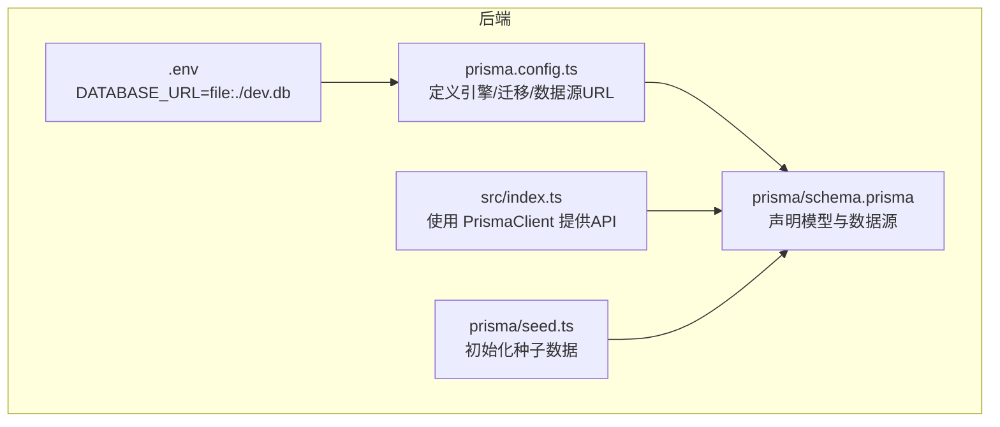
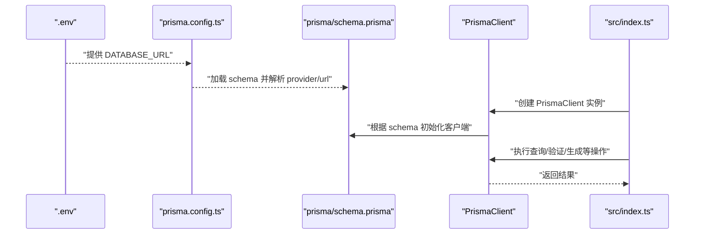
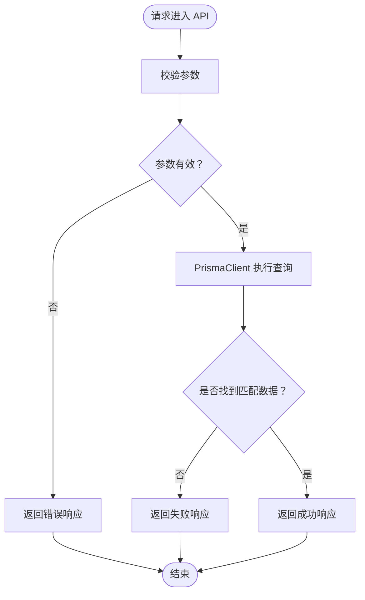
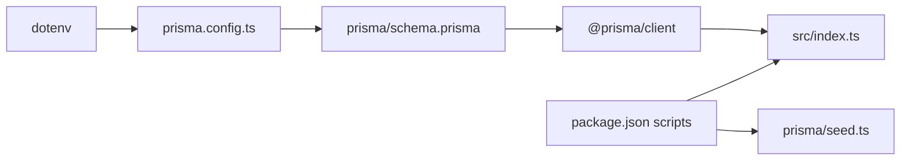

# Prisma集成与配置

<cite>
**本文引用的文件**
- [backend/prisma.config.ts](file://backend/prisma.config.ts)
- [backend/.env](file://backend/.env)
- [backend/prisma/schema.prisma](file://backend/prisma/schema.prisma)
- [backend/src/index.ts](file://backend/src/index.ts)
- [backend/package.json](file://backend/package.json)
- [backend/prisma/seed.ts](file://backend/prisma/seed.ts)
</cite>

## 目录
1. [简介](#简介)
2. [项目结构](#项目结构)
3. [核心组件](#核心组件)
4. [架构总览](#架构总览)
5. [详细组件分析](#详细组件分析)
6. [依赖关系分析](#依赖关系分析)
7. [性能考虑](#性能考虑)
8. [故障排查指南](#故障排查指南)
9. [结论](#结论)
10. [附录](#附录)

## 简介
本文件面向开发者，系统性说明后端项目中 Prisma ORM 的集成方式与配置要点，重点围绕以下主题：
- prisma.config.ts 中 defineConfig 的关键配置项及其作用：schema 路径、migrations 目录、datasource.url 如何通过 env('DATABASE_URL') 读取环境变量。
- .env 文件中 DATABASE_URL="file:./dev.db" 的含义：指定 SQLite 数据库文件的本地存储位置。
- 运行时 PrismaClient 实例如何连接到该数据库并支持 CRUD 操作。
- 配置变更指导、多环境适配策略（开发/生产）、连接池配置建议以及常见路径解析问题的解决方案。

## 项目结构
后端采用“配置 + 模式 + 客户端”的分层组织：
- 配置层：prisma.config.ts 定义 Prisma 引擎、迁移目录、数据源 URL。
- 模式层：prisma/schema.prisma 声明数据模型与数据源。
- 运行时层：src/index.ts 使用 PrismaClient 提供 API。
- 种子数据：prisma/seed.ts 初始化示例数据。
- 环境变量：.env 提供数据库连接字符串。

图表来源
- [backend/prisma.config.ts](file://backend/prisma.config.ts#L1-L14)
- [backend/prisma/schema.prisma](file://backend/prisma/schema.prisma#L1-L19)
- [backend/.env](file://backend/.env#L1-L1)
- [backend/src/index.ts](file://backend/src/index.ts#L1-L78)
- [backend/prisma/seed.ts](file://backend/prisma/seed.ts#L1-L53)

章节来源
- [backend/prisma.config.ts](file://backend/prisma.config.ts#L1-L14)
- [backend/prisma/schema.prisma](file://backend/prisma/schema.prisma#L1-L19)
- [backend/.env](file://backend/.env#L1-L1)
- [backend/src/index.ts](file://backend/src/index.ts#L1-L78)
- [backend/package.json](file://backend/package.json#L1-L30)

## 核心组件
- prisma.config.ts
  - 导入 dotenv 并通过 defineConfig 定义 Prisma 行为。
  - schema 指向 prisma/schema.prisma，用于加载 Prisma 模式。
  - migrations.path 指定迁移脚本目录，便于管理数据库演进。
  - datasource.url 通过 env('DATABASE_URL') 从环境变量读取数据库连接字符串。
  - engine 设置为 classic，表示使用经典引擎模式。
- .env
  - 提供 DATABASE_URL=file:./dev.db，指示 SQLite 使用本地 dev.db 文件作为数据存储。
- prisma/schema.prisma
  - generator client 指定 prisma-client-js，生成类型安全的客户端。
  - datasource db 指定 provider 为 sqlite，并通过 env("DATABASE_URL") 读取连接字符串。
  - model Poem 定义了 id、title、author、content 字段。
- src/index.ts
  - 创建 PrismaClient 实例并基于其进行查询与业务逻辑处理。
  - 提供三个 API：随机令字、验证用户诗句、AI 生成诗句。
- prisma/seed.ts
  - 使用 PrismaClient 清空并写入示例数据，演示 CRUD 的写入能力。

章节来源
- [backend/prisma.config.ts](file://backend/prisma.config.ts#L1-L14)
- [backend/.env](file://backend/.env#L1-L1)
- [backend/prisma/schema.prisma](file://backend/prisma/schema.prisma#L1-L19)
- [backend/src/index.ts](file://backend/src/index.ts#L1-L78)
- [backend/prisma/seed.ts](file://backend/prisma/seed.ts#L1-L53)

## 架构总览
下图展示了 Prisma 在运行时的连接与调用流程，从 .env 到 prisma.config.ts，再到 schema.prisma，最终由 PrismaClient 在 src/index.ts 中执行查询。

图表来源
- [backend/.env](file://backend/.env#L1-L1)
- [backend/prisma.config.ts](file://backend/prisma.config.ts#L1-L14)
- [backend/prisma/schema.prisma](file://backend/prisma/schema.prisma#L1-L19)
- [backend/src/index.ts](file://backend/src/index.ts#L1-L78)

## 详细组件分析

### 配置文件 prisma.config.ts
- 功能定位
  - 作为 Prisma 的工程级配置入口，统一定义 schema、迁移目录、引擎模式与数据源 URL。
- 关键配置项
  - schema: 指向 prisma/schema.prisma，确保 Prisma 加载正确的数据模型与数据源定义。
  - migrations.path: 指定迁移脚本存放目录，便于版本化管理数据库结构变更。
  - engine: 设为 classic，表示使用经典引擎模式（与新引擎模式相比，兼容性与行为差异需结合实际需求评估）。
  - datasource.url: 通过 env('DATABASE_URL') 读取环境变量 DATABASE_URL，实现连接字符串的外部化配置。
- 与 .env 的协作
  - prisma.config.ts 先导入 dotenv，使 process.env 可用；随后通过 env('DATABASE_URL') 读取 .env 中的值，形成“配置文件 -> 环境变量”的链路。

章节来源
- [backend/prisma.config.ts](file://backend/prisma.config.ts#L1-L14)
- [backend/.env](file://backend/.env#L1-L1)

### 环境变量 .env 与 DATABASE_URL
- 含义与作用
  - DATABASE_URL="file:./dev.db" 指定 SQLite 使用本地文件 dev.db 作为数据存储，路径相对当前工作目录。
  - 该值被 prisma.config.ts 通过 env('DATABASE_URL') 读取，进而传递给 schema.prisma 的 datasource db.url。
- 注意事项
  - 若项目根目录或工作目录发生变化，需同步调整相对路径，避免数据库文件找不到。
  - 在 CI/CD 或容器环境中，应通过环境注入的方式提供 DATABASE_URL，避免硬编码。

章节来源
- [backend/.env](file://backend/.env#L1-L1)
- [backend/prisma.config.ts](file://backend/prisma.config.ts#L1-L14)
- [backend/prisma/schema.prisma](file://backend/prisma/schema.prisma#L1-L19)

### Prisma 模式 prisma/schema.prisma
- 生成器 client
  - provider 为 prisma-client-js，生成类型安全的客户端代码，便于在 TypeScript 中进行强类型查询。
- 数据源 datasource db
  - provider 为 sqlite，url 通过 env("DATABASE_URL") 读取连接字符串。
- 模型 model Poem
  - 包含 id、title、author、content 字段，对应后端 API 的业务实体。

章节来源
- [backend/prisma/schema.prisma](file://backend/prisma/schema.prisma#L1-L19)

### 运行时 PrismaClient 与 CRUD
- 实例化
  - 在 src/index.ts 中创建 PrismaClient 实例，用于与数据库交互。
- CRUD 示例
  - 查询：findMany/findFirst 等方法用于检索数据。
  - 写入：prisma/seed.ts 展示了 deleteMany 与 createMany 的组合，实现清空与批量插入。
- API 场景
  - 随机令字：从 poem 表中随机选取一条记录并返回其中的一个字符。
  - 验证诗句：检查输入是否包含令字、是否已使用过、是否存在于数据库中。
  - AI 生成：基于令字筛选可用诗句并返回一条。

图表来源
- [backend/src/index.ts](file://backend/src/index.ts#L1-L78)
- [backend/prisma/seed.ts](file://backend/prisma/seed.ts#L1-L53)

章节来源
- [backend/src/index.ts](file://backend/src/index.ts#L1-L78)
- [backend/prisma/seed.ts](file://backend/prisma/seed.ts#L1-L53)

### 多环境适配策略（开发/生产）
- 开发环境
  - 使用 SQLite 本地文件 dev.db，便于快速迭代与离线开发。
  - 通过 .env 注入 DATABASE_URL=file:./dev.db。
- 生产环境
  - 推荐使用云数据库（如 PostgreSQL/MySQL），通过环境变量注入连接字符串。
  - 将 DATABASE_URL 改为生产数据库地址，确保连接安全与高可用。
- 环境隔离
  - 不同环境使用不同的 .env 文件或环境变量注入，避免误用。
  - 对于 Docker/Kubernetes，建议通过配置映射或密钥管理服务注入 DATABASE_URL。

章节来源
- [backend/.env](file://backend/.env#L1-L1)
- [backend/prisma.config.ts](file://backend/prisma.config.ts#L1-L14)
- [backend/prisma/schema.prisma](file://backend/prisma/schema.prisma#L1-L19)

### 连接池与性能配置建议
- 连接池
  - Prisma 官方默认连接池参数适用于大多数场景；若并发较高或存在长事务，可按官方文档调整连接池大小与超时参数。
- 性能优化
  - 合理使用索引与查询条件，避免全表扫描。
  - 批量写入（如 createMany）优于多次单条插入。
  - 控制查询字段范围，减少不必要的数据传输。
- 资源释放
  - 在应用退出或长时间空闲时，确保断开 PrismaClient 连接，避免资源泄漏。

章节来源
- [backend/src/index.ts](file://backend/src/index.ts#L1-L78)
- [backend/package.json](file://backend/package.json#L1-L30)

### 路径解析与常见问题
- SQLite 文件路径
  - DATABASE_URL=file:./dev.db 使用相对路径，需确保工作目录与期望一致。
  - 若部署在容器或 CI 环境，建议使用绝对路径或通过环境变量动态拼接。
- 环境变量加载顺序
  - prisma.config.ts 先导入 dotenv，再读取 env('DATABASE_URL')，确保 .env 已生效。
- 模式与引擎
  - engine 设置为 classic，若后续切换到新引擎模式，需评估兼容性与行为差异。

章节来源
- [backend/.env](file://backend/.env#L1-L1)
- [backend/prisma.config.ts](file://backend/prisma.config.ts#L1-L14)
- [backend/prisma/schema.prisma](file://backend/prisma/schema.prisma#L1-L19)

## 依赖关系分析
- 组件耦合
  - prisma.config.ts 依赖 dotenv 以加载 .env。
  - prisma/schema.prisma 依赖 env("DATABASE_URL") 读取连接字符串。
  - src/index.ts 依赖 @prisma/client 生成的类型安全客户端。
- 外部依赖
  - prisma 与 @prisma/client 提供 ORM 能力与客户端生成。
  - sqlite3 为 SQLite 的驱动依赖。
- 脚本与命令
  - package.json 中的 scripts 定义了启动与种子数据脚本，便于本地开发与初始化。

图表来源
- [backend/prisma.config.ts](file://backend/prisma.config.ts#L1-L14)
- [backend/prisma/schema.prisma](file://backend/prisma/schema.prisma#L1-L19)
- [backend/src/index.ts](file://backend/src/index.ts#L1-L78)
- [backend/package.json](file://backend/package.json#L1-L30)
- [backend/prisma/seed.ts](file://backend/prisma/seed.ts#L1-L53)

章节来源
- [backend/package.json](file://backend/package.json#L1-L30)

## 性能考虑
- 查询优化
  - 使用 where 条件与排序限制结果集规模。
  - 对高频查询字段建立索引（在 schema.prisma 中定义）。
- 写入优化
  - 使用 createMany 等批量写入接口，降低网络往返次数。
- 连接管理
  - 在应用生命周期内复用 PrismaClient 实例，避免频繁创建销毁。
  - 在关闭应用或长时间空闲时断开连接，释放资源。

章节来源
- [backend/src/index.ts](file://backend/src/index.ts#L1-L78)
- [backend/prisma/seed.ts](file://backend/prisma/seed.ts#L1-L53)

## 故障排查指南
- 数据库文件找不到
  - 检查 .env 中 DATABASE_URL 的路径是否正确，确认相对路径与工作目录一致。
  - 在容器或 CI 环境中，使用绝对路径或通过环境变量注入。
- 环境变量未生效
  - 确认 prisma.config.ts 已导入 dotenv，且在读取 env('DATABASE_URL') 前已加载 .env。
- 迁移问题
  - 确认 migrations.path 指向的目录存在且包含有效的迁移脚本。
  - 使用 Prisma CLI 执行迁移命令，确保数据库结构与 schema 保持一致。
- 连接异常
  - 检查数据库权限与文件权限（SQLite 文件需要读写权限）。
  - 在生产环境，确认连接字符串格式与目标数据库兼容。

章节来源
- [backend/.env](file://backend/.env#L1-L1)
- [backend/prisma.config.ts](file://backend/prisma.config.ts#L1-L14)
- [backend/prisma/schema.prisma](file://backend/prisma/schema.prisma#L1-L19)

## 结论
本项目通过 prisma.config.ts 与 .env 的协同，将数据库连接字符串外部化，并以 prisma/schema.prisma 声明数据模型与数据源。运行时，PrismaClient 在 src/index.ts 中完成 CRUD 操作，配合种子脚本实现快速初始化。建议在开发与生产环境分别使用合适的数据库与连接字符串，并关注路径解析、连接池与查询性能，以获得稳定高效的运行体验。

## 附录
- 快速检查清单
  - 确认 .env 中 DATABASE_URL 已正确设置。
  - 确认 prisma.config.ts 已导入 dotenv 并读取 env('DATABASE_URL')。
  - 确认 schema.prisma 的 provider 与 url 正确。
  - 确认 src/index.ts 中已创建 PrismaClient 实例并使用其进行查询。
  - 在生产环境使用独立的数据库连接字符串，并通过环境注入。