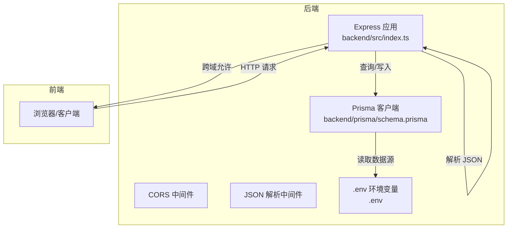
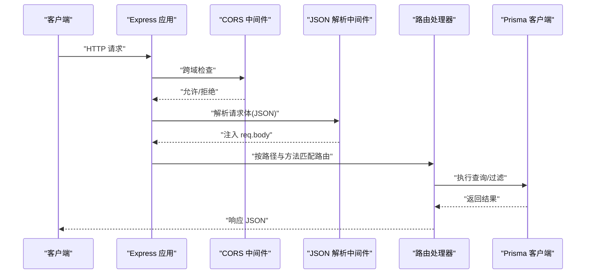
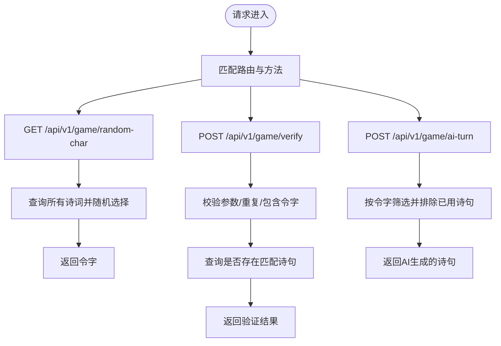
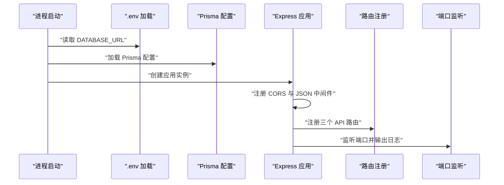
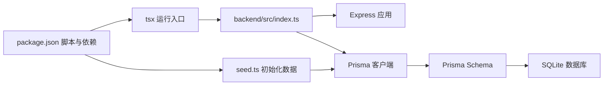

# 后端服务结构

<cite>
**本文引用的文件**
- [backend/src/index.ts](file://backend/src/index.ts)
- [backend/package.json](file://backend/package.json)
- [backend/.env](file://backend/.env)
- [backend/prisma.config.ts](file://backend/prisma.config.ts)
- [backend/prisma/schema.prisma](file://backend/prisma/schema.prisma)
- [backend/prisma/seed.ts](file://backend/prisma/seed.ts)
</cite>

## 目录
1. [简介](#简介)
2. [项目结构](#项目结构)
3. [核心组件](#核心组件)
4. [架构总览](#架构总览)
5. [详细组件分析](#详细组件分析)
6. [依赖关系分析](#依赖关系分析)
7. [性能考虑](#性能考虑)
8. [故障排查指南](#故障排查指南)
9. [结论](#结论)
10. [附录](#附录)

## 简介
本文件围绕后端服务入口文件 backend/src/index.ts 进行系统性架构与实现解析，重点覆盖：
- Express 应用实例的初始化与中间件加载顺序
- CORS 跨域与 JSON 请求体解析的工作原理
- 服务启动流程与端口监听逻辑
- PrismaClient 全局实例化及其在请求处理中的使用
- 三个核心 API 路由的注册机制与行为
- 服务生命周期视图、错误处理扩展点与性能优化建议

该文档既面向初学者提供清晰的服务运行脉络，也为高级开发者提供中间件顺序、错误处理与性能优化的深入分析。

## 项目结构
后端采用最小化 Express 架构，核心逻辑集中在单一入口文件中；数据库访问通过 Prisma 客户端完成，数据模型定义位于 Prisma Schema 中，环境变量通过 dotenv 加载。

图表来源
- [backend/src/index.ts](file://backend/src/index.ts#L1-L78)
- [backend/.env](file://backend/.env#L1-L1)
- [backend/prisma/schema.prisma](file://backend/prisma/schema.prisma#L1-L19)

章节来源
- [backend/src/index.ts](file://backend/src/index.ts#L1-L78)
- [backend/package.json](file://backend/package.json#L1-L30)
- [backend/.env](file://backend/.env#L1-L1)
- [backend/prisma/schema.prisma](file://backend/prisma/schema.prisma#L1-L19)

## 核心组件
- Express 应用实例与中间件栈
  - 初始化 Express 应用实例
  - 注册 CORS 中间件以允许跨域
  - 注册 JSON 请求体解析中间件
- Prisma 客户端
  - 在模块顶层实例化 PrismaClient
  - 在各路由处理器中进行数据库查询与过滤
- 三个核心 API 路由
  - GET /api/v1/game/random-char：随机返回一个令字
  - POST /api/v1/game/verify：校验用户输入的诗句是否有效
  - POST /api/v1/game/ai-turn：根据令字生成 AI 诗句

章节来源
- [backend/src/index.ts](file://backend/src/index.ts#L1-L78)
- [backend/prisma/schema.prisma](file://backend/prisma/schema.prisma#L1-L19)

## 架构总览
下图展示从客户端到服务端再到数据库的整体调用链路与职责边界。

图表来源
- [backend/src/index.ts](file://backend/src/index.ts#L1-L78)
- [backend/prisma/schema.prisma](file://backend/prisma/schema.prisma#L1-L19)

## 详细组件分析

### Express 应用初始化与中间件加载顺序
- 应用实例初始化
  - 在模块顶层创建 Express 应用实例
- 中间件注册顺序
  - 先注册 CORS 中间件，再注册 JSON 请求体解析中间件
  - 该顺序确保：CORS 在解析 JSON 前生效，避免跨域预检失败或解析异常导致的 CORS 失效
- 端口监听
  - 默认监听端口来自环境变量，若未设置则回退到固定值
  - 启动后输出服务运行地址的日志

章节来源
- [backend/src/index.ts](file://backend/src/index.ts#L1-L78)
- [backend/package.json](file://backend/package.json#L1-L30)

### CORS 跨域资源共享
- 功能说明
  - 通过在应用上注册 CORS 中间件，允许来自不同源的前端访问后端接口
- 适用场景
  - 前端与后端分离部署时，解决浏览器同源策略限制
- 注意事项
  - 若需更细粒度控制（如特定源、头部、方法），可参考中间件配置选项进行扩展

章节来源
- [backend/src/index.ts](file://backend/src/index.ts#L1-L78)

### JSON 请求体解析
- 功能说明
  - 使用内置 JSON 解析中间件，自动将 Content-Type 为 application/json 的请求体解析为对象并挂载到 req.body
- 作用位置
  - 在路由注册之前完成，保证所有后续路由都能直接访问解析后的请求体
- 错误处理提示
  - 当请求体格式不合法或过大时，可结合自定义中间件或全局错误处理捕获并返回统一格式的错误响应

章节来源
- [backend/src/index.ts](file://backend/src/index.ts#L1-L78)

### PrismaClient 全局实例化与使用
- 实例化位置
  - 在模块顶层创建 PrismaClient 实例，供所有路由处理器共享使用
- 数据库连接
  - 数据源 URL 来自环境变量，Prisma 配置文件中声明了 SQLite 提供商与迁移目录
- 在路由中的使用
  - 随机选择诗词与令字
  - 按条件过滤可用诗句并生成 AI 诗句
  - 查询是否存在匹配的诗句内容

章节来源
- [backend/src/index.ts](file://backend/src/index.ts#L1-L78)
- [backend/prisma.config.ts](file://backend/prisma.config.ts#L1-L14)
- [backend/prisma/schema.prisma](file://backend/prisma/schema.prisma#L1-L19)
- [backend/.env](file://backend/.env#L1-L1)

### 三个核心 API 路由注册机制
- 路由一：GET /api/v1/game/random-char
  - 行为：随机选取一首诗词，再从其内容中随机挑选一个字符作为令字
  - 返回：包含令字的对象
- 路由二：POST /api/v1/game/verify
  - 行为：校验用户提交的诗句是否包含令字、是否重复使用、是否存在于数据库中
  - 返回：布尔有效性与消息
- 路由三：POST /api/v1/game/ai-turn
  - 行为：基于令字筛选可用诗句，排除已使用过的诗句，随机返回一句
  - 返回：包含生成诗句的对象
- 路由注册与匹配
  - 使用 Express 的 app.get/app.post 方法分别注册对应 HTTP 方法与路径
  - 路由处理器内部通过 Prisma 执行查询与业务判断

图表来源
- [backend/src/index.ts](file://backend/src/index.ts#L1-L78)

章节来源
- [backend/src/index.ts](file://backend/src/index.ts#L1-L78)

### 服务启动流程
- 环境准备
  - 通过 dotenv 加载 .env 文件中的 DATABASE_URL
  - Prisma 配置文件指定 schema、迁移目录与引擎类型
- 启动步骤
  - 创建 Express 应用实例
  - 注册 CORS 与 JSON 解析中间件
  - 注册三个核心路由
  - 监听端口并输出运行日志

图表来源
- [backend/src/index.ts](file://backend/src/index.ts#L1-L78)
- [backend/.env](file://backend/.env#L1-L1)
- [backend/prisma.config.ts](file://backend/prisma.config.ts#L1-L14)

章节来源
- [backend/src/index.ts](file://backend/src/index.ts#L1-L78)
- [backend/.env](file://backend/.env#L1-L1)
- [backend/prisma.config.ts](file://backend/prisma.config.ts#L1-L14)

## 依赖关系分析
- 包管理与脚本
  - 使用 tsx 作为开发时运行器，直接执行 TypeScript 入口文件
  - 通过 seed 脚本初始化数据库中的诗词数据
- 运行时依赖
  - express、cors、@prisma/client、sqlite3、typescript 等
- 数据层依赖
  - Prisma Schema 定义了 Poem 模型，SQLite 作为数据源
  - Prisma 配置文件集中管理 schema、迁移与数据源 URL

图表来源
- [backend/package.json](file://backend/package.json#L1-L30)
- [backend/src/index.ts](file://backend/src/index.ts#L1-L78)
- [backend/prisma/schema.prisma](file://backend/prisma/schema.prisma#L1-L19)
- [backend/prisma/seed.ts](file://backend/prisma/seed.ts#L1-L53)

章节来源
- [backend/package.json](file://backend/package.json#L1-L30)
- [backend/src/index.ts](file://backend/src/index.ts#L1-L78)
- [backend/prisma/schema.prisma](file://backend/prisma/schema.prisma#L1-L19)
- [backend/prisma/seed.ts](file://backend/prisma/seed.ts#L1-L53)

## 性能考虑
- 中间件顺序
  - CORS 在 JSON 解析之前注册，有助于减少不必要的解析开销与错误处理成本
- 数据库查询
  - 随机选择与字符串包含查询在小规模数据集上表现良好；若数据量增长，建议：
    - 对 content 字段建立索引（如适用）
    - 优化随机选择算法，避免全表扫描
- 路由处理
  - 将重复使用的查询逻辑抽取为独立函数，便于缓存与复用
- 错误处理
  - 建议引入统一的错误处理中间件，对异常进行捕获并返回一致的错误格式
- 并发与连接
  - 在生产环境中，建议使用连接池与更严格的超时配置，避免长时间占用连接

[本节为通用性能建议，不直接分析具体文件]

## 故障排查指南
- 端口占用
  - 若端口被占用，可在环境变量中调整端口或释放占用端口
- 数据库连接
  - 确认 .env 文件中的 DATABASE_URL 是否正确指向 SQLite 文件
  - 如需重置数据，可运行种子脚本重新导入示例数据
- 路由返回空数据
  - 随机路由与 AI 路由在无可用数据时会返回错误状态码，请确认数据库中已有诗词数据
- 跨域问题
  - 若前端无法访问后端接口，请检查 CORS 中间件是否生效，必要时调整允许的源与方法

章节来源
- [backend/src/index.ts](file://backend/src/index.ts#L1-L78)
- [backend/.env](file://backend/.env#L1-L1)
- [backend/prisma/seed.ts](file://backend/prisma/seed.ts#L1-L53)

## 结论
本后端服务以最小化架构实现，入口文件集中完成了 Express 应用初始化、中间件注册、路由定义与服务启动。Prisma 客户端贯穿请求处理流程，支撑随机令字、诗句校验与 AI 生成等核心功能。对于初学者，建议先理解中间件顺序与路由匹配；对于高级开发者，可进一步完善错误处理、性能优化与可维护性设计。

[本节为总结性内容，不直接分析具体文件]

## 附录
- 开发与运行
  - 使用 tsx 直接运行入口文件
  - 通过 seed 脚本初始化数据库
- 数据模型
  - Poem 模型包含标题、作者与内容字段，用于存储诗词信息

章节来源
- [backend/package.json](file://backend/package.json#L1-L30)
- [backend/prisma/schema.prisma](file://backend/prisma/schema.prisma#L1-L19)
- [backend/prisma/seed.ts](file://backend/prisma/seed.ts#L1-L53)