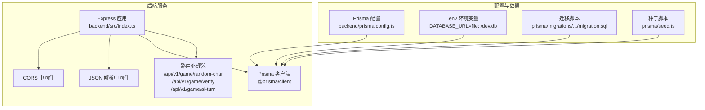
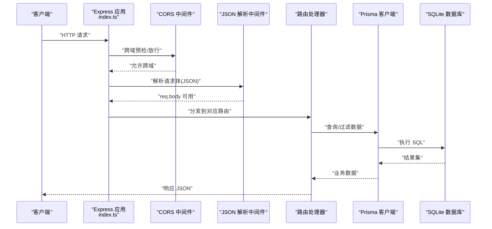
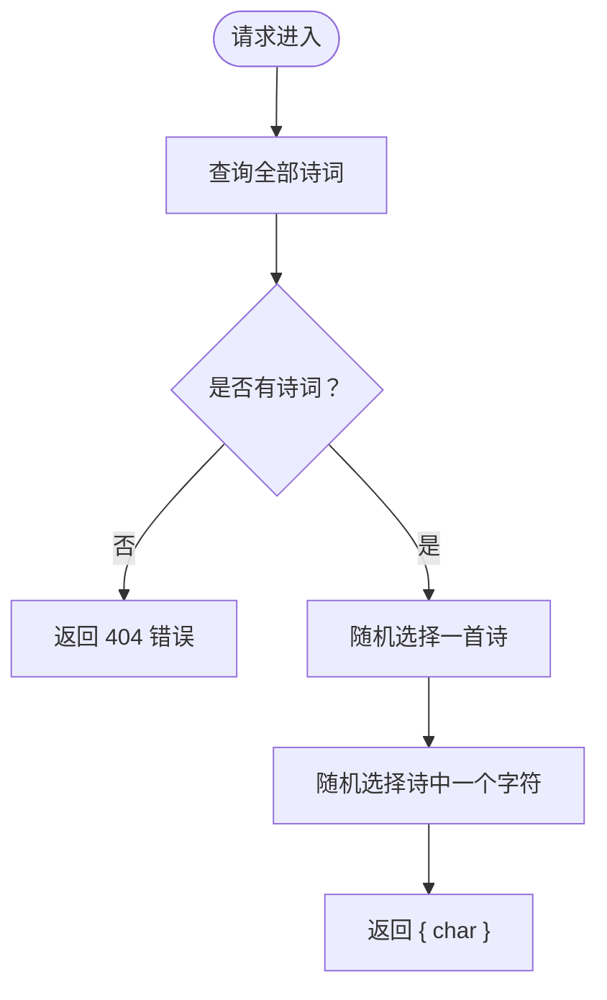
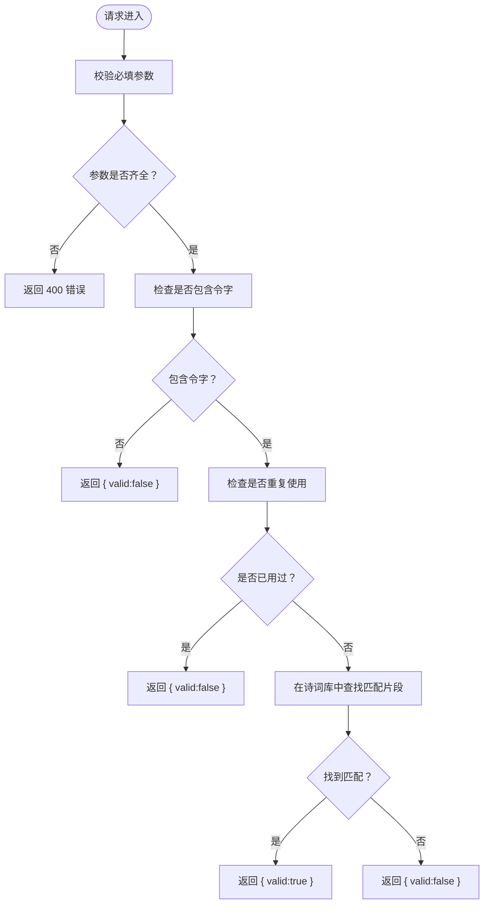
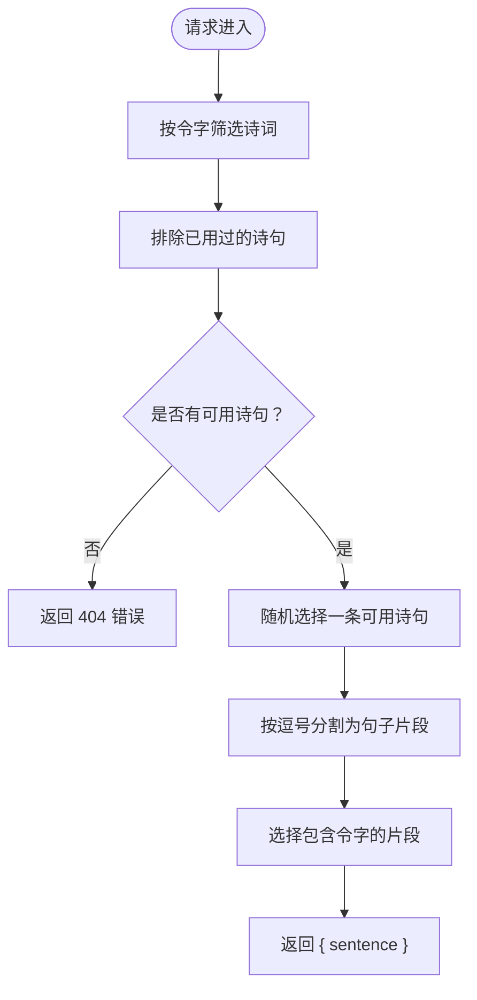
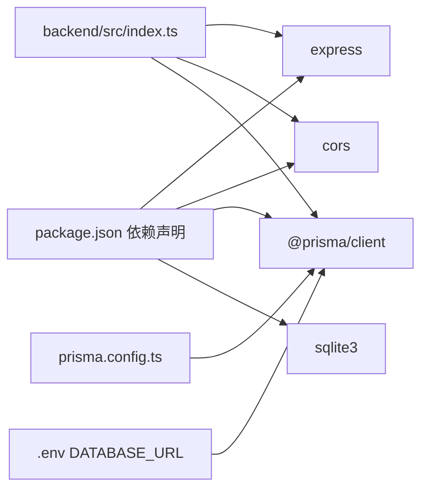

# 后端架构

<cite>
**本文引用的文件**
- [backend/src/index.ts](file://backend/src/index.ts)
- [backend/prisma.config.ts](file://backend/prisma.config.ts)
- [backend/.env](file://backend/.env)
- [backend/package.json](file://backend/package.json)
- [backend/prisma/seed.ts](file://backend/prisma/seed.ts)
- [backend/prisma/migrations/20251104061144_init/migration.sql](file://backend/prisma/migrations/20251104061144_init/migration.sql)
</cite>

## 目录
1. [简介](#简介)
2. [项目结构](#项目结构)
3. [核心组件](#核心组件)
4. [架构总览](#架构总览)
5. [详细组件分析](#详细组件分析)
6. [依赖关系分析](#依赖关系分析)
7. [性能考量](#性能考量)
8. [故障排查指南](#故障排查指南)
9. [结论](#结论)
10. [附录](#附录)

## 简介
本文件面向后端服务的完整架构文档，围绕 backend/src/index.ts 的 Express 应用展开，重点说明：
- CORS 中间件如何允许跨域请求
- JSON 解析中间件如何处理请求体
- 三个核心 API 路由的注册与处理逻辑
- PrismaClient 的实例化方式与依赖注入模式
- prisma.config.ts 如何定义 schema 路径、迁移目录与数据源 URL
- .env 文件中 DATABASE_URL 的作用及 SQLite 数据库存储位置
- 服务启动流程的完整视图

## 项目结构
后端采用最小化的单进程服务模型，核心入口为 backend/src/index.ts，数据库访问通过 Prisma 客户端实现，数据初始化通过种子脚本完成，配置通过 prisma.config.ts 和 .env 文件统一管理。

图表来源
- [backend/src/index.ts](file://backend/src/index.ts#L1-L78)
- [backend/prisma.config.ts](file://backend/prisma.config.ts#L1-L14)
- [backend/.env](file://backend/.env#L1-L1)
- [backend/prisma/seed.ts](file://backend/prisma/seed.ts#L1-L53)
- [backend/prisma/migrations/20251104061144_init/migration.sql](file://backend/prisma/migrations/20251104061144_init/migration.sql#L1-L8)

章节来源
- [backend/src/index.ts](file://backend/src/index.ts#L1-L78)
- [backend/prisma.config.ts](file://backend/prisma.config.ts#L1-L14)
- [backend/.env](file://backend/.env#L1-L1)
- [backend/package.json](file://backend/package.json#L1-L30)
- [backend/prisma/seed.ts](file://backend/prisma/seed.ts#L1-L53)
- [backend/prisma/migrations/20251104061144_init/migration.sql](file://backend/prisma/migrations/20251104061144_init/migration.sql#L1-L8)

## 核心组件
- Express 应用与中间件
  - 使用 CORS 中间件允许跨域请求
  - 使用 JSON 解析中间件处理请求体
- Prisma 客户端
  - 在应用启动时实例化，贯穿所有路由处理器
  - 通过 prisma.config.ts 指定 schema、迁移目录与数据源 URL
- 路由处理器
  - /api/v1/game/random-char：从诗词表中随机选取一个字符作为“令字”
  - /api/v1/game/verify：校验用户输入的诗句是否包含“令字”、是否重复、是否存在于诗词库
  - /api/v1/game/ai-turn：根据“令字”筛选可用诗句，返回一条可选的句子

章节来源
- [backend/src/index.ts](file://backend/src/index.ts#L1-L78)
- [backend/prisma.config.ts](file://backend/prisma.config.ts#L1-L14)

## 架构总览
下图展示了从客户端到数据库的调用链路，以及中间件与路由的装配关系。

图表来源
- [backend/src/index.ts](file://backend/src/index.ts#L1-L78)

## 详细组件分析

### Express 应用与中间件
- CORS 中间件
  - 在应用启动时启用，允许来自任意来源的跨域请求，便于前端跨域访问
- JSON 解析中间件
  - 将 Content-Type 为 application/json 的请求体解析为对象，供后续路由处理器读取
- 端口监听
  - 默认监听环境变量 PORT 或 3000 端口，并输出启动日志

章节来源
- [backend/src/index.ts](file://backend/src/index.ts#L1-L78)

### 路由与业务逻辑

#### 路由：/api/v1/game/random-char
- 功能：从诗词表中随机选取一首诗，再从该诗内容中随机选取一个字符作为“令字”，返回给客户端
- 关键点：
  - 若诗词表为空，返回 404
  - 随机选择策略基于数组长度与索引计算
- 处理器路径参考
  - [backend/src/index.ts](file://backend/src/index.ts#L12-L21)

图表来源
- [backend/src/index.ts](file://backend/src/index.ts#L12-L21)

#### 路由：/api/v1/game/verify
- 功能：校验用户提交的诗句
- 参数要求：
  - 必须包含“令字”
  - 不得与已用过的诗句重复
  - 且必须能在诗词库中找到匹配的诗句片段
- 返回值：
  - valid: 布尔值
  - message: 提示信息
- 处理器路径参考
  - [backend/src/index.ts](file://backend/src/index.ts#L23-L48)

图表来源
- [backend/src/index.ts](file://backend/src/index.ts#L23-L48)

#### 路由：/api/v1/game/ai-turn
- 功能：根据“令字”筛选可用诗句，返回一条可选的句子
- 过滤逻辑：
  - 先按“令字”包含条件筛选
  - 再排除已用过的诗句
- 处理器路径参考
  - [backend/src/index.ts](file://backend/src/index.ts#L50-L72)

图表来源
- [backend/src/index.ts](file://backend/src/index.ts#L50-L72)

### Prisma 客户端与依赖注入模式
- 实例化方式
  - 在应用入口处创建 PrismaClient 实例，随后在各路由处理器中直接使用
- 依赖注入模式
  - 采用“全局单例 + 函数内直接使用”的轻量依赖注入模式，无需额外容器
  - 优点：简单直观；缺点：测试时需注意连接生命周期管理
- 数据库连接
  - 通过 prisma.config.ts 的 datasource.url 读取 DATABASE_URL 环境变量
  - .env 文件中 DATABASE_URL 指向 SQLite 文件 dev.db（相对路径）

章节来源
- [backend/src/index.ts](file://backend/src/index.ts#L1-L78)
- [backend/prisma.config.ts](file://backend/prisma.config.ts#L1-L14)
- [backend/.env](file://backend/.env#L1-L1)

### Prisma 配置与数据模型
- prisma.config.ts
  - schema：指向 prisma/schema.prisma
  - migrations：迁移目录为 prisma/migrations
  - engine：classic 引擎
  - datasource.url：从环境变量 DATABASE_URL 读取
- 迁移脚本
  - 初始迁移创建了 Poem 表，包含 id、title、author、content 字段
- 种子脚本
  - 初始化多首诗词，将段落合并为 content 存入数据库

章节来源
- [backend/prisma.config.ts](file://backend/prisma.config.ts#L1-L14)
- [backend/prisma/migrations/20251104061144_init/migration.sql](file://backend/prisma/migrations/20251104061144_init/migration.sql#L1-L8)
- [backend/prisma/seed.ts](file://backend/prisma/seed.ts#L1-L53)

### 环境变量与数据库文件位置
- DATABASE_URL
  - 作用：指定 Prisma 数据源 URL，用于建立数据库连接
  - 值：file:./dev.db（SQLite 文件）
- SQLite 文件实际存储位置
  - 由于使用相对路径 file:./dev.db，SQLite 文件位于项目根目录下的 dev.db
  - 若需要自定义路径，请修改 .env 中的 DATABASE_URL 值

章节来源
- [backend/.env](file://backend/.env#L1-L1)
- [backend/prisma.config.ts](file://backend/prisma.config.ts#L1-L14)

### 服务启动流程
- 启动命令
  - 使用脚本 npm run start（或直接运行 tsx src/index.ts）
- 启动步骤
  - 加载 .env 环境变量
  - 初始化 Prisma 客户端
  - 启用 CORS 与 JSON 解析中间件
  - 注册三条游戏相关路由
  - 监听端口并输出启动日志

章节来源
- [backend/package.json](file://backend/package.json#L1-L30)
- [backend/src/index.ts](file://backend/src/index.ts#L1-L78)
- [backend/.env](file://backend/.env#L1-L1)

## 依赖关系分析
- 组件耦合
  - 路由处理器直接依赖 PrismaClient，耦合度较低但集中于入口文件
  - 中间件与路由之间为松耦合，通过 Express 的中间件机制串联
- 外部依赖
  - @prisma/client：数据库访问
  - express：Web 框架
  - cors：跨域支持
  - sqlite3：SQLite 驱动
- 配置依赖
  - prisma.config.ts 与 .env 影响 Prisma 的 schema、迁移与数据源

图表来源
- [backend/package.json](file://backend/package.json#L1-L30)
- [backend/src/index.ts](file://backend/src/index.ts#L1-L78)
- [backend/prisma.config.ts](file://backend/prisma.config.ts#L1-L14)
- [backend/.env](file://backend/.env#L1-L1)

章节来源
- [backend/package.json](file://backend/package.json#L1-L30)
- [backend/src/index.ts](file://backend/src/index.ts#L1-L78)

## 性能考量
- 路由查询复杂度
  - /api/v1/game/random-char：全表扫描后随机选择，时间复杂度 O(n)，n 为诗词数量
  - /api/v1/game/verify：按片段包含查询，时间复杂度取决于数据库索引与数据量
  - /api/v1/game/ai-turn：先按令字筛选，再排除已用诗句，整体复杂度受筛选与过滤影响
- 优化建议
  - 为 content 字段建立索引以提升包含查询性能
  - 对高频随机选择场景，考虑缓存热门诗词或预生成随机索引
  - 控制请求体大小，避免超大 JSON 导致内存压力
- 连接管理
  - 当前采用单例 PrismaClient，注意在高并发下合理复用连接
  - 测试阶段可在断言后显式断开连接，避免进程阻塞

[本节为通用性能建议，不直接分析具体文件]

## 故障排查指南
- 跨域问题
  - 确认已启用 CORS 中间件
  - 检查前端请求是否携带正确的 Origin
- 请求体解析失败
  - 确保 Content-Type 为 application/json
  - 检查请求体格式是否符合 JSON 规范
- 数据库连接错误
  - 检查 .env 中 DATABASE_URL 是否正确
  - 确认 SQLite 文件存在且可读写
- 路由返回 404
  - /api/v1/game/random-char：确认种子脚本已执行，数据库中有诗词记录
  - /api/v1/game/ai-turn：确认筛选后仍有可用诗句
- 日志定位
  - 启动日志会打印服务监听地址，便于确认服务状态

章节来源
- [backend/src/index.ts](file://backend/src/index.ts#L1-L78)
- [backend/.env](file://backend/.env#L1-L1)
- [backend/prisma/seed.ts](file://backend/prisma/seed.ts#L1-L53)

## 结论
本后端服务以 Express 为核心，通过 CORS 与 JSON 中间件提供跨域与请求体解析能力，三条游戏路由分别负责“令字生成”、“诗句验证”与“AI 生成”。Prisma 客户端采用全局单例模式，配合 prisma.config.ts 与 .env 实现清晰的配置与数据源管理。整体架构简洁、职责明确，适合快速迭代与扩展。

[本节为总结性内容，不直接分析具体文件]

## 附录
- 启动与初始化
  - 执行种子脚本以填充初始数据
  - 使用 npm run start 启动服务
- 常见操作
  - 修改 DATABASE_URL 可切换数据库类型或文件路径
  - 新增路由时遵循现有中间件与 Prisma 使用模式

章节来源
- [backend/package.json](file://backend/package.json#L1-L30)
- [backend/prisma/seed.ts](file://backend/prisma/seed.ts#L1-L53)
- [backend/src/index.ts](file://backend/src/index.ts#L1-L78)