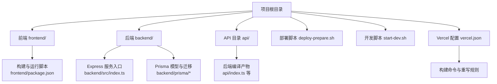
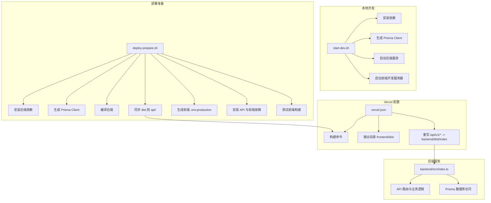
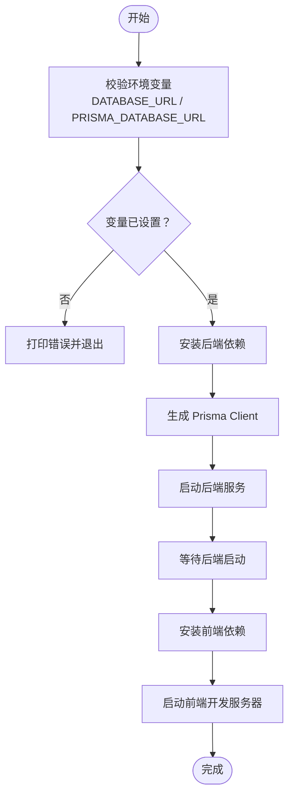
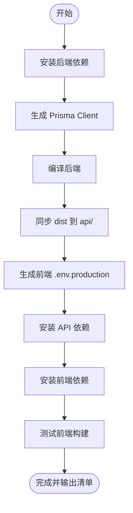
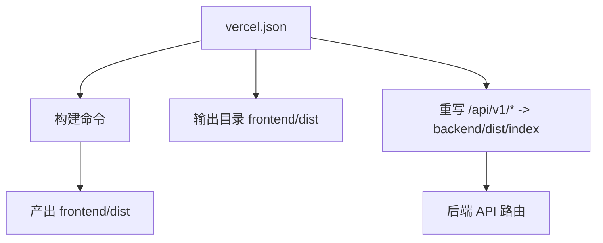
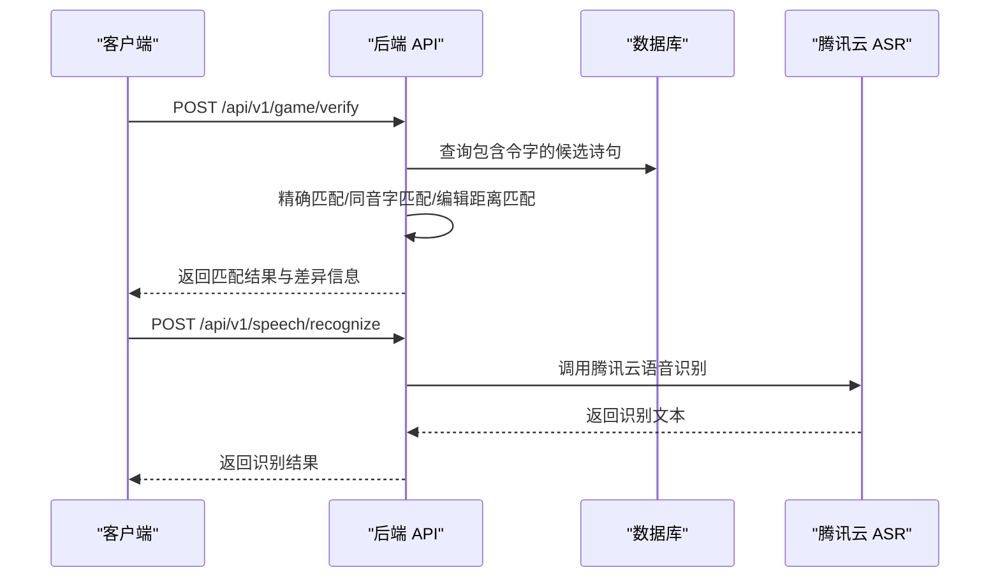
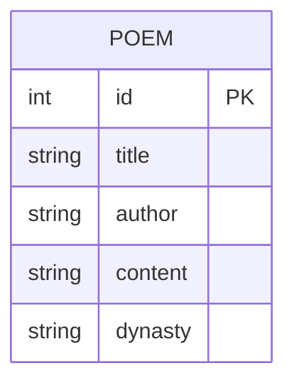
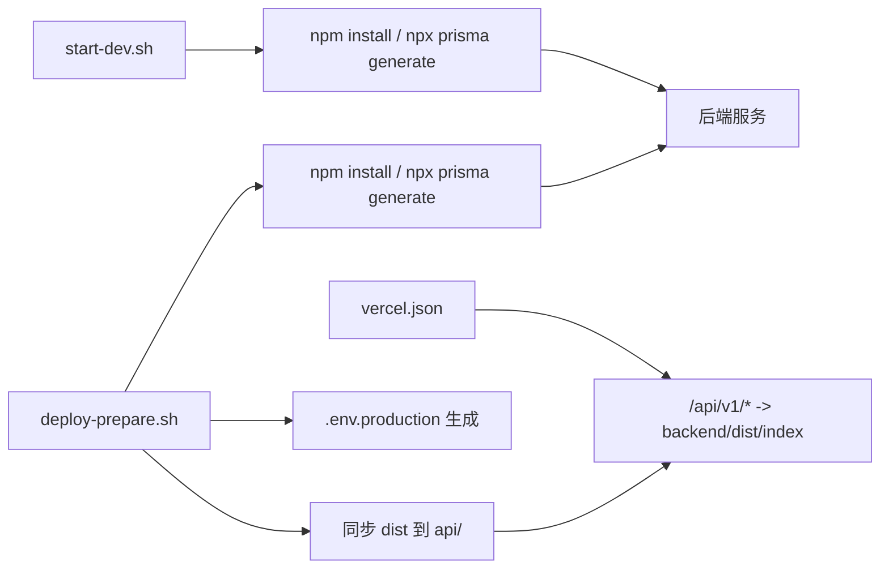

# 自动化脚本

<cite>
**本文引用的文件**
- [deploy-prepare.sh](file://deploy-prepare.sh)
- [start-dev.sh](file://start-dev.sh)
- [DEPLOY.md](file://DEPLOY.md)
- [README.md](file://README.md)
- [vercel.json](file://vercel.json)
- [backend/src/index.ts](file://backend/src/index.ts)
- [backend/src/asrService.ts](file://backend/src/asrService.ts)
- [backend/package.json](file://backend/package.json)
- [frontend/package.json](file://frontend/package.json)
- [api/package.json](file://api/package.json)
- [backend/prisma/schema.prisma](file://backend/prisma/schema.prisma)
- [backend/prisma/seed.ts](file://backend/prisma/seed.ts)
- [backend/prisma/migrations/20251118115717_init/migration.sql](file://backend/prisma/migrations/20251118115717_init/migration.sql)
</cite>

## 目录
1. [简介](#简介)
2. [项目结构](#项目结构)
3. [核心组件](#核心组件)
4. [架构总览](#架构总览)
5. [详细组件分析](#详细组件分析)
6. [依赖关系分析](#依赖关系分析)
7. [性能考量](#性能考量)
8. [故障排查指南](#故障排查指南)
9. [结论](#结论)
10. [附录](#附录)

## 简介
本文件聚焦于本项目的自动化脚本与部署流程，帮助开发者快速完成本地开发环境启动与 Vercel 云端部署。内容涵盖：
- 本地开发启动脚本的工作流程与注意事项
- Vercel 部署准备脚本的步骤与产物
- Vercel 配置文件如何将前端与后端整合为一体化部署
- 后端 API 的路由与服务职责，以及与自动化脚本的衔接
- 常见问题与排障建议

## 项目结构
本项目采用前后端分离架构，并通过自动化脚本与 Vercel 配置实现一键部署与本地开发启动。

图表来源
- [vercel.json](file://vercel.json#L1-L13)
- [frontend/package.json](file://frontend/package.json#L1-L54)
- [backend/src/index.ts](file://backend/src/index.ts#L1-L373)
- [backend/prisma/schema.prisma](file://backend/prisma/schema.prisma#L1-L19)
- [deploy-prepare.sh](file://deploy-prepare.sh#L1-L94)

章节来源
- [README.md](file://README.md#L30-L60)
- [vercel.json](file://vercel.json#L1-L13)

## 核心组件
- 本地开发启动脚本：负责校验环境变量、安装依赖、生成 Prisma Client、并行启动前后端服务。
- 部署准备脚本：负责安装依赖、生成 Prisma Client、编译后端、同步产物至 api 目录、生成前端生产环境变量、安装前端与 API 依赖、测试前端构建。
- Vercel 配置：定义构建命令、输出目录、路由重写规则，将 /api/v1/* 转发到后端编译入口。
- 后端服务：提供飞花令游戏相关 API，含模糊匹配、AI 出句、提示、语音识别等能力。
- Prisma 数据库：使用 PostgreSQL，模型与迁移文件位于 backend/prisma。

章节来源
- [start-dev.sh](file://start-dev.sh#L1-L57)
- [deploy-prepare.sh](file://deploy-prepare.sh#L1-L94)
- [vercel.json](file://vercel.json#L1-L13)
- [backend/src/index.ts](file://backend/src/index.ts#L1-L373)
- [backend/prisma/schema.prisma](file://backend/prisma/schema.prisma#L1-L19)

## 架构总览
下图展示了自动化脚本与部署配置如何协同工作，将前端与后端整合为 Vercel 上的一体化服务。

图表来源
- [start-dev.sh](file://start-dev.sh#L1-L57)
- [deploy-prepare.sh](file://deploy-prepare.sh#L1-L94)
- [vercel.json](file://vercel.json#L1-L13)
- [backend/src/index.ts](file://backend/src/index.ts#L1-L373)

## 详细组件分析

### 本地开发启动脚本（start-dev.sh）
该脚本用于一键启动本地开发环境，主要流程如下：
- 校验必需的环境变量（数据库连接 URL），若缺失则提示并退出
- 安装后端依赖并生成 Prisma Client
- 并行启动后端服务与前端开发服务器
- 前端开发服务器端口默认 5173，后端服务端口默认 3000

图表来源
- [start-dev.sh](file://start-dev.sh#L1-L57)

章节来源
- [start-dev.sh](file://start-dev.sh#L1-L57)
- [README.md](file://README.md#L77-L95)

### 部署准备脚本（deploy-prepare.sh）
该脚本用于准备 Vercel 部署所需的产物与配置，主要流程如下：
- 安装后端依赖并生成 Prisma Client
- 编译后端代码
- 将编译产物与后端 package.json 同步到 api 目录
- 生成前端生产环境变量文件
- 安装 API 与前端依赖
- 测试前端构建
- 输出部署清单与下一步操作提示

图表来源
- [deploy-prepare.sh](file://deploy-prepare.sh#L1-L94)

章节来源
- [deploy-prepare.sh](file://deploy-prepare.sh#L1-L94)
- [DEPLOY.md](file://DEPLOY.md#L1-L40)

### Vercel 配置（vercel.json）
该配置文件定义了构建命令、输出目录与路由重写规则：
- 构建命令：先安装前端依赖并构建前端，再安装后端依赖并编译后端
- 输出目录：frontend/dist（前端静态资源）
- 重写规则：将 /api/v1/* 请求转发到后端编译入口 backend/dist/index

图表来源
- [vercel.json](file://vercel.json#L1-L13)

章节来源
- [vercel.json](file://vercel.json#L1-L13)
- [README.md](file://README.md#L260-L270)

### 后端服务（backend/src/index.ts）
后端服务提供飞花令相关 API，包含：
- 获取随机令字
- 开始游戏与 AI 出句
- 验证用户诗句（支持精确匹配、同音字匹配、编辑距离模糊匹配）
- 提示接口
- 语音识别接口（调用腾讯云 ASR）

图表来源
- [backend/src/index.ts](file://backend/src/index.ts#L72-L190)
- [backend/src/index.ts](file://backend/src/index.ts#L346-L370)
- [backend/src/asrService.ts](file://backend/src/asrService.ts#L66-L98)

章节来源
- [backend/src/index.ts](file://backend/src/index.ts#L1-L373)
- [backend/src/asrService.ts](file://backend/src/asrService.ts#L1-L98)

### Prisma 数据库与种子数据
- 数据库模型：Poem 表包含 id、title、author、content、dynasty 字段
- 迁移：初始迁移创建 Poem 表
- 种子数据：提供若干经典诗词条目，用于本地演示与测试

图表来源
- [backend/prisma/schema.prisma](file://backend/prisma/schema.prisma#L1-L19)
- [backend/prisma/migrations/20251118115717_init/migration.sql](file://backend/prisma/migrations/20251118115717_init/migration.sql#L1-L11)
- [backend/prisma/seed.ts](file://backend/prisma/seed.ts#L1-L53)

章节来源
- [backend/prisma/schema.prisma](file://backend/prisma/schema.prisma#L1-L19)
- [backend/prisma/migrations/20251118115717_init/migration.sql](file://backend/prisma/migrations/20251118115717_init/migration.sql#L1-L11)
- [backend/prisma/seed.ts](file://backend/prisma/seed.ts#L1-L53)

## 依赖关系分析
- 脚本与包管理器
  - start-dev.sh 与 deploy-prepare.sh 通过 npm install 与 npx prisma generate 管理依赖与 Prisma Client
  - 前端与后端各自维护独立的 package.json，分别定义构建与运行脚本
- 脚本与后端服务
  - 两个脚本最终都会生成 Prisma Client 并编译后端，确保后端 API 可用
- 脚本与 Vercel
  - deploy-prepare.sh 生成 api 目录与前端 .env.production，配合 vercel.json 的重写规则，使 /api/v1/* 请求指向后端编译入口

图表来源
- [start-dev.sh](file://start-dev.sh#L1-L57)
- [deploy-prepare.sh](file://deploy-prepare.sh#L1-L94)
- [vercel.json](file://vercel.json#L1-L13)

章节来源
- [backend/package.json](file://backend/package.json#L1-L37)
- [frontend/package.json](file://frontend/package.json#L1-L54)
- [api/package.json](file://api/package.json#L1-L37)

## 性能考量
- 本地开发
  - 并行启动后端与前端，减少等待时间
  - 通过 Prisma 查询限制（如 take）降低查询开销
- 部署阶段
  - 构建命令按顺序安装前端依赖、构建前端，再安装后端依赖、编译后端，避免并发冲突
  - 输出目录与重写规则确保静态资源与 API 路由分离，便于缓存与边缘加速

章节来源
- [start-dev.sh](file://start-dev.sh#L38-L57)
- [deploy-prepare.sh](file://deploy-prepare.sh#L28-L38)
- [vercel.json](file://vercel.json#L1-L13)

## 故障排查指南
- 本地开发启动失败
  - 确认 DATABASE_URL 与 PRISMA_DATABASE_URL 已设置
  - 检查后端依赖安装与 Prisma Client 生成是否成功
  - 确认端口未被占用（默认 3000/5173）
- 部署准备阶段失败
  - 检查 npm install 与 npx prisma generate 是否报错
  - 确认 api 目录已生成且包含 dist 与 package.json
  - 确认前端构建成功，dist 存在
- Vercel 部署后 API 无响应
  - 检查环境变量 DATABASE_URL 与 PRISMA_DATABASE_URL 是否正确配置
  - 查看 Vercel 构建日志定位错误
  - 确认路由重写规则生效（/api/v1/* 指向 backend/dist/index）

章节来源
- [start-dev.sh](file://start-dev.sh#L9-L20)
- [deploy-prepare.sh](file://deploy-prepare.sh#L12-L20)
- [DEPLOY.md](file://DEPLOY.md#L173-L211)
- [README.md](file://README.md#L457-L465)

## 结论
本项目的自动化脚本与 Vercel 配置共同实现了“一键本地开发”与“一键云端部署”的目标。通过明确的依赖安装、Prisma Client 生成、编译与产物同步流程，以及合理的路由重写规则，开发者可以高效地完成从本地到云端的全流程交付。

## 附录
- 快速参考
  - 本地开发：设置环境变量后运行本地启动脚本
  - 部署准备：设置环境变量后运行部署准备脚本，随后按需进行 Vercel Dashboard 或 CLI 部署
  - 部署配置：确认 vercel.json 的构建命令、输出目录与重写规则

章节来源
- [README.md](file://README.md#L77-L95)
- [DEPLOY.md](file://DEPLOY.md#L160-L211)
- [vercel.json](file://vercel.json#L1-L13)