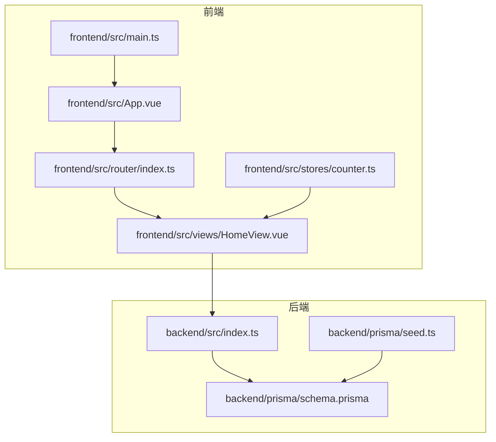
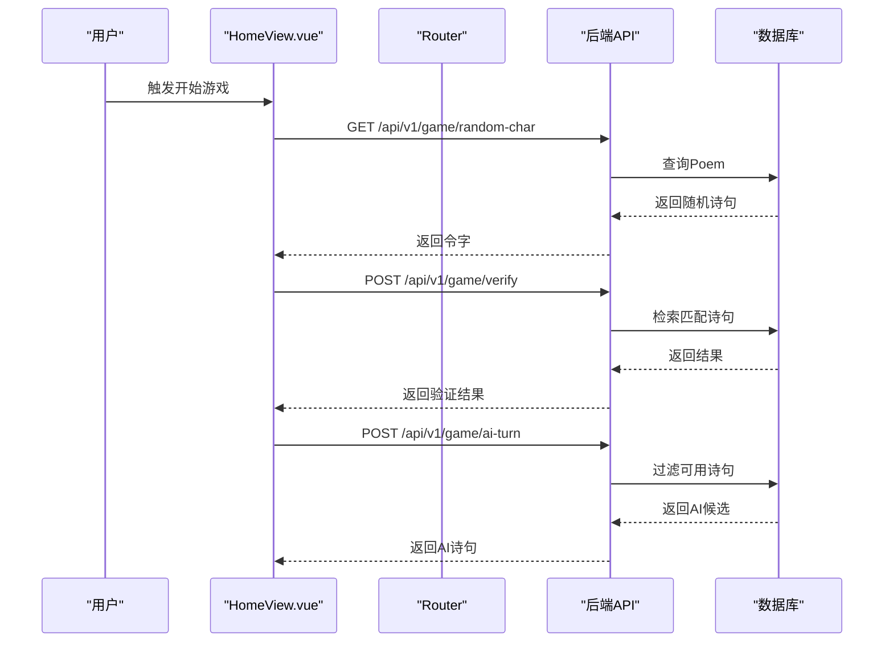
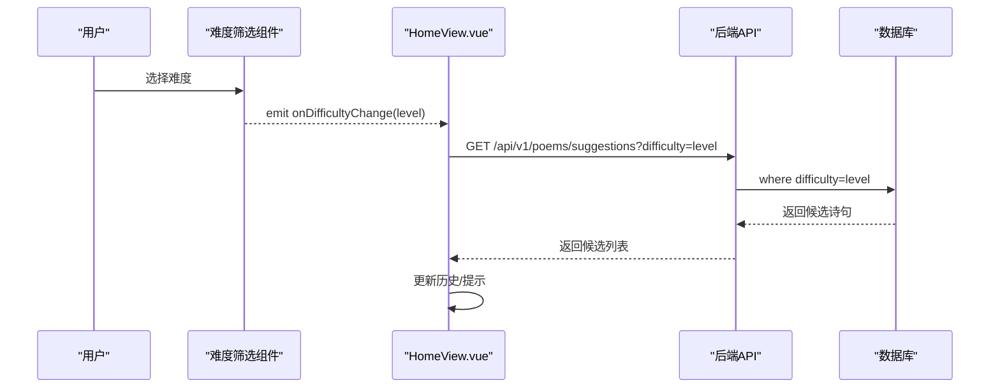
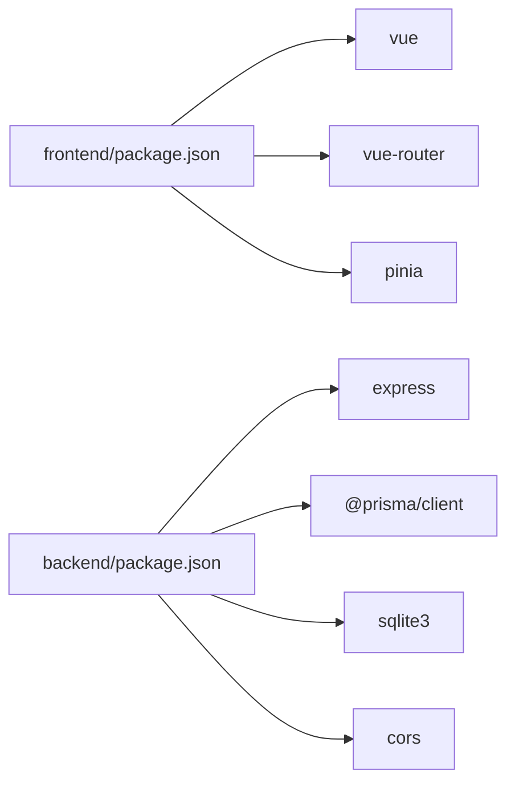

# 功能扩展指南

<cite>
**本文引用的文件**
- [backend/src/index.ts](file://backend/src/index.ts)
- [backend/prisma/schema.prisma](file://backend/prisma/schema.prisma)
- [backend/prisma/seed.ts](file://backend/prisma/seed.ts)
- [frontend/src/main.ts](file://frontend/src/main.ts)
- [frontend/src/router/index.ts](file://frontend/src/router/index.ts)
- [frontend/src/App.vue](file://frontend/src/App.vue)
- [frontend/src/views/HomeView.vue](file://frontend/src/views/HomeView.vue)
- [frontend/src/stores/counter.ts](file://frontend/src/stores/counter.ts)
- [backend/package.json](file://backend/package.json)
- [frontend/package.json](file://frontend/package.json)
</cite>

## 目录
1. [引言](#引言)
2. [项目结构](#项目结构)
3. [核心组件](#核心组件)
4. [架构总览](#架构总览)
5. [详细组件分析](#详细组件分析)
6. [依赖关系分析](#依赖关系分析)
7. [性能考虑](#性能考虑)
8. [故障排查指南](#故障排查指南)
9. [结论](#结论)
10. [附录](#附录)

## 引言
本指南面向希望安全扩展系统的开发者，提供从后端API到前端组件的完整扩展流程。内容覆盖：
- 在后端以RESTful风格添加新路由（统一前缀/api/v1/），使用PrismaClient进行数据访问，并确保输入校验与错误处理。
- 在前端新增Vue组件（Composition API），支持Props与事件发射，按约定放置于frontend/src/components/。
- 工具函数封装规范：通用逻辑抽取至frontend/src/utils/，保证无副作用与可测试性。
- 以“诗句难度筛选”为例，演示从前端UI到后端查询的完整实现路径，包括状态管理更新、API调用与数据库查询优化。

## 项目结构
项目采用前后端分离架构：
- 后端基于Express + Prisma SQLite，提供RESTful API。
- 前端基于Vue 3 + Pinia + Vue Router，通过fetch调用后端API。

图表来源
- [frontend/src/main.ts](file://frontend/src/main.ts#L1-L15)
- [frontend/src/App.vue](file://frontend/src/App.vue#L1-L19)
- [frontend/src/router/index.ts](file://frontend/src/router/index.ts#L1-L24)
- [frontend/src/views/HomeView.vue](file://frontend/src/views/HomeView.vue#L1-L232)
- [frontend/src/stores/counter.ts](file://frontend/src/stores/counter.ts#L1-L13)
- [backend/src/index.ts](file://backend/src/index.ts#L1-L78)
- [backend/prisma/schema.prisma](file://backend/prisma/schema.prisma#L1-L19)
- [backend/prisma/seed.ts](file://backend/prisma/seed.ts#L1-L53)

章节来源
- [frontend/src/main.ts](file://frontend/src/main.ts#L1-L15)
- [frontend/src/router/index.ts](file://frontend/src/router/index.ts#L1-L24)
- [frontend/src/views/HomeView.vue](file://frontend/src/views/HomeView.vue#L1-L232)
- [backend/src/index.ts](file://backend/src/index.ts#L1-L78)
- [backend/prisma/schema.prisma](file://backend/prisma/schema.prisma#L1-L19)
- [backend/prisma/seed.ts](file://backend/prisma/seed.ts#L1-L53)

## 核心组件
- 后端服务入口与路由：在backend/src/index.ts中定义/api/v1/前缀的REST接口，使用PrismaClient访问SQLite数据库。
- 数据模型：Poem模型包含id、title、author、content字段，由Prisma schema定义。
- 前端应用入口与路由：frontend/src/main.ts注册Pinia与Router；frontend/src/router/index.ts配置页面路由。
- 示例视图：frontend/src/views/HomeView.vue展示飞花令游戏交互，包含状态管理与API调用示例。
- 状态管理：frontend/src/stores/counter.ts演示Pinia Store的使用方式。

章节来源
- [backend/src/index.ts](file://backend/src/index.ts#L1-L78)
- [backend/prisma/schema.prisma](file://backend/prisma/schema.prisma#L1-L19)
- [frontend/src/main.ts](file://frontend/src/main.ts#L1-L15)
- [frontend/src/router/index.ts](file://frontend/src/router/index.ts#L1-L24)
- [frontend/src/views/HomeView.vue](file://frontend/src/views/HomeView.vue#L1-L232)
- [frontend/src/stores/counter.ts](file://frontend/src/stores/counter.ts#L1-L13)

## 架构总览
后端通过Express提供REST API，前端通过fetch调用这些接口，Pinia用于状态管理，Vue Router负责页面导航。

图表来源
- [frontend/src/views/HomeView.vue](file://frontend/src/views/HomeView.vue#L1-L232)
- [backend/src/index.ts](file://backend/src/index.ts#L1-L78)
- [backend/prisma/schema.prisma](file://backend/prisma/schema.prisma#L1-L19)

## 详细组件分析

### 后端：新增RESTful API（/api/v1/前缀）
- 路由设计原则
  - 统一使用/api/v1/前缀，资源命名采用名词复数形式，动词使用HTTP方法表达动作。
  - 对外暴露的接口需明确请求体字段与响应格式，便于前端对接。
- 输入校验与错误处理
  - 对必填参数进行前置校验，缺失或非法参数返回400。
  - 对业务规则进行校验（例如诗句必须包含令字、不能重复使用等），返回语义化错误信息。
- 数据访问与PrismaClient
  - 使用PrismaClient进行查询与过滤，避免手写SQL，提升可维护性。
  - 对复杂查询可结合where条件与数组过滤，减少不必要的数据传输。
- 安全性建议
  - 对外部输入进行严格校验，避免注入风险。
  - 对敏感操作（如AI生成）限制频率，必要时引入速率限制中间件。
  - 对返回的数据进行脱敏处理，避免泄露隐私字段。

章节来源
- [backend/src/index.ts](file://backend/src/index.ts#L1-L78)

### 前端：新增Vue组件（Composition API）
- 组件位置与命名
  - 新组件放置于frontend/src/components/目录下，采用语义化命名，便于维护。
- Props与事件
  - 使用defineProps声明输入属性，使用defineEmits声明事件，保持组件职责单一。
- 状态管理
  - 将组件内部状态与全局状态分离：仅在Pinia中保存跨页面共享的状态，组件内状态使用ref/computed/local state。
- API调用
  - 使用fetch或封装的HTTP客户端调用后端API，统一处理错误与加载态。
  - 对请求参数进行类型约束，避免运行时错误。
- 样式与可访问性
  - 使用scoped样式隔离组件样式，为交互元素提供可访问性标签与键盘支持。

章节来源
- [frontend/src/views/HomeView.vue](file://frontend/src/views/HomeView.vue#L1-L232)
- [frontend/src/router/index.ts](file://frontend/src/router/index.ts#L1-L24)
- [frontend/src/stores/counter.ts](file://frontend/src/stores/counter.ts#L1-L13)

### 工具函数封装规范
- 位置与职责
  - 通用逻辑抽取至frontend/src/utils/，如字符串处理、日期格式化、URL构建等。
- 无副作用与可测试性
  - 工具函数应尽量纯函数化，避免修改外部状态；对需要副作用的场景，通过参数注入依赖（如HTTP客户端）以便替换。
- 可测试性
  - 提供清晰的输入输出契约，编写单元测试覆盖边界条件与异常分支。
- 复用性
  - 抽象出可复用的工具模块，避免重复代码，降低耦合度。

章节来源
- [frontend/src/views/HomeView.vue](file://frontend/src/views/HomeView.vue#L1-L232)

### 实战案例：增加“诗句难度筛选”
目标：在现有飞花令游戏中增加“难度筛选”，允许玩家选择不同难度的诗句作为候选，从而影响AI生成与验证策略。

- 前端实现步骤
  1) 在frontend/src/components/下新增难度筛选组件，支持Props（如difficultyLevel）与事件发射（如onDifficultyChange）。
  2) 在HomeView.vue中集成该组件，监听事件并更新本地状态（如selectedDifficulty）。
  3) 在状态管理中（Pinia）持久化难度设置，确保刷新后仍生效。
  4) 将selectedDifficulty作为查询参数传递给后端API。
- 后端实现步骤
  1) 在backend/src/index.ts中新增GET /api/v1/poems/suggestions，接收difficulty参数，使用PrismaClient按难度过滤诗句。
  2) 在Prisma schema中为Poem模型新增difficulty字段（或通过content长度/复杂度计算），并在seed中填充示例数据。
  3) 对输入参数进行校验（如difficulty取值范围），对空结果返回404。
- 数据库与查询优化
  1) 在schema中为常用查询字段建立索引（如author、title、content），减少查询时间。
  2) 对复杂查询使用分页或限制返回数量，避免一次性返回过多数据。
  3) 对AI候选生成逻辑，先在内存中过滤再随机选择，减少数据库压力。
- 完整调用序列

图表来源
- [frontend/src/views/HomeView.vue](file://frontend/src/views/HomeView.vue#L1-L232)
- [backend/src/index.ts](file://backend/src/index.ts#L1-L78)
- [backend/prisma/schema.prisma](file://backend/prisma/schema.prisma#L1-L19)
- [backend/prisma/seed.ts](file://backend/prisma/seed.ts#L1-L53)

## 依赖关系分析
- 前端依赖
  - vue、vue-router、pinia用于框架与状态管理；vite用于构建与开发服务器。
- 后端依赖
  - express提供Web服务，@prisma/client与sqlite3用于数据库访问；cors启用跨域支持。
- 项目脚本
  - 后端提供seed脚本用于初始化数据；前端提供dev/build/preview/test等常用脚本。

图表来源
- [frontend/package.json](file://frontend/package.json#L1-L51)
- [backend/package.json](file://backend/package.json#L1-L30)

章节来源
- [frontend/package.json](file://frontend/package.json#L1-L51)
- [backend/package.json](file://backend/package.json#L1-L30)

## 性能考虑
- 前端
  - 使用懒加载路由与组件拆分，减少首屏体积。
  - 对频繁触发的API调用进行节流/防抖，避免重复请求。
  - 利用Pinia缓存轻量级状态，避免不必要的重渲染。
- 后端
  - 对高频查询建立索引，合理使用where条件与limit。
  - 对AI候选生成等计算密集型任务，优先在内存中完成，减少数据库往返。
  - 对外部依赖（如第三方API）设置超时与重试策略，提升稳定性。

## 故障排查指南
- 常见问题
  - CORS错误：确认后端已启用CORS中间件，且前端请求地址与端口正确。
  - 400/404错误：检查请求参数是否完整、类型是否正确；确认API路径与版本前缀一致。
  - 数据库连接失败：检查DATABASE_URL环境变量与Prisma schema配置。
- 排查步骤
  - 在前端Network面板查看请求与响应详情，定位错误来源。
  - 在后端控制台查看日志，确认Prisma查询是否执行成功。
  - 使用Postman或curl手动调用API，排除前端逻辑干扰。
- 建议
  - 为每个API接口编写简要的请求/响应示例，便于联调与测试。
  - 对关键流程（如AI回合）增加重试与降级策略，提升用户体验。

章节来源
- [backend/src/index.ts](file://backend/src/index.ts#L1-L78)
- [frontend/src/views/HomeView.vue](file://frontend/src/views/HomeView.vue#L1-L232)

## 结论
通过遵循本指南的扩展流程，开发者可以安全、高效地为系统新增功能。后端以RESTful API与PrismaClient为核心，前端以Composition API与Pinia为基础，配合工具函数与组件化设计，能够快速迭代并保持代码质量与可维护性。以“诗句难度筛选”为例，展示了从前端UI到后端查询的完整路径，包括状态管理、API调用与数据库优化的最佳实践。

## 附录
- 快速检查清单
  - 后端：路由命名规范、参数校验、错误处理、Prisma查询优化。
  - 前端：组件职责单一、Props/Events清晰、状态管理合理、工具函数无副作用。
  - 数据库：schema字段完整、索引合理、seed数据覆盖典型场景。
- 参考实现位置
  - 后端路由与Prisma：[backend/src/index.ts](file://backend/src/index.ts#L1-L78)、[backend/prisma/schema.prisma](file://backend/prisma/schema.prisma#L1-L19)、[backend/prisma/seed.ts](file://backend/prisma/seed.ts#L1-L53)
  - 前端入口与路由：[frontend/src/main.ts](file://frontend/src/main.ts#L1-L15)、[frontend/src/router/index.ts](file://frontend/src/router/index.ts#L1-L24)
  - 示例视图与状态：[frontend/src/views/HomeView.vue](file://frontend/src/views/HomeView.vue#L1-L232)、[frontend/src/stores/counter.ts](file://frontend/src/stores/counter.ts#L1-L13)