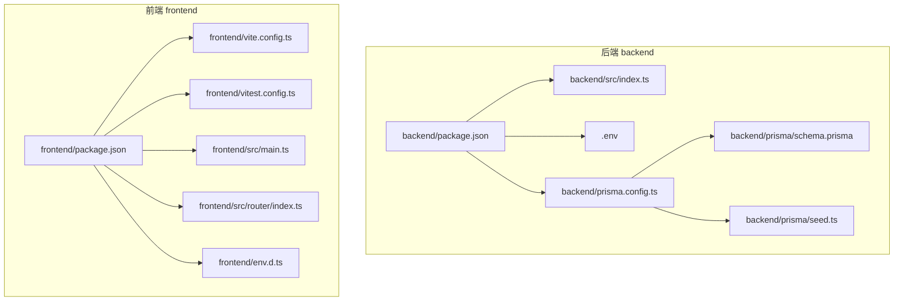
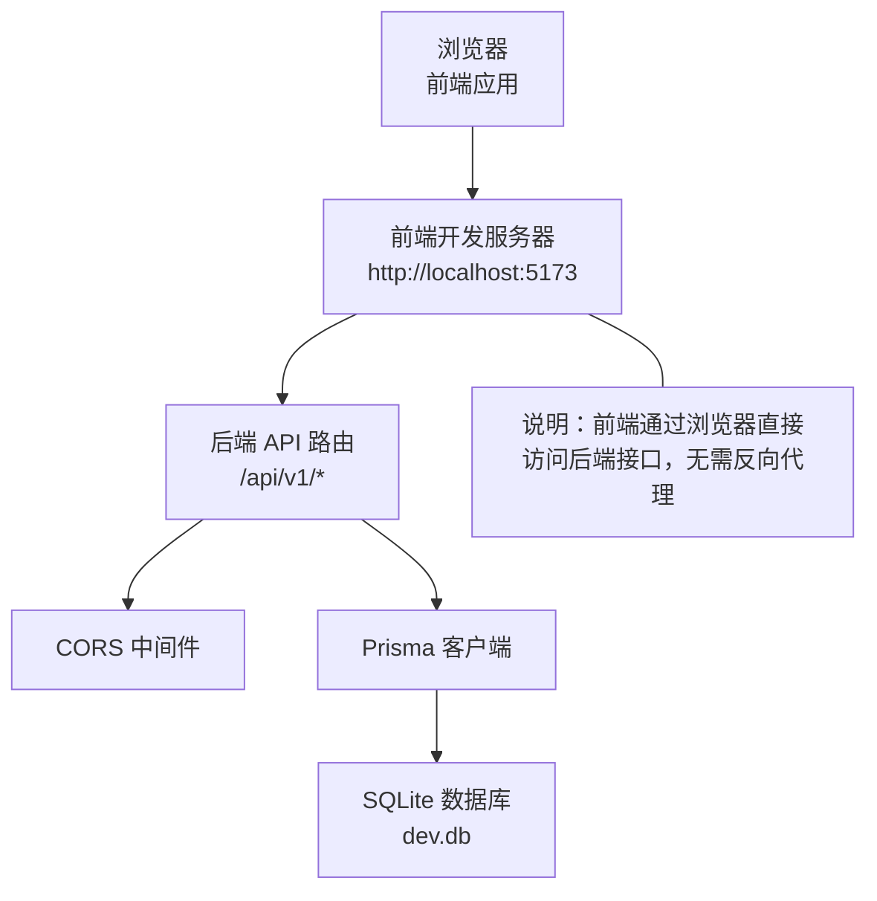
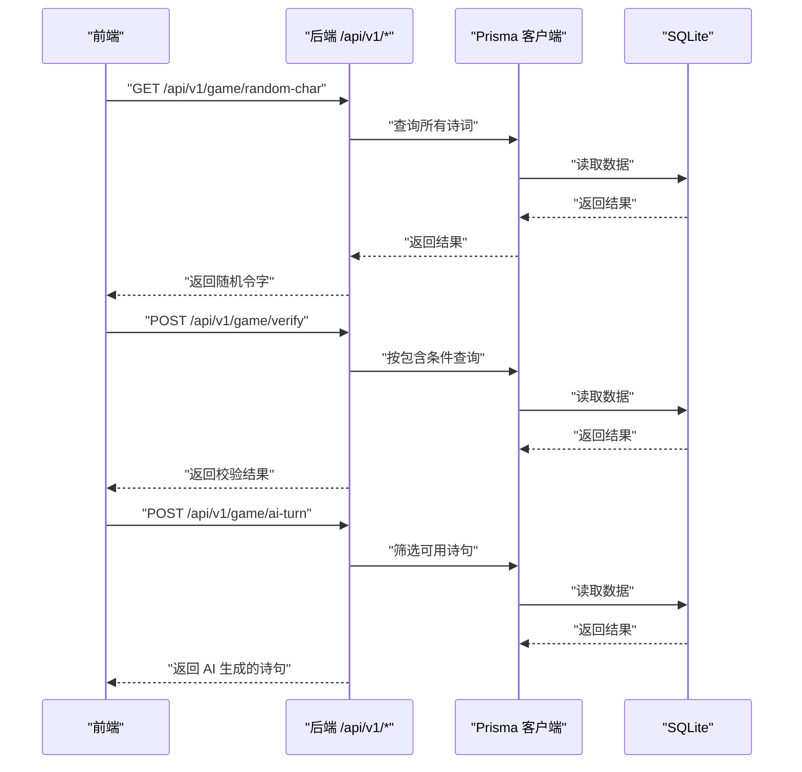
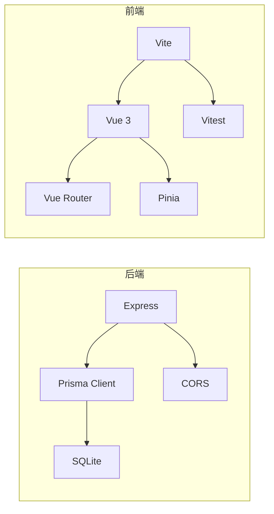

# 开发流程

<cite>
**本文引用的文件**
- [backend/package.json](file://backend/package.json)
- [backend/src/index.ts](file://backend/src/index.ts)
- [backend/.env](file://backend/.env)
- [backend/prisma.config.ts](file://backend/prisma.config.ts)
- [backend/prisma/schema.prisma](file://backend/prisma/schema.prisma)
- [backend/prisma/seed.ts](file://backend/prisma/seed.ts)
- [frontend/package.json](file://frontend/package.json)
- [frontend/vite.config.ts](file://frontend/vite.config.ts)
- [frontend/vitest.config.ts](file://frontend/vitest.config.ts)
- [frontend/src/main.ts](file://frontend/src/main.ts)
- [frontend/src/router/index.ts](file://frontend/src/router/index.ts)
- [frontend/env.d.ts](file://frontend/env.d.ts)
</cite>

## 目录
1. [简介](#简介)
2. [项目结构](#项目结构)
3. [核心组件](#核心组件)
4. [架构总览](#架构总览)
5. [详细组件分析](#详细组件分析)
6. [依赖关系分析](#依赖关系分析)
7. [性能与构建建议](#性能与构建建议)
8. [故障排查指南](#故障排查指南)
9. [结论](#结论)
10. [附录：命令清单与说明](#附录命令清单与说明)

## 简介
本指南面向开发者，提供从零开始搭建与运行该前后端分离项目的完整本地开发流程。后端采用 Express 框架，提供 /api/v1/* 接口；前端基于 Vite + Vue 3，通过代理或 CORS 实现跨域访问。文档涵盖：
- 启动后端服务与前端服务
- 跨域通信机制说明（CORS 已配置）
- 单元测试运行（Vitest）
- 生产构建与预览
- 常见问题排查（端口占用、数据库连接、环境变量缺失等）
- 完整命令清单与作用说明

## 项目结构
该项目采用前后端分离架构，根目录下包含 backend 与 frontend 两个子工程，分别管理各自的依赖、脚本与配置。

图表来源
- [backend/package.json](file://backend/package.json#L1-L30)
- [backend/src/index.ts](file://backend/src/index.ts#L1-L78)
- [backend/.env](file://backend/.env#L1-L1)
- [backend/prisma.config.ts](file://backend/prisma.config.ts#L1-L14)
- [backend/prisma/schema.prisma](file://backend/prisma/schema.prisma#L1-L19)
- [backend/prisma/seed.ts](file://backend/prisma/seed.ts#L1-L53)
- [frontend/package.json](file://frontend/package.json#L1-L51)
- [frontend/vite.config.ts](file://frontend/vite.config.ts#L1-L19)
- [frontend/vitest.config.ts](file://frontend/vitest.config.ts#L1-L15)
- [frontend/src/main.ts](file://frontend/src/main.ts#L1-L15)
- [frontend/src/router/index.ts](file://frontend/src/router/index.ts#L1-L24)
- [frontend/env.d.ts](file://frontend/env.d.ts#L1-L2)

章节来源
- [backend/package.json](file://backend/package.json#L1-L30)
- [frontend/package.json](file://frontend/package.json#L1-L51)

## 核心组件
- 后端服务
  - 使用 Express 提供 REST 接口，监听端口 3000，默认路由前缀为 /api/v1。
  - 已启用 CORS 中间件，允许前端跨域访问。
  - 数据库使用 SQLite，通过 Prisma 管理，数据源 URL 来自 .env。
- 前端应用
  - 使用 Vite 启动开发服务器，默认端口 5173。
  - 使用 Vue 3 + Vue Router + Pinia 构建页面与状态管理。
  - 单元测试使用 Vitest，测试环境为 jsdom。

章节来源
- [backend/src/index.ts](file://backend/src/index.ts#L1-L78)
- [backend/.env](file://backend/.env#L1-L1)
- [backend/prisma/schema.prisma](file://backend/prisma/schema.prisma#L1-L19)
- [frontend/package.json](file://frontend/package.json#L1-L51)
- [frontend/vite.config.ts](file://frontend/vite.config.ts#L1-L19)
- [frontend/src/main.ts](file://frontend/src/main.ts#L1-L15)
- [frontend/src/router/index.ts](file://frontend/src/router/index.ts#L1-L24)
- [frontend/vitest.config.ts](file://frontend/vitest.config.ts#L1-L15)

## 架构总览
前后端分离架构下，前端通过浏览器直接向后端发起 API 请求。由于后端启用了 CORS，前端无需额外代理即可访问 /api/v1/* 接口。

图表来源
- [backend/src/index.ts](file://backend/src/index.ts#L1-L78)
- [backend/prisma/schema.prisma](file://backend/prisma/schema.prisma#L1-L19)
- [backend/.env](file://backend/.env#L1-L1)

## 详细组件分析

### 后端服务启动与路由
- 启动方式
  - 使用 npm 脚本启动后端服务，监听端口 3000。
- 路由与功能
  - GET /api/v1/game/random-char：返回一个随机令字。
  - POST /api/v1/game/verify：校验用户输入的诗句是否包含令字且未重复。
  - POST /api/v1/game/ai-turn：根据令字生成可使用的诗句。
- 数据库
  - 使用 SQLite，数据源 URL 来自 .env 文件。
  - 可通过种子脚本初始化示例数据。

图表来源
- [backend/src/index.ts](file://backend/src/index.ts#L1-L78)
- [backend/prisma/schema.prisma](file://backend/prisma/schema.prisma#L1-L19)
- [backend/.env](file://backend/.env#L1-L1)

章节来源
- [backend/src/index.ts](file://backend/src/index.ts#L1-L78)
- [backend/.env](file://backend/.env#L1-L1)
- [backend/prisma/schema.prisma](file://backend/prisma/schema.prisma#L1-L19)

### 前端开发与测试
- 开发服务器
  - 使用 Vite 启动，默认端口 5173。
- 测试
  - 使用 Vitest 运行单元测试，测试环境为 jsdom。
- 构建
  - 使用 Vite 执行生产构建与预览。

章节来源
- [frontend/package.json](file://frontend/package.json#L1-L51)
- [frontend/vite.config.ts](file://frontend/vite.config.ts#L1-L19)
- [frontend/vitest.config.ts](file://frontend/vitest.config.ts#L1-L15)
- [frontend/src/main.ts](file://frontend/src/main.ts#L1-L15)
- [frontend/src/router/index.ts](file://frontend/src/router/index.ts#L1-L24)

### 数据库与种子脚本
- 数据库类型与数据源
  - SQLite，数据源 URL 来自 .env。
- Prisma 配置
  - schema.prisma 定义了 Poem 模型。
  - prisma.config.ts 读取 .env 并设置迁移路径。
- 种子脚本
  - 初始化示例诗词数据，便于本地调试。

章节来源
- [backend/.env](file://backend/.env#L1-L1)
- [backend/prisma/schema.prisma](file://backend/prisma/schema.prisma#L1-L19)
- [backend/prisma.config.ts](file://backend/prisma.config.ts#L1-L14)
- [backend/prisma/seed.ts](file://backend/prisma/seed.ts#L1-L53)

## 依赖关系分析
- 后端依赖
  - Express 提供 Web 服务与路由。
  - Prisma 客户端 + sqlite3 访问 SQLite。
  - cors 中间件启用跨域。
- 前端依赖
  - Vite 提供开发服务器与构建工具。
  - Vue 3 + Vue Router + Pinia 构建界面与状态。
  - Vitest 用于单元测试。

图表来源
- [backend/package.json](file://backend/package.json#L1-L30)
- [frontend/package.json](file://frontend/package.json#L1-L51)

章节来源
- [backend/package.json](file://backend/package.json#L1-L30)
- [frontend/package.json](file://frontend/package.json#L1-L51)

## 性能与构建建议
- 开发阶段
  - 前端使用 Vite 的热更新能力，启动速度快。
  - 后端使用 ts-node/tsx 运行，便于快速迭代。
- 生产构建
  - 前端使用 Vite 生产构建，产物体积小、加载快。
  - 建议在 CI 中缓存 node_modules 以提升构建速度。
- 数据库
  - SQLite 适合本地开发，生产环境建议迁移到更稳定的数据库。
  - 若数据量增大，可考虑索引优化与分页查询。

[本节为通用建议，不直接分析具体文件]

## 故障排查指南
- 端口占用
  - 后端默认端口 3000；前端默认端口 5173。若端口被占用，请修改对应服务的监听端口或释放占用进程。
- 数据库连接失败
  - 检查 .env 中 DATABASE_URL 是否正确指向 SQLite 文件。
  - 确认 Prisma schema.prisma 的 datasource db 配置与 .env 一致。
  - 如需重置数据，可先删除 dev.db 再重新执行种子脚本。
- 环境变量缺失
  - 确保 .env 文件存在且包含 DATABASE_URL。
  - 在运行后端前，确认已安装依赖并执行过 Prisma 初始化（如需要）。
- 跨域问题
  - 后端已启用 CORS，若仍出现跨域错误，请检查浏览器控制台错误信息与请求头。
- 单元测试失败
  - 确保已安装依赖并使用 Vitest 运行测试。
  - 检查测试环境配置（jsdom）与测试文件路径。

章节来源
- [backend/.env](file://backend/.env#L1-L1)
- [backend/prisma/schema.prisma](file://backend/prisma/schema.prisma#L1-L19)
- [frontend/vitest.config.ts](file://frontend/vitest.config.ts#L1-L15)

## 结论
本项目采用清晰的前后端分离架构，后端通过 Express 提供 /api/v1/* 接口，并启用 CORS 支持前端直连访问。前端基于 Vite + Vue 3 快速开发与测试，配合 Prisma 管理 SQLite 数据。按照本文档步骤，可顺利完成本地开发、测试与构建。

[本节为总结性内容，不直接分析具体文件]

## 附录：命令清单与说明
- 后端
  - 启动后端服务：使用 npm 脚本启动后端服务，监听端口 3000。
  - 数据库初始化/重置：可使用 Prisma 相关命令进行迁移与数据填充（例如执行种子脚本）。
- 前端
  - 启动前端开发服务器：使用 Vite 启动开发服务器，监听端口 5173。
  - 运行单元测试：使用 Vitest 运行单元测试。
  - 生产构建与预览：使用 Vite 执行生产构建与预览。
- 其他
  - 数据库相关：根据 Prisma 配置与 schema 进行迁移与数据填充。

章节来源
- [backend/package.json](file://backend/package.json#L1-L30)
- [frontend/package.json](file://frontend/package.json#L1-L51)
- [frontend/vitest.config.ts](file://frontend/vitest.config.ts#L1-L15)