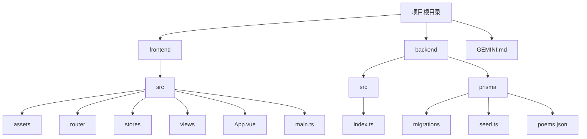

# 开发者指南

<cite>
**本文档引用的文件**  
- [GEMINI.md](file://GEMINI.md)
- [frontend/package.json](file://frontend/package.json)
- [backend/package.json](file://backend/package.json)
- [frontend/vite.config.ts](file://frontend/vite.config.ts)
- [frontend/eslint.config.ts](file://frontend/eslint.config.ts)
- [frontend/src/main.ts](file://frontend/src/main.ts)
- [frontend/src/router/index.ts](file://frontend/src/router/index.ts)
- [frontend/src/stores/counter.ts](file://frontend/src/stores/counter.ts)
- [backend/src/index.ts](file://backend/src/index.ts)
- [backend/prisma/seed.ts](file://backend/prisma/seed.ts)
</cite>

## 目录

1. [简介](#简介)
2. [项目结构](#项目结构)
3. [编码规范与约定](#编码规范与约定)
4. [开发环境与常用命令](#开发环境与常用命令)
5. [功能扩展指南](#功能扩展指南)
6. [代码质量与提交规范](#代码质量与提交规范)

## 简介

本指南旨在为新加入的开发者提供一份实践导向的操作手册，帮助快速上手飞花令项目。项目采用 Vue3 + TypeScript 前端架构与 Node.js + Express + Prisma 后端架构，遵循统一的代码风格与项目约定。本文档将详细介绍 API 路由规范、组件与工具函数的组织方式、测试文件命名规则，并提供常见开发任务的操作命令与功能扩展方法。

## 项目结构

项目分为 `frontend` 和 `backend` 两个主要目录，分别对应前端与后端代码。前端使用 Vite 构建，后端使用 Express 搭建 RESTful API。



**Diagram sources**  
- [GEMINI.md](file://GEMINI.md#L4-L13)
- [frontend/src/main.ts](file://frontend/src/main.ts#L1-L15)
- [backend/src/index.ts](file://backend/src/index.ts#L1-L78)

## 编码规范与约定

项目遵循严格的编码规范，确保代码一致性与可维护性。

### API 路由前缀规范

所有后端 API 接口统一使用 `/api/v1/` 作为前缀，便于版本管理与接口组织。例如：
- 获取随机令字：`GET /api/v1/game/random-char`
- 验证诗句：`POST /api/v1/game/verify`
- AI 回合生成诗句：`POST /api/v1/game/ai-turn`

### 组件与工具函数路径

- **Vue 组件**：存放于 `frontend/src/components/` 目录下，按功能或模块组织。
- **工具函数**：存放于 `frontend/src/utils/` 目录下，用于封装可复用的逻辑。
- **状态管理**：使用 Pinia，模块化存储定义在 `frontend/src/stores/` 目录中。

### 测试文件命名规则

所有测试文件必须以 `.test.ts` 作为后缀，便于 Vitest 自动识别与运行。测试文件应与被测文件同目录或置于 `__tests__` 目录中。

### TypeScript 开发规范

- 使用 TypeScript 严格模式（strict mode）
- 所有注释必须使用中文
- 遵循 ESLint 配置进行静态检查
- 使用 `@` 别名指向 `src` 目录，提升导入可读性

**Section sources**  
- [GEMINI.md](file://GEMINI.md#L6-L20)
- [frontend/vite.config.ts](file://frontend/vite.config.ts#L1-L19)
- [frontend/eslint.config.ts](file://frontend/eslint.config.ts#L1-L29)

## 开发环境与常用命令

### 启动前后端服务

**前端开发服务器**  
```bash
cd frontend
npm run dev
```
启动 Vite 开发服务器，默认监听 `http://localhost:5173`

**后端 API 服务**  
```bash
cd backend
npm run start
```
启动 Express 服务，默认监听 `http://localhost:3000`

### 运行 lint 检查

执行 ESLint 检查并自动修复可修复的问题：
```bash
cd frontend
npm run lint
```

### 执行单元测试

运行所有单元测试：
```bash
cd frontend
npm run test:unit
```
测试框架使用 Vitest，配置文件为 `vitest.config.ts`

**Section sources**  
- [frontend/package.json](file://frontend/package.json#L9-L17)
- [backend/package.json](file://backend/package.json#L6-L10)

## 功能扩展指南

### 新增 API 接口

1. 在 `backend/src/index.ts` 中添加新的路由处理函数
2. 遵循 `/api/v1/` 前缀规范
3. 使用 Prisma 客户端操作数据库
4. 添加必要的参数校验与错误处理

示例结构：
```ts
app.get('/api/v1/new-feature', async (req, res) => {
  // 实现逻辑
});
```

### 添加新的 Vue 组件

1. 在 `frontend/src/components/` 下创建新组件文件（`.vue`）
2. 使用 `<script setup>` 语法糖编写 TypeScript 逻辑
3. 在需要的视图或组件中通过 `import` 引入并注册使用

### 修改游戏规则逻辑

游戏核心逻辑位于后端 API 中，主要涉及：
- 随机令字生成（`/api/v1/game/random-char`）
- 诗句验证规则（`/api/v1/game/verify`）
- AI 出句策略（`/api/v1/game/ai-turn`）

修改时需注意：
- 保持接口输入输出格式一致
- 更新相关注释说明逻辑变更
- 添加必要的单元测试验证新规则

**Section sources**  
- [backend/src/index.ts](file://backend/src/index.ts#L13-L78)
- [backend/prisma/seed.ts](file://backend/prisma/seed.ts#L1-L53)
- [frontend/src/main.ts](file://frontend/src/main.ts#L1-L15)

## 代码质量与提交规范

在提交代码前，必须确保以下步骤已完成：

1. **ESLint 检查通过**  
   运行 `npm run lint` 确保无语法或风格错误。

2. **Prettier 格式化**  
   运行 `npm run format` 自动格式化 `src/` 目录下的所有文件，保持代码风格统一。

3. **单元测试通过**  
   运行 `npm run test:unit` 确保新增或修改的代码不影响现有功能。

4. **Prisma 数据库同步（如涉及）**  
   若修改了数据模型，需运行 `npx prisma migrate dev` 创建迁移并同步数据库。

遵循以上流程，确保每次提交的代码都符合项目质量标准，维护团队协作效率与代码库稳定性。

**Section sources**  
- [frontend/package.json](file://frontend/package.json#L16-L17)
- [GEMINI.md](file://GEMINI.md#L6-L9)
- [frontend/eslint.config.ts](file://frontend/eslint.config.ts#L1-L29)