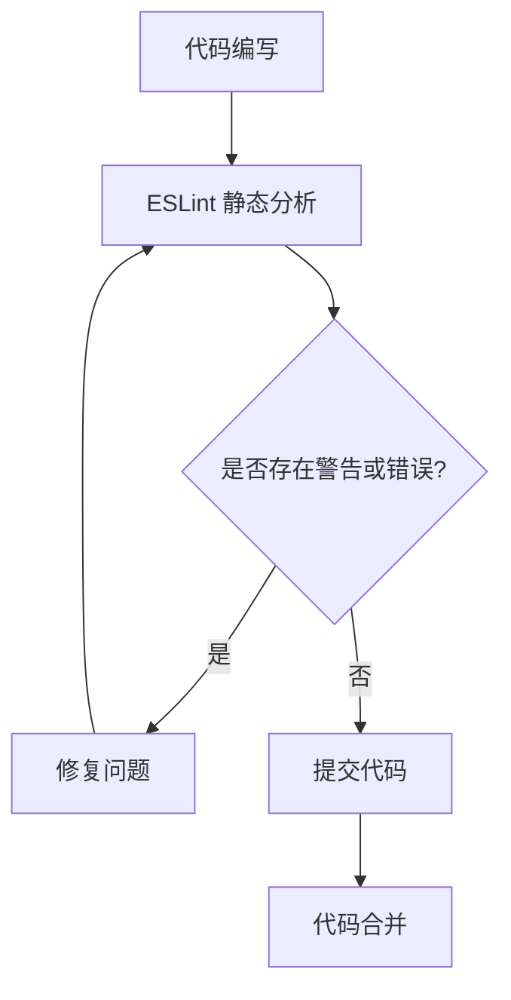

# 编码规范

<cite>
**本文档引用的文件**  
- [GEMINI.md](file://GEMINI.md)
- [eslint.config.ts](file://frontend/eslint.config.ts)
- [package.json](file://frontend/package.json)
- [package.json](file://backend/package.json)
- [tsconfig.app.json](file://frontend/tsconfig.app.json)
- [tsconfig.node.json](file://frontend/tsconfig.node.json)
- [tsconfig.json](file://frontend/tsconfig.json)
- [main.ts](file://frontend/src/main.ts)
- [index.ts](file://backend/src/index.ts)
- [HomeView.vue](file://frontend/src/views/HomeView.vue)
- [router/index.ts](file://frontend/src/router/index.ts)
- [counter.ts](file://frontend/src/stores/counter.ts)
</cite>

## 目录
1. [项目概述](#项目概述)
2. [TypeScript 严格模式](#typescript-严格模式)
3. [ESLint 代码风格统一](#eslint-代码风格统一)
4. [中文注释规范](#中文注释规范)
5. [lint 流程与开发工作流集成](#lint-流程与开发工作流集成)
6. [关键编码规则](#关键编码规则)
7. [正确与错误的代码示例](#正确与错误的代码示例)
8. [提交前检查流程](#提交前检查流程)
9. [总结](#总结)

## 项目概述
本项目为一个基于 Vue3 + TypeScript 构建的飞花令 H5 应用，运行于手机和平板设备。前端采用 Vue3 + TypeScript + Tailwind CSS 技术栈，后端使用 Node.js + Express + Prisma。项目遵循严格的编码规范，确保代码质量、可维护性和团队协作效率。

**Section sources**
- [GEMINI.md](file://GEMINI.md#L4-L13)

## TypeScript 严格模式
项目启用 TypeScript 严格模式以提升类型安全性。通过继承 `@vue/tsconfig/tsconfig.dom.json` 和 `@tsconfig/node22/tsconfig.json` 配置，项目自动启用了包括 `strictNullChecks`、`strictBindCallApply` 等在内的所有严格类型检查选项。这能有效防止空值引用错误、函数调用参数不匹配等常见运行时错误，提升代码健壮性。

**Section sources**
- [tsconfig.app.json](file://frontend/tsconfig.app.json#L2)
- [tsconfig.node.json](file://frontend/tsconfig.node.json#L2)

## ESLint 代码风格统一
项目通过 `eslint.config.ts` 统一代码风格。配置基于 `@vue/eslint-config-typescript` 推荐规则，结合 `eslint-plugin-vue` 和 `@vitest/eslint-plugin`，覆盖 `.ts`、`.tsx` 和 `.vue` 文件。该配置确保团队成员遵循一致的代码格式、命名约定和最佳实践，减少代码审查中的风格争议。



**Diagram sources**
- [eslint.config.ts](file://frontend/eslint.config.ts#L1-L28)

**Section sources**
- [eslint.config.ts](file://frontend/eslint.config.ts#L1-L28)

## 中文注释规范
根据 GEMINI.md 编码规范要求，所有注释必须使用中文。这一规定保障了团队协作效率，确保所有开发者（无论母语是否为英语）都能准确理解代码意图、业务逻辑和实现细节。中文注释降低了沟通成本，提高了代码可读性和维护性。

**Section sources**
- [GEMINI.md](file://GEMINI.md#L9)

## lint 流程与开发工作流集成
lint 流程已深度集成到开发工作流中。前端 `package.json` 中定义了 `lint` 脚本：`"lint": "eslint . --fix --cache"`，可自动修复大部分格式问题并缓存结果以提高性能。后端虽未直接定义 lint 脚本，但其依赖项包含 TypeScript，前端的 lint 流程覆盖了全栈的 TypeScript 代码检查。


**Diagram sources**
- [package.json](file://frontend/package.json#L16)
- [package.json](file://backend/package.json)

**Section sources**
- [package.json](file://frontend/package.json#L16)
- [package.json](file://backend/package.json#L1-L30)

## 关键编码规则
项目强制执行多项关键编码规则：
- **禁止使用 `any` 类型**：强制使用明确的类型定义，充分发挥 TypeScript 的类型检查优势。
- **函数参数和返回值必须添加类型注解**：提高代码可读性，防止类型推断错误。
- **启用严格模式**：确保所有严格类型检查选项均开启。
- **遵循 ESLint 配置**：统一代码风格。
- **注释使用中文**：保障团队沟通效率。

**Section sources**
- [GEMINI.md](file://GEMINI.md#L7-L9)
- [tsconfig.app.json](file://frontend/tsconfig.app.json#L2)
- [eslint.config.ts](file://frontend/eslint.config.ts#L21)

## 正确与错误的代码示例
### 正确示例
```typescript
// 函数参数和返回值均有明确类型注解
function verifySentence(sentence: string, char: string): boolean {
  return sentence.includes(char);
}
```

### 错误示例
```typescript
// 使用 any 类型，违反类型安全原则
function verifySentence(sentence: any, char: any): any {
  return sentence.includes(char);
}

// 缺少类型注解
function verifySentence(sentence, char) {
  return sentence.includes(char);
}
```

**Section sources**
- [HomeView.vue](file://frontend/src/views/HomeView.vue#L32-L62)
- [index.ts](file://backend/src/index.ts#L24-L48)

## 提交前检查流程
开发者在提交代码前必须执行 `npm run lint` 命令。该命令会：
1. 扫描项目中所有 TypeScript 和 Vue 文件
2. 根据 ESLint 规则进行静态分析
3. 自动修复可修复的问题（如格式错误）
4. 输出剩余需要手动修复的警告或错误

开发者需逐一审查并修复所有问题，确保 `npm run lint` 运行后无任何警告或错误，方可提交代码。

**Section sources**
- [package.json](file://frontend/package.json#L16)

## 总结
本项目通过启用 TypeScript 严格模式、统一 ESLint 配置、强制中文注释等措施，建立了高标准的编码规范体系。这些规范不仅提升了代码质量和类型安全性，也显著增强了团队协作效率。所有开发者必须严格遵守这些规则，在提交前运行 `npm run lint` 并修复所有问题，共同维护代码库的健康与可维护性。