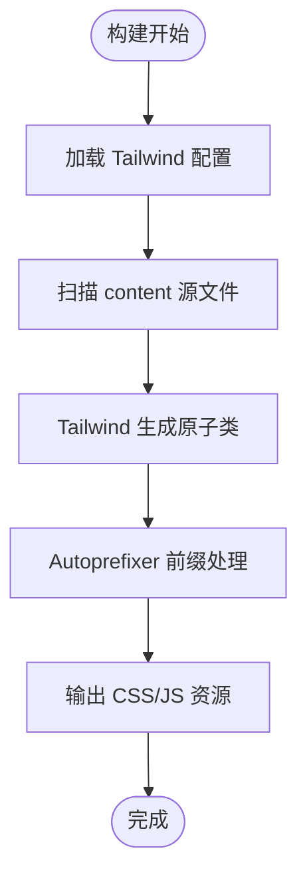

# 技术栈与依赖

<cite>
**本文引用的文件**
- [frontend/package.json](file://frontend/package.json)
- [backend/package.json](file://backend/package.json)
- [frontend/vite.config.ts](file://frontend/vite.config.ts)
- [frontend/tailwind.config.js](file://frontend/tailwind.config.js)
- [frontend/postcss.config.js](file://frontend/postcss.config.js)
- [frontend/src/main.ts](file://frontend/src/main.ts)
- [frontend/src/router/index.ts](file://frontend/src/router/index.ts)
- [frontend/src/stores/counter.ts](file://frontend/src/stores/counter.ts)
- [backend/src/index.ts](file://backend/src/index.ts)
- [backend/prisma/schema.prisma](file://backend/prisma/schema.prisma)
- [backend/prisma/seed.ts](file://backend/prisma/seed.ts)
- [frontend/tsconfig.json](file://frontend/tsconfig.json)
- [frontend/tsconfig.app.json](file://frontend/tsconfig.app.json)
</cite>

## 目录
1. [引言](#引言)
2. [项目结构](#项目结构)
3. [核心组件](#核心组件)
4. [架构总览](#架构总览)
5. [详细组件分析](#详细组件分析)
6. [依赖分析](#依赖分析)
7. [性能考虑](#性能考虑)
8. [故障排查指南](#故障排查指南)
9. [结论](#结论)
10. [附录](#附录)

## 引言
本项目采用前后端分离架构：前端使用 Vue 3 组合式 API、Pinia 状态管理、Vue Router 路由控制、Tailwind CSS 样式系统与 Vite 构建工具；后端基于 Express 5 提供 RESTful 服务，使用 Prisma 6.x 对 SQLite 数据库进行 ORM 封装，并通过 CORS 中间件处理跨域请求。本文将系统梳理技术栈组成、关键依赖版本与兼容性要求，结合实际 package.json 内容说明生产依赖与开发依赖的划分，并解释 tsx、ts-node 在 TypeScript 运行时中的作用，最后给出面向新开发者的选型合理性说明。

## 项目结构
项目采用多包结构，前端与后端分别独立管理依赖与构建流程：
- 前端目录包含应用入口、路由、状态管理、样式与构建配置
- 后端目录包含服务入口、Prisma 模式定义与种子数据脚本
- 两套 TypeScript 配置文件分别服务于各自环境

图表来源
- [frontend/package.json](file://frontend/package.json#L1-L51)
- [frontend/src/main.ts](file://frontend/src/main.ts#L1-L15)
- [frontend/src/router/index.ts](file://frontend/src/router/index.ts#L1-L24)
- [frontend/src/stores/counter.ts](file://frontend/src/stores/counter.ts#L1-L13)
- [frontend/vite.config.ts](file://frontend/vite.config.ts#L1-L19)
- [frontend/tailwind.config.js](file://frontend/tailwind.config.js#L1-L11)
- [frontend/postcss.config.js](file://frontend/postcss.config.js#L1-L6)
- [frontend/tsconfig.json](file://frontend/tsconfig.json#L1-L15)
- [backend/package.json](file://backend/package.json#L1-L30)
- [backend/src/index.ts](file://backend/src/index.ts#L1-L78)
- [backend/prisma/schema.prisma](file://backend/prisma/schema.prisma#L1-L19)
- [backend/prisma/seed.ts](file://backend/prisma/seed.ts#L1-L53)

章节来源
- [frontend/package.json](file://frontend/package.json#L1-L51)
- [backend/package.json](file://backend/package.json#L1-L30)
- [frontend/tsconfig.json](file://frontend/tsconfig.json#L1-L15)

## 核心组件
- 前端核心依赖
  - Vue 3：提供响应式与组合式 API，支撑组件化开发
  - Pinia：轻量级状态管理，配合组合式 Store 使用
  - Vue Router：SPA 路由控制，支持历史模式与懒加载
  - Tailwind CSS：原子化 CSS 框架，通过 PostCSS 插件链启用
  - Vite：现代化构建工具，提供快速开发体验与高效打包
- 后端核心依赖
  - Express 5：提供 RESTful 服务骨架
  - Prisma 6.x：ORM 客户端与生成器，SQLite 数据源
  - CORS：跨域资源共享中间件
  - ts-node/tsx：TypeScript 运行时执行器
  - sqlite3：SQLite 驱动

章节来源
- [frontend/package.json](file://frontend/package.json#L19-L49)
- [backend/package.json](file://backend/package.json#L15-L25)

## 架构总览
前端通过 Vite 开发服务器启动，使用 Vue 3 + Pinia + Vue Router 构建单页应用；后端以 Express 提供 REST 接口，Prisma 访问 SQLite 数据库，CORS 处理跨域。前端通过 Axios 或原生 fetch 调用后端接口，实现前后端解耦。

图表来源
- [frontend/package.json](file://frontend/package.json#L19-L49)
- [backend/package.json](file://backend/package.json#L15-L25)
- [backend/src/index.ts](file://backend/src/index.ts#L1-L78)
- [backend/prisma/schema.prisma](file://backend/prisma/schema.prisma#L1-L19)

## 详细组件分析

### 前端：Vue 3 组合式 API 与 Pinia 状态管理
- 组合式 API：在组件中使用响应式与生命周期钩子，提升逻辑复用与可维护性
- Pinia Store：通过 defineStore 定义模块化状态，示例中包含计数状态与派生计算
- 入口装配：在 main.ts 中注册 Pinia 与 Router，并挂载应用

图表来源
- [frontend/src/stores/counter.ts](file://frontend/src/stores/counter.ts#L1-L13)
- [frontend/src/main.ts](file://frontend/src/main.ts#L1-L15)

章节来源
- [frontend/src/stores/counter.ts](file://frontend/src/stores/counter.ts#L1-L13)
- [frontend/src/main.ts](file://frontend/src/main.ts#L1-L15)

### 前端：Vue Router 路由控制
- 历史模式：使用 createWebHistory，结合 BASE_URL 生成路由路径
- 懒加载：通过动态导入实现按需加载，优化首屏性能
- 路由定义：包含首页与关于页两条路由

图表来源
- [frontend/src/router/index.ts](file://frontend/src/router/index.ts#L1-L24)

章节来源
- [frontend/src/router/index.ts](file://frontend/src/router/index.ts#L1-L24)

### 前端：Tailwind CSS 与 Vite 集成
- Tailwind 配置：content 指向 HTML 与源码目录，确保按需生成样式
- PostCSS 插件链：tailwindcss 与 autoprefixer 自动注入
- Vite 插件：@vitejs/plugin-vue 与 vite-plugin-vue-devtools 提升开发体验

图表来源
- [frontend/tailwind.config.js](file://frontend/tailwind.config.js#L1-L11)
- [frontend/postcss.config.js](file://frontend/postcss.config.js#L1-L6)
- [frontend/vite.config.ts](file://frontend/vite.config.ts#L1-L19)

章节来源
- [frontend/tailwind.config.js](file://frontend/tailwind.config.js#L1-L11)
- [frontend/postcss.config.js](file://frontend/postcss.config.js#L1-L6)
- [frontend/vite.config.ts](file://frontend/vite.config.ts#L1-L19)

### 后端：Express RESTful 服务与 CORS
- CORS：全局启用，允许跨域请求
- JSON 解析：express.json() 解析请求体
- 路由示例：随机令字、诗句验证、AI 出句三个接口
- 错误处理：针对空数据、参数缺失、重复使用等场景返回明确状态

图表来源
- [backend/src/index.ts](file://backend/src/index.ts#L1-L78)

章节来源
- [backend/src/index.ts](file://backend/src/index.ts#L1-L78)

### 后端：Prisma ORM 与 SQLite
- Prisma 模式：定义 Poem 模型，SQLite 作为数据源
- 种子脚本：批量插入示例诗词，便于本地开发与测试
- 运行方式：通过 tsx 或 ts-node 执行种子与服务入口

图表来源
- [backend/prisma/schema.prisma](file://backend/prisma/schema.prisma#L1-L19)
- [backend/prisma/seed.ts](file://backend/prisma/seed.ts#L1-L53)

章节来源
- [backend/prisma/schema.prisma](file://backend/prisma/schema.prisma#L1-L19)
- [backend/prisma/seed.ts](file://backend/prisma/seed.ts#L1-L53)

## 依赖分析
- 前端依赖划分
  - 生产依赖：vue、vue-router、pinia
  - 开发依赖：Vite、Tailwind CSS、TypeScript、ESLint、Prettier、Vue 测试工具链等
- 后端依赖划分
  - 生产依赖：express、@prisma/client、prisma、sqlite3、cors、ts-node、typescript
  - 开发依赖：@types/*、类型声明相关

章节来源
- [frontend/package.json](file://frontend/package.json#L19-L49)
- [backend/package.json](file://backend/package.json#L15-L28)

## 性能考虑
- 前端
  - 使用 Vue Router 的路由懒加载减少初始包体积
  - Tailwind 原子类按需生成，建议在生产构建中开启 Tree Shaking 与压缩
  - Vite 的热更新与预构建提升开发效率
- 后端
  - Prisma 查询尽量使用索引字段与过滤条件，避免全表扫描
  - 控制一次性返回的数据量，必要时分页或限制条数
  - CORS 默认策略应最小授权，避免通配符暴露风险

## 故障排查指南
- 启动失败
  - 前端：检查 Node 版本是否满足 engines 要求，确认 Vite 插件安装完整
  - 后端：确认 Prisma 已初始化并生成客户端，数据库连接字符串正确
- 跨域问题
  - 确认已启用 CORS 中间件，检查请求头与预检策略
- 数据库问题
  - 使用种子脚本初始化数据，确认 SQLite 文件权限与路径
- 类型错误
  - 前端：检查 tsconfig 引用关系与路径映射
  - 后端：确认 Prisma 模式与生成的客户端一致

章节来源
- [frontend/package.json](file://frontend/package.json#L6-L18)
- [backend/package.json](file://backend/package.json#L8-L10)
- [backend/src/index.ts](file://backend/src/index.ts#L1-L78)
- [backend/prisma/seed.ts](file://backend/prisma/seed.ts#L1-L53)
- [frontend/tsconfig.json](file://frontend/tsconfig.json#L1-L15)
- [frontend/tsconfig.app.json](file://frontend/tsconfig.app.json#L1-L13)

## 结论
本项目在技术栈选择上体现了现代前端工程化与轻量后端服务的平衡：前端以 Vue 3 + Vite + Tailwind 构建高性能 SPA，后端以 Express + Prisma + SQLite 提供简洁可靠的 API 层。版本与依赖划分清晰，开发与生产环境职责明确，适合快速迭代与团队协作。

## 附录
- 关键版本与兼容性要点
  - Vue 3：组合式 API 与响应式系统
  - Pinia 3：模块化状态管理
  - Vue Router 4：历史模式与懒加载
  - Tailwind CSS 4：原子类与按需生成
  - Vite 7：现代化构建与开发体验
  - Express 5：RESTful 服务骨架
  - Prisma 6.18.0：ORM 客户端与生成器
  - TypeScript 5：类型安全与编译支持
  - ts-node/tsx：TypeScript 运行时执行
  - sqlite3：SQLite 驱动
- 生产依赖与开发依赖划分依据
  - 前端：将运行时依赖置于 dependencies，构建与开发工具置于 devDependencies
  - 后端：将运行时依赖置于 dependencies，类型声明与开发工具置于 devDependencies
- tsx、ts-node 角色说明
  - ts-node：在 Node 环境直接执行 TypeScript 文件
  - tsx：提供更友好的 TypeScript 执行体验，常用于脚本与种子数据

章节来源
- [frontend/package.json](file://frontend/package.json#L19-L49)
- [backend/package.json](file://backend/package.json#L15-L28)
- [backend/src/index.ts](file://backend/src/index.ts#L1-L78)
- [backend/prisma/seed.ts](file://backend/prisma/seed.ts#L1-L53)