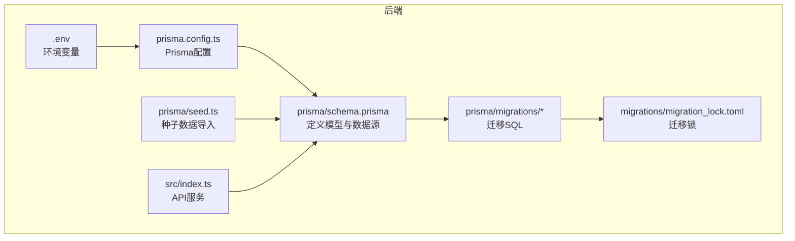
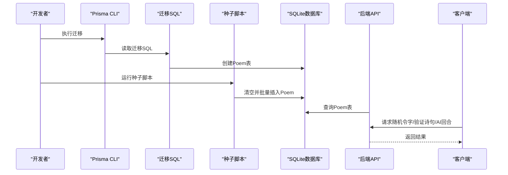
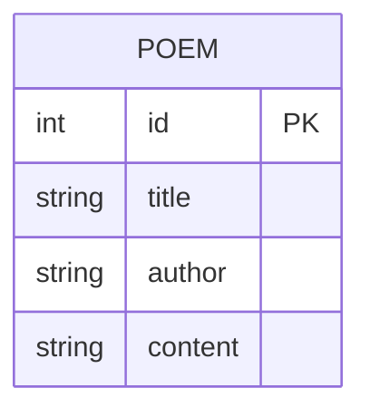
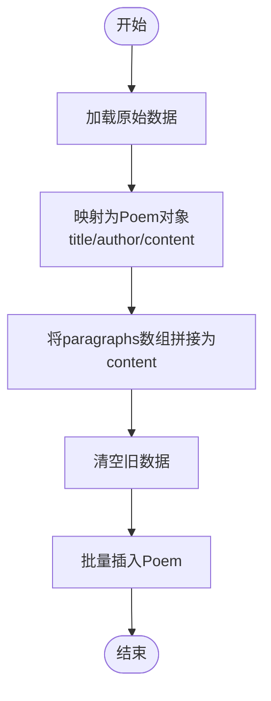
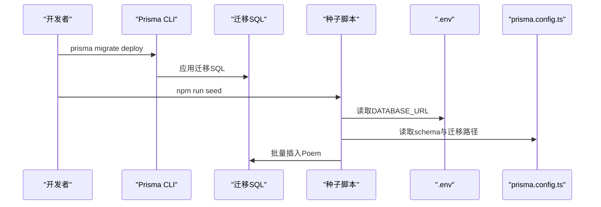
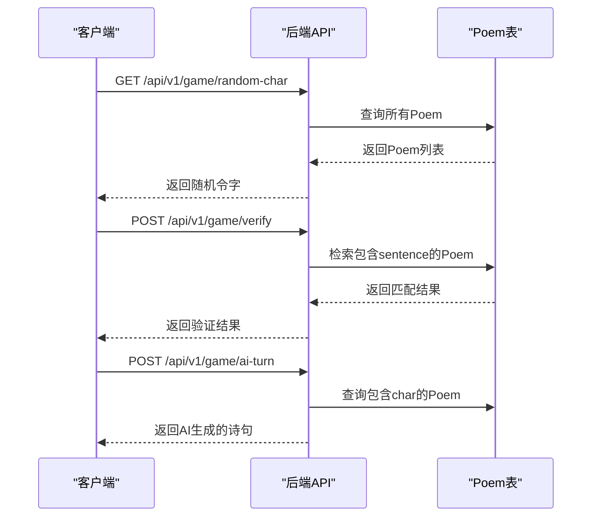
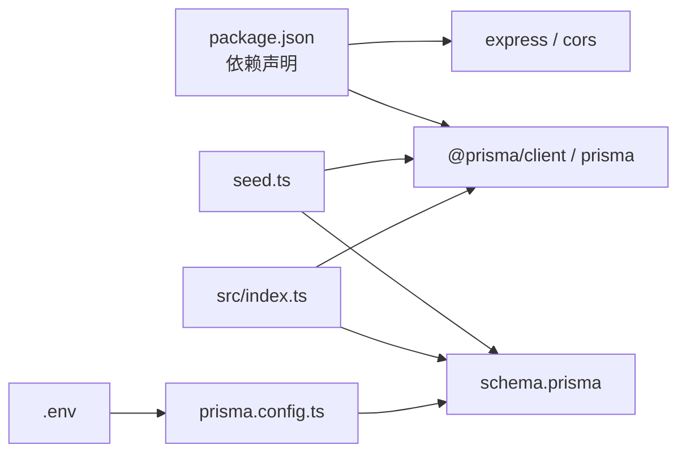
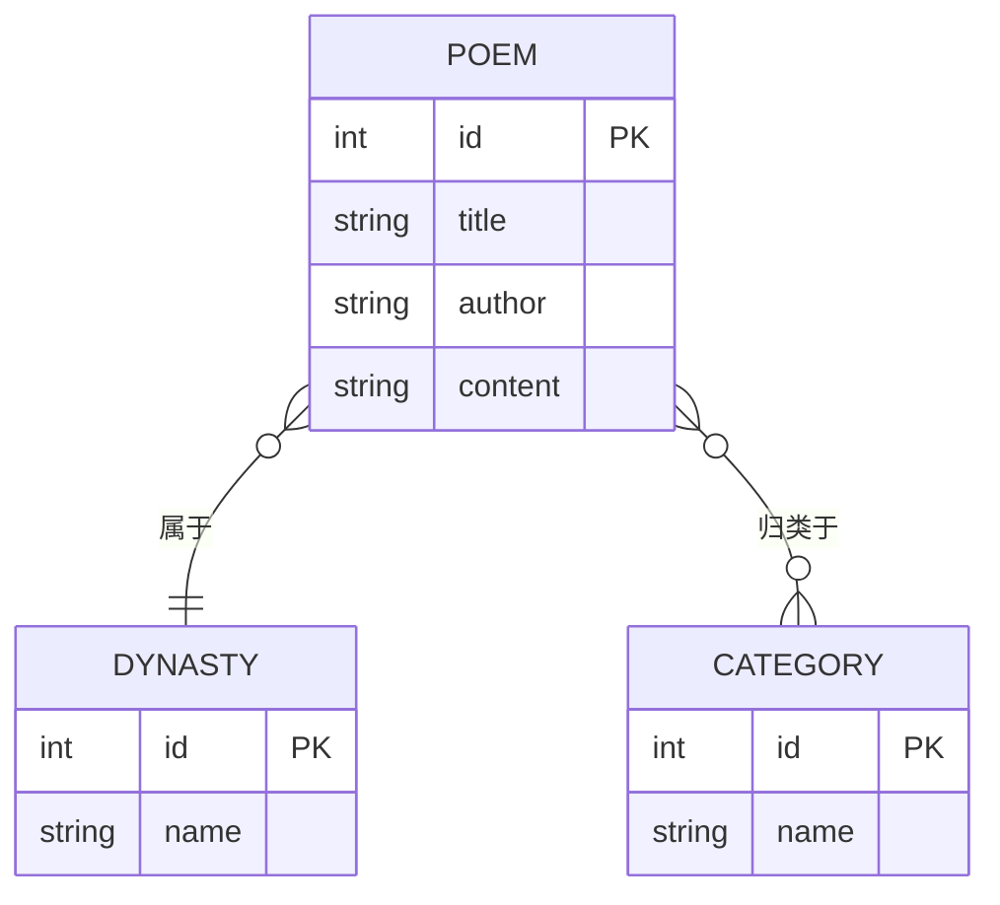

# 数据库设计

<cite>
**本文引用的文件**
- [backend/prisma/schema.prisma](file://backend/prisma/schema.prisma)
- [backend/prisma/migrations/20251104061144_init/migration.sql](file://backend/prisma/migrations/20251104061144_init/migration.sql)
- [backend/prisma/seed.ts](file://backend/prisma/seed.ts)
- [backend/src/index.ts](file://backend/src/index.ts)
- [backend/package.json](file://backend/package.json)
- [backend/prisma.config.ts](file://backend/prisma.config.ts)
- [backend/.env](file://backend/.env)
- [backend/prisma/migrations/migration_lock.toml](file://backend/prisma/migrations/migration_lock.toml)
</cite>

## 目录
1. [简介](#简介)
2. [项目结构](#项目结构)
3. [核心组件](#核心组件)
4. [架构总览](#架构总览)
5. [详细组件分析](#详细组件分析)
6. [依赖分析](#依赖分析)
7. [性能考虑](#性能考虑)
8. [故障排查指南](#故障排查指南)
9. [结论](#结论)
10. [附录](#附录)

## 简介
本文件围绕后端数据库与数据模型进行系统化说明，重点基于迁移脚本定义的表结构（id、title、author、content），解释字段的数据类型、约束条件及业务含义；同时说明 poems.json 作为原始诗词数据源的结构，以及 seed.ts 如何将 paragraphs 数组扁平化为 content 并批量写入数据库；最后给出数据库初始化流程、ER 图建议与未来扩展方向。

## 项目结构
后端使用 Prisma 管理 SQLite 数据库，核心文件分布如下：
- 模式定义：prisma/schema.prisma
- 迁移脚本：prisma/migrations/.../migration.sql
- 初始化种子脚本：prisma/seed.ts
- 后端服务入口：src/index.ts
- 工程脚本与依赖：package.json
- Prisma 配置：prisma.config.ts
- 环境变量：.env
- 迁移锁文件：migrations/migration_lock.toml

图表来源
- [backend/prisma/schema.prisma](file://backend/prisma/schema.prisma#L1-L19)
- [backend/prisma/migrations/20251104061144_init/migration.sql](file://backend/prisma/migrations/20251104061144_init/migration.sql#L1-L8)
- [backend/prisma/seed.ts](file://backend/prisma/seed.ts#L1-L53)
- [backend/src/index.ts](file://backend/src/index.ts#L1-L78)
- [backend/prisma.config.ts](file://backend/prisma.config.ts#L1-L14)
- [backend/.env](file://backend/.env#L1-L1)
- [backend/prisma/migrations/migration_lock.toml](file://backend/prisma/migrations/migration_lock.toml#L1-L4)

章节来源
- [backend/prisma/schema.prisma](file://backend/prisma/schema.prisma#L1-L19)
- [backend/prisma/migrations/20251104061144_init/migration.sql](file://backend/prisma/migrations/20251104061144_init/migration.sql#L1-L8)
- [backend/prisma/seed.ts](file://backend/prisma/seed.ts#L1-L53)
- [backend/src/index.ts](file://backend/src/index.ts#L1-L78)
- [backend/package.json](file://backend/package.json#L1-L30)
- [backend/prisma.config.ts](file://backend/prisma.config.ts#L1-L14)
- [backend/.env](file://backend/.env#L1-L1)
- [backend/prisma/migrations/migration_lock.toml](file://backend/prisma/migrations/migration_lock.toml#L1-L4)

## 核心组件
- 数据模型：Poem（id、title、author、content）
- 原始数据源：poems.json（示例数据位于 seed.ts 中）
- 种子脚本：将 paragraphs 数组拼接为 content 并批量插入
- 初始化流程：prisma migrate deploy 创建表结构；npm run seed 导入初始数据
- API 使用：后端服务通过 Prisma 查询 Poem 表实现游戏逻辑

章节来源
- [backend/prisma/schema.prisma](file://backend/prisma/schema.prisma#L13-L18)
- [backend/prisma/migrations/20251104061144_init/migration.sql](file://backend/prisma/migrations/20251104061144_init/migration.sql#L1-L8)
- [backend/prisma/seed.ts](file://backend/prisma/seed.ts#L1-L53)
- [backend/src/index.ts](file://backend/src/index.ts#L1-L78)
- [backend/package.json](file://backend/package.json#L6-L10)

## 架构总览
下图展示从迁移、种子到服务调用的整体流程与组件交互。

图表来源
- [backend/prisma/migrations/20251104061144_init/migration.sql](file://backend/prisma/migrations/20251104061144_init/migration.sql#L1-L8)
- [backend/prisma/seed.ts](file://backend/prisma/seed.ts#L1-L53)
- [backend/src/index.ts](file://backend/src/index.ts#L1-L78)

## 详细组件分析

### 数据模型：Poem
- 字段定义与约束
  - id：整型，主键，自增
  - title：文本，非空
  - author：文本，非空
  - content：文本，非空
- 业务含义
  - id：唯一标识每首诗词
  - title：诗词标题
  - author：作者名
  - content：由原始 paragraphs 数组拼接后的完整文本，便于全文检索与随机抽取

图表来源
- [backend/prisma/migrations/20251104061144_init/migration.sql](file://backend/prisma/migrations/20251104061144_init/migration.sql#L1-L8)
- [backend/prisma/schema.prisma](file://backend/prisma/schema.prisma#L13-L18)

章节来源
- [backend/prisma/migrations/20251104061144_init/migration.sql](file://backend/prisma/migrations/20251104061144_init/migration.sql#L1-L8)
- [backend/prisma/schema.prisma](file://backend/prisma/schema.prisma#L13-L18)

### 原始数据源：poems.json 与 seed.ts
- 数据源结构（示例）
  - 每条记录包含：author、title、paragraphs（字符串数组）
- 转换逻辑
  - 将 paragraphs 数组按顺序拼接为 content 字段
  - 清空现有数据后批量插入
- 批量插入
  - 使用 createMany 一次性写入多条记录

图表来源
- [backend/prisma/seed.ts](file://backend/prisma/seed.ts#L1-L53)

章节来源
- [backend/prisma/seed.ts](file://backend/prisma/seed.ts#L1-L53)

### 数据库初始化流程
- 迁移部署
  - 使用 Prisma 迁移命令创建表结构
  - 迁移 SQL 定义了 Poem 表的字段与约束
- 种子数据
  - 通过 npm run seed 执行 seed.ts
  - 清空并批量写入初始诗词数据
- 环境配置
  - DATABASE_URL 指向本地 SQLite 文件路径
  - prisma.config.ts 指定 schema 与迁移目录

图表来源
- [backend/package.json](file://backend/package.json#L6-L10)
- [backend/prisma/migrations/20251104061144_init/migration.sql](file://backend/prisma/migrations/20251104061144_init/migration.sql#L1-L8)
- [backend/prisma/seed.ts](file://backend/prisma/seed.ts#L1-L53)
- [backend/.env](file://backend/.env#L1-L1)
- [backend/prisma.config.ts](file://backend/prisma.config.ts#L1-L14)

章节来源
- [backend/package.json](file://backend/package.json#L6-L10)
- [backend/prisma/migrations/20251104061144_init/migration.sql](file://backend/prisma/migrations/20251104061144_init/migration.sql#L1-L8)
- [backend/prisma/seed.ts](file://backend/prisma/seed.ts#L1-L53)
- [backend/.env](file://backend/.env#L1-L1)
- [backend/prisma.config.ts](file://backend/prisma.config.ts#L1-L14)

### API 对 Poem 的使用
- 随机令字：从所有诗词 content 中随机选取一个字符
- 诗句验证：根据用户输入的 sentence 与 char，判断是否包含令字且未重复使用
- AI 回合：筛选包含令字的诗词，排除已用过的诗句，随机返回一句

图表来源
- [backend/src/index.ts](file://backend/src/index.ts#L1-L78)

章节来源
- [backend/src/index.ts](file://backend/src/index.ts#L1-L78)

## 依赖分析
- 外部依赖
  - @prisma/client、prisma：ORM 与迁移工具
  - sqlite3：SQLite 驱动
  - express、cors：HTTP 服务与跨域支持
- 内部依赖
  - seed.ts 依赖 PrismaClient 与 schema.prisma
  - src/index.ts 依赖 PrismaClient 查询 Poem
  - prisma.config.ts 指定 schema 与迁移路径
  - .env 提供 DATABASE_URL

图表来源
- [backend/package.json](file://backend/package.json#L1-L30)
- [backend/prisma/seed.ts](file://backend/prisma/seed.ts#L1-L53)
- [backend/src/index.ts](file://backend/src/index.ts#L1-L78)
- [backend/prisma.schema.prisma](file://backend/prisma/schema.prisma#L1-L19)
- [backend/prisma.config.ts](file://backend/prisma.config.ts#L1-L14)
- [backend/.env](file://backend/.env#L1-L1)

章节来源
- [backend/package.json](file://backend/package.json#L1-L30)
- [backend/prisma/seed.ts](file://backend/prisma/seed.ts#L1-L53)
- [backend/src/index.ts](file://backend/src/index.ts#L1-L78)
- [backend/prisma/schema.prisma](file://backend/prisma/schema.prisma#L1-L19)
- [backend/prisma.config.ts](file://backend/prisma.config.ts#L1-L14)
- [backend/.env](file://backend/.env#L1-L1)

## 性能考虑
- 全文检索
  - content 字段用于 contains 查询，建议在 SQLite 中建立合适的索引或分词策略以提升查询效率（当前迁移脚本未显式创建索引）
- 批量写入
  - seed.ts 使用 createMany 一次性插入，避免逐条写入的开销
- 随机访问
  - 随机令字与随机诗句依赖内存中的 Poem 列表，数据量较大时可考虑服务端随机游标或分页策略
- 数据规模
  - 当前示例数据量较小，生产环境需评估 SQLite 的并发与容量限制

[本节为通用性能建议，不直接分析具体文件]

## 故障排查指南
- 迁移失败
  - 检查 prisma.config.ts 的 schema 与 migrations 路径是否正确
  - 确认 .env 中 DATABASE_URL 指向有效路径
- 种子脚本错误
  - 确保已安装依赖并正确执行 npm run seed
  - 若出现连接问题，检查 DATABASE_URL 与 SQLite 文件权限
- API 404
  - 当诗词库为空时，随机令字接口会返回 404；先执行种子脚本后再测试

章节来源
- [backend/prisma.config.ts](file://backend/prisma.config.ts#L1-L14)
- [backend/.env](file://backend/.env#L1-L1)
- [backend/package.json](file://backend/package.json#L6-L10)
- [backend/src/index.ts](file://backend/src/index.ts#L12-L21)

## 结论
本项目采用 SQLite + Prisma 的轻量方案管理 Poem 数据模型，迁移脚本定义了基础字段与约束，seed.ts 将原始 paragraphs 数组扁平化为 content 并批量导入。后端 API 通过 Prisma 查询 Poem 实现游戏功能。整体结构清晰、易于扩展，适合快速迭代与演示。

[本节为总结性内容，不直接分析具体文件]

## 附录

### ER 图建议
- 当前实体
  - POEM：id、title、author、content
- 建议扩展（未来）
  - 新增表：Dynasty（朝代）、Category（分类）
  - 关系：Poem 可关联 Dynasty（外键）、Poem 可关联 Category（多对多中间表）

图表来源
- [backend/prisma/migrations/20251104061144_init/migration.sql](file://backend/prisma/migrations/20251104061144_init/migration.sql#L1-L8)
- [backend/prisma/schema.prisma](file://backend/prisma/schema.prisma#L13-L18)

### 字段约束与业务说明对照
- id：主键，自增，确保唯一性
- title：非空，表示诗词名称
- author：非空，表示作者
- content：非空，表示拼接后的完整文本，支持全文检索与随机字符抽取

章节来源
- [backend/prisma/migrations/20251104061144_init/migration.sql](file://backend/prisma/migrations/20251104061144_init/migration.sql#L1-L8)
- [backend/prisma/schema.prisma](file://backend/prisma/schema.prisma#L13-L18)