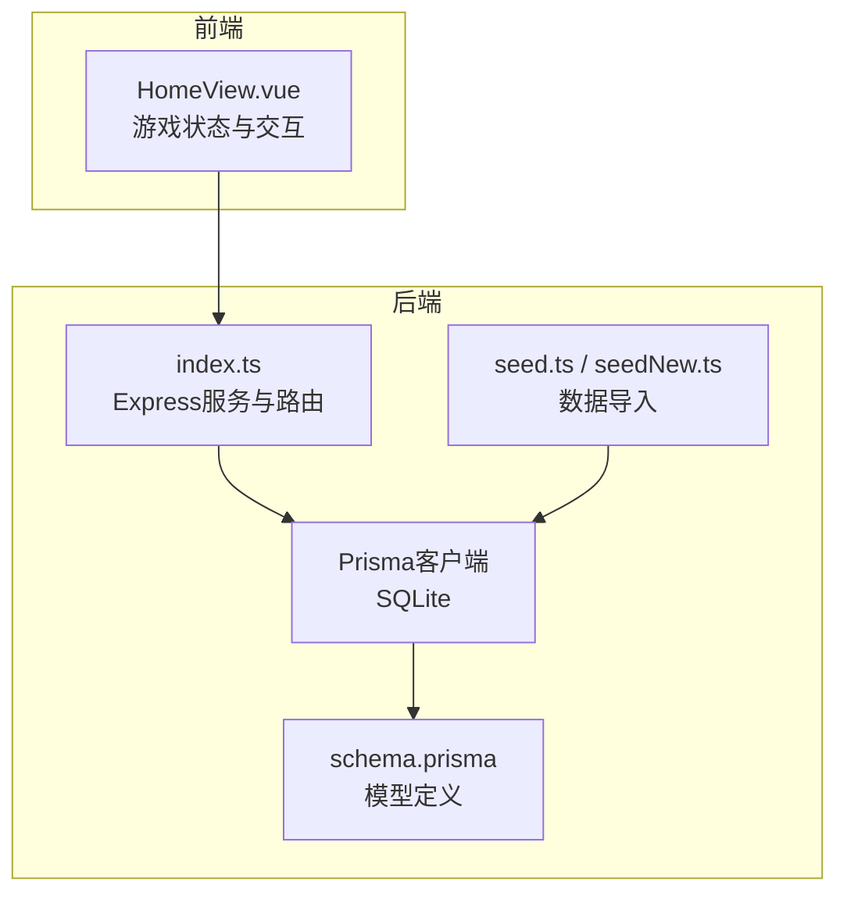
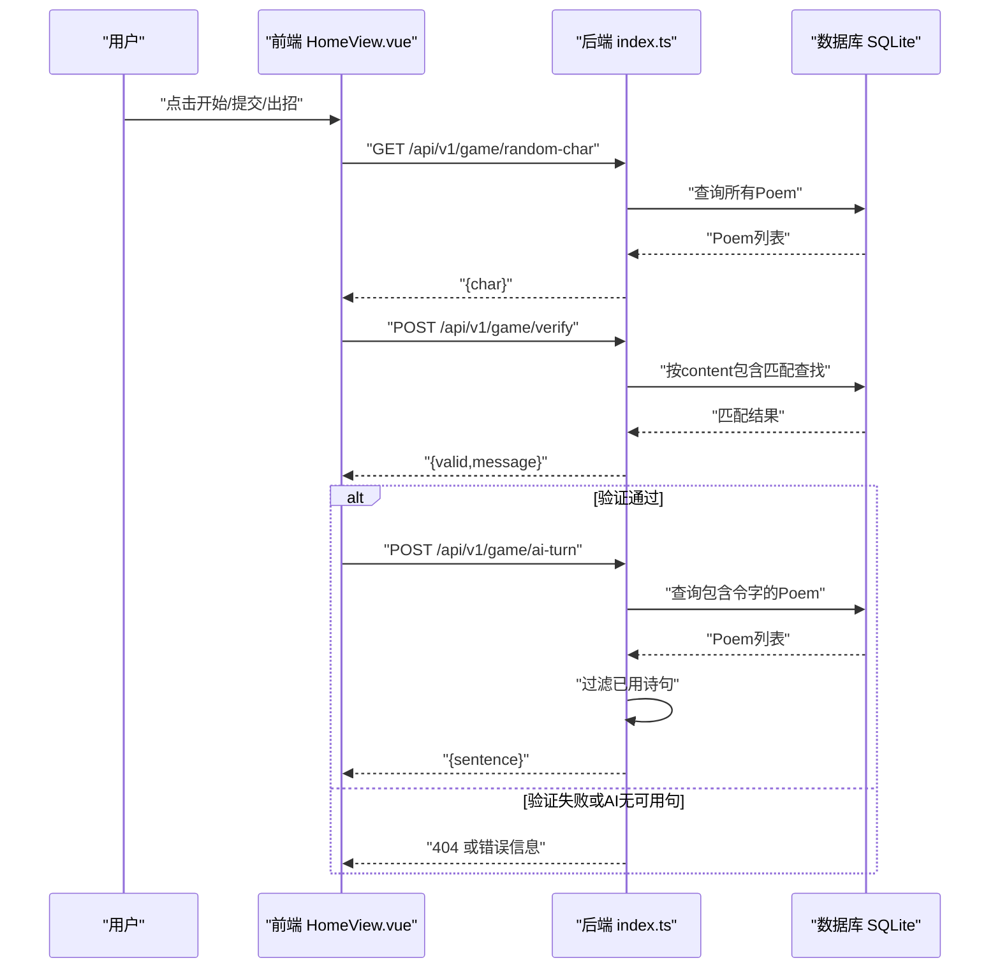
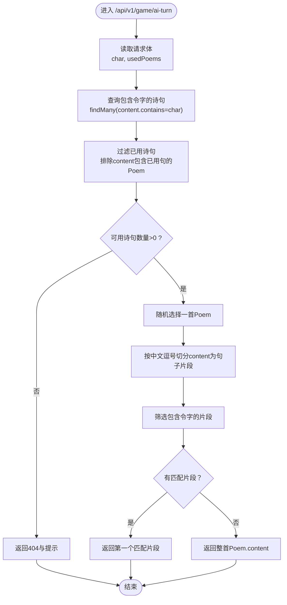
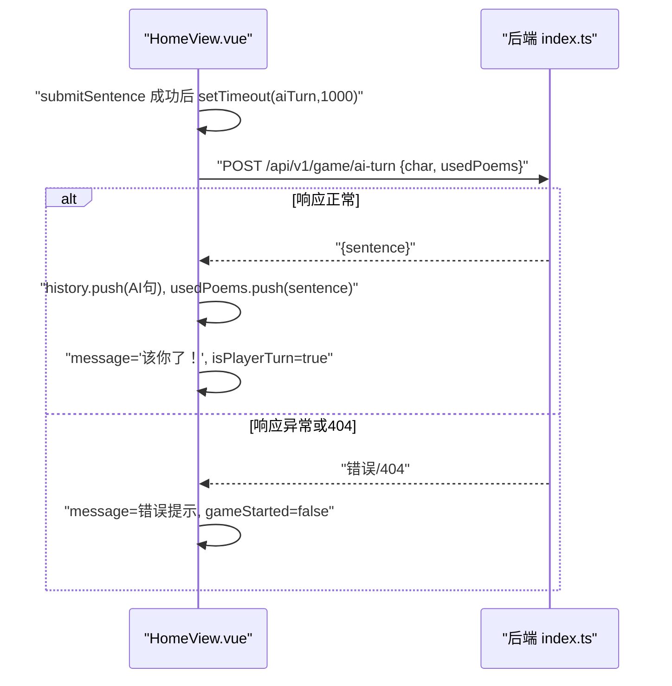
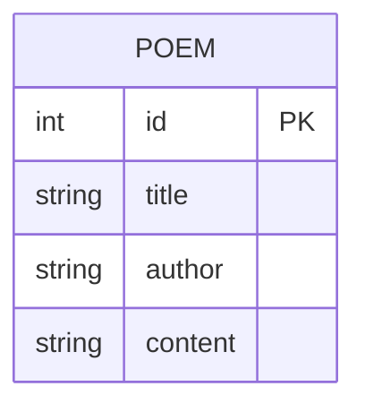

# AI出句算法

<cite>
**本文引用的文件**
- [backend/src/index.ts](file://backend/src/index.ts)
- [frontend/src/views/HomeView.vue](file://frontend/src/views/HomeView.vue)
- [backend/prisma/schema.prisma](file://backend/prisma/schema.prisma)
- [backend/prisma/seed.ts](file://backend/prisma/seed.ts)
- [backend/prisma/seedNew.ts](file://backend/prisma/seedNew.ts)
- [backend/package.json](file://backend/package.json)
</cite>

## 目录
1. [简介](#简介)
2. [项目结构](#项目结构)
3. [核心组件](#核心组件)
4. [架构总览](#架构总览)
5. [详细组件分析](#详细组件分析)
6. [依赖关系分析](#依赖关系分析)
7. [性能考量](#性能考量)
8. [故障排查指南](#故障排查指南)
9. [结论](#结论)
10. [附录](#附录)

## 简介
本文件系统化阐述“飞花令”游戏中AI出句功能的实现机制，围绕后端接口 POST /api/v1/game/ai-turn 的工作流程展开，并结合前端 HomeView.vue 中的 aiTurn 异步调用、超时与状态切换逻辑进行说明。同时，针对当前算法在句子切分上的局限性，提出引入中文分句与NLP技术的优化建议。

## 项目结构
- 后端采用 Express + Prisma + SQLite，提供游戏相关API与诗词数据管理。
- 前端使用 Vue 3 Composition API，负责游戏状态、交互与与后端的HTTP通信。
- 数据模型为 Poem，包含 id、title、author、content 字段；种子脚本将多段内容拼接为完整诗句存入数据库。

图表来源
- [backend/src/index.ts](file://backend/src/index.ts#L1-L78)
- [backend/prisma/schema.prisma](file://backend/prisma/schema.prisma#L1-L19)
- [backend/prisma/seed.ts](file://backend/prisma/seed.ts#L1-L52)
- [backend/prisma/seedNew.ts](file://backend/prisma/seedNew.ts#L1-L86)
- [frontend/src/views/HomeView.vue](file://frontend/src/views/HomeView.vue#L1-L232)

章节来源
- [backend/src/index.ts](file://backend/src/index.ts#L1-L78)
- [backend/prisma/schema.prisma](file://backend/prisma/schema.prisma#L1-L19)
- [backend/prisma/seed.ts](file://backend/prisma/seed.ts#L1-L52)
- [backend/prisma/seedNew.ts](file://backend/prisma/seedNew.ts#L1-L86)
- [frontend/src/views/HomeView.vue](file://frontend/src/views/HomeView.vue#L1-L232)

## 核心组件
- 后端路由与业务逻辑
  - POST /api/v1/game/ai-turn：接收当前令字与已用诗句列表，查询包含该字的所有诗句，过滤掉已用过的诗句，若无可选则返回404，否则从可用诗句中随机挑选一首，并简单切分为以中文逗号分隔的句子片段，返回第一个包含令字的片段作为AI出句。
- 前端交互与状态
  - HomeView.vue 提供开始游戏、提交玩家诗句、触发AI回合、消息提示与回合切换等逻辑；通过 fetch 发起HTTP请求，使用 setTimeout 实现AI回合延时，捕获异常并结束游戏。

章节来源
- [backend/src/index.ts](file://backend/src/index.ts#L50-L77)
- [frontend/src/views/HomeView.vue](file://frontend/src/views/HomeView.vue#L48-L90)
- [frontend/src/views/HomeView.vue](file://frontend/src/views/HomeView.vue#L64-L84)

## 架构总览
后端服务通过 Prisma 访问 SQLite 数据库，提供随机令字、验证玩家诗句与AI出句三项API。前端通过 fetch 与后端交互，维护游戏状态并在AI回合时延迟切换回玩家回合。

图表来源
- [backend/src/index.ts](file://backend/src/index.ts#L12-L48)
- [backend/src/index.ts](file://backend/src/index.ts#L50-L77)
- [frontend/src/views/HomeView.vue](file://frontend/src/views/HomeView.vue#L14-L30)
- [frontend/src/views/HomeView.vue](file://frontend/src/views/HomeView.vue#L32-L63)
- [frontend/src/views/HomeView.vue](file://frontend/src/views/HomeView.vue#L64-L84)

## 详细组件分析

### 后端：AI出句接口 POST /api/v1/game/ai-turn
- 输入参数
  - char：当前令字
  - usedPoems：已用过的诗句列表
- 查询与过滤
  - 使用 findMany 查询 content 包含 char 的所有诗句
  - 过滤掉 content 中包含已用诗句的诗句，得到可用集合
- 选择与返回
  - 若可用集合为空，返回404与提示信息
  - 否则随机选择一首，按中文逗号切分为句子片段，筛选包含令字的片段，返回第一个匹配项；若无匹配则返回整首诗内容

图表来源
- [backend/src/index.ts](file://backend/src/index.ts#L50-L77)

章节来源
- [backend/src/index.ts](file://backend/src/index.ts#L50-L77)

### 前端：aiTurn 异步调用与状态切换
- 触发时机
  - 玩家提交有效诗句后，前端在短暂延时后调用 aiTurn
- 请求与响应
  - 发送 POST /api/v1/game/ai-turn，携带 char 与 usedPoems
  - 若响应非OK，视为AI无可用句，前端显示提示并结束游戏
  - 成功时，将AI的句子加入历史与已用列表，更新消息并切换回玩家回合
- 错误处理
  - 捕获网络异常与服务端错误，设置消息并终止游戏

图表来源
- [frontend/src/views/HomeView.vue](file://frontend/src/views/HomeView.vue#L48-L63)
- [frontend/src/views/HomeView.vue](file://frontend/src/views/HomeView.vue#L64-L84)
- [backend/src/index.ts](file://backend/src/index.ts#L50-L77)

章节来源
- [frontend/src/views/HomeView.vue](file://frontend/src/views/HomeView.vue#L48-L63)
- [frontend/src/views/HomeView.vue](file://frontend/src/views/HomeView.vue#L64-L84)

### 数据模型与种子数据
- 数据模型
  - Poem：id、title、author、content
- 种子数据
  - seed.ts 将多段内容拼接为完整 content 存入数据库
  - seedNew.ts 支持从CSV批量导入，分批写入，提升大数据量下的稳定性

图表来源
- [backend/prisma/schema.prisma](file://backend/prisma/schema.prisma#L13-L18)
- [backend/prisma/seed.ts](file://backend/prisma/seed.ts#L1-L52)
- [backend/prisma/seedNew.ts](file://backend/prisma/seedNew.ts#L1-L86)

章节来源
- [backend/prisma/schema.prisma](file://backend/prisma/schema.prisma#L13-L18)
- [backend/prisma/seed.ts](file://backend/prisma/seed.ts#L1-L52)
- [backend/prisma/seedNew.ts](file://backend/prisma/seedNew.ts#L1-L86)

## 依赖关系分析
- 后端依赖
  - Express：提供HTTP服务与路由
  - Prisma：ORM访问SQLite数据库
  - CORS：跨域支持
- 前端依赖
  - Vue 3：组件化与响应式状态管理
  - fetch：与后端API通信
- 数据库
  - SQLite：轻量存储，适合本地开发与演示

图表来源
- [backend/src/index.ts](file://backend/src/index.ts#L1-L20)
- [backend/package.json](file://backend/package.json#L1-L30)
- [frontend/src/views/HomeView.vue](file://frontend/src/views/HomeView.vue#L1-L20)

章节来源
- [backend/src/index.ts](file://backend/src/index.ts#L1-L20)
- [backend/package.json](file://backend/package.json#L1-L30)

## 性能考量
- 查询复杂度
  - findMany(content.contains=char) 在content字段上进行模糊匹配，可能不具备索引；当数据量增大时，建议：
    - 为content建立全文索引或分词索引（需根据数据库能力评估）
    - 或者预先构建“令字→诗句ID”的倒排索引表，减少每次查询范围
- 过滤成本
  - 过滤已用诗句时对每条Poem.content执行包含判断，复杂度约为 O(U)，U为可用诗句数；可考虑：
    - 将usedPoems转为Set，提高包含判断效率
    - 或在数据库侧直接过滤（如使用SQL子查询）
- 随机选择
  - 随机采样为O(1)，但需要遍历数组；对于大集合可考虑 reservoir sampling 或数据库层limit+offset随机
- 切分策略
  - 当前按中文逗号切分，仅能覆盖标准断句场景；在复杂文本中可能出现误切或漏切

章节来源
- [backend/src/index.ts](file://backend/src/index.ts#L50-L77)

## 故障排查指南
- AI无可用句（404）
  - 可能原因：数据库中不含该令字的诗句，或所有包含该字的诗句均已被使用
  - 前端表现：显示“AI也想不出来了”，并结束游戏
- 网络异常
  - 前端捕获异常并提示“请求失败，请检查网络”
- 数据库为空
  - 随机令字接口在空库时会返回404，前端应提示“诗词库为空”

章节来源
- [backend/src/index.ts](file://backend/src/index.ts#L12-L21)
- [backend/src/index.ts](file://backend/src/index.ts#L50-L77)
- [frontend/src/views/HomeView.vue](file://frontend/src/views/HomeView.vue#L64-L84)

## 结论
当前AI出句算法以“令字包含+简单分句”为核心，实现简洁、易懂且可运行。其主要局限在于句子切分过于粗略，可能导致返回片段不符合语义边界。建议引入中文分句与NLP技术，提升AI出句的自然度与可读性；同时配合数据库索引与过滤优化，进一步提升性能与可扩展性。

## 附录

### 优化建议（面向未来迭代）
- 引入中文分句与NLP
  - 使用中文分句工具（如jieba分句、HanLP等）替代简单的中文逗号切分，确保返回的句子片段具备语法与语义完整性
- 增强检索与排序
  - 对包含令字的诗句按“与上一句的衔接度/平仄匹配度/作者偏好”等规则打分，再进行随机抽样，提升AI出句质量
- 数据层优化
  - 为content建立索引或分词索引；将usedPoems转换为Set以加速包含判断
- 前端体验
  - 增加加载态与重试机制；在AI思考阶段显示占位符或动画，改善交互体验