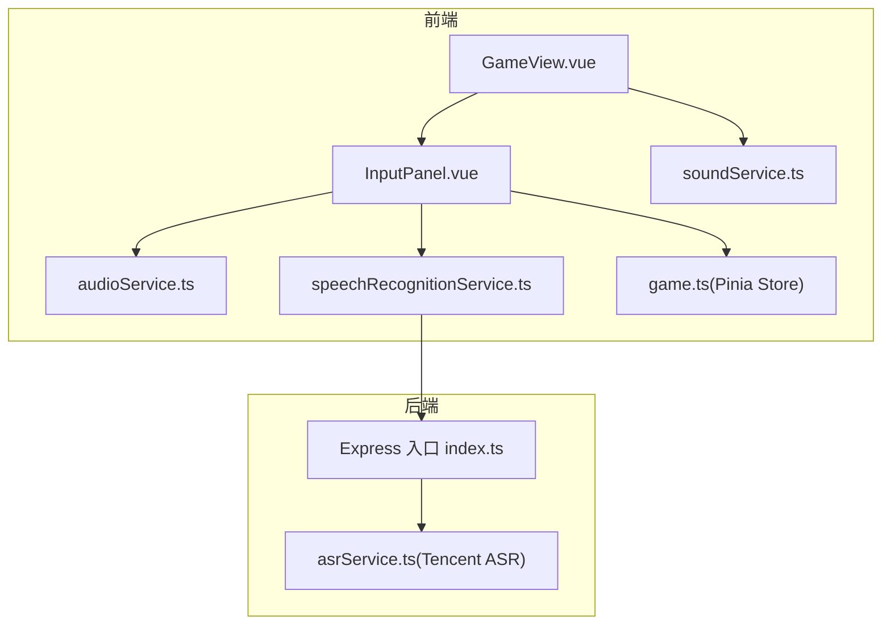
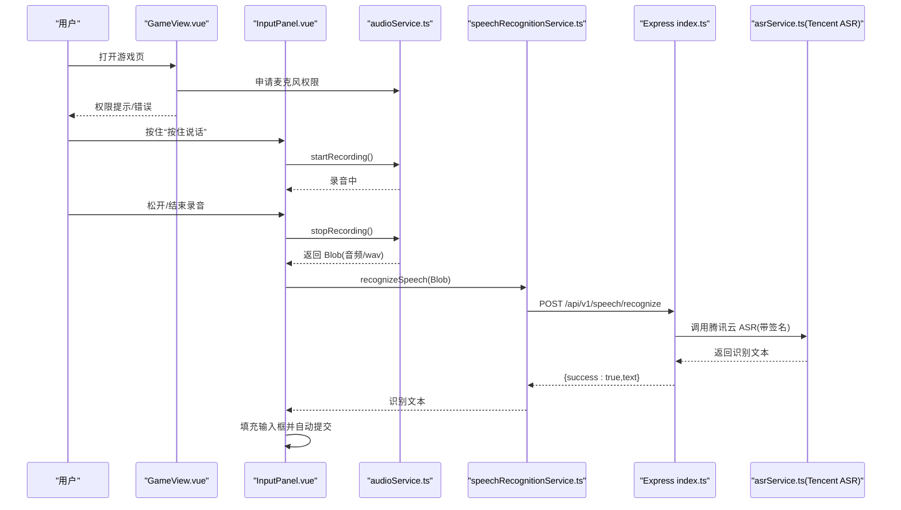
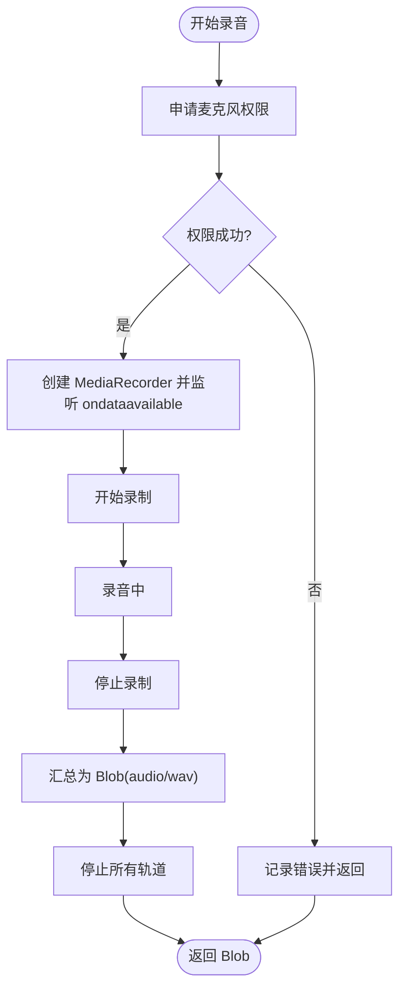
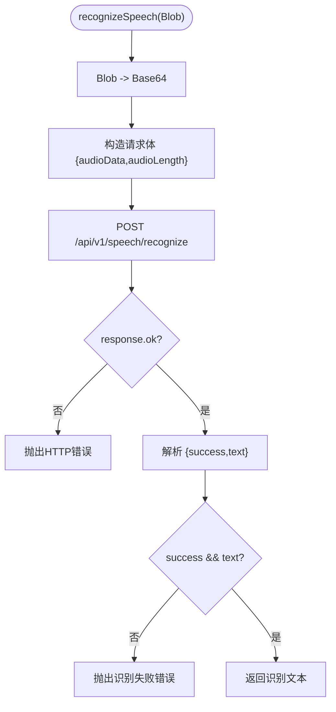
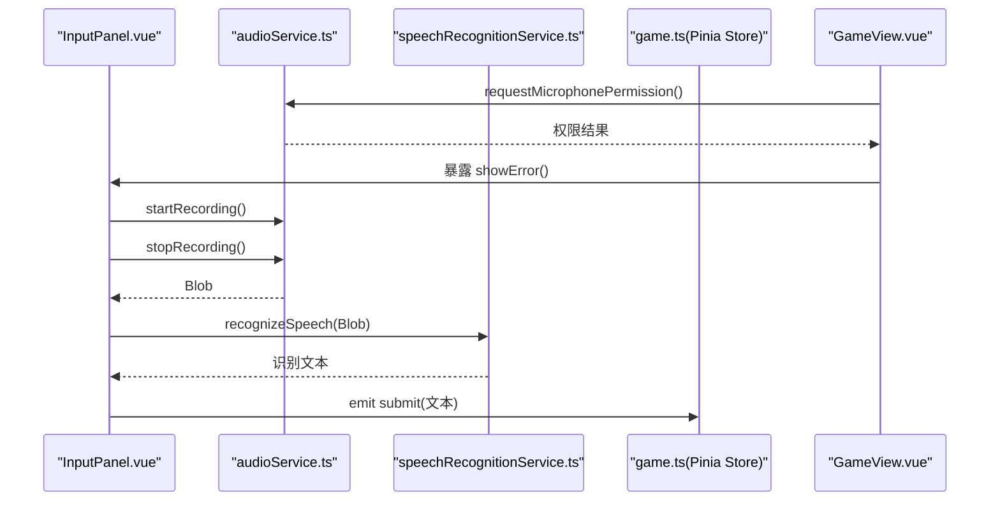
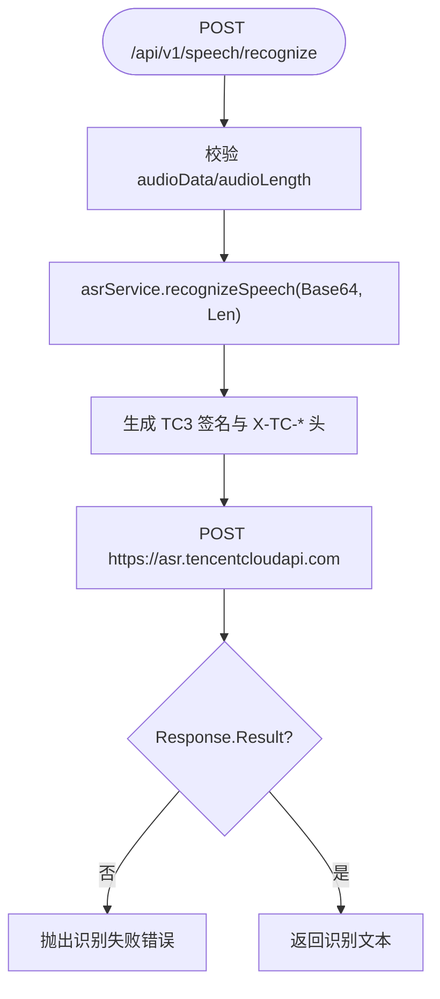
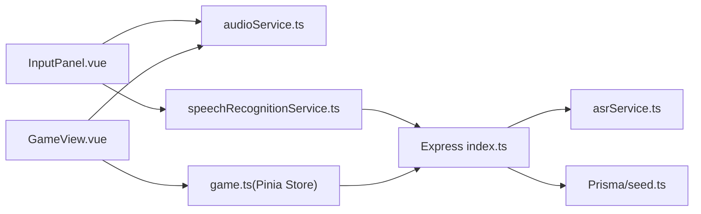

# 语音输入功能

<cite>
**本文引用的文件**
- [frontend/src/components/InputPanel.vue](file://frontend/src/components/InputPanel.vue)
- [frontend/src/services/audioService.ts](file://frontend/src/services/audioService.ts)
- [frontend/src/services/speechRecognitionService.ts](file://frontend/src/services/speechRecognitionService.ts)
- [frontend/src/views/GameView.vue](file://frontend/src/views/GameView.vue)
- [backend/src/index.ts](file://backend/src/index.ts)
- [backend/src/asrService.ts](file://backend/src/asrService.ts)
- [frontend/src/stores/game.ts](file://frontend/src/stores/game.ts)
- [frontend/src/services/soundService.ts](file://frontend/src/services/soundService.ts)
- [frontend/src/types/game.ts](file://frontend/src/types/game.ts)
- [backend/prisma/seed.ts](file://backend/prisma/seed.ts)
- [README.md](file://README.md)
</cite>

## 目录
1. [简介](#简介)
2. [项目结构](#项目结构)
3. [核心组件](#核心组件)
4. [架构总览](#架构总览)
5. [详细组件分析](#详细组件分析)
6. [依赖关系分析](#依赖关系分析)
7. [性能与可靠性](#性能与可靠性)
8. [故障排查指南](#故障排查指南)
9. [结论](#结论)
10. [附录](#附录)

## 简介
本文件聚焦“语音输入”功能，完整梳理从前端录音采集、语音识别调用，到后端腾讯云ASR接入与结果返回的端到端流程。读者可据此快速理解语音输入如何与游戏主流程集成，以及在不同环节可能出现的问题与优化方向。

## 项目结构
- 前端采用 Vue3 + TypeScript，语音输入由 InputPanel 组件承载，配合 audioService 与 speechRecognitionService 实现录音与识别调用。
- 后端基于 Express，提供 /api/v1/speech/recognize 接口，内部调用腾讯云 ASR 服务，返回识别文本。
- 游戏主流程由 GameView 与 Pinia Store 协作，InputPanel 的识别结果直接参与验证与回合推进。

图表来源
- [frontend/src/views/GameView.vue](file://frontend/src/views/GameView.vue#L1-L36)
- [frontend/src/components/InputPanel.vue](file://frontend/src/components/InputPanel.vue#L1-L71)
- [frontend/src/services/audioService.ts](file://frontend/src/services/audioService.ts#L1-L78)
- [frontend/src/services/speechRecognitionService.ts](file://frontend/src/services/speechRecognitionService.ts#L1-L58)
- [frontend/src/stores/game.ts](file://frontend/src/stores/game.ts#L1-L120)
- [frontend/src/services/soundService.ts](file://frontend/src/services/soundService.ts#L1-L90)
- [backend/src/index.ts](file://backend/src/index.ts#L346-L373)
- [backend/src/asrService.ts](file://backend/src/asrService.ts#L1-L98)

章节来源
- [README.md](file://README.md#L1-L120)

## 核心组件
- 录音采集与权限申请：audioService 提供麦克风权限申请、MediaRecorder 开始/停止录音、浏览器能力检测。
- 语音识别调用：speechRecognitionService 将 Blob 转 Base64 并向后端 /api/v1/speech/recognize 发起识别请求。
- 识别结果处理：InputPanel 在录音结束后调用识别服务，将识别文本填入输入框并自动提交。
- 后端识别服务：Express 路由接收音频数据，调用 asrService 生成签名并请求腾讯云 ASR，返回识别文本。
- 游戏集成：GameView 在挂载时申请麦克风权限并在失败时提示；Pinia Store 负责游戏状态流转与回合推进。

章节来源
- [frontend/src/services/audioService.ts](file://frontend/src/services/audioService.ts#L1-L78)
- [frontend/src/services/speechRecognitionService.ts](file://frontend/src/services/speechRecognitionService.ts#L1-L58)
- [frontend/src/components/InputPanel.vue](file://frontend/src/components/InputPanel.vue#L108-L171)
- [backend/src/index.ts](file://backend/src/index.ts#L346-L373)
- [backend/src/asrService.ts](file://backend/src/asrService.ts#L1-L98)
- [frontend/src/views/GameView.vue](file://frontend/src/views/GameView.vue#L1-L36)
- [frontend/src/stores/game.ts](file://frontend/src/stores/game.ts#L146-L219)

## 架构总览
语音输入端到端流程如下：

图表来源
- [frontend/src/views/GameView.vue](file://frontend/src/views/GameView.vue#L1-L36)
- [frontend/src/components/InputPanel.vue](file://frontend/src/components/InputPanel.vue#L108-L171)
- [frontend/src/services/audioService.ts](file://frontend/src/services/audioService.ts#L1-L78)
- [frontend/src/services/speechRecognitionService.ts](file://frontend/src/services/speechRecognitionService.ts#L1-L58)
- [backend/src/index.ts](file://backend/src/index.ts#L346-L373)
- [backend/src/asrService.ts](file://backend/src/asrService.ts#L1-L98)

## 详细组件分析

### 录音与权限管理（audioService）
- 能力检测：检查 navigator、MediaRecorder、getUserMedia 是否可用。
- 权限申请：调用 getUserMedia 成功后立即停止轨道，避免持续占用麦克风。
- 录音控制：startRecording 创建 MediaRecorder 并收集 ondataavailable 数据块；stopRecording 汇总为 Blob 并停止所有轨道。
- 异常处理：录音启动失败抛出明确错误，供上层 UI 展示。

图表来源
- [frontend/src/services/audioService.ts](file://frontend/src/services/audioService.ts#L1-L78)

章节来源
- [frontend/src/services/audioService.ts](file://frontend/src/services/audioService.ts#L1-L78)

### 语音识别调用（speechRecognitionService）
- 将 Blob 转为 Base64 字符串，构造 {audioData, audioLength} 请求体。
- 向 /api/v1/speech/recognize 发起 POST，解析响应中的 success/text。
- 失败时抛出错误，供上层 UI 展示。

图表来源
- [frontend/src/services/speechRecognitionService.ts](file://frontend/src/services/speechRecognitionService.ts#L1-L58)
- [backend/src/index.ts](file://backend/src/index.ts#L346-L373)

章节来源
- [frontend/src/services/speechRecognitionService.ts](file://frontend/src/services/speechRecognitionService.ts#L1-L58)
- [backend/src/index.ts](file://backend/src/index.ts#L346-L373)

### 前端输入面板（InputPanel）与游戏集成
- UI 行为：按住/松开录音按钮触发 startRecording/stopRecording；录音中高亮按钮并显示状态提示；不支持或权限不足时提示。
- 逻辑行为：stopRecording 后调用识别服务，识别成功则填充输入框并自动触发 submit 事件；错误时显示错误信息。
- 与 GameView 集成：GameView 在挂载时申请麦克风权限，失败则通过 InputPanel.expose.showError 提示用户。

图表来源
- [frontend/src/components/InputPanel.vue](file://frontend/src/components/InputPanel.vue#L108-L171)
- [frontend/src/views/GameView.vue](file://frontend/src/views/GameView.vue#L1-L36)
- [frontend/src/stores/game.ts](file://frontend/src/stores/game.ts#L146-L219)

章节来源
- [frontend/src/components/InputPanel.vue](file://frontend/src/components/InputPanel.vue#L1-L171)
- [frontend/src/views/GameView.vue](file://frontend/src/views/GameView.vue#L1-L36)
- [frontend/src/stores/game.ts](file://frontend/src/stores/game.ts#L146-L219)

### 后端腾讯云 ASR（asrService + Express 路由）
- Express 路由：接收 {audioData, audioLength}，校验参数后调用 asrService。
- asrService：生成 TC3-HMAC-SHA256 签名，构造 Authorization、X-TC-* 请求头，向 https://asr.tencentcloudapi.com 发起 POST，解析 Response.Result 返回文本。
- 错误处理：参数缺失、HTTP 错误、ASR 返回错误均转化为统一错误信息。

图表来源
- [backend/src/index.ts](file://backend/src/index.ts#L346-L373)
- [backend/src/asrService.ts](file://backend/src/asrService.ts#L1-L98)

章节来源
- [backend/src/index.ts](file://backend/src/index.ts#L346-L373)
- [backend/src/asrService.ts](file://backend/src/asrService.ts#L1-L98)

### 游戏状态与提示（Pinia Store 与音效）
- Pinia Store：负责开始游戏、验证诗句、AI 回合、提示获取、计时器与统计。
- 音效服务：预加载音效资源，按需播放，支持静音与音量调节。
- InputPanel 与 Store 的交互：识别成功后通过 submit 事件进入验证流程；错误时通过 showError 提示。

章节来源
- [frontend/src/stores/game.ts](file://frontend/src/stores/game.ts#L1-L339)
- [frontend/src/services/soundService.ts](file://frontend/src/services/soundService.ts#L1-L148)
- [frontend/src/types/game.ts](file://frontend/src/types/game.ts#L1-L48)

## 依赖关系分析
- 前端组件依赖：
  - InputPanel 依赖 audioService 与 speechRecognitionService。
  - GameView 依赖 audioService 与 Pinia Store，用于权限申请与错误提示。
- 后端服务依赖：
  - Express 路由依赖 asrService。
  - asrService 依赖 axios 与 crypto 生成签名。
- 数据与资源：
  - 诗词数据由 Prisma seed 初始化，供游戏验证与提示使用。

图表来源
- [frontend/src/components/InputPanel.vue](file://frontend/src/components/InputPanel.vue#L1-L71)
- [frontend/src/services/audioService.ts](file://frontend/src/services/audioService.ts#L1-L78)
- [frontend/src/services/speechRecognitionService.ts](file://frontend/src/services/speechRecognitionService.ts#L1-L58)
- [frontend/src/views/GameView.vue](file://frontend/src/views/GameView.vue#L1-L36)
- [frontend/src/stores/game.ts](file://frontend/src/stores/game.ts#L1-L120)
- [backend/src/index.ts](file://backend/src/index.ts#L346-L373)
- [backend/src/asrService.ts](file://backend/src/asrService.ts#L1-L98)
- [backend/prisma/seed.ts](file://backend/prisma/seed.ts#L1-L53)

章节来源
- [backend/prisma/seed.ts](file://backend/prisma/seed.ts#L1-L53)

## 性能与可靠性
- 前端录音体积与网络传输：
  - 当前实现将 Blob 转 Base64，体积约为原始音频的 4/3 倍，可能带来网络与内存压力。建议在后端直接接收二进制或使用分片上传以降低内存峰值。
- 识别耗时与并发：
  - 腾讯云 ASR 为外部服务，受网络与服务端负载影响。建议在前端增加超时与重试策略，并对识别失败进行降级提示。
- 浏览器兼容性：
  - MediaRecorder 与 getUserMedia 在部分旧版本浏览器不可用，应提供降级提示与替代输入方式。
- 错误恢复：
  - 前端与后端均对识别失败进行错误抛出与统一错误响应，UI 层应保证错误信息可见且可清除。

[本节为通用建议，不直接分析具体文件]

## 故障排查指南
- 录音权限被拒绝
  - 现象：GameView 挂载时申请麦克风失败，InputPanel 显示错误提示。
  - 排查：确认浏览器设置允许麦克风；刷新页面重试；更换现代浏览器。
  - 关联文件：[frontend/src/views/GameView.vue](file://frontend/src/views/GameView.vue#L1-L36)，[frontend/src/services/audioService.ts](file://frontend/src/services/audioService.ts#L1-L38)
- 录音启动失败
  - 现象：点击“按住说话”按钮无反应或报错。
  - 排查：检查浏览器是否支持 MediaRecorder 与 getUserMedia；确认设备麦克风正常；查看控制台错误。
  - 关联文件：[frontend/src/services/audioService.ts](file://frontend/src/services/audioService.ts#L21-L42)
- 识别接口 500
  - 现象：前端收到后端错误响应。
  - 排查：检查 /api/v1/speech/recognize 参数完整性；确认后端环境变量（如腾讯云密钥）配置正确；查看后端日志。
  - 关联文件：[frontend/src/services/speechRecognitionService.ts](file://frontend/src/services/speechRecognitionService.ts#L1-L58)，[backend/src/index.ts](file://backend/src/index.ts#L346-L373)
- 识别结果为空或失败
  - 现象：识别接口返回 success=true 但 text 为空或错误。
  - 排查：确认音频质量与时长；检查腾讯云 ASR 配置；尝试重新录音。
  - 关联文件：[backend/src/asrService.ts](file://backend/src/asrService.ts#L65-L98)

章节来源
- [frontend/src/views/GameView.vue](file://frontend/src/views/GameView.vue#L1-L36)
- [frontend/src/services/audioService.ts](file://frontend/src/services/audioService.ts#L1-L78)
- [frontend/src/services/speechRecognitionService.ts](file://frontend/src/services/speechRecognitionService.ts#L1-L58)
- [backend/src/index.ts](file://backend/src/index.ts#L346-L373)
- [backend/src/asrService.ts](file://backend/src/asrService.ts#L65-L98)

## 结论
语音输入功能通过 InputPanel + audioService + speechRecognitionService 的前端链路，结合后端 Express + Tencent ASR 的识别链路，实现了从录音到识别再到游戏验证的闭环。当前实现简洁可靠，具备良好的错误提示与降级能力。后续可在传输体积、并发与稳定性方面进一步优化，以提升用户体验。

[本节为总结性内容，不直接分析具体文件]

## 附录
- API 路由与用途概览（来自项目文档）
  - GET /api/v1/game/random-char：获取随机关键字
  - POST /api/v1/game/start：开始游戏并返回 AI 首句
  - POST /api/v1/game/verify：验证用户诗句
  - POST /api/v1/game/ai-turn：AI 出句
  - POST /api/v1/game/hint：获取提示
  - POST /api/v1/speech/recognize：语音识别

章节来源
- [README.md](file://README.md#L284-L392)