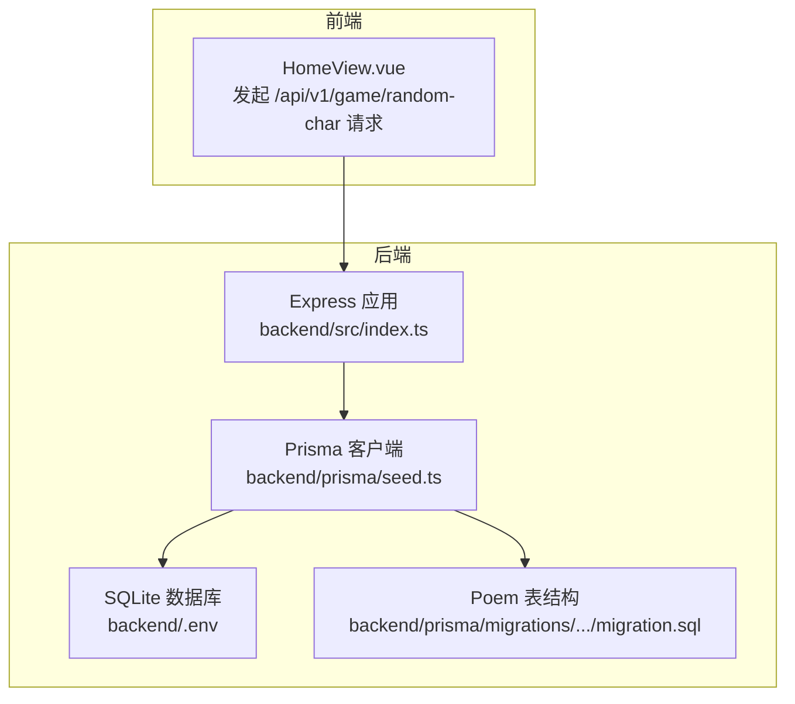
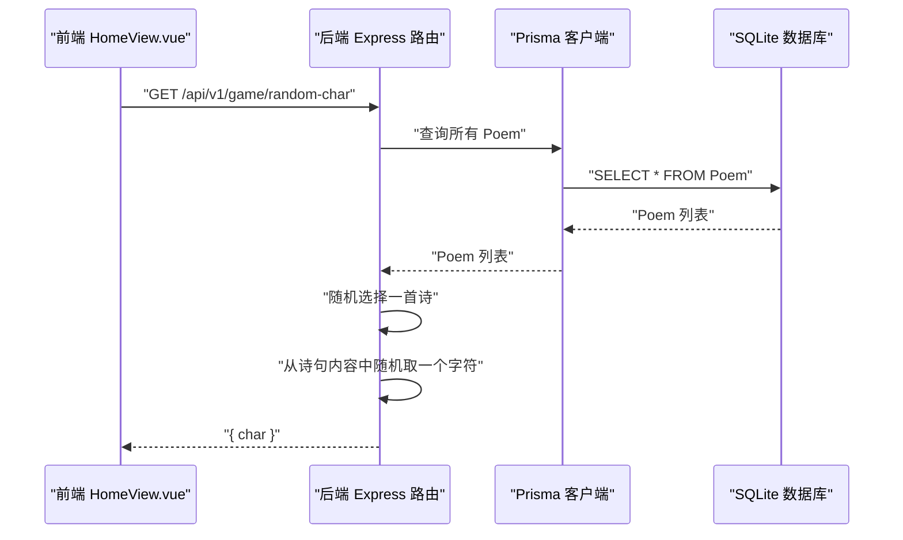
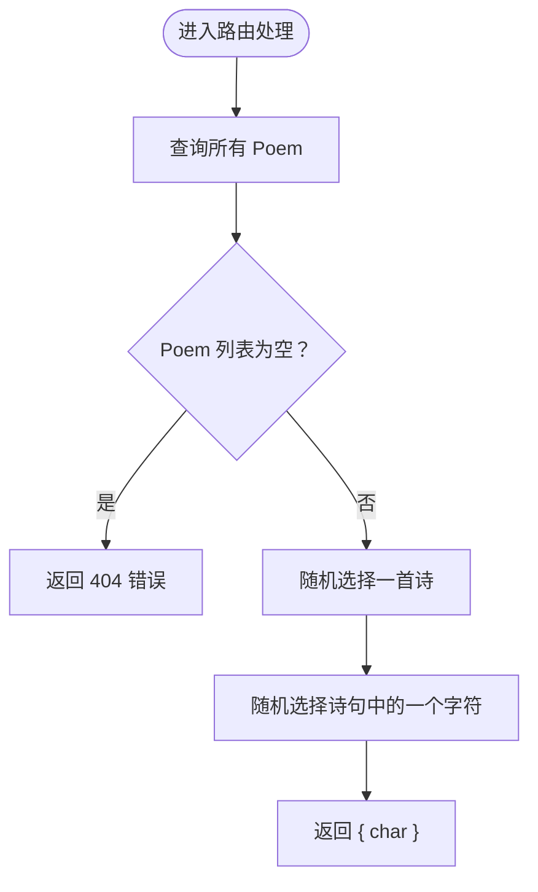
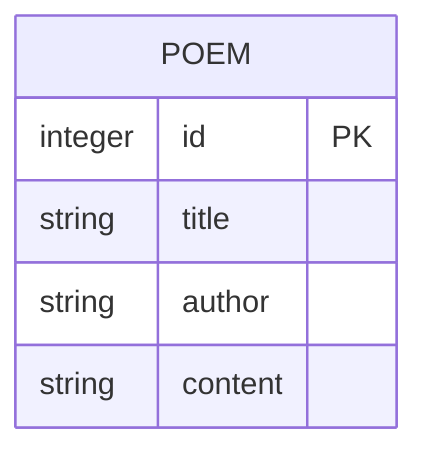
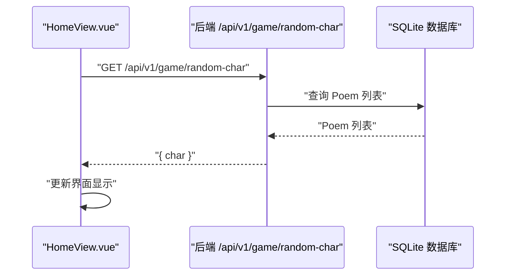

# 令字生成机制

<cite>
**本文引用的文件列表**
- [backend/src/index.ts](file://backend/src/index.ts)
- [backend/prisma/seed.ts](file://backend/prisma/seed.ts)
- [backend/prisma/migrations/20251104061144_init/migration.sql](file://backend/prisma/migrations/20251104061144_init/migration.sql)
- [backend/.env](file://backend/.env)
- [frontend/src/views/HomeView.vue](file://frontend/src/views/HomeView.vue)
</cite>

## 目录
1. [引言](#引言)
2. [项目结构](#项目结构)
3. [核心组件](#核心组件)
4. [架构总览](#架构总览)
5. [详细组件分析](#详细组件分析)
6. [依赖关系分析](#依赖关系分析)
7. [性能考量](#性能考量)
8. [故障排查指南](#故障排查指南)
9. [结论](#结论)
10. [附录](#附录)

## 引言
本文件聚焦后端“令字生成”逻辑，围绕以下目标展开：
- 解释后端如何从 Poem 数据表中随机选取一首诗，并从诗句内容中随机提取一个字符作为令字；
- 结合 GET /api/v1/game/random-char 路由实现，说明请求处理流程、边界条件（如诗词库为空时的 404 响应）与返回格式（{ char }）；
- 提供前端调用该接口的示例（HomeView.vue 中的 startGame 函数），并分析从数据库到前端界面的数据流路径；
- 指出潜在优化点，例如避免选择标点符号作为令字。

## 项目结构
后端采用 Express + Prisma 的轻量架构，数据库为 SQLite（通过环境变量配置），迁移脚本定义了 Poem 表结构；前端使用 Vue 3 Composition API 实现游戏界面与交互。

图表来源
- [backend/src/index.ts](file://backend/src/index.ts#L1-L21)
- [backend/prisma/seed.ts](file://backend/prisma/seed.ts#L1-L53)
- [backend/prisma/migrations/20251104061144_init/migration.sql](file://backend/prisma/migrations/20251104061144_init/migration.sql#L1-L8)
- [backend/.env](file://backend/.env#L1-L1)
- [frontend/src/views/HomeView.vue](file://frontend/src/views/HomeView.vue#L14-L30)

章节来源
- [backend/src/index.ts](file://backend/src/index.ts#L1-L21)
- [backend/prisma/seed.ts](file://backend/prisma/seed.ts#L1-L53)
- [backend/prisma/migrations/20251104061144_init/migration.sql](file://backend/prisma/migrations/20251104061144_init/migration.sql#L1-L8)
- [backend/.env](file://backend/.env#L1-L1)
- [frontend/src/views/HomeView.vue](file://frontend/src/views/HomeView.vue#L14-L30)

## 核心组件
- 后端路由：GET /api/v1/game/random-char
- 数据访问：Prisma 查询 Poem 表
- 前端调用：HomeView.vue 的 startGame 函数
- 数据模型：Poem 表（id、title、author、content）

章节来源
- [backend/src/index.ts](file://backend/src/index.ts#L12-L21)
- [backend/prisma/migrations/20251104061144_init/migration.sql](file://backend/prisma/migrations/20251104061144_init/migration.sql#L1-L8)
- [frontend/src/views/HomeView.vue](file://frontend/src/views/HomeView.vue#L14-L30)

## 架构总览
后端通过 Express 提供 REST 接口，Prisma 访问 SQLite 数据库；前端通过 fetch 发起请求，接收并渲染令字。

图表来源
- [backend/src/index.ts](file://backend/src/index.ts#L12-L21)
- [backend/prisma/migrations/20251104061144_init/migration.sql](file://backend/prisma/migrations/20251104061144_init/migration.sql#L1-L8)
- [frontend/src/views/HomeView.vue](file://frontend/src/views/HomeView.vue#L14-L30)

## 详细组件分析

### 后端路由：GET /api/v1/game/random-char
- 功能：从 Poem 表中随机挑选一首诗，再从该诗内容中随机挑选一个字符作为令字返回。
- 请求处理流程：
  1) 读取所有 Poem；
  2) 若列表为空，返回 404 并提示“诗词库为空”；
  3) 使用等概率随机算法从列表中选择一首；
  4) 对该诗内容进行等概率随机字符选择；
  5) 返回 { char }。
- 边界条件：
  - 诗词库为空：返回 404；
  - 诗句为空或长度为 0：随机索引可能越界（当前实现未做额外校验）。
- 返回格式：{ char }。

图表来源
- [backend/src/index.ts](file://backend/src/index.ts#L12-L21)

章节来源
- [backend/src/index.ts](file://backend/src/index.ts#L12-L21)

### 数据模型与种子数据
- Poem 表字段：id、title、author、content；
- 种子脚本将多首诗的段落合并为 content 字段写入数据库；
- 数据库文件路径由环境变量 DATABASE_URL 指定。

图表来源
- [backend/prisma/migrations/20251104061144_init/migration.sql](file://backend/prisma/migrations/20251104061144_init/migration.sql#L1-L8)
- [backend/prisma/seed.ts](file://backend/prisma/seed.ts#L1-L53)
- [backend/.env](file://backend/.env#L1-L1)

章节来源
- [backend/prisma/migrations/20251104061144_init/migration.sql](file://backend/prisma/migrations/20251104061144_init/migration.sql#L1-L8)
- [backend/prisma/seed.ts](file://backend/prisma/seed.ts#L1-L53)
- [backend/.env](file://backend/.env#L1-L1)

### 前端调用与数据流
- HomeView.vue 的 startGame 函数：
  - 设置游戏状态与消息；
  - 调用 fetch 发起 GET /api/v1/game/random-char；
  - 处理响应错误（非 2xx）；
  - 将返回的 char 赋值给本地响应式变量 ling，并更新界面消息。
- 数据流路径：前端 -> 后端路由 -> Prisma -> SQLite -> 返回 { char } -> 前端渲染。

图表来源
- [frontend/src/views/HomeView.vue](file://frontend/src/views/HomeView.vue#L14-L30)
- [backend/src/index.ts](file://backend/src/index.ts#L12-L21)

章节来源
- [frontend/src/views/HomeView.vue](file://frontend/src/views/HomeView.vue#L14-L30)
- [backend/src/index.ts](file://backend/src/index.ts#L12-L21)

## 依赖关系分析
- 后端依赖：
  - Express：提供 HTTP 服务与路由；
  - Prisma Client：ORM 访问 SQLite；
  - CORS：跨域支持；
  - SQLite3：底层数据库驱动（随 Prisma 安装）。
- 前端依赖：
  - Vue 3：组件化与响应式；
  - fetch：HTTP 请求（浏览器内置）。
- 数据库依赖：
  - SQLite 文件由 DATABASE_URL 指向；
  - 迁移脚本定义 Poem 表结构；
  - 种子脚本初始化测试数据。

图表来源
- [backend/src/index.ts](file://backend/src/index.ts#L1-L21)
- [backend/.env](file://backend/.env#L1-L1)
- [backend/prisma/migrations/20251104061144_init/migration.sql](file://backend/prisma/migrations/20251104061144_init/migration.sql#L1-L8)

章节来源
- [backend/src/index.ts](file://backend/src/index.ts#L1-L21)
- [backend/.env](file://backend/.env#L1-L1)
- [backend/prisma/migrations/20251104061144_init/migration.sql](file://backend/prisma/migrations/20251104061144_init/migration.sql#L1-L8)

## 性能考量
- 当前实现：
  - 先全量查询 Poem 列表，再在内存中进行随机选择与字符选择；
  - 时间复杂度 O(n)（n 为 Poem 数量），空间复杂度 O(n)。
- 可选优化：
  - 使用数据库层随机抽样（如 SQLite 的 ORDER BY RANDOM() LIMIT 1），减少内存占用与网络传输；
  - 在 content 上建立索引（若需要频繁按内容检索，但本接口仅随机抽取，意义有限）；
  - 对空内容或纯标点的诗句进行过滤，提升用户体验。

[本节为通用性能讨论，无需特定文件来源]

## 故障排查指南
- 404：诗词库为空
  - 现象：后端返回 404，前端显示相应错误信息；
  - 原因：Poem 表无数据；
  - 处理：执行种子脚本导入数据后再试。
- 网络错误：无法获取令字
  - 现象：前端捕获异常并提示“无法获取令字”；
  - 原因：后端未启动、端口被占用、跨域问题；
  - 处理：确认后端已运行、端口正确、允许跨域。
- 令字为标点或空白
  - 现象：用户看到标点或空格作为令字；
  - 建议：在后端随机取字符前增加过滤逻辑，排除标点与空白字符。

章节来源
- [backend/src/index.ts](file://backend/src/index.ts#L12-L21)
- [frontend/src/views/HomeView.vue](file://frontend/src/views/HomeView.vue#L14-L30)

## 结论
后端通过简单直接的方式实现了“令字生成”：先随机选诗，再随机选字符。该实现易于理解且可扩展。建议在后续迭代中加入对空内容与标点符号的过滤，以及数据库层随机抽样等优化，以提升健壮性与性能。

[本节为总结性内容，无需特定文件来源]

## 附录

### 关键实现位置速查
- 令字生成路由：[backend/src/index.ts](file://backend/src/index.ts#L12-L21)
- Poem 表结构：[backend/prisma/migrations/20251104061144_init/migration.sql](file://backend/prisma/migrations/20251104061144_init/migration.sql#L1-L8)
- 种子数据与 content 组装：[backend/prisma/seed.ts](file://backend/prisma/seed.ts#L1-L53)
- 前端发起请求与展示：[frontend/src/views/HomeView.vue](file://frontend/src/views/HomeView.vue#L14-L30)