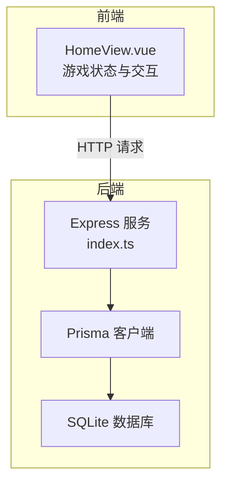
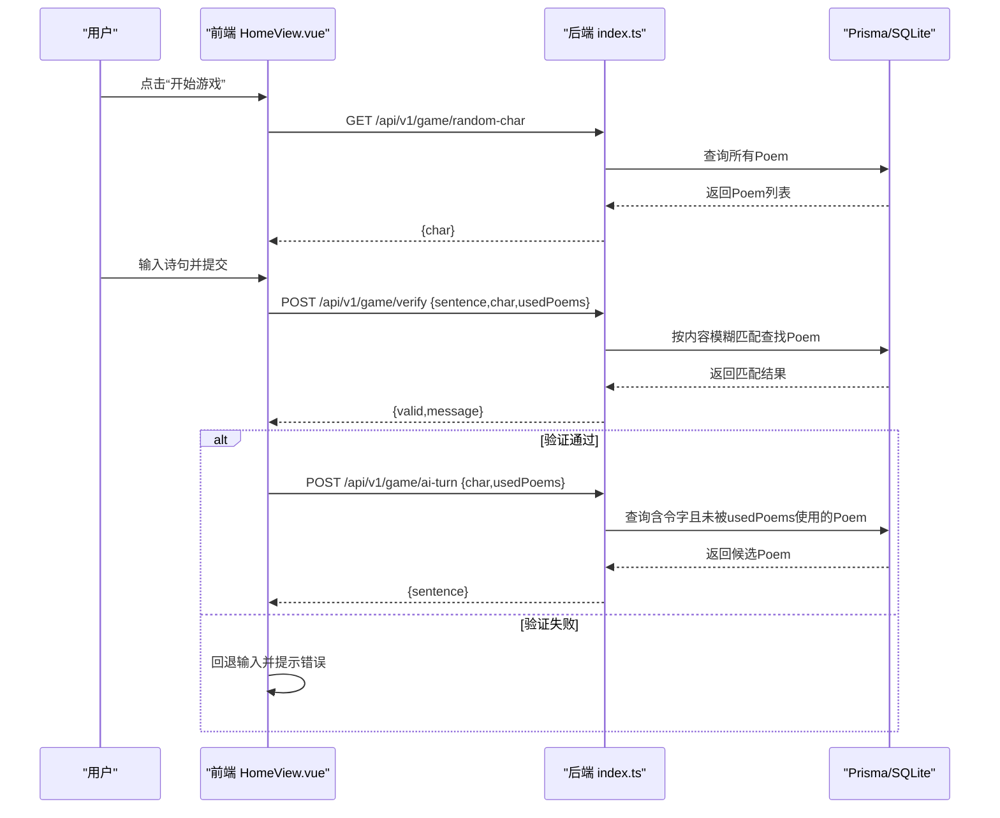
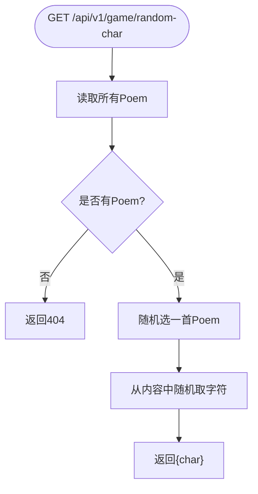
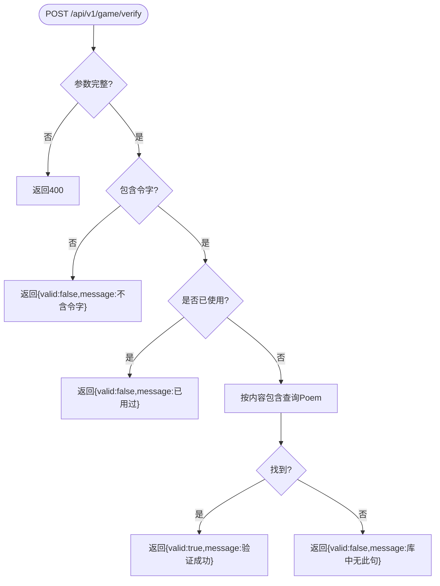
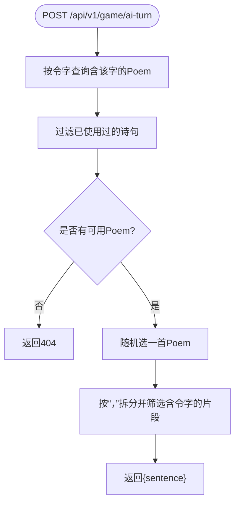
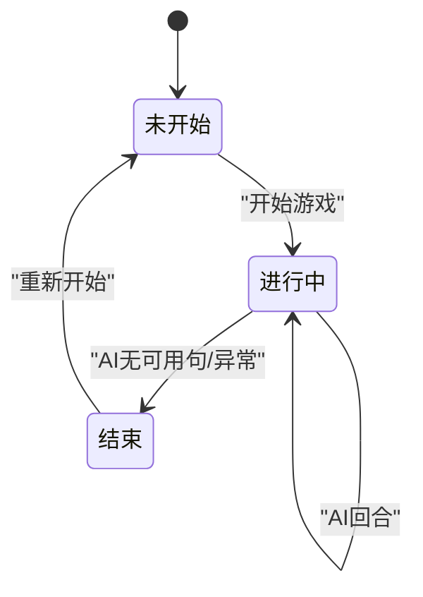
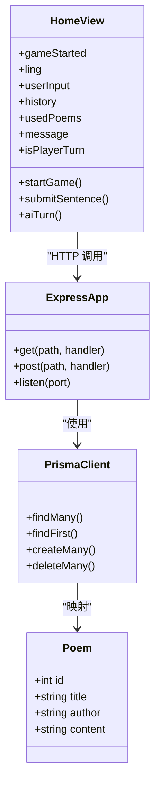

# 核心功能设计

<cite>
**本文引用的文件**
- [backend/src/index.ts](file://backend/src/index.ts)
- [backend/prisma/seed.ts](file://backend/prisma/seed.ts)
- [backend/prisma/migrations/20251104061144_init/migration.sql](file://backend/prisma/migrations/20251104061144_init/migration.sql)
- [frontend/src/views/HomeView.vue](file://frontend/src/views/HomeView.vue)
</cite>

## 目录
1. [引言](#引言)
2. [项目结构](#项目结构)
3. [核心组件](#核心组件)
4. [架构总览](#架构总览)
5. [详细组件分析](#详细组件分析)
6. [依赖关系分析](#依赖关系分析)
7. [性能考量](#性能考量)
8. [故障排查指南](#故障排查指南)
9. [结论](#结论)

## 引言
本文件系统化阐述飞花令游戏的核心功能实现机制，围绕以下关键点展开：
- 令字生成：后端从Poem表随机选取诗句并提取字符返回
- 诗句验证：检查用户输入是否包含令字、是否已在usedPoems中出现、是否存在于数据库
- AI出句算法：根据当前令字查询未使用的诗句并随机返回
- 防重复机制：通过前端usedPoems数组与后端验证逻辑协同工作
- 游戏状态机：开始、进行中、结束的管理方式
- 数据在客户端与服务器之间的流转及典型交互序列的时序图建议

## 项目结构
- 后端采用 Express + Prisma + SQLite 的轻量服务，提供三个核心接口：随机令字、诗句验证、AI回合
- 前端采用 Vue 3 单页应用，负责游戏状态管理、UI渲染与与后端的HTTP交互
- 数据库迁移脚本定义了 Poem 表结构，种子脚本初始化了若干经典诗句

图表来源
- [backend/src/index.ts](file://backend/src/index.ts#L1-L78)
- [frontend/src/views/HomeView.vue](file://frontend/src/views/HomeView.vue#L1-L118)

章节来源
- [backend/src/index.ts](file://backend/src/index.ts#L1-L78)
- [frontend/src/views/HomeView.vue](file://frontend/src/views/HomeView.vue#L1-L118)

## 核心组件
- 令字生成接口：随机选择一首诗，再从诗句内容中随机取一个字符作为令字
- 诗句验证接口：校验令字包含性、去重（usedPoems）、是否存在数据库
- AI回合接口：按令字检索未使用诗句，随机返回一句
- 前端游戏状态：开始、进行中、结束；玩家回合与AI回合切换；历史记录与提示信息

章节来源
- [backend/src/index.ts](file://backend/src/index.ts#L12-L48)
- [backend/src/index.ts](file://backend/src/index.ts#L50-L72)
- [frontend/src/views/HomeView.vue](file://frontend/src/views/HomeView.vue#L1-L118)

## 架构总览
后端以REST风格暴露三个API，前端通过fetch发起请求，双方通过JSON交换数据。数据库为SQLite，由Prisma管理迁移与访问。

图表来源
- [backend/src/index.ts](file://backend/src/index.ts#L12-L48)
- [backend/src/index.ts](file://backend/src/index.ts#L50-L72)
- [frontend/src/views/HomeView.vue](file://frontend/src/views/HomeView.vue#L1-L118)

## 详细组件分析

### 令字生成（后端）
- 逻辑要点
  - 从Poem表随机抽取一首诗
  - 从该诗内容中随机抽取一个字符作为令字
  - 若Poem表为空，返回404
- 复杂度
  - 查询所有Poem为O(n)，n为诗句数量
  - 字符随机选择为O(1)
- 错误处理
  - 空库时返回错误信息
- 性能影响
  - 当诗句数量较大时，可考虑缓存或索引优化

图表来源
- [backend/src/index.ts](file://backend/src/index.ts#L12-L21)

章节来源
- [backend/src/index.ts](file://backend/src/index.ts#L12-L21)

### 诗句验证（后端）
- 逻辑要点
  - 参数校验：缺少参数返回400
  - 包含性校验：若输入不含令字，返回false
  - 去重校验：若已出现在usedPoems，返回false
  - 存在性校验：按内容包含查询数据库，存在则true，否则false
- 复杂度
  - 内容包含查询为O(n)扫描
- 错误处理
  - 缺少参数返回错误
  - 未找到诗句返回false
- 性能影响
  - 可考虑对content建立全文索引或分词索引以提升查询效率

图表来源
- [backend/src/index.ts](file://backend/src/index.ts#L24-L48)

章节来源
- [backend/src/index.ts](file://backend/src/index.ts#L24-L48)

### AI出句算法（后端）
- 逻辑要点
  - 按令字在content中的包含条件查询所有候选Poem
  - 过滤掉已被usedPoems包含的诗句
  - 若无可选诗句，返回404
  - 随机选择一首Poem，拆分“，”后筛选包含令字的句子片段，返回首个或整首
- 复杂度
  - 查询候选Poem为O(n)，过滤为O(m)，m为候选数
- 错误处理
  - 无可选时返回404
- 性能影响
  - 可考虑对content建立索引，或预构建按字符分组的索引以加速查询

图表来源
- [backend/src/index.ts](file://backend/src/index.ts#L50-L72)

章节来源
- [backend/src/index.ts](file://backend/src/index.ts#L50-L72)

### 前端交互与状态机
- 游戏状态
  - 未开始：显示“开始游戏”按钮
  - 进行中：显示历史、输入框、提示信息；isPlayerTurn控制回合
  - 结束：当AI无法出句或发生异常时，gameStarted置为false
- 数据流转
  - startGame：调用后端随机令字，设置ling与message
  - submitSentence：调用后端验证，成功则推进AI回合
  - aiTurn：调用后端AI出句，更新历史与usedPoems，切换回合
- 防重复机制
  - 前端维护usedPoems数组，提交时随请求发送至后端
  - 后端在AI查询阶段同样过滤usedPoems，避免重复

图表来源
- [frontend/src/views/HomeView.vue](file://frontend/src/views/HomeView.vue#L1-L118)

章节来源
- [frontend/src/views/HomeView.vue](file://frontend/src/views/HomeView.vue#L1-L118)

## 依赖关系分析
- 后端依赖
  - Express：提供HTTP服务
  - Prisma：ORM与SQLite驱动
  - CORS：跨域支持
- 前端依赖
  - Vue 3：响应式状态与组件化
  - vue-router：路由（页面级导航）
- 数据模型
  - Poem：id、title、author、content
  - 种子数据：包含多首经典诗作，content为拼接后的诗句串

图表来源
- [backend/src/index.ts](file://backend/src/index.ts#L1-L78)
- [backend/prisma/migrations/20251104061144_init/migration.sql](file://backend/prisma/migrations/20251104061144_init/migration.sql#L1-L8)
- [backend/prisma/seed.ts](file://backend/prisma/seed.ts#L1-L53)
- [frontend/src/views/HomeView.vue](file://frontend/src/views/HomeView.vue#L1-L118)

章节来源
- [backend/src/index.ts](file://backend/src/index.ts#L1-L78)
- [backend/prisma/migrations/20251104061144_init/migration.sql](file://backend/prisma/migrations/20251104061144_init/migration.sql#L1-L8)
- [backend/prisma/seed.ts](file://backend/prisma/seed.ts#L1-L53)
- [frontend/src/views/HomeView.vue](file://frontend/src/views/HomeView.vue#L1-L118)

## 性能考量
- 查询复杂度
  - 令字生成：O(n)遍历Poem
  - 诗句验证：O(n)内容包含查询
  - AI出句：O(n)候选查询 + O(m)过滤
- 优化建议
  - 对content字段建立索引，或采用全文索引
  - 在AI阶段增加“按令字分组”的预索引，减少候选集
  - 前端usedPoems过大时，可在后端维护会话级去重集合
  - 对频繁请求进行节流与缓存（如令字短期缓存）

## 故障排查指南
- 常见问题
  - 无法获取令字：确认后端服务已启动，Poem表非空
  - 验证失败：检查输入是否包含令字、是否重复、是否存在于数据库
  - AI无可用句：usedPoems可能已占满可用诗句，或数据库中无含令字的诗句
- 排查步骤
  - 检查后端日志与返回码
  - 使用数据库工具查看Poem表内容
  - 前端检查fetch响应与错误提示
- 建议
  - 在验证失败时保留历史记录以便复盘
  - 对网络异常进行重试与降级提示

章节来源
- [backend/src/index.ts](file://backend/src/index.ts#L12-L72)
- [frontend/src/views/HomeView.vue](file://frontend/src/views/HomeView.vue#L1-L118)

## 结论
本项目以简洁的前后端分离架构实现了飞花令的核心玩法：令字生成、诗句验证、AI出句与防重复机制。通过Prisma与SQLite的组合，快速搭建了数据层；前端以Vue响应式状态管理游戏生命周期。后续可在索引优化、缓存策略与用户体验方面进一步增强。