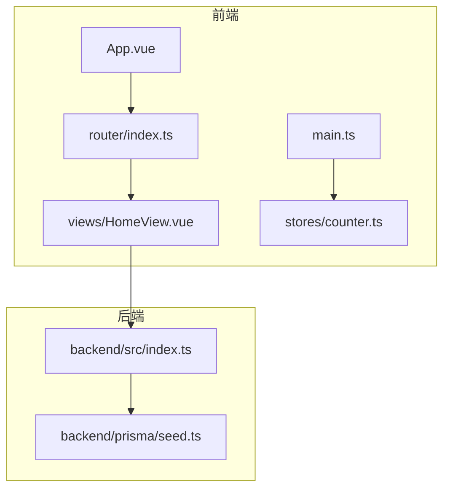
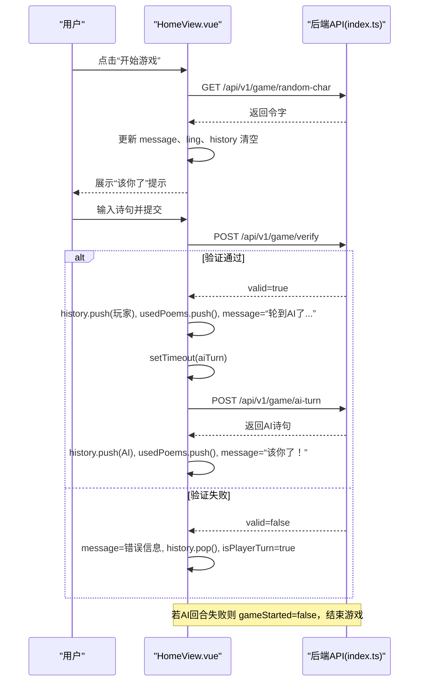
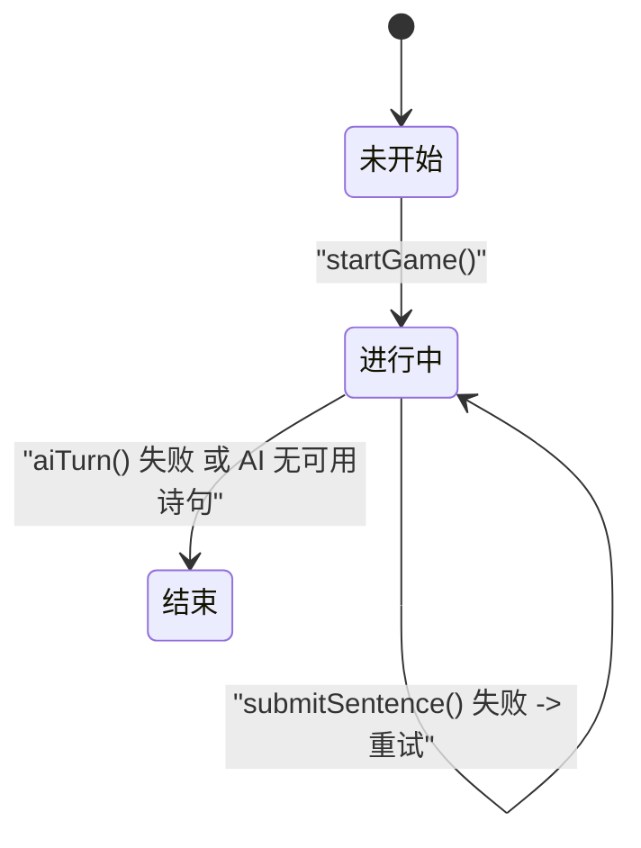
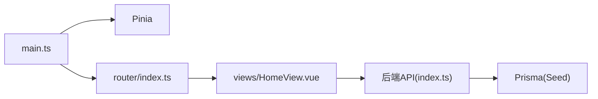
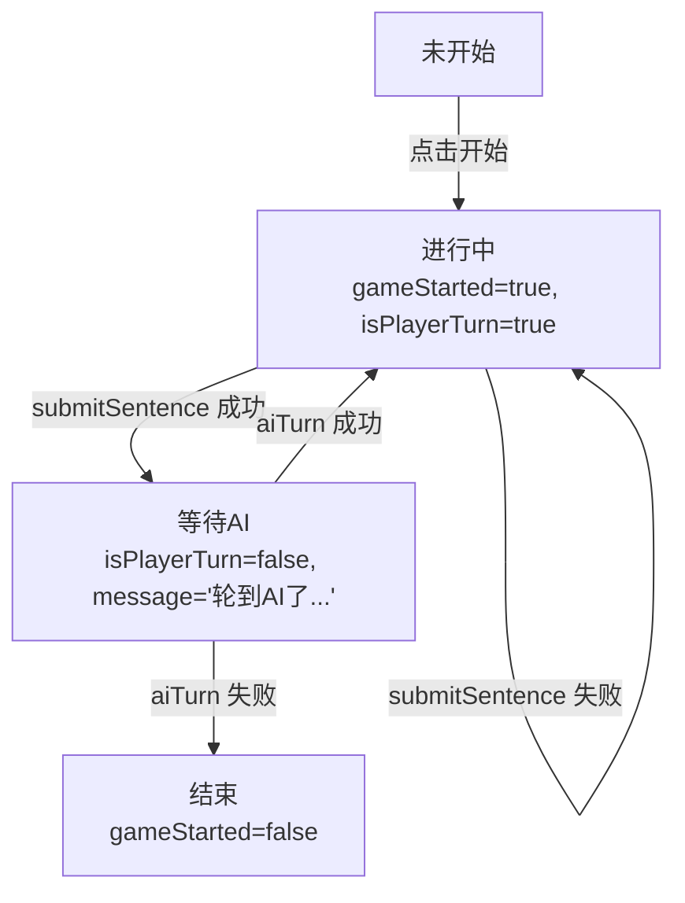

# 游戏状态管理

<cite>
**本文引用的文件**
- [HomeView.vue](file://frontend/src/views/HomeView.vue)
- [main.ts](file://frontend/src/main.ts)
- [router/index.ts](file://frontend/src/router/index.ts)
- [App.vue](file://frontend/src/App.vue)
- [counter.ts](file://frontend/src/stores/counter.ts)
- [index.ts](file://backend/src/index.ts)
- [seed.ts](file://backend/prisma/seed.ts)
- [README.md](file://frontend/README.md)
- [GEMINI.md](file://GEMINI.md)
</cite>

## 目录
1. [引言](#引言)
2. [项目结构](#项目结构)
3. [核心组件](#核心组件)
4. [架构总览](#架构总览)
5. [详细组件分析](#详细组件分析)
6. [依赖关系分析](#依赖关系分析)
7. [性能考量](#性能考量)
8. [故障排查指南](#故障排查指南)
9. [结论](#结论)
10. [附录](#附录)

## 引言
本文件围绕前端游戏“飞花令”的状态机实现展开，重点基于 HomeView.vue 中的响应式变量（gameStarted、isPlayerTurn、history 等）解释游戏的三种状态（未开始、进行中、结束）如何通过布尔标志与数组数据进行管理；并分析 startGame、submitSentence、aiTurn 三个核心函数如何驱动状态转换；同时结合 history 数组的 push/pop 操作说明交互历史的动态维护；最后阐述 message 提示信息如何反映当前游戏状态（如等待 AI 响应、验证失败等）。文末给出状态转换图与 Pinia 集中式状态管理的可行性建议。

## 项目结构
前端采用 Vue3 + TypeScript + Tailwind CSS 的技术栈，使用 Pinia 作为状态管理方案，路由通过 vue-router 管理页面切换。HomeView.vue 是游戏主界面，负责渲染游戏状态、处理用户输入与调用后端 API。

图表来源
- [App.vue](file://frontend/src/App.vue#L1-L19)
- [router/index.ts](file://frontend/src/router/index.ts#L1-L24)
- [HomeView.vue](file://frontend/src/views/HomeView.vue#L1-L118)
- [main.ts](file://frontend/src/main.ts#L1-L15)
- [counter.ts](file://frontend/src/stores/counter.ts#L1-L13)
- [index.ts](file://backend/src/index.ts#L1-L78)
- [seed.ts](file://backend/prisma/seed.ts#L1-L53)

章节来源
- [README.md](file://frontend/README.md#L1-L55)
- [GEMINI.md](file://GEMINI.md#L1-L21)

## 核心组件
- HomeView.vue：承载游戏状态机与 UI 逻辑，包含以下关键响应式变量：
  - gameStarted：控制是否进入游戏进行中状态
  - isPlayerTurn：控制玩家回合与输入禁用状态
  - history：记录交互历史（作者与文本）
  - usedPoems：记录已使用的诗句，用于验证与 AI 选择
  - message：提示信息，反映当前阶段（开始、等待、验证结果、结束）
  - ling：本轮令字
  - userInput：用户输入框内容
- 后端 index.ts：提供随机令字、验证诗句、AI 回合三项 API，支撑前端状态转换与提示信息

章节来源
- [HomeView.vue](file://frontend/src/views/HomeView.vue#L1-L118)
- [index.ts](file://backend/src/index.ts#L1-L78)

## 架构总览
前端通过 HomeView.vue 的响应式变量与事件绑定驱动状态机；后端提供三类 API，分别对应“获取令字”“验证诗句”“AI 回合”。UI 层根据返回结果更新 message、history、usedPoems 与 isPlayerTurn，从而完成状态转换。

图表来源
- [HomeView.vue](file://frontend/src/views/HomeView.vue#L14-L84)
- [index.ts](file://backend/src/index.ts#L12-L72)

## 详细组件分析

### 游戏状态与变量映射
- 未开始：gameStarted=false，显示“开始游戏”按钮，message 为空或提示“游戏开始...”
- 进行中：gameStarted=true，isPlayerTurn 控制输入框与按钮可用性；history 记录双方交互；message 反映当前阶段
- 结束：当 AI 回合失败或显式结束时，gameStarted=false，回到未开始状态

图表来源
- [HomeView.vue](file://frontend/src/views/HomeView.vue#L14-L84)
- [index.ts](file://backend/src/index.ts#L12-L72)

章节来源
- [HomeView.vue](file://frontend/src/views/HomeView.vue#L1-L118)

### 核心函数与状态转换

#### startGame()
- 功能：初始化游戏，清空历史与已用诗句，请求后端随机令字，更新 message 与 ling
- 关键点：
  - 设置 gameStarted=true
  - 清空 history 与 usedPoems
  - 发起 GET 请求获取令字，成功后更新 message 与 ling
  - 失败时设置 message 为错误信息

章节来源
- [HomeView.vue](file://frontend/src/views/HomeView.vue#L14-L30)
- [index.ts](file://backend/src/index.ts#L12-L21)

#### submitSentence()
- 功能：提交用户诗句，触发验证流程
- 关键点：
  - 校验输入与 isPlayerTurn，否则直接返回
  - 设置 isPlayerTurn=false，清空 message
  - 将本次输入推入 history
  - 发起 POST /api/v1/game/verify
    - 验证通过：将诗句加入 usedPoems，清空输入，message=“轮到AI了...”，延时调用 aiTurn
    - 验证失败：message=错误信息，history.pop() 回滚，isPlayerTurn=true
  - 异常：message=“请求失败，请检查网络”，isPlayerTurn=true

章节来源
- [HomeView.vue](file://frontend/src/views/HomeView.vue#L32-L62)
- [index.ts](file://backend/src/index.ts#L23-L48)

#### aiTurn()
- 功能：AI 回合，生成并返回一句包含令字的诗句
- 关键点：
  - 发起 POST /api/v1/game/ai-turn
  - 成功：将 AI 诗句推入 history 与 usedPoems，message=“该你了！”，isPlayerTurn=true
  - 失败：message=错误信息，gameStarted=false，结束游戏

章节来源
- [HomeView.vue](file://frontend/src/views/HomeView.vue#L64-L84)
- [index.ts](file://backend/src/index.ts#L50-L72)

### 交互历史与提示信息
- history 数组：
  - submitSentence 成功时 push 玩家输入
  - 验证失败时 pop 回滚
  - aiTurn 成功时 push AI 输出
- message：
  - startGame：提示“正在获取令字”“本轮的令字是 ...”
  - submitSentence：提示“不错！轮到AI了...”“无效的诗句”“请求失败，请检查网络”
  - aiTurn：提示“该你了！”或错误信息并结束游戏

章节来源
- [HomeView.vue](file://frontend/src/views/HomeView.vue#L14-L84)

### UI 与状态联动
- gameStarted 控制“开始游戏”按钮与游戏区域显示
- isPlayerTurn 控制输入框与按钮的禁用状态
- history 与 usedPoems 用于渲染历史与验证重复使用
- message 用于实时反馈当前阶段与错误信息

章节来源
- [HomeView.vue](file://frontend/src/views/HomeView.vue#L87-L118)

## 依赖关系分析
- 前端依赖：
  - Vue3 + TypeScript：组件与响应式系统
  - Pinia：全局状态管理（当前仅存在计数示例 store）
  - vue-router：页面路由
- 后端依赖：
  - Express：HTTP 服务
  - Prisma：数据库访问与种子数据
- 文件间关系：
  - main.ts 注册 Pinia 与路由
  - router/index.ts 将 HomeView 作为首页
  - HomeView.vue 通过 fetch 调用后端 API
  - index.ts 提供三类 API，seed.ts 初始化诗词数据

图表来源
- [main.ts](file://frontend/src/main.ts#L1-L15)
- [router/index.ts](file://frontend/src/router/index.ts#L1-L24)
- [HomeView.vue](file://frontend/src/views/HomeView.vue#L1-L118)
- [index.ts](file://backend/src/index.ts#L1-L78)
- [seed.ts](file://backend/prisma/seed.ts#L1-L53)

章节来源
- [main.ts](file://frontend/src/main.ts#L1-L15)
- [router/index.ts](file://frontend/src/router/index.ts#L1-L24)
- [HomeView.vue](file://frontend/src/views/HomeView.vue#L1-L118)
- [index.ts](file://backend/src/index.ts#L1-L78)
- [seed.ts](file://backend/prisma/seed.ts#L1-L53)

## 性能考量
- 网络请求：
  - 验证与 AI 回合均涉及网络请求，建议在 UI 上增加加载指示（如 spinner）以提升体验
- 历史渲染：
  - history 数组增长可能影响滚动性能，可考虑限制最大长度或虚拟化渲染
- 并发控制：
  - submitSentence 与 aiTurn 之间存在时间差，避免重复提交可通过 isPlayerTurn 与 message 状态协同控制
- 数据一致性：
  - usedPoems 与 history 应保持一致，避免出现“AI 已用但未出现在历史中”的情况（当前实现已保证）

[本节为通用建议，无需特定文件来源]

## 故障排查指南
- 无法获取令字：
  - 检查后端服务是否启动，确认 GET /api/v1/game/random-char 是否返回字符
  - 查看 message 是否显示“无法获取令字”
- 提交无效：
  - 检查输入是否包含令字、是否重复使用、是否存在于诗词库
  - message 会提示“诗句中不包含令字”“这句诗已经用过了”“诗词库中没有找到这句诗”
- AI 回合失败：
  - 当后端返回“AI也想不出来了”或 404，前端会结束游戏，message 显示相应提示
- 网络异常：
  - message 显示“请求失败，请检查网络”，可重试或检查本地网络

章节来源
- [HomeView.vue](file://frontend/src/views/HomeView.vue#L14-L84)
- [index.ts](file://backend/src/index.ts#L12-L72)

## 结论
本项目通过少量响应式变量与数组实现了清晰的游戏状态机：未开始、进行中、结束。startGame、submitSentence、aiTurn 三个函数分别承担初始化、验证与回合推进职责，history 与 usedPoems 协助维护交互历史与去重校验，message 则直观反映当前阶段与错误信息。若未来需要跨组件共享状态或复杂业务逻辑，引入 Pinia 进行集中管理将是一个自然演进方向。

[本节为总结，无需特定文件来源]

## 附录

### 状态转换图（代码级映射）

图表来源
- [HomeView.vue](file://frontend/src/views/HomeView.vue#L14-L84)
- [index.ts](file://backend/src/index.ts#L12-L72)

### Pinia 集中式状态管理建议
- 当前项目已安装并注册 Pinia，但尚未在 HomeView 中使用
- 建议将游戏状态（gameStarted、isPlayerTurn、history、usedPoems、ling、message）迁移到 Pinia Store，以便：
  - 在多视图场景下共享状态
  - 统一状态变更入口，便于调试与测试
  - 与路由/持久化策略集成（如持久化 store）
- 迁移步骤（概念性）：
  - 定义 store：定义上述字段与对应 action（如 startGame、submitSentence、aiTurn）
  - 组件内注入：useGameStore() 替换本地 ref
  - 同步 UI：模板中绑定 store 状态与调用 store actions
- 当前示例 store（计数）可作为迁移参考

章节来源
- [main.ts](file://frontend/src/main.ts#L1-L15)
- [counter.ts](file://frontend/src/stores/counter.ts#L1-L13)