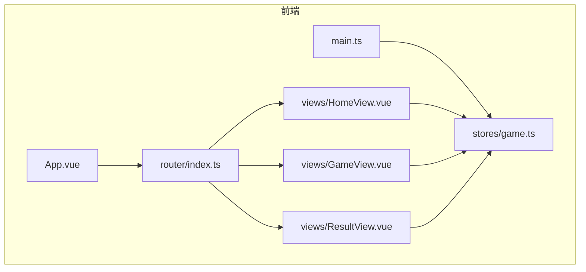
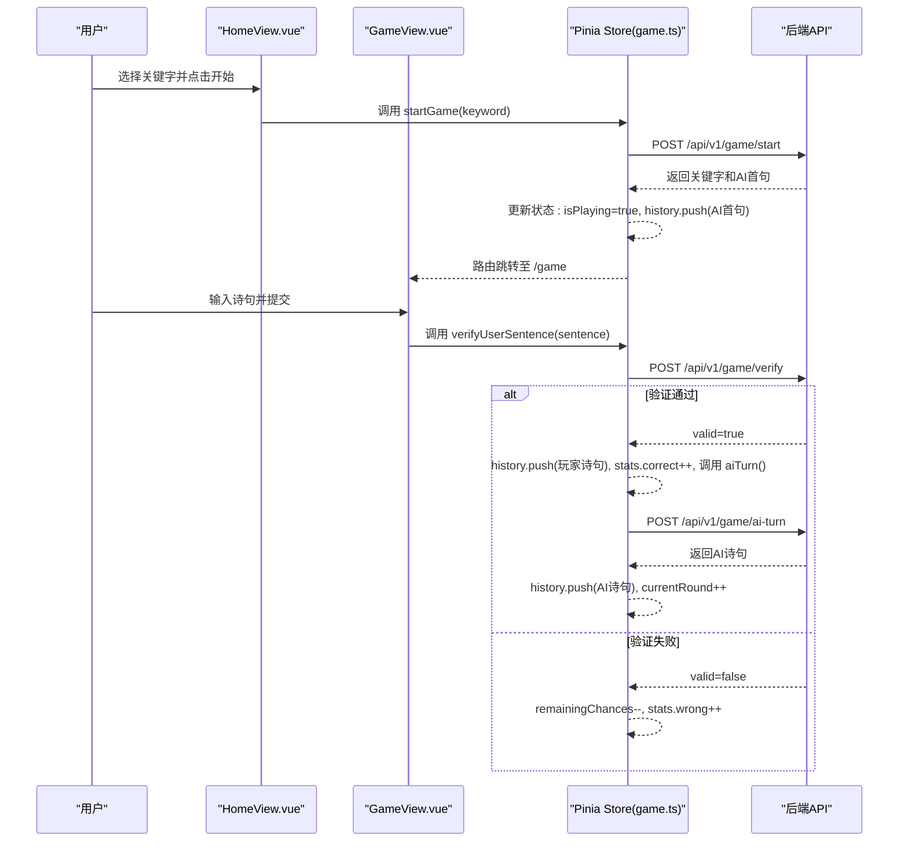
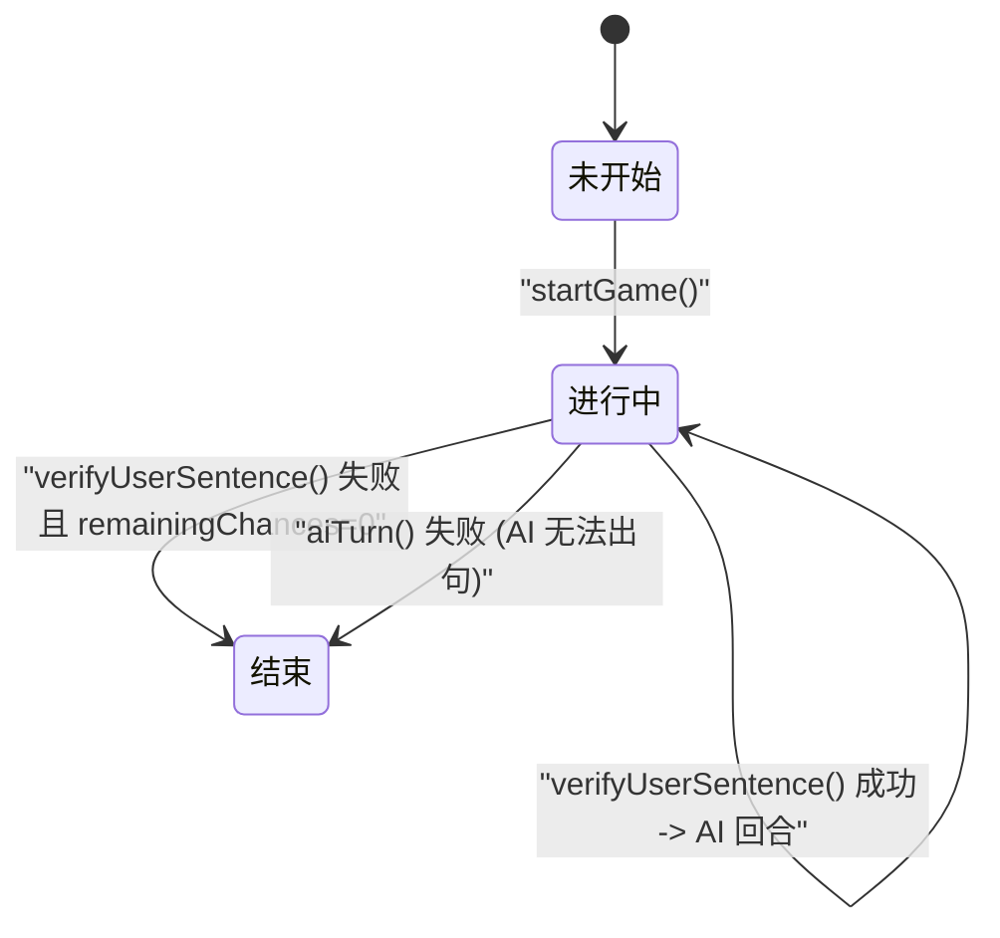
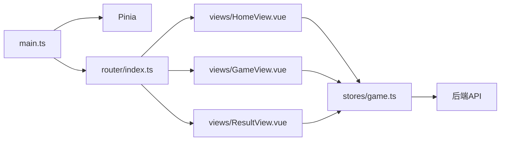

# 游戏状态管理

<cite>
**本文引用的文件**
- [HomeView.vue](file://frontend/src/views/HomeView.vue)
- [GameView.vue](file://frontend/src/views/GameView.vue)
- [ResultView.vue](file://frontend/src/views/ResultView.vue)
- [game.ts](file://frontend/src/stores/game.ts)
- [game.ts](file://frontend/src/types/game.ts)
- [router/index.ts](file://frontend/src/router/index.ts)
</cite>

## 目录
1. [引言](#引言)
2. [项目结构](#项目结构)
3. [核心组件](#核心组件)
4. [架构总览](#架构总览)
5. [详细组件分析](#详细组件分析)
6. [依赖关系分析](#依赖关系分析)
7. [性能考量](#性能考量)
8. [故障排查指南](#故障排查指南)
9. [结论](#结论)
10. [附录](#附录)

## 引言
本文档围绕前端游戏“飞花令”的状态机实现展开，重点阐述如何通过 Pinia store（game.ts）对游戏状态进行集中管理。基于 `useGameStore` 中定义的响应式状态（如 isPlaying、currentRound、history 等），解释游戏的三种状态（未开始、进行中、结束）如何通过布尔标志、计数器与数组数据进行管理；并分析 startGame、verifyUserSentence、aiTurn 三个核心 action 如何驱动状态转换；同时结合 history 数组的 push 操作说明交互历史的动态维护。最后阐述 UI 组件如何从 store 获取数据以反映当前游戏状态（如回合信息、剩余机会、统计信息等）。文末更新了状态转换图以准确反映当前流程。

## 项目结构
前端采用 Vue3 + TypeScript + Tailwind CSS 的技术栈，使用 Pinia 作为状态管理方案，路由通过 vue-router 管理页面切换。游戏状态已从 HomeView.vue 迁移至 Pinia store（game.ts），实现了状态的集中化管理。HomeView.vue 负责选择关键字并启动游戏，GameView.vue 负责渲染游戏过程，ResultView.vue 负责展示游戏结果。



图表来源
- [App.vue](file://frontend/src/App.vue#L1-L19)
- [router/index.ts](file://frontend/src/router/index.ts#L1-L25)
- [HomeView.vue](file://frontend/src/views/HomeView.vue#L1-L69)
- [GameView.vue](file://frontend/src/views/GameView.vue#L1-L156)
- [ResultView.vue](file://frontend/src/views/ResultView.vue#L1-L118)
- [game.ts](file://frontend/src/stores/game.ts#L1-L220)

章节来源
- [README.md](file://frontend/README.md#L1-L55)
- [GEMINI.md](file://GEMINI.md#L1-L21)

## 核心组件
- game.ts：游戏状态的 Pinia store，集中管理所有游戏状态，包含以下关键状态：
  - keyword：本轮关键字
  - isPlaying：控制游戏是否处于进行中状态
  - currentRound：当前回合数
  - remainingChances：玩家剩余挑战机会
  - history：记录交互历史（包含回合、说话者、诗句、标题、作者）
  - usedPoems：记录已使用的诗句，用于验证
  - stats：游戏统计数据（答对、答错、提示次数、开始时间等）
  - currentHintLevel：当前提示级别
- HomeView.vue：游戏起始界面，用户选择关键字后调用 store 的 startGame action。
- GameView.vue：游戏主界面，从 store 获取状态并渲染，调用 store 的 verifyUserSentence、getHint、skipRound 等 action。
- ResultView.vue：游戏结果界面，从 store 获取最终状态和统计数据进行展示。

章节来源
- [game.ts](file://frontend/src/stores/game.ts#L7-L35)
- [HomeView.vue](file://frontend/src/views/HomeView.vue#L12-L24)
- [GameView.vue](file://frontend/src/views/GameView.vue#L10-L156)
- [ResultView.vue](file://frontend/src/views/ResultView.vue#L7-L118)

## 架构总览
前端通过 Pinia store (game.ts) 集中管理游戏状态。UI 组件（HomeView, GameView, ResultView）通过 `useGameStore()` 注入 store 实例，订阅状态变化并调用 action。后端提供三类 API，分别对应“开始游戏”“验证诗句”“AI 回合”“获取提示”。UI 层根据 store 状态自动更新，从而完成状态转换。



图表来源
- [game.ts](file://frontend/src/stores/game.ts#L34-L170)
- [HomeView.vue](file://frontend/src/views/HomeView.vue#L12-L24)
- [GameView.vue](file://frontend/src/views/GameView.vue#L23-L47)

## 详细组件分析

### 游戏状态与变量映射
- 未开始：isPlaying=false，显示 HomeView，用户可选择关键字。
- 进行中：isPlaying=true，显示 GameView，根据 currentRound、remainingChances 和 history 渲染游戏状态。
- 结束：isPlaying=false，显示 ResultView，展示最终统计数据。



图表来源
- [game.ts](file://frontend/src/stores/game.ts#L34-L204)
- [GameView.vue](file://frontend/src/views/GameView.vue#L14-L156)

章节来源
- [game.ts](file://frontend/src/stores/game.ts#L7-L35)

### 核心函数与状态转换

#### startGame()
- 功能：初始化游戏，请求后端获取关键字和AI首句。
- 关键点：
  - 发起 POST /api/v1/game/start 请求
  - 成功后：设置 isPlaying=true, keyword, currentRound=1, 重置 remainingChances 和 history，并将AI首句加入 history
  - 失败时抛出错误

章节来源
- [game.ts](file://frontend/src/stores/game.ts#L34-L80)
- [HomeView.vue](file://frontend/src/views/HomeView.vue#L12-L24)

#### verifyUserSentence()
- 功能：验证用户提交的诗句。
- 关键点：
  - 发起 POST /api/v1/game/verify 请求
  - 验证通过：将玩家诗句加入 history，correct 和 totalRounds 统计加一，重置 remainingChances，然后调用 aiTurn()
  - 验证失败：remainingChances 减一，wrong 统计加一，若 remainingChances <= 0 则调用 endGame() 结束游戏

章节来源
- [game.ts](file://frontend/src/stores/game.ts#L83-L127)
- [GameView.vue](file://frontend/src/views/GameView.vue#L23-L47)

#### aiTurn()
- 功能：AI 回合，生成并返回一句包含关键字的诗句。
- 关键点：
  - 发起 POST /api/v1/game/ai-turn 请求
  - 成功：currentRound 加一，将AI诗句加入 history
  - 失败：调用 endGame(true) 结束游戏，playerWin=true 表示玩家获胜

章节来源
- [game.ts](file://frontend/src/stores/game.ts#L135-L170)
- [GameView.vue](file://frontend/src/views/GameView.vue#L23-L47)

### 交互历史与提示信息
- history 数组：
  - startGame 成功时 push AI 首句
  - verifyUserSentence 成功时 push 玩家诗句
  - aiTurn 成功时 push AI 诗句
- UI 提示信息：
  - 通过 currentRound、remainingChances、stats 等状态在 GameView 和 ResultView 中动态渲染，如回合数、剩余机会、答对/答错统计、游戏时长等。

章节来源
- [game.ts](file://frontend/src/stores/game.ts#L65-L163)
- [GameView.vue](file://frontend/src/views/GameView.vue#L78-L143)
- [ResultView.vue](file://frontend/src/views/ResultView.vue#L52-L76)

### UI 与状态联动
- isPlaying 控制显示 HomeView、GameView 还是 ResultView
- currentRound、keyword、remainingChances 在 GameView 顶部状态栏实时显示
- stats 统计数据在 GameView 和 ResultView 中展示
- history 数组用于在 ResultView 中渲染完整的对战记录

章节来源
- [GameView.vue](file://frontend/src/views/GameView.vue#L78-L155)
- [ResultView.vue](file://frontend/src/views/ResultView.vue#L52-L117)

## 依赖关系分析
- 前端依赖：
  - Vue3 + TypeScript：组件与响应式系统
  - Pinia：全局状态管理
  - vue-router：页面路由
- 后端依赖：
  - Express：HTTP 服务
  - Prisma：数据库访问与种子数据
- 文件间关系：
  - main.ts 注册 Pinia 与路由
  - router/index.ts 定义路由，将 HomeView、GameView、ResultView 分别映射到 /、/game、/result
  - HomeView/GameView/ResultView 通过 useGameStore() 使用 store
  - store (game.ts) 通过 fetch 调用后端 API
  - 后端 API 提供游戏逻辑支持



图表来源
- [main.ts](file://frontend/src/main.ts#L1-L15)
- [router/index.ts](file://frontend/src/router/index.ts#L1-L25)
- [HomeView.vue](file://frontend/src/views/HomeView.vue#L1-L69)
- [GameView.vue](file://frontend/src/views/GameView.vue#L1-L156)
- [ResultView.vue](file://frontend/src/views/ResultView.vue#L1-L118)
- [game.ts](file://frontend/src/stores/game.ts#L1-L220)

章节来源
- [main.ts](file://frontend/src/main.ts#L1-L15)
- [router/index.ts](file://frontend/src/router/index.ts#L1-L25)
- [game.ts](file://frontend/src/stores/game.ts#L1-L220)

## 性能考量
- 网络请求：
  - 所有游戏操作均涉及网络请求，建议在 UI 上增加加载指示（如 spinner）以提升体验
- 历史渲染：
  - history 数组增长可能影响滚动性能，可考虑限制最大长度或虚拟化渲染
- 数据一致性：
  - 由于状态集中管理，避免了组件间状态不一致的问题，保证了数据的一致性
- 状态持久化：
  - 可考虑将 store 状态持久化（如使用 pinia-plugin-persistedstate），防止页面刷新导致游戏进度丢失

[本节为通用建议，无需特定文件来源]

## 故障排查指南
- 无法开始游戏：
  - 检查后端服务是否启动，确认 POST /api/v1/game/start 是否返回数据
  - 查看 HomeView 是否显示错误信息
- 提交诗句无效：
  - 检查输入是否包含关键字、是否重复使用、是否存在于诗词库
  - GameView 会通过 InputPanel 显示具体错误信息
- AI 回合失败：
  - 当后端返回 404 或错误，store 会调用 endGame(true)，玩家获胜
- 网络异常：
  - 所有 API 调用均有错误捕获，相关 action 会抛出错误，由 UI 组件处理并提示

章节来源
- [game.ts](file://frontend/src/stores/game.ts#L34-L218)
- [GameView.vue](file://frontend/src/views/GameView.vue#L23-L47)

## 结论
本项目已成功将游戏状态从分散的组件中迁移至 Pinia store (game.ts) 进行集中管理。通过定义清晰的 GameState 接口和 actions，实现了状态的统一维护和变更。startGame、verifyUserSentence、aiTurn 等 action 分别承担初始化、验证与回合推进职责，history 与 usedPoems 协助维护交互历史与去重校验，stats 提供了全面的游戏数据统计。这种集中式状态管理提升了代码的可维护性、可测试性和可扩展性，为未来添加新功能（如成就系统、排行榜）奠定了良好基础。

[本节为总结，无需特定文件来源]

## 附录

### 状态转换图（代码级映射）
```mermaid
flowchart TD
S["未开始<br/>isPlaying=false"] --> |startGame()| G["进行中<br/>isPlaying=true"]
G --> |verifyUserSentence 成功| A["AI 回合<br/>调用 aiTurn()"]
A --> |aiTurn 成功| G
A --> |aiTurn 失败| E["结束<br/>endGame(true)"]
G --> |verifyUserSentence 失败| R["剩余机会-1"]
R --> |remainingChances > 0| G
R --> |remainingChances = 0| E
```

图表来源
- [game.ts](file://frontend/src/stores/game.ts#L34-L204)

### Pinia 集中式状态管理实现
- 已将游戏状态从 HomeView.vue 迁移至 Pinia Store (game.ts)
- 定义了 GameState 接口，包含所有游戏状态字段
- 通过 actions (startGame, verifyUserSentence, aiTurn, endGame 等) 统一管理状态变更
- 在 HomeView、GameView、ResultView 中通过 useGameStore() 注入并使用 store
- 实现了状态的集中化、可预测和可调试

章节来源
- [game.ts](file://frontend/src/stores/game.ts#L6-L218)
- [HomeView.vue](file://frontend/src/views/HomeView.vue#L8)
- [GameView.vue](file://frontend/src/views/GameView.vue#L10)
- [ResultView.vue](file://frontend/src/views/ResultView.vue#L7)