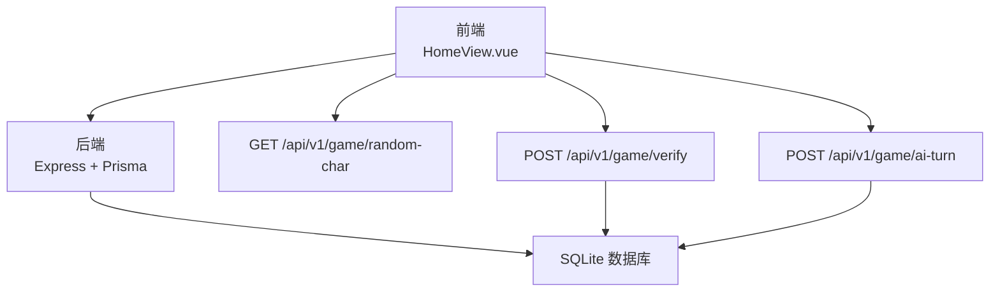
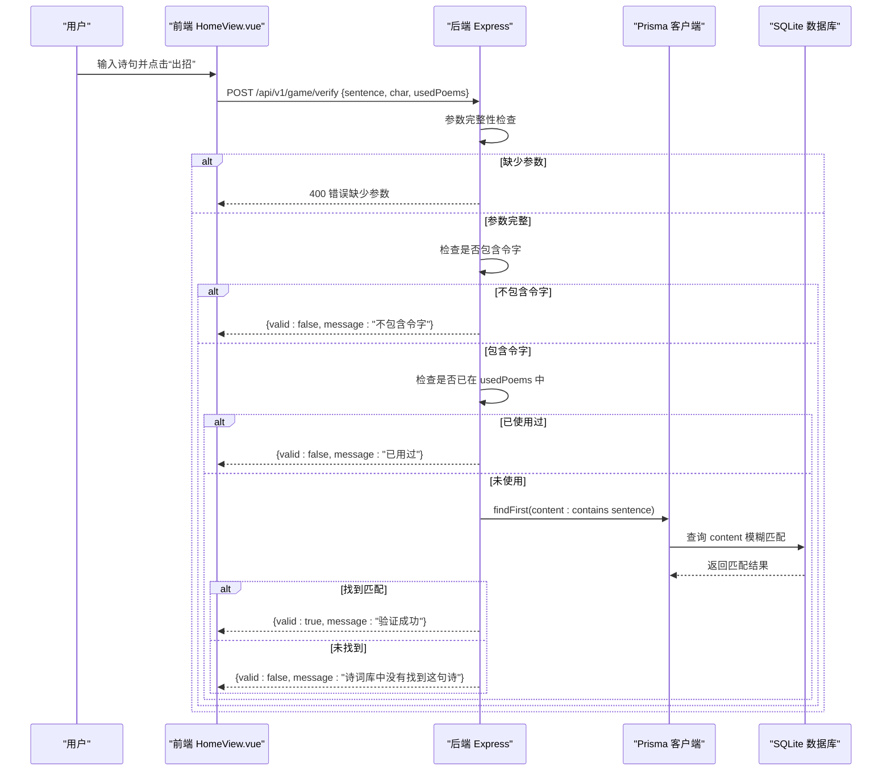
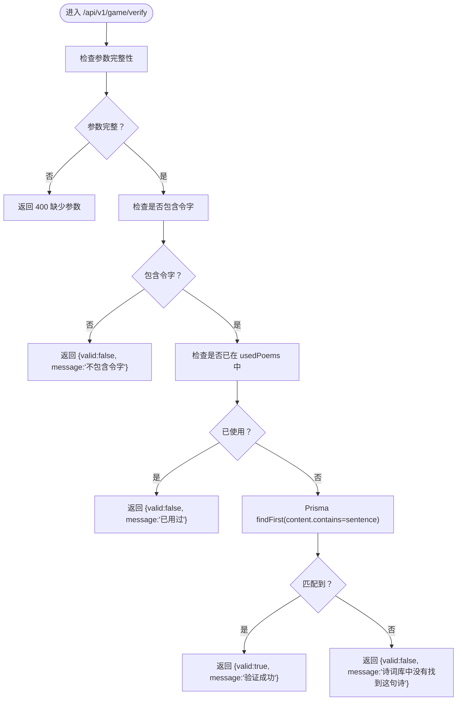
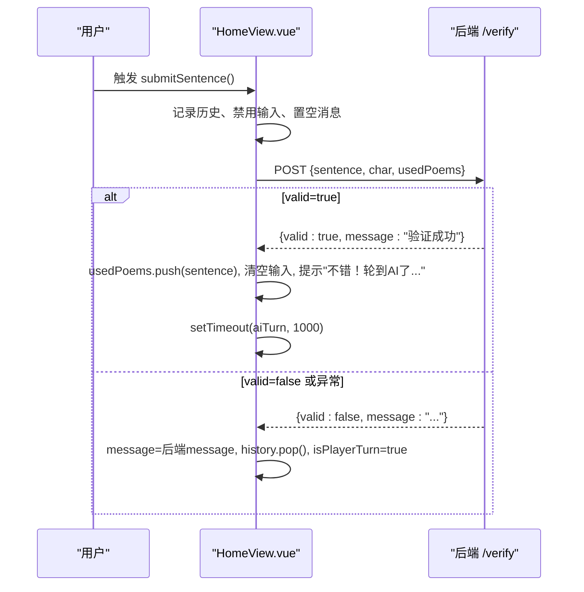
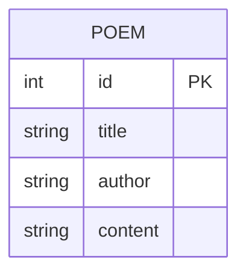
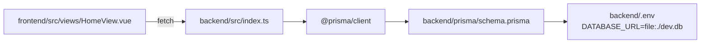

# 用户诗句验证机制

<cite>
**本文引用的文件**
- [backend/src/index.ts](file://backend/src/index.ts)
- [frontend/src/views/HomeView.vue](file://frontend/src/views/HomeView.vue)
- [backend/prisma/schema.prisma](file://backend/prisma/schema.prisma)
- [backend/prisma/seed.ts](file://backend/prisma/seed.ts)
- [backend/package.json](file://backend/package.json)
- [backend/.env](file://backend/.env)
</cite>

## 目录
1. [简介](#简介)
2. [项目结构](#项目结构)
3. [核心组件](#核心组件)
4. [架构总览](#架构总览)
5. [详细组件分析](#详细组件分析)
6. [依赖关系分析](#依赖关系分析)
7. [性能考量](#性能考量)
8. [故障排查指南](#故障排查指南)
9. [结论](#结论)
10. [附录](#附录)

## 简介
本文件围绕 POST /api/v1/game/verify 接口的验证流程进行深入解析，系统性说明后端如何依次执行以下校验：
1) 参数完整性检查；
2) 诗句是否包含指定令字；
3) 是否已在 usedPoems 列表中重复使用；
4) 是否存在于数据库诗词库中（通过 Prisma findFirst 对 content 字段进行模糊匹配）。

同时，结合前端 HomeView.vue 的 submitSentence 函数，展示前端如何构造请求体、处理不同验证结果（成功推进 AI 回合，失败则提示原因并回滚历史记录），并给出请求/响应示例与用户体验反馈机制分析，最后讨论可能的误判场景与改进建议。

## 项目结构
后端采用 Express + Prisma + SQLite 架构，前端为 Vue 单页应用。关键目录与职责如下：
- backend/src/index.ts：后端服务入口，定义 /api/v1/game/* 接口（含 verify、random-char、ai-turn）
- backend/prisma/schema.prisma：数据库模型定义（Poem 模型）
- backend/prisma/seed.ts：种子数据脚本，将多首诗词写入数据库
- frontend/src/views/HomeView.vue：前端游戏界面与交互逻辑（包含 submitSentence）

图表来源
- [backend/src/index.ts](file://backend/src/index.ts#L1-L78)
- [frontend/src/views/HomeView.vue](file://frontend/src/views/HomeView.vue#L1-L118)
- [backend/prisma/schema.prisma](file://backend/prisma/schema.prisma#L1-L19)

章节来源
- [backend/src/index.ts](file://backend/src/index.ts#L1-L78)
- [frontend/src/views/HomeView.vue](file://frontend/src/views/HomeView.vue#L1-L118)
- [backend/prisma/schema.prisma](file://backend/prisma/schema.prisma#L1-L19)

## 核心组件
- 后端接口层：负责接收请求、参数校验、调用 Prisma 查询、返回统一格式的 JSON 响应。
- 前端视图层：负责渲染游戏状态、收集用户输入、发起请求、根据响应更新 UI 并回滚无效操作。
- 数据层：SQLite + Prisma，Poem 模型包含 id、title、author、content 字段。

章节来源
- [backend/src/index.ts](file://backend/src/index.ts#L1-L78)
- [frontend/src/views/HomeView.vue](file://frontend/src/views/HomeView.vue#L1-L118)
- [backend/prisma/schema.prisma](file://backend/prisma/schema.prisma#L1-L19)

## 架构总览
下图展示了从用户提交诗句到验证完成的整体流程，以及前后端交互的关键点。

图表来源
- [backend/src/index.ts](file://backend/src/index.ts#L23-L48)
- [frontend/src/views/HomeView.vue](file://frontend/src/views/HomeView.vue#L32-L62)

## 详细组件分析

### 后端接口：POST /api/v1/game/verify 的验证逻辑
后端在 /api/v1/game/verify 中按顺序执行四步校验，每一步都返回明确的 JSON 结果，便于前端做一致化的错误提示与回滚。

- 参数完整性检查
  - 若缺少 sentence 或 char，直接返回 400 并提示“缺少参数”。
- 令字包含检查
  - 若 sentence 不包含 char，返回 {valid:false, message:"诗句中不包含令字"}。
- 重复使用检查
  - 若 usedPoems 中已包含该 sentence，返回 {valid:false, message:"这句诗已经用过了"}。
- 数据库匹配检查
  - 使用 Prisma findFirst 对 content 字段进行“包含”匹配。若匹配成功，返回 {valid:true, message:"验证成功"}；否则返回 {valid:false, message:"诗词库中没有找到这句诗"}。

图表来源
- [backend/src/index.ts](file://backend/src/index.ts#L23-L48)

章节来源
- [backend/src/index.ts](file://backend/src/index.ts#L23-L48)

### 前端：HomeView.vue 的 submitSentence 行为
前端在用户点击“出招”或按回车键时触发 submitSentence，其行为要点如下：
- 构造请求体：包含 sentence（去除首尾空白）、char（当前轮次令字）、usedPoems（历史使用的诗句集合）。
- 成功分支：将该句加入 usedPoems，清空输入框，显示提示“不错！轮到AI了...”，延时后调用 AI 回合。
- 失败分支：显示后端返回的 message，回滚历史记录（移除最近一次无效输入），并将 isPlayerTurn 置回 true，允许再次出招。
- 异常分支：网络错误时提示“请求失败，请检查网络”，并恢复可交互状态。

图表来源
- [frontend/src/views/HomeView.vue](file://frontend/src/views/HomeView.vue#L32-L62)
- [backend/src/index.ts](file://backend/src/index.ts#L23-L48)

章节来源
- [frontend/src/views/HomeView.vue](file://frontend/src/views/HomeView.vue#L32-L62)

### 数据模型与种子数据
- 数据模型：Poem 模型包含 id、title、author、content 字段，content 存储完整诗句内容。
- 种子数据：seed.ts 将多首诗词转换为 content 字符串并批量写入数据库，供后续 verify 与 AI 回合使用。

图表来源
- [backend/prisma/schema.prisma](file://backend/prisma/schema.prisma#L13-L18)
- [backend/prisma/seed.ts](file://backend/prisma/seed.ts#L1-L53)

章节来源
- [backend/prisma/schema.prisma](file://backend/prisma/schema.prisma#L1-L19)
- [backend/prisma/seed.ts](file://backend/prisma/seed.ts#L1-L53)

## 依赖关系分析
- 后端依赖
  - Express：提供 HTTP 服务与路由
  - Prisma Client：数据库访问抽象
  - SQLite：本地存储（由 DATABASE_URL 指定）
- 前端依赖
  - Vue：组件化 UI 与状态管理
  - 浏览器 fetch：与后端 API 通信

图表来源
- [frontend/src/views/HomeView.vue](file://frontend/src/views/HomeView.vue#L1-L118)
- [backend/src/index.ts](file://backend/src/index.ts#L1-L78)
- [backend/prisma/schema.prisma](file://backend/prisma/schema.prisma#L1-L19)
- [backend/.env](file://backend/.env#L1-L1)

章节来源
- [backend/package.json](file://backend/package.json#L1-L30)
- [backend/.env](file://backend/.env#L1-L1)

## 性能考量
- 模糊匹配复杂度
  - findFirst(content: contains sentence) 在 content 上进行字符串包含匹配，属于线性扫描。若诗词库较大，建议：
    - 在 content 上建立索引（如全文索引或前缀索引）以降低查询成本；
    - 限制 sentence 的最大长度，避免过长子串导致的全表扫描；
    - 对高频查询进行缓存（如命中率高的诗句可缓存结果）。
- 并发与一致性
  - verify 与 ai-turn 可并发调用，但 verify 会读取 usedPoems 作为去重依据。建议：
    - 在 verify 内部对 usedPoems 进行幂等校验；
    - 若需要更强一致性，可在事务中执行 verify 与更新 usedPoems 的原子操作（需评估 Prisma 支持情况）。
- 前端体验
  - 提交后立即禁用输入，避免重复提交；
  - 成功后延迟触发 AI 回合，提升节奏感。

[本节为通用性能建议，不直接分析具体文件，故无章节来源]

## 故障排查指南
- 常见错误与定位
  - 缺少参数：后端返回 400，前端显示“缺少参数”。检查前端是否正确传入 sentence、char、usedPoems。
  - 不包含令字：后端返回 {valid:false, message:"不包含令字"}。确认当前轮次令字 ling 是否正确获取。
  - 已用过：后端返回 {valid:false, message:"这句诗已经用过了"}。检查 usedPoems 是否同步更新。
  - 未找到诗句：后端返回 {valid:false, message:"诗词库中没有找到这句诗"}。确认 content 是否包含完整句子，或数据库是否已导入种子数据。
  - 网络异常：前端捕获异常并提示“请求失败，请检查网络”。检查后端服务是否启动、端口是否正确、跨域是否允许。
- 数据库问题
  - 若诗词库为空，/api/v1/game/random-char 会返回 404。可通过 seed 脚本初始化数据。
  - 确认 DATABASE_URL 指向正确的 SQLite 文件路径。

章节来源
- [backend/src/index.ts](file://backend/src/index.ts#L12-L21)
- [frontend/src/views/HomeView.vue](file://frontend/src/views/HomeView.vue#L32-L62)
- [backend/.env](file://backend/.env#L1-L1)

## 结论
POST /api/v1/game/verify 的验证逻辑清晰、分层明确：参数校验、令字检查、重复检测、数据库匹配。前端通过 submitSentence 统一处理成功与失败分支，具备良好的用户体验反馈与回滚机制。为进一步提升稳定性与性能，建议优化数据库查询与索引策略，并在必要时引入缓存与事务保障。

[本节为总结性内容，不直接分析具体文件，故无章节来源]

## 附录

### 请求/响应示例
- 请求体（POST /api/v1/game/verify）
  - Content-Type: application/json
  - 示例字段：sentence、char、usedPoems
- 成功响应
  - { valid: true, message: "验证成功" }
- 失败响应（示例）
  - { valid: false, message: "诗句中不包含令字" }
  - { valid: false, message: "这句诗已经用过了" }
  - { valid: false, message: "诗词库中没有找到这句诗" }

章节来源
- [backend/src/index.ts](file://backend/src/index.ts#L23-L48)
- [frontend/src/views/HomeView.vue](file://frontend/src/views/HomeView.vue#L32-L62)

### 误判场景与改进建议
- 场景一：sentence 仅为令字本身或极短片段
  - 现状：verify 仅检查包含关系，未限定长度或完整性，可能导致误判。
  - 建议：增加最小长度校验、要求包含完整句式（如包含逗号分隔的完整句子片段）。
- 场景二：content 中存在多个相同子串，findFirst 返回首个匹配
  - 现状：findFirst 返回首个匹配，可能与预期不符。
  - 建议：在 verify 中优先选择最长匹配或最贴近完整诗句的匹配项；或在入库时规范化 content，减少歧义。
- 场景三：usedPoems 未实时同步
  - 现状：verify 依赖前端传入的 usedPoems，若前端未及时更新，可能出现重复使用。
  - 建议：在 verify 内部再次校验数据库中是否已有该诗句；或在 AI 回合后统一更新 usedPoems。
- 场景四：网络抖动导致重复提交
  - 现状：前端已禁用输入，但仍可能出现重复提交。
  - 建议：在前端增加防抖与幂等标识（如 UUID），后端基于幂等键去重。

[本节为通用改进建议，不直接分析具体文件，故无章节来源]