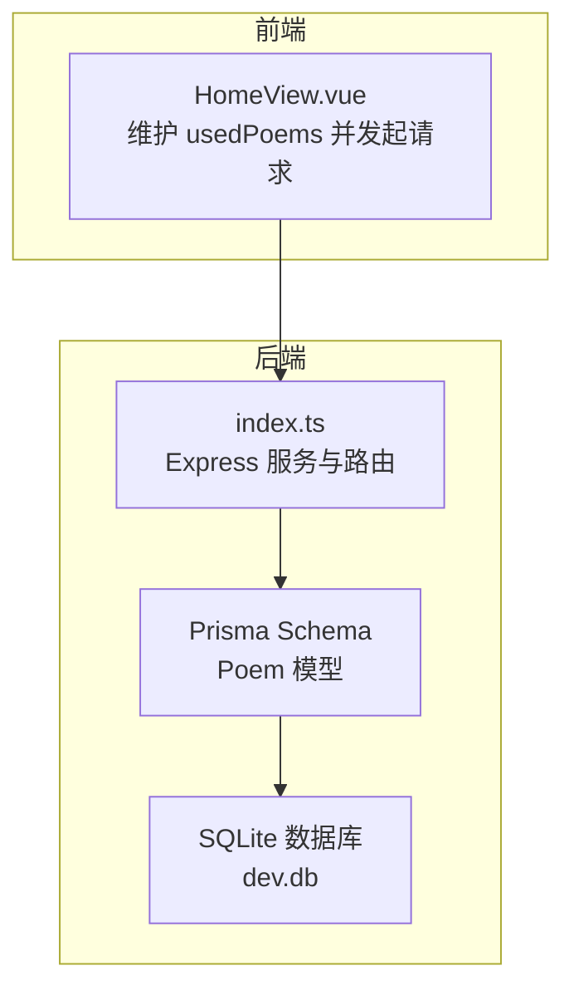
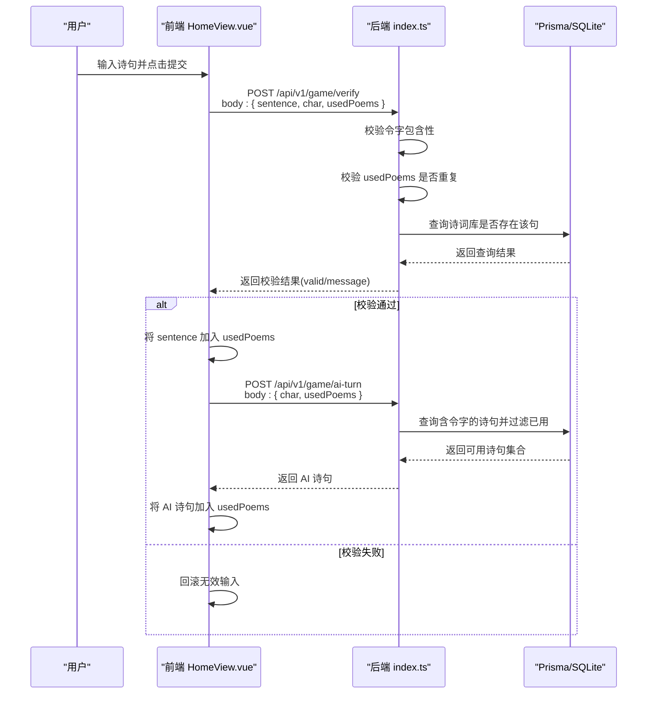
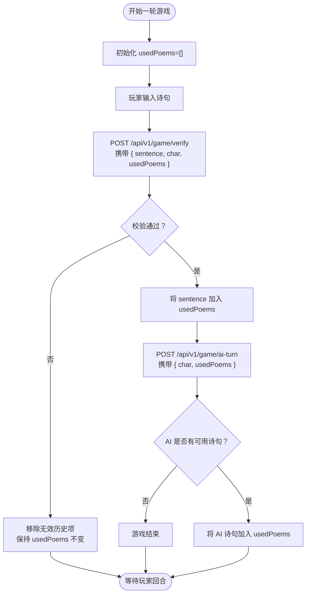
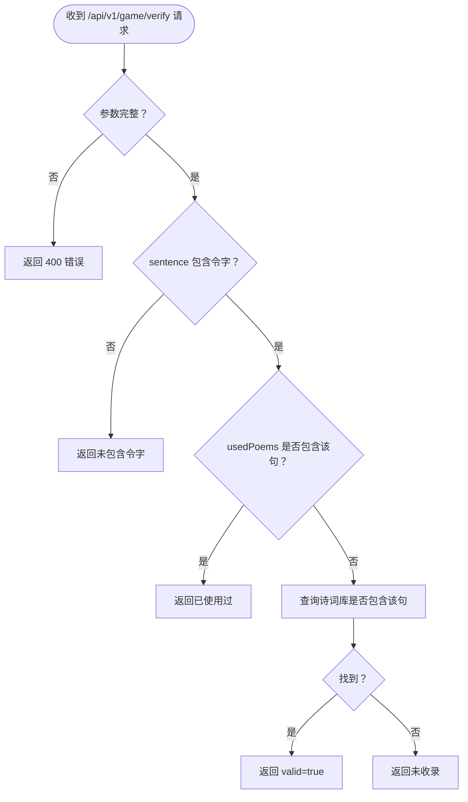
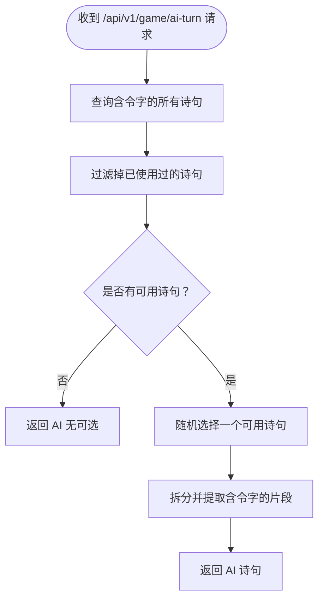
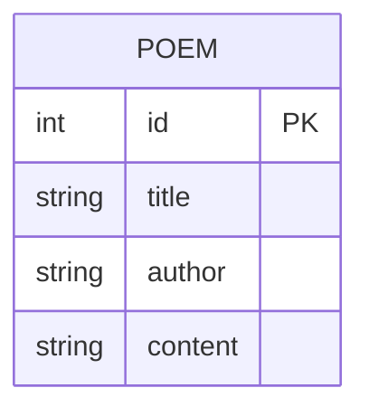
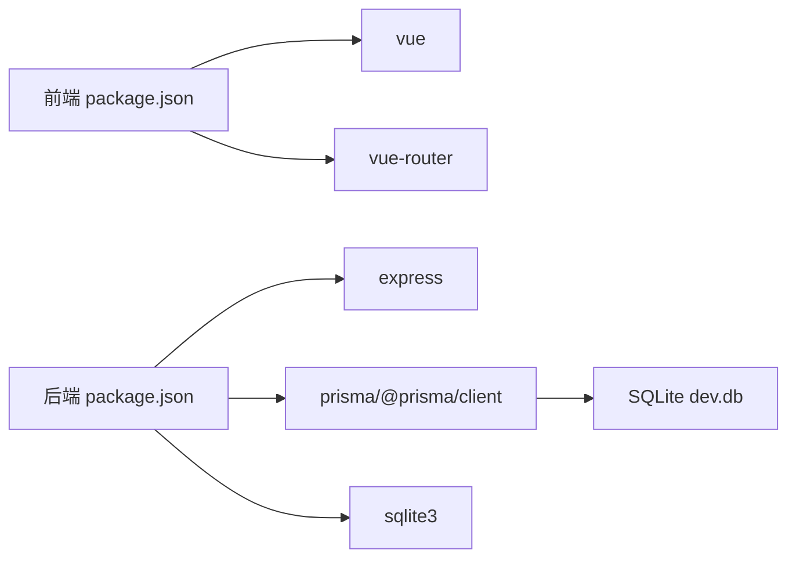

# 防重复机制

<cite>
**本文引用的文件**
- [backend/src/index.ts](file://backend/src/index.ts)
- [frontend/src/views/HomeView.vue](file://frontend/src/views/HomeView.vue)
- [backend/prisma/schema.prisma](file://backend/prisma/schema.prisma)
- [backend/prisma/migrations/20251104061144_init/migration.sql](file://backend/prisma/migrations/20251104061144_init/migration.sql)
- [backend/prisma/seed.ts](file://backend/prisma/seed.ts)
- [backend/package.json](file://backend/package.json)
- [frontend/package.json](file://frontend/package.json)
- [backend/.env](file://backend/.env)
</cite>

## 目录
1. [简介](#简介)
2. [项目结构](#项目结构)
3. [核心组件](#核心组件)
4. [架构总览](#架构总览)
5. [详细组件分析](#详细组件分析)
6. [依赖关系分析](#依赖关系分析)
7. [性能考量](#性能考量)
8. [故障排查指南](#故障排查指南)
9. [结论](#结论)
10. [附录](#附录)

## 简介
本文件围绕“前后端协同的防重复机制”展开，重点说明：
- 前端如何通过响应式数组 usedPoems 维护已使用诗句列表，并在用户提交与AI回合后更新；
- 后端在 verify 与 ai-turn 接口中接收该列表并执行重复性校验；
- 双重校验的意义：前端防止本地重复输入，后端确保数据一致性与安全性；
- 数据通过请求体（usedPoems[]）在客户端与服务端之间同步；
- 多用户场景下的扩展挑战与可能的解决方案（如会话级状态管理）。

## 项目结构
该项目采用前后端分离架构：
- 前端为 Vue 3 应用，负责用户交互、状态管理与 API 调用；
- 后端基于 Express + Prisma + SQLite，提供飞花令相关接口与数据持久化。

图表来源
- [frontend/src/views/HomeView.vue](file://frontend/src/views/HomeView.vue#L1-L118)
- [backend/src/index.ts](file://backend/src/index.ts#L1-L78)
- [backend/prisma/schema.prisma](file://backend/prisma/schema.prisma#L1-L19)
- [backend/.env](file://backend/.env#L1-L1)

章节来源
- [frontend/src/views/HomeView.vue](file://frontend/src/views/HomeView.vue#L1-L118)
- [backend/src/index.ts](file://backend/src/index.ts#L1-L78)
- [backend/prisma/schema.prisma](file://backend/prisma/schema.prisma#L1-L19)
- [backend/.env](file://backend/.env#L1-L1)

## 核心组件
- 前端组件 HomeView.vue
  - 使用响应式 ref 维护 usedPoems 数组，用于记录本轮已使用的诗句；
  - 在用户提交诗句与AI回合后，将 usedPoems 同步至后端；
  - 通过 fetch 发起 verify 与 ai-turn 请求，携带 { sentence, char, usedPoems }。
- 后端接口
  - verify：校验诗句是否包含令字、是否已在 usedPoems 中、以及是否存在于诗词库；
  - ai-turn：根据令字筛选含令字的诗句，并排除已使用过的诗句，返回可用诗句；
  - random-char：为每轮游戏生成一个随机令字。

章节来源
- [frontend/src/views/HomeView.vue](file://frontend/src/views/HomeView.vue#L1-L118)
- [backend/src/index.ts](file://backend/src/index.ts#L1-L78)

## 架构总览
下图展示了从前端到后端的数据流与校验点：

图表来源
- [frontend/src/views/HomeView.vue](file://frontend/src/views/HomeView.vue#L1-L118)
- [backend/src/index.ts](file://backend/src/index.ts#L1-L78)

## 详细组件分析

### 前端：usedPoems 的维护与同步
- 初始化与重置
  - 游戏开始时，usedPoems 被清空，保证每轮独立的状态；
- 用户提交流程
  - 提交前将当前输入推入历史记录；
  - 发送 verify 请求，请求体包含 { sentence, char, usedPoems }；
  - 若校验通过，将该句加入 usedPoems，并进入AI回合；
  - 若校验失败，回滚历史记录并允许再次输入；
- AI 回合流程
  - 发送 ai-turn 请求，请求体包含 { char, usedPoems }；
  - 收到 AI 诗句后，将其加入 usedPoems，并切换回玩家回合。

图表来源
- [frontend/src/views/HomeView.vue](file://frontend/src/views/HomeView.vue#L1-L118)

章节来源
- [frontend/src/views/HomeView.vue](file://frontend/src/views/HomeView.vue#L1-L118)

### 后端：verify 接口的重复性校验
- 参数校验
  - 缺少 sentence 或 char 时直接返回错误；
- 令字包含性校验
  - 确保诗句包含本轮令字；
- 本地重复性校验
  - usedPoems 中若已包含该句，则判定重复；
- 诗词库一致性校验
  - 在诗词库中查找是否包含该句，不存在则提示未收录；
- 返回值
  - 返回 valid 与 message，供前端决定后续流程。

图表来源
- [backend/src/index.ts](file://backend/src/index.ts#L23-L48)

章节来源
- [backend/src/index.ts](file://backend/src/index.ts#L23-L48)

### 后端：ai-turn 接口的可用性过滤
- 查询策略
  - 先按令字筛选含令字的诗句；
  - 再从候选集中过滤掉已被 usedPoems 使用过的诗句；
- 结果返回
  - 随机选择一个可用诗句，返回其中包含令字的部分；
  - 若无可选诗句，返回错误提示。

图表来源
- [backend/src/index.ts](file://backend/src/index.ts#L50-L72)

章节来源
- [backend/src/index.ts](file://backend/src/index.ts#L50-L72)

### 数据模型与持久化
- 模型定义
  - Poem 模型包含 id、title、author、content；
- 迁移与种子
  - 初始迁移创建 Poem 表；
  - 种子脚本向表中写入若干诗句条目，便于演示；
- 数据库
  - 使用 SQLite，连接字符串由环境变量 DATABASE_URL 指定。

图表来源
- [backend/prisma/schema.prisma](file://backend/prisma/schema.prisma#L1-L19)
- [backend/prisma/migrations/20251104061144_init/migration.sql](file://backend/prisma/migrations/20251104061144_init/migration.sql#L1-L8)
- [backend/prisma/seed.ts](file://backend/prisma/seed.ts#L1-L52)
- [backend/.env](file://backend/.env#L1-L1)

章节来源
- [backend/prisma/schema.prisma](file://backend/prisma/schema.prisma#L1-L19)
- [backend/prisma/migrations/20251104061144_init/migration.sql](file://backend/prisma/migrations/20251104061144_init/migration.sql#L1-L8)
- [backend/prisma/seed.ts](file://backend/prisma/seed.ts#L1-L52)
- [backend/.env](file://backend/.env#L1-L1)

## 依赖关系分析
- 前端依赖
  - vue、vue-router、pinia（虽未直接在 HomeView.vue 使用，但项目包含）；
- 后端依赖
  - express、@prisma/client、cors、sqlite3、prisma；
- 数据层
  - Prisma 作为 ORM，SQLite 作为存储引擎；
- 环境配置
  - DATABASE_URL 指向本地 dev.db 文件。

图表来源
- [frontend/package.json](file://frontend/package.json#L1-L51)
- [backend/package.json](file://backend/package.json#L1-L30)
- [backend/.env](file://backend/.env#L1-L1)

章节来源
- [frontend/package.json](file://frontend/package.json#L1-L51)
- [backend/package.json](file://backend/package.json#L1-L30)
- [backend/.env](file://backend/.env#L1-L1)

## 性能考量
- 前端
  - usedPoems 为内存数组，长度增长会导致 includes 检索成本线性增长；建议在高并发或长局游戏中考虑使用 Set 以降低查找复杂度；
- 后端
  - verify 与 ai-turn 均涉及对诗词库的查询与过滤；当诗句数量较大时，可考虑：
    - 对 content 建立索引（Prisma 层面可配置）；
    - 将 usedPoems 传入时转换为 Set，减少过滤成本；
    - 对 ai-turn 的过滤逻辑进行分页或限制候选集大小；
- 网络与并发
  - 当前实现为单进程单实例，多用户并发时建议引入会话隔离与限流策略。

## 故障排查指南
- 常见问题与定位
  - verify 返回“缺少参数”：确认请求体是否包含 sentence、char、usedPoems；
  - verify 返回“未包含令字”：检查前端是否正确设置 ling（令字）；
  - verify 返回“已使用过”：确认 usedPoems 是否被正确更新；
  - ai-turn 返回“无可选”：确认 usedPoems 是否过大导致候选集耗尽；
  - 数据库为空：确认种子脚本已执行且 dev.db 存在；
- 建议排查步骤
  - 打开浏览器开发者工具，查看 verify/ai-turn 请求与响应；
  - 检查后端日志输出与 Prisma 日志；
  - 确认 DATABASE_URL 指向正确的 SQLite 文件；
  - 如需重新导入数据，运行种子脚本并重启服务。

章节来源
- [backend/src/index.ts](file://backend/src/index.ts#L1-L78)
- [backend/prisma/seed.ts](file://backend/prisma/seed.ts#L1-L52)
- [backend/.env](file://backend/.env#L1-L1)

## 结论
- 该系统通过“前端 usedPoems + 后端校验”的双重机制，有效防止同一句诗在同轮内重复使用；
- 前端负责用户体验与本地状态同步，后端负责一致性与安全边界；
- 在多用户场景下，当前实现仅支持单进程单实例，需引入会话隔离与状态持久化以满足扩展需求。

## 附录
- 关键实现路径参考
  - 前端提交与AI回合：[frontend/src/views/HomeView.vue](file://frontend/src/views/HomeView.vue#L1-L118)
  - 后端 verify 校验：[backend/src/index.ts](file://backend/src/index.ts#L23-L48)
  - 后端 ai-turn 过滤：[backend/src/index.ts](file://backend/src/index.ts#L50-L72)
  - 数据模型与迁移：[backend/prisma/schema.prisma](file://backend/prisma/schema.prisma#L1-L19)，[backend/prisma/migrations/20251104061144_init/migration.sql](file://backend/prisma/migrations/20251104061144_init/migration.sql#L1-L8)
  - 种子数据与数据库：[backend/prisma/seed.ts](file://backend/prisma/seed.ts#L1-L52)，[backend/.env](file://backend/.env#L1-L1)