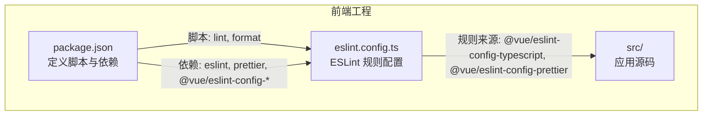
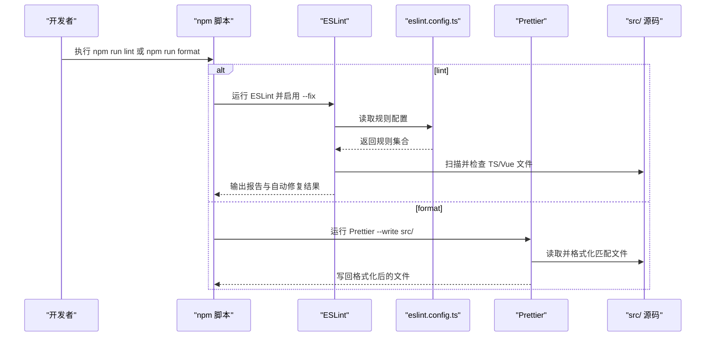
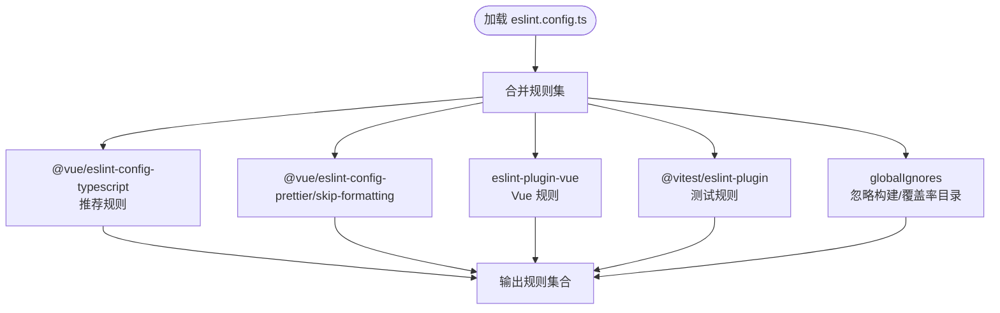
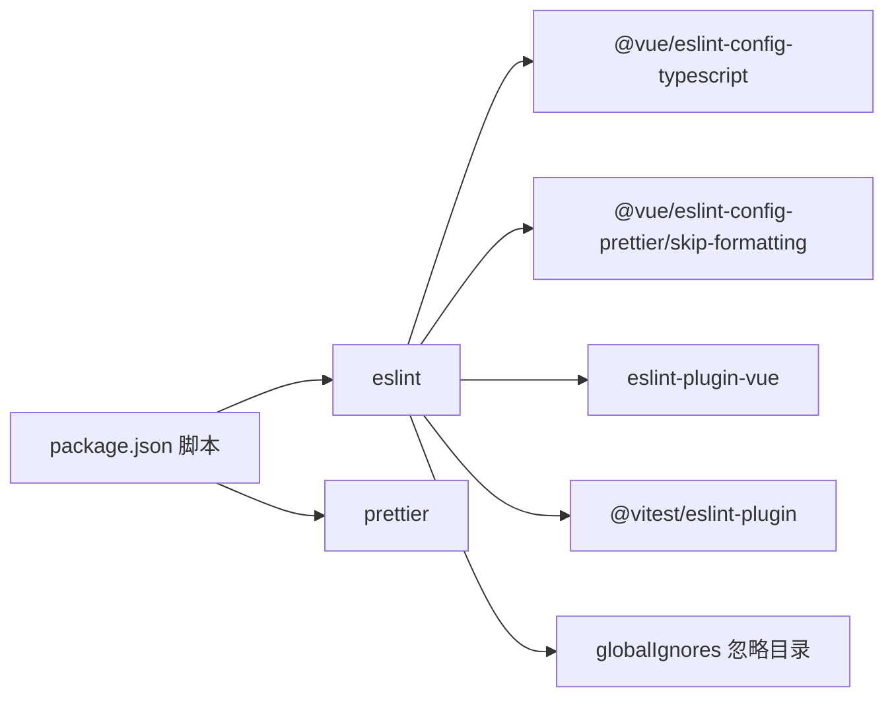

# 代码质量与格式化

<cite>
**本文引用的文件**
- [frontend/package.json](file://frontend/package.json)
- [frontend/eslint.config.ts](file://frontend/eslint.config.ts)
- [frontend/src/App.vue](file://frontend/src/App.vue)
- [frontend/src/main.ts](file://frontend/src/main.ts)
- [frontend/src/router/index.ts](file://frontend/src/router/index.ts)
</cite>

## 目录
1. [简介](#简介)
2. [项目结构](#项目结构)
3. [核心组件](#核心组件)
4. [架构总览](#架构总览)
5. [详细组件分析](#详细组件分析)
6. [依赖关系分析](#依赖关系分析)
7. [性能考虑](#性能考虑)
8. [故障排查指南](#故障排查指南)
9. [结论](#结论)

## 简介
本说明面向前端团队，系统介绍项目中集成的代码质量保障工具链：ESLint 与 Prettier。文档将指导如何通过 npm 脚本执行规范检查与自动修复、以及对源码进行格式化；解释 eslint.config.ts 中规则配置来源（@vue/eslint-config-typescript、@vue/eslint-config-prettier）；说明 Prettier 在命令 prettier --write src/ 下的作用范围；并结合项目实际配置，阐述代码风格统一的重要性，最后给出常见 Lint 错误的修复建议。

## 项目结构
前端工程位于 frontend 目录，包含 Vue 3 应用、TypeScript 配置、Vite 构建配置等。与代码质量相关的配置集中在：
- 包管理脚本与依赖：frontend/package.json
- ESLint 规则配置：frontend/eslint.config.ts
- 示例源码文件：frontend/src/*.ts、frontend/src/*.vue

图表来源
- [frontend/package.json](file://frontend/package.json#L9-L17)
- [frontend/eslint.config.ts](file://frontend/eslint.config.ts#L1-L28)

章节来源
- [frontend/package.json](file://frontend/package.json#L9-L17)
- [frontend/eslint.config.ts](file://frontend/eslint.config.ts#L1-L28)

## 核心组件
- ESLint 规则配置
  - 使用 @vue/eslint-config-typescript 提供 Vue + TypeScript 的推荐规则集
  - 使用 @vue/eslint-config-prettier/skip-formatting 将格式化交由 Prettier 处理，避免 ESLint 与 Prettier 的格式冲突
  - 针对测试文件 src/**/__tests__/* 单独启用 Vitest ESLint 插件的推荐配置
  - 忽略构建产物与覆盖率目录等非源码路径
- Prettier 格式化
  - 通过 npm run format 对 src/ 目录下所有匹配文件进行格式化
  - 与 ESLint 配置配合，确保风格统一且无重复格式化冲突

章节来源
- [frontend/eslint.config.ts](file://frontend/eslint.config.ts#L1-L28)
- [frontend/package.json](file://frontend/package.json#L9-L17)

## 架构总览
下图展示了从开发者执行脚本到工具链落地的流程，包括 ESLint 检查与 Prettier 格式化的协作关系。

图表来源
- [frontend/package.json](file://frontend/package.json#L9-L17)
- [frontend/eslint.config.ts](file://frontend/eslint.config.ts#L1-L28)

## 详细组件分析

### ESLint 规则配置详解
- 规则来源与职责
  - @vue/eslint-config-typescript：为 Vue + TypeScript 项目提供推荐规则集，覆盖类型安全、最佳实践等
  - @vue/eslint-config-prettier/skip-formatting：关闭 ESLint 中与格式化相关的规则，避免与 Prettier 冲突
  - eslint-plugin-vue：提供 Vue 文件的语法与结构检查
  - @vitest/eslint-plugin：为单元测试文件提供推荐规则
- 文件匹配与忽略
  - 匹配范围：**/*.{ts,mts,tsx,vue}
  - 忽略范围：**/dist/**、**/dist-ssr/**、**/coverage/**
  - 测试文件单独启用 Vitest 推荐规则，限定在 src/**/__tests__/*
- 与 Prettier 的协作
  - 通过 skip-formatting 将格式化职责交给 Prettier，ESLint 专注逻辑与风格冲突检测

图表来源
- [frontend/eslint.config.ts](file://frontend/eslint.config.ts#L1-L28)

章节来源
- [frontend/eslint.config.ts](file://frontend/eslint.config.ts#L1-L28)

### Prettier 格式化范围与行为
- 命令与范围
  - npm run format 使用 prettier --write src/ 对 src/ 目录下所有匹配文件进行就地格式化
- 与 ESLint 的关系
  - 由于 ESLint 已通过 skip-formatting 关闭格式化相关规则，Prettier 可以独立承担格式化职责，二者不会互相覆盖或冲突
- 实际作用对象
  - 依据 eslint.config.ts 的文件匹配规则，Prettier 会处理 TS/TSX/Vue 文件（具体受 Prettier 默认解析器影响）

章节来源
- [frontend/package.json](file://frontend/package.json#L9-L17)
- [frontend/eslint.config.ts](file://frontend/eslint.config.ts#L1-L28)

### 开发者操作指引
- 规范检查与自动修复
  - 执行 npm run lint，ESLint 将扫描 TS/Vue 文件，基于 @vue/eslint-config-typescript 的推荐规则进行检查，并尝试自动修复可修复问题
- 统一格式化
  - 执行 npm run format，Prettier 将对 src/ 目录下所有匹配文件进行格式化，确保团队风格一致

章节来源
- [frontend/package.json](file://frontend/package.json#L9-L17)

### 示例文件与潜在问题
以下示例文件展示了当前项目中常见的风格差异点，便于理解 Lint 与格式化的作用范围与边界。

- App.vue
  - 结构清晰，但样式与模板缩进、引号风格等可能触发不同规则
  - 参考路径：[frontend/src/App.vue](file://frontend/src/App.vue#L1-L19)
- main.ts
  - 导入顺序、空行与注释风格可能需要统一
  - 参考路径：[frontend/src/main.ts](file://frontend/src/main.ts#L1-L15)
- router/index.ts
  - 注释与路由懒加载写法属于常见风格差异点
  - 参考路径：[frontend/src/router/index.ts](file://frontend/src/router/index.ts#L1-L24)

章节来源
- [frontend/src/App.vue](file://frontend/src/App.vue#L1-L19)
- [frontend/src/main.ts](file://frontend/src/main.ts#L1-L15)
- [frontend/src/router/index.ts](file://frontend/src/router/index.ts#L1-L24)

## 依赖关系分析
- 脚本与工具
  - npm run lint 依赖 eslint 与 @vue/eslint-config-typescript、@vue/eslint-config-prettier
  - npm run format 依赖 prettier
- 规则来源
  - @vue/eslint-config-typescript 提供 Vue + TypeScript 的推荐规则
  - @vue/eslint-config-prettier/skip-formatting 关闭 ESLint 的格式化规则
  - eslint-plugin-vue、@vitest/eslint-plugin 分别提供 Vue 与测试相关规则
- 忽略路径
  - dist、dist-ssr、coverage 等目录被排除，避免对构建产物与覆盖率统计文件进行检查

图表来源
- [frontend/package.json](file://frontend/package.json#L9-L17)
- [frontend/eslint.config.ts](file://frontend/eslint.config.ts#L1-L28)

章节来源
- [frontend/package.json](file://frontend/package.json#L9-L17)
- [frontend/eslint.config.ts](file://frontend/eslint.config.ts#L1-L28)

## 性能考虑
- 缓存与增量检查
  - ESLint 支持缓存机制，建议在大型项目中保持缓存以提升二次检查速度
- 忽略目录
  - 已通过 globalIgnores 忽略 dist、dist-ssr、coverage 等目录，减少不必要的扫描开销
- 并行与增量
  - Prettier 适合对 src/ 目录进行增量格式化；建议在 CI 中仅对变更文件运行 Lint，以缩短流水线时间

## 故障排查指南
- 常见 Lint 错误与修复建议
  - 类型相关错误
    - 症状：未声明变量类型、返回值类型缺失、参数类型不明确
    - 修复：为函数参数与返回值添加明确类型标注；参考 Vue + TypeScript 推荐规则
  - Vue 文件结构问题
    - 症状：模板中未使用驼峰命名属性、未遵循单文件组件结构
    - 修复：按 Vue 单文件组件约定组织模板、脚本与样式区域
  - 格式化冲突
    - 症状：ESLint 与 Prettier 在缩进、引号、分号等问题上产生冲突
    - 修复：确认已启用 @vue/eslint-config-prettier/skip-formatting，将格式化交由 Prettier 处理
  - 测试文件规则
    - 症状：测试文件缺少推荐规则约束
    - 修复：确保 src/**/__tests__/* 路径启用 @vitest/eslint-plugin 推荐规则
- 命令执行失败
  - npm run lint 报错：检查 Node 版本是否满足 engines 要求；确认依赖安装完成
  - npm run format 未生效：确认 src/ 目录存在且包含匹配文件；检查 Prettier 是否正确安装

章节来源
- [frontend/eslint.config.ts](file://frontend/eslint.config.ts#L1-L28)
- [frontend/package.json](file://frontend/package.json#L1-L10)

## 结论
通过在项目中集成 ESLint 与 Prettier，并采用 @vue/eslint-config-typescript 与 @vue/eslint-config-prettier 的推荐配置，团队可以实现“逻辑与风格分离”的质量保障体系：ESLint 负责逻辑与风格冲突检测，Prettier 负责统一格式化。配合 npm run lint 与 npm run format，开发者可在本地快速发现并修复问题，CI 中亦可实现高效的质量门禁。建议在日常开发中优先运行 npm run format 保证风格一致，再运行 npm run lint 发现潜在问题，形成稳定高效的开发节奏。